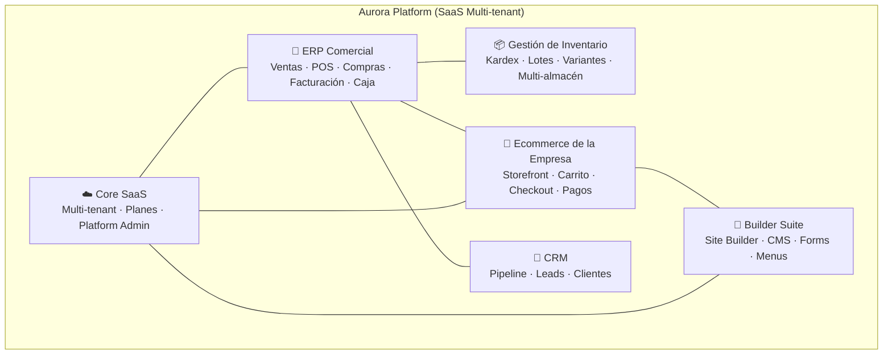
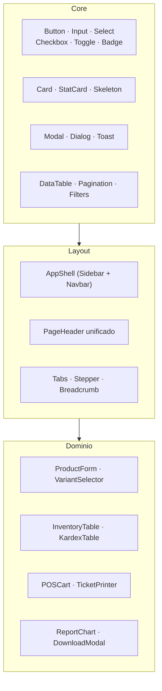

# Análisis de Rediseño Completo — Aurora Platform

> **Objetivo:** Analizar **cada sección del frontend con sus componentes** para planificar un **rediseño integral**, teniendo en cuenta que esta plataforma es un **SaaS ERP + Ecommerce Builder multi-tenant** (no una app monolítica ni un ecommerce simple).

---

## Índice

1. [Tipo de Plataforma y Principios de Diseño](#1-tipo-de-plataforma-y-principios-de-diseño)
2. [Diagnóstico Transversal del Frontend](#2-diagnóstico-transversal-del-frontend)
   - [Los 8 sistemas de diseño paralelos](#21-los-8-sistemas-de-diseño-paralelos)
   - [Deuda técnica prioritaria](#22-deuda-técnica-prioritaria)
3. [Design System Objetivo (Aurora 2.0)](#3-design-system-objetivo-aurora-20)
4. [Análisis Sección por Sección](#4-análisis-sección-por-sección)
   - [4.1 Layout y Navegación](#41-layout-y-navegación)
   - [4.2 Dashboard](#42-dashboard)
   - [4.3 Productos](#43-productos)
   - [4.4 Categorías](#44-categorías)
   - [4.5 Inventario](#45-inventario)
   - [4.6 Ventas y POS](#46-ventas-y-pos)
   - [4.7 Caja](#47-caja)
   - [4.8 Compras](#48-compras)
   - [4.9 Proveedores](#49-proveedores)
   - [4.10 Clientes](#410-clientes)
   - [4.11 Facturas](#411-facturas)
   - [4.12 Reportes](#412-reportes)
   - [4.13 Ecommerce Builder](#413-ecommerce-builder)
   - [4.14 CMS / Site Builder / Form Builder](#414-cms--site-builder--form-builder)
   - [4.15 CRM](#415-crm)
   - [4.16 Admin y RBAC](#416-admin-y-rbac)
   - [4.17 Platform Admin (SaaS)](#417-platform-admin-saas)
   - [4.18 Integraciones](#418-integraciones)
   - [4.19 Autenticación](#419-autenticación)
   - [4.20 Área Cliente (Account)](#420-área-cliente-account)
   - [4.21 Storefront Público (Landing + Catálogo + Checkout)](#421-storefront-público)
5. [Componentes Shared: Estado y Rediseño](#5-componentes-shared-estado-y-rediseño)
6. [Bugs Detectados Durante el Análisis](#6-bugs-detectados-durante-el-análisis)
7. [Plan de Rediseño por Fases](#7-plan-de-rediseño-por-fases)
8. [Métricas de Éxito](#8-métricas-de-éxito)
9. [Conclusión](#9-conclusión)

---

## 1. Tipo de Plataforma y Principios de Diseño

### 1.1 Qué es Aurora Platform



### 1.2 Implicaciones de diseño según el tipo de plataforma

| Característica SaaS/ERP | Implicación de diseño |
|---|---|
| **Multi-tenant** | Cada empresa tiene su propia marca, logo, colores y dominio. El diseño de la app debe separar **chrome de plataforma** (estable, Aurora) del **branding del tenant** (dinámico vía settings). |
| **Dos audiencias distintas** | El **usuario interno** (admin/cajero/almacén) necesita densidad de información y velocidad; el **cliente final** del storefront necesita storytelling y claridad. Son dos "productos" con dos design systems. |
| **Muchos módulos** | Un **command palette / búsqueda global** es imprescindible con 30+ rutas. Hoy solo existe un buscador decorativo (`⌘K` sin función). |
| **SaaS comercial** | El **onboarding** y la **configuración** deben guiar; hoy hay 8 sistemas de diseño distintos y stubs con `alert()`. |
| **Datos críticos** | Tablas con **export, filtros combinados, persistencia de preferencias y estado en URL** (compartible). |
| **Responsive** | El personal de tienda usa tablet/móvil (POS). El storefront es móvil-first por definición. |

### 1.3 Principios de rediseño

1. **Un solo design system (Aurora 2.0)** con tokens semánticos y componentes compartidos. Eliminar los 8 sistemas paralelos.
2. **Separación total** entre *chrome de plataforma* (sidebar, navbar, tablas, formularios) y *branding del tenant* (logo, colores, fuentes de la tienda).
3. **Densidad configurable**: modo "cómodo" y modo "compacto" para usuarios internos.
4. **Estado en la URL** para listados (filtros, orden, página) — compartible y persistente.
5. **Nada de valores hardcodeados**: moneda, impuestos, marca, fechas — todo desde config/composables.
6. **Eliminar `alert()`/`confirm()`/`document.write`/Swal mixto** → un sistema de feedback unificado (toasts + dialog).
7. **Español 100%** (UI del tenant); storefront puede tener textos del builder.

---

## 2. Diagnóstico Transversal del Frontend

### 2.1 Los 8 sistemas de diseño paralelos

El análisis de `frontend/src` (86 vistas + 45 componentes) revela **8 sistemas de diseño coexistiendo**:

| # | Sistema | Clases / prefijo | Dónde vive |
|---|---|---|---|
| 1 | **Aurora Neumorphism** | `aurora-*`, `--aurora-*` | AppLayout, Sidebar, Navbar, ~20 vistas ERP |
| 2 | **Mesh Gradient Header** | `.mesh-gradient-header`, `.header-glass` | Cabecera de 31 vistas (2026-07) |
| 3 | **LEGACY CSS replicado** | `.page`, `.card`, `.modal`, `.btn` | PagesManager, SiteBuilder, FormBuilder, Integrations, RBAC, MenuEditorModal, SectionEditor, ComponentPicker |
| 4 | **Platform Admin** | `pa-*` | Todo `platform-admin/` |
| 5 | **Onboarding** | `onb-*` | CompanyOnboardingView |
| 6 | **CRM** | `crm-*` | PipelineView |
| 7 | **Nexus (legacy)** | `nexus-*`, `dt-*`, `dt-card`, `dt-badge`, tema café `#624200` | DataTable (raíz), SidebarItem, ProfileView, NotificationDetailView, AdminView, ConfigView |
| 8 | **Notificaciones Bento** | `glass-panel`, `stat-card-bento`, `accent-gradient` | NotificationsView, NotificationsFeed |

**Consecuencia:** el usuario percibe la app como 8 productos distintos pegados. La marca "Aurora" no existe visualmente más allá de unas clases.

### 2.2 Deuda técnica prioritaria

| Deuda | Impacto | Evidencia |
|---|---|---|
| **Estilos inline masivos** con `@focus`/`@blur`/`@mouseenter` mutando `style` en el template | Mantenimiento nulo, inconsistencia | ProductFormView (860 l), PurchaseFormView, UsersView, ConfigView, InventoryTable |
| **Valores hardcodeados** (moneda MXN/COP/USD mezclada, IVA 19%, marca "Animal Store", "TIENDA") | Bugs contables y de branding reales | DataTable MXN, OfferShowcase MXN, PurchaseFormView 19%, POSView, SaleDetailView, useSEO COP |
| **`document.write` para impresión** | Riesgo XSS, imposible de mantener | POSView.printTicket, SaleDetailView.printAsDraft |
| **Stubs con `alert()`** | Funcionalidad prometida que no existe | SiteBuilder.editCode, RBAC.editPlan, CartView.applyCoupon, ProfileView "Cambiar contraseña", Integrations test |
| **Mock data en producción** | Datos falsos presentados como reales | DynamicDashboardView (`generateMockData` + Math.random) |
| **Bug de seguridad**: cliente edita su propio `credit_limit`; CVV/tarjetas en localStorage | Crítico | CreditView, CardsView |
| **Caché a nivel de módulo en composables** | Fuga multi-tenant | useEcommerceConfig, useEcommerceSettings |
| **N+1 y fetches masivos** | Rendimiento | CashRegisterReportView (N+1), DashboardView (`limit: 99999`), ClientsReportView |
| **Duplicación de lógica** (variantes, paginación con elipsis, modal de descarga, shaders WebGL, helpers pa-*) | Mantenimiento | Ver tabla en §4 |
| **Texto en inglés/otros idiomas en UI en español** | Profesionalismo | AuroraDownloadModal (100% inglés), ProductShowcase, HeroSection fallback, `'Vista简约'` en NotificationDetailView |
| **Kardex roto** | Bug funcional | `inventoryAPI.getKardex` no existe en el cliente + columnas Entrada/Salida con misma `key: 'quantity'` |

---

## 3. Design System Objetivo (Aurora 2.0)

### 3.1 Tokens semánticos

Reemplazar los colores hex hardcodeados por tokens CSS con modo claro/oscuro:

```css
/* Aurora 2.0 — tokens semánticos */
:root {
  --aurora-bg: #f6f5f9;            /* superficie principal */
  --aurora-surface: #ffffff;
  --aurora-surface-muted: #f1eef7;
  --aurora-border: rgba(30, 20, 60, 0.08);
  --aurora-text: #1c1630;
  --aurora-text-muted: #6b6480;
  --aurora-primary: #7c3aed;       /* violeta Aurora */
  --aurora-primary-hover: #6d28d9;
  --aurora-primary-soft: rgba(124, 58, 237, 0.10);
  --aurora-success: #16a34a;
  --aurora-warning: #d97706;
  --aurora-danger: #dc2626;
  --aurora-radius-sm: 8px;
  --aurora-radius-md: 12px;
  --aurora-radius-lg: 16px;
  --aurora-shadow-sm: 0 1px 2px rgba(28, 22, 48, 0.06);
  --aurora-shadow-md: 0 4px 16px rgba(28, 22, 48, 0.08);
  --aurora-shadow-lg: 0 12px 40px rgba(28, 22, 48, 0.12);
  --aurora-font-headline: 'Plus Jakarta Sans', sans-serif;
  --aurora-font-body: 'Inter', sans-serif;
  --aurora-density: 0px;           /* 0 = cómodo, -4px = compacto */
}

/* Variables de tenant (inyectadas desde ecommerce_settings) */
:root[data-tenant] {
  --tenant-primary: var(--tenant-primary, #7c3aed);
  --tenant-logo: var(--tenant-logo, '');
}
```

### 3.2 Catálogo de componentes Aurora 2.0



Componentes a crear/refactorizar:

| Componente | Acción | Reemplaza |
|---|---|---|
| `AuroraInput/Select/Textarea` | Crear | ~40 copias de `@focus` inline en formularios |
| `AuroraConfirmDialog` (genérico) | Refactor | ConfirmDialog solo-eliminar + Swal + modales Teleport |
| `ToastProvider` | Crear | Swal para éxito/error, alert() nativo |
| `AuroraChart` (wrapper Chart.js) | Crear | 4+ builders de chart duplicados |
| `AuroraPagination` | Crear | `visiblePages`/`buildPagination` duplicados en 3 vistas |
| `CommandPalette` | Crear | Buscador `⌘K` decorativo del Navbar |
| `useDownloadModal` composable | Crear | Estado del modal de descarga copy-pasteado en 6 archivos |
| `useProductVariants` composable | Crear | Lógica duplicada en 3 vistas de producto |
| `useTableState` composable | Crear | Filtros + orden + página + URL sync en listados |
| `TenantThemeProvider` | Crear | Aplica `--tenant-*` desde settings; corrige caché multi-tenant |
| `CurrencyProvider` | Refactor | Moneda real desde ecommerce_settings (no store con rates estáticos) |
| `AuroraPrint` util | Crear | `document.write` → iframe/ventana con HTML sanitizado |

---

## 4. Análisis Sección por Sección

### 4.1 Layout y Navegación

**Archivos:** `AppLayout.vue`, `Sidebar.vue`, `SidebarItem.vue` (muerto), `Navbar.vue`, `AppNavBar.vue` (público), `AppFooter.vue` (público), `stores/app.js`

#### Estado actual

| Componente | Líneas | Estado |
|---|---|---|
| AppLayout | 59 | Aurora OK. Breadcrumb condicional, keep-alive hardcodeado `['Dashboard']` |
| Sidebar | 295 | Aurora OK. Submenús mutan `item._open`; emojis en labels (`🔄 CRM Pipeline`); permisos OK |
| SidebarItem | 56 | **Muerto** (Sidebar no lo importa), clases `nexus-*` inexistentes |
| Navbar | 110 | Aurora OK. **Buscador `⌘K` sin funcionalidad**; badge notificaciones 9+ |
| AppNavBar (público) | 392 | Tailwind dark, menú dinámico de Site Builder (fase 2 ok) |
| AppFooter (público) | 72 | Bien modularizado |

#### Problemas
- Dos familias de iconos conviven (`material-symbols-outlined` y `material-icons-outlined`) en toda la app.
- Sidebar tiene 20+ items sin agrupar → necesita **secciones colapsables** o agrupación por módulo (ERP / Ecommerce / Plataforma).
- El breadcrumb solo aparece con `pageTitle`; el título global duplica el `mesh-gradient-header` de cada vista (doble header).

#### Rediseño propuesto
1. **AppShell unificado** (`AppShell.vue`): sidebar agrupada por módulos con secciones "Operación", "Ecommerce", "Administración", footer de usuario. Colapso con animación. Accesible.
2. **Navbar con Command Palette** (`⌘K`) que navegue a las 30+ rutas con filtrado por teclado; buscador global de productos/clientes/facturas.
3. **Unificar iconos** a `material-symbols-outlined` (auditoría global con script).
4. **Eliminar el header duplicado**: cada vista deja de pintar su `mesh-gradient-header` y lo centraliza el AppShell vía `route.meta` (título, icono, acciones). Un solo patrón.
5. **SidebarItem**: eliminar (muerto) o resucitarlo como componente estándar.
6. `keep-alive` configurable desde `route.meta.cache`.

---

### 4.2 Dashboard

**Archivos:** `DashboardView.vue` (1022 líneas), `dashboard/DynamicDashboardView.vue` (498), `components/dashboard/DashboardWidgetRenderer.vue`, `WidgetPickerModal.vue`

#### Estado actual

| Aspecto | DashboardView | DynamicDashboardView |
|---|---|---|
| UI | mesh-gradient + aurora-stat-card + 4 charts Chart.js | Tailwind + gradiente `#667eea→#764ba2` |
| Datos | 9 llamadas `Promise.all`, incluye `productsAPI.getAll({limit: 99999})` para el doughnut | **100% MOCK** (`generateMockData` + `Math.random()`) |
| KPIs | Ventas hoy/mes con tendencias | Widgets de catálogo |
| Animación | GSAP + anime.js (contadores, stagger) | — |

#### Problemas
- DashboardView: 1022 líneas, footer en inglés ("System Status: All Systems Operational", "© 2024 Aurora ERP").
- Descarga todo el catálogo solo para un gráfico de categorías.
- DynamicDashboardView presenta datos falsos como reales → **pérdida de confianza del usuario** y confusión.
- Dos dashboards compiten sin lógica de unificación.

#### Rediseño propuesto
1. **Unificar**: un solo Dashboard con widgets configurables (el widget renderer de DynamicDashboard sirve de base) pero **conectado a datos reales** del backend (`reportsAPI.dashboard` + endpoints agregados).
2. **Endpoint agregado** en el backend para "productos por categoría" en lugar de `limit: 99999`.
3. **Widget Library**: tarjetas estándar (KPIs, ventas por hora, top productos, alertas stock, actividad, ofertas activas) con layout responsive tipo bento.
4. **Extractar charts** a componente `AuroraChart` (una sola fuente de opciones + theme).
5. Textos 100% español y marca desde settings.

---

### 4.3 Productos

**Archivos (ERP):** `products/ProductListView.vue` (966), `ProductFormView.vue` (860), `ProductDetailView.vue` (359)
**Archivos (Público):** `products/ProductsCatalogView.vue` (567), `ProductPublicDetailView.vue` (814), `OffersProductsView.vue` (497)

#### Estado actual
- Listado: mesh-gradient + DataTable + toggle tabla/grid, filtros (categoría, estado, rango precio), paginación server-side, permisos. **Textos en inglés** ("Products Module").
- Form: tarjetas por sección, variantes con modal propio, upload a Supabase directo. **Estilo inline masivo** (`@focus` mutando borderColor/boxShadow decenas de veces), `alert()` nativo.
- Detalle: variantes agrupadas, galería. **Lógica de variantes duplicada** con la vista pública.
- Público: glass-card + tilt 3D + **shader WebGL** (duplicado en 4 vistas), filtros con sync de URL (bien), `formatPrice` local.

#### Problemas
- 966 + 860 + 814 + 567 = **~3200 líneas** para 6 vistas con lógica duplicada.
- Shader WebGL sin fallback para dispositivos sin WebGL (perf en móvil).
- Doble disparo de fetch en catálogo (watcher + syncUrlQuery).

#### Rediseño propuesto
1. **`useProductVariants`** composable: selección de variantes, grupos, thumbnails — usado por ambas vistas.
2. **Formulario por pasos (stepper)**: Información → Precio/Impuestos → Variantes → Imágenes → SEO. Con `AuroraInput` (elimina los inline handlers).
3. **Upload manager unificado** (`useFileUpload` a Supabase con progreso) — reutilizable en productos, banners, avatares, hero.
4. **Catálogo público**: extraer tilt/shader a componentes `useTilt3D` y `useWebGLBackground` con fallback CSS; `formatPrice` centralizado.
5. Ordenamiento del listado ERP persistente en URL.

---

### 4.4 Categorías

**Archivos:** `categories/CategoryListView.vue` (295)

#### Estado actual
- CRUD con jerarquía padre/hijo, cards en grid, Modal + ConfirmDialog compartidos, búsqueda client-side.
- **Bugs:** `fetchCategories()` y `fetchAllCategories()` hacen la misma llamada (doble request); `DataTable` importado pero no usado.

#### Rediseño propuesto
1. Grid jerárquico con **indentación visual** y drag & drop (o mover arriba/abajo) para reordenar.
2. Badge con conteo de productos por categoría.
3. Eliminar el fetch duplicado; paginación server-side si el catálogo crece.

---

### 4.5 Inventario

**Archivos:** `inventory/InventoryView.vue` (315), `InventoryDetailView.vue` (426), `InventoryList.vue` (38), `MovementsView.vue` (187), `KardexView.vue` (94), `AdjustmentsView.vue` (134), `TransfersView.vue` (124), `VerificationView.vue` (307), `components/inventory/InventoryTable.vue` (181), `InventoryTabs.vue` (55)

#### Estado actual
- Vista principal: KPIs (valor total, bajo stock, agotados, pendientes) + InventoryTable custom (8 columnas, badges por estado).
- Movimientos: DataTable + filtro por tipo + modal detalle.
- **Kardex: ROTO** — llama `inventoryAPI.getKardex` (no existe en el cliente) y columnas Entrada/Salida comparten `key: 'quantity'`.
- Ajustes/Transferencias: listados vía `getMovements({type})`, formularios modal con **ubicaciones en texto libre** (sin selector de almacenes).
- Verificación: KPIs + modal con `verified_qty`/`rejected_qty` acoplados.
- **Novedad 2026-08:** estados `not_available` + `available` + `blocked` + `pending` (migración 054) ya soportados en InventoryDetailView; la regla stock=0 → `inactive`/`not_available` funciona por trigger.

#### Problemas
- `InventoryList.vue` (38 líneas) redundante con `InventoryView`; `InventoryTable` y `InventoryTabs` con estilos inline y JS en template (`@mouseenter` mutando background).
- Ajustes/Transferencias sin paginación ni skeleton.
- Kardex roto (bug funcional).
- `min_stock || 5` hardcodeado.

#### Rediseño propuesto
1. **Eliminar `InventoryList.vue`**; mantener `InventoryView` como única lista.
2. **Kardex**: añadir `getKardex` al cliente API, corregir columnas, añadir saldo acumulado con totales.
3. **Transferencias**: selector de almacén origen/destino desde la tabla de almacenes (no texto libre).
4. **Selector de almacén global** (breadcrumb/topbar) para filtrar todo el módulo.
5. Badges de estado con token semántico único (`inventoryStatusBadge` en utils) — un solo mapeo para desktop y móvil.
6. `InventoryTabs` refactor a componente Aurora con RouterLinks (sin estilos inline).

---

### 4.6 Ventas y POS

**Archivos:** `sales/SaleListView.vue` (712), `SaleFormView.vue` (224), `SaleDetailView.vue` (298), `POSView.vue` (798)

#### Estado actual
- Listado: KPIs + chart + DataTable, filtros (estado, pago, fechas), anular venta. **Tendencia hardcodeada `12`**, meta ticket `$80,000` fija, rango fechas hardcodeado 2024-2026.
- Form: alta manual, IVA desde config (bien).
- Detalle: `printAsDraft()` con **`document.write`** + `companyName = 'ANIMAL STORE'` hardcodeado.
- POS: 2 paneles (catálogo + carrito), turnos de caja con verifyAdmin, ticket 80mm con `document.write`, checkout crea venta + movimiento caja.

#### Problemas
- Lógica de checkout en la vista (798 líneas) — sin composable.
- Impresión vía `document.write` (XSS + mantenimiento).
- Métricas falsas (tendencia 12, meta 80k).

#### Rediseño propuesto
1. **`useCheckout` composable** compartido por POS y SaleForm (cliente, items, split de pago, impuesto, crear venta+movimiento).
2. **`AuroraPrint` util**: imprime un HTML sanitizado en ventana/iframe nueva (sin `document.write`), con plantillas por tipo (ticket 80mm, borrador, factura).
3. **KPIs reales** desde backend (dashboard ya tiene las tendencias).
4. POS responsive con **teclado numérico grande** para pantalla táctil y modo "checkout express".

---

### 4.7 Caja

**Archivos:** `sales/CashRegisterView.vue` (567), `reports/CashRegisterReportView.vue` (369)

#### Estado actual
- Turnos (abrir/cerrar), movimientos (ingreso/egreso/retiro/depósito), reporte de turno con items vendidos, export PDF/Excel (jsPDF+XLSX).
- Reporte: filtros por usuario/fechas, **N+1 severo** (`for...of` sobre sesiones llamando `salesAPI.getAll` por cada una).

#### Rediseño propuesto
1. **Refactor N+1**: endpoint backend `GET /cash-register/sessions/:id/sales` (o agregar join) en vez de llamar por sesión.
2. Unificar con el POS: estado del turno en la topbar (indicador "Turno abierto — $12,340").
3. `AuroraDownloadModal` en español y con progreso real.

---

### 4.8 Compras

**Archivos:** `purchases/PurchaseListView.vue` (427), `PurchaseFormView.vue` (345), `PurchaseDetailView.vue` (502)

#### Estado actual
- Listado: DataTable + filtros + resumen. **`fetchSummary` con `getAll({limit:1})` para contar** (ineficiente); catch vacíos.
- Form: autocomplete de productos, crear producto inline, preview de número. **IVA 19% hardcodeado** (inconsistente con ventas que usan config).
- Detalle: editar items, verificar cantidades, sendToInventory, cancelar. **Modales custom con Teleport** duplicando `Modal.vue`; lógica de verificación duplicada con VerificationView.

#### Rediseño propuesto
1. IVA desde `useEcommerceConfig` (consistencia contable).
2. Usar `Modal.vue` compartido en el detalle (eliminar overlay custom).
3. Extraer **`useVerification`** composable (verificar/actualizar/rechazar) compartido por PurchaseDetail y VerificationView.
4. Autocomplete de productos en componente `ProductAutocomplete` reutilizable (también en POS y SaleForm).

---

### 4.9 Proveedores

**Archivos:** `suppliers/SuppliersView.vue` (326)

#### Estado actual
- CRUD con DataTable server-side + modal de formulario + confirmación **con Teleport propio** (no usa ConfirmDialog compartido).
- Importa `CardGridSkeleton` sin usarlo.

#### Rediseño propuesto
1. Usar `ConfirmDialog` compartido (igual que Categorías).
2. Métricas por proveedor (compras totales, deuda) en el listado.
3. Unificar con el módulo de compras (detalle de proveedor con historial de compras).

---

### 4.10 Clientes

**Archivos:** `clients/ClientListView.vue` (146), `ClientDetailView.vue` (145), `components/clients/ClientFormModal.vue`

#### Estado actual
- Una de las áreas **más limpias**: DataTable + ClientFormModal compartido + detalle con historial de ventas y reset de contraseña.
- Swal para confirmaciones (podría usar ConfirmDialog).

#### Rediseño propuesto
1. Detalle con **pestañas**: Resumen, Ventas, Crédito, Facturas, Notificaciones.
2. Badge de estado de crédito (saldo/límite) en el listado.
3. Swal → toast+dialog unificado.

---

### 4.11 Facturas

**Archivos:** `invoices/InvoiceListView.vue` (316), `InvoiceDetailView.vue` (508)

#### Estado actual
- Listado: stats + DataTable con **orden server-side funcional** (N° factura, total, creada — arreglado 2026-08-05, verificado en navegador) + marcar pagada + PDF.
- Detalle: PDF de factura + asiento fiscal + Excel; toggle pagada/emitida.
- **Bugs:** `invoiceStats` calculado solo sobre la página actual; **IVA 19% hardcodeado** en el PDF; `mapInvoiceData` mapeo manual enorme.

#### Rediseño propuesto
1. **Stats reales** desde endpoint agregado (`GET /invoices/stats`).
2. IVA desde config del tenant.
3. `normalizeInvoice` en utils (reemplaza `mapInvoiceData`).
4. PDF generado con plantilla (html-pdf o plantilla Aurora) en lugar de coordenadas jsPDF manuales.
5. Acciones rápidas en la fila: ver, PDF, pagada, enviar por email.

---

### 4.12 Reportes

**Archivos:** `reports/reporthomeview.vue` (6), `ReportsView.vue` (59), `SalesReportView.vue` (219), `InventoryReportView.vue` (280), `TopProductsView.vue` (236), `ClientsReportView.vue` (247), `CashRegisterReportView.vue` (369)

#### Estado actual
- Hub de navegación + 5 reportes con Chart.js + export PDF/Excel.
- **Estado del modal de descarga copy-pasteado en los 5** (textos en inglés); `setTimeout(() => buildCharts(), 100)` hack; dobles fetches (full + paginado); `CashRegisterReportView` N+1; paginación client-side en TopProducts.

#### Rediseño propuesto
1. **`useDownloadModal`** composable + `AuroraDownloadModal` en español con progreso real.
2. **Layout de reportes unificado** (filtros en panel lateral, chart + tabla + export en área principal).
3. **Selector de período global** reutilizable (hoy/7d/30d/trimestre/año/custom).
4. Dashboard de reportes con tarjetas de resumen clicables.
5. `reporthomeview.vue`: eliminar (wrapper vacío) y apuntar la ruta raíz a ReportsView.

---

### 4.13 Ecommerce Builder

**Archivos:** `ecommerce/EcommerceView.vue` (25), `EcommerceHome.vue` (64), `BannersView.vue` (102), `OffersView.vue` (277), `HeroSettingsView.vue` (175), `HeroSlidesView.vue` (363), `FloatingBannersView.vue` (359), `ReviewsModerationView.vue` (283), `CouponsView.vue` (364), `PromotionsView.vue` (289), `SettingsView.vue` (**1693**)

#### Estado actual
- Tabs contenedoras (bien) con **tab "Hero (legacy)" duplicada**.
- Banners: CRUD por URL (sin upload, inconsistente con HeroSlides que sí sube a Supabase).
- Offers/Coupons/Promotions: **gemelos copy-paste** (layout, estilos, borrado casi idénticos); 3 mecanismos de confirmación distintos (Swal/ConfirmDialog/Modal) en el mismo módulo.
- `console.log` de debug en producción (OffersView, OfferShowcase).
- **SettingsView: monolito de 1693 líneas** con CSS scoped propio y un atributo por línea.

#### Rediseño propuesto
1. **Unificar Offers/Coupons/Promotions** en un componente parametrizado `DiscountEntityManager` (tipo: oferta/cupón/promoción) con layout, modal de borrado y toggle únicos.
2. **SettingsView**: dividir en 5 vistas/tabs (Identidad y logo, Moneda e impuestos, WhatsApp, SEO, Métodos de pago) usando componentes `AuroraFormSection` + `AuroraInput`.
3. **Upload manager unificado** para banners y media.
4. Eliminar tab legacy Hero; dejar solo Hero Carrusel.
5. Dashboard del módulo: KPIs reales (banners activos, ofertas, cupones usados, conversión de checkout).

---

### 4.14 CMS / Site Builder / Form Builder

**Archivos:** `cms/PagesManagerView.vue` (393), `CmsPublicPageView.vue` (81), `site/SiteBuilderView.vue` (422), `forms/FormBuilderView.vue` (305), `components/site/MenuEditorModal.vue` (225), `components/cms/ComponentPicker.vue` (131), `RenderSection.vue` (368), `SectionEditor.vue` (420)

#### Estado actual
- **Área LEGACY completa**: CSS `.page/.card/.modal/.btn` replicado en 8+ archivos (scoped), `alert()`/`confirm()` nativos, sin componentes shared.
- PagesManager: CRUD + builder de secciones con preview en vivo (funcional, UI vieja).
- SiteBuilder: media **solo URL**, temas con color pickers, navegación (MenuEditorModal — **fase 2 ya lo usa AppNavBar**), `editCode` es **stub con `alert()`**.
- FormBuilder: 10 tipos de campo, submissions en **JSON crudo**, guardado N+1 campo por campo.
- ComponentPicker/SectionEditor/RenderSection: **duplican el mismo bloque CSS legacy**.

#### Rediseño propuesto (prioridad ALTA — es el diferenciador del producto)
1. **Portar los 8 archivos a Aurora 2.0**: reemplazar CSS scoped legacy por tokens y componentes.
2. **PagesManager → Page Builder visual**: canvas central + panel de componentes + inspector de propiedades (inspirado en Framer/Webflow, pero simple).
3. **Preview en vivo** ya existe en SectionEditor — integrarlo como vista previa de página completa con dispositivos (desktop/tablet/móvil).
4. **FormBuilder**: editor visual de campos con drag & drop; submissions en tabla con acciones (export CSV).
5. **SiteBuilder**: upload de media real (Supabase), editor de código con editor simple (textarea con resaltado) en vez de stub.
6. **Menú editor**: ya integrado en navegación pública — estandarizar el modal a Aurora.

---

### 4.15 CRM

**Archivos:** `crm/PipelineView.vue` (393)

#### Estado actual
- Kanban con drag & drop nativo HTML5, stats (leads, valor pipeline, conversión), modal de detalle con actividades, crear lead, convertir a cliente.
- **Séptimo sistema de diseño** (`crm-*`), modales con Teleport propios, fallback `{id:1}` fake, helpers duplicados.

#### Rediseño propuesto
1. **Portar a Aurora**: kanban como componente `KanbanBoard` reutilizable (columnas configuradas desde backend).
2. Integrar con clientes/ventas: convertir lead → cliente con historial.
3. Métricas de pipeline (tiempo en etapa, tasa de conversión) reales.

---

### 4.16 Admin y RBAC

**Archivos:** `admin/AdminView.vue` (60), `UsersView.vue` (56), `UserDetailView.vue` (53), `AuditLogView.vue` (218), `AuditDetailView.vue` (173), `ConfigView.vue` (75), `rbac/RolesPermissionsView.vue` (341)

#### Estado actual
- AdminView con tabs (usuarios/auditoría/config) mezclando aurora header con **iconos legacy**.
- UsersView/UserDetailView: botones con `@mouseenter/@mouseleave` JS para hover.
- AuditLogView: **duplica la vista móvil** (DataTable ya la tiene); mezcla familias de iconos.
- ConfigView: **tema café `#624200`** que no coincide con Aurora.
- RBAC: feature flags + planes; `editPlan` **stub con `alert()`**; fallback de companyId hardcodeado.

#### Rediseño propuesto
1. **RBAC como módulo de primera clase**: editor de roles visual (matriz permisos × módulos con checkboxes), feature flags, planes.
2. Unificar AuditLogView con DataTable (eliminar tarjeta móvil duplicada).
3. ConfigView con tokens Aurora (eliminar tema café).
4. `AdminView` como layout de pestañas Aurora estándar.

---

### 4.17 Platform Admin (SaaS)

**Archivos:** `platform-admin/PlatformAdminView.vue` (58), `PlatformDashboard.vue` (225), `CompaniesView.vue` (285), `CompanyDetailView.vue` (353), `CompanyOnboardingView.vue` (396), `GlobalUsersView.vue` (176), `ImpersonationLogView.vue` (183)

#### Estado actual
- **Cuarto + quinto sistema de diseño** (`pa-*` y `onb-*`), sidebar fija 240px sin colapso, iconos **emoji**.
- Helpers duplicados en 4 archivos (`getInitials`, `getAvatarColor`, `getStatusClass`).
- Onboarding: **contraseña temporal `'Admin123!'` hardcodeada**, widgets hardcodeados (8) en vez de catálogo real, `onb-*` no reutiliza `pa-*`.
- CompanyDetailView: drag handle decorativo (no drag & drop).

#### Rediseño propuesto
1. **Portar todo `pa-*` a Aurora 2.0** con el mismo shell lateral (pero con la paleta de la plataforma, no del tenant).
2. **Onboarding**: wizard con componentes `Stepper` Aurora; contraseña generada segura; widgets desde catálogo real.
3. Helpers a `utils/platformAdmin.js` (una sola fuente).
4. Tabla de empresas con DataTable (paginación, búsqueda, export).

---

### 4.18 Integraciones

**Archivos:** `integrations/IntegrationsView.vue` (332)

#### Estado actual
- Tabs webhooks/automations, cards con event tags, test inline **simulado** (`alert`), logs modal, checkbox grid de event types.

#### Rediseño propuesto
1. Portar a Aurora; **test real** (enviar evento de prueba y mostrar respuesta HTTP).
2. Biblioteca de integraciones (Shopify, MercadoLibre, WhatsApp, email) como cards conectables.
3. Logs con tabla + detalle JSON.

---

### 4.19 Autenticación

**Archivos:** `auth/LoginView.vue` (261), `RegisterView.vue` (262), `ForgotPasswordView.vue` (194), `ResetPasswordView.vue` (216)

#### Estado actual
- Dark glass con **shader WebGL duplicado en las 4 vistas** (~100 líneas cada una), colores hex hardcodeados en Login pero variables en Register (incoherente).
- Register: **muta el store directamente** (`authStore.user = result.user`), setTimeout 2s mágico, sin validación JS de email.
- ForgotPassword: descarta el error real del servidor.

#### Rediseño propuesto
1. **`useAuthBackground`** composable (shader único) + fallback CSS sin WebGL.
2. Tokens de color unificados (Register como referencia).
3. Validación con `utils/validation.js` (email, fuerza de password) y feedback inline.
4. Centralizar todo el flujo auth en el store (Register/Forgot/Reset usan el store, no API directa).

---

### 4.20 Área Cliente (Account)

**Archivos:** `account/AccountLayout.vue` (132), `ProfileView.vue` (254), `PurchasesView.vue` (171), `CreditView.vue` (207), `NotificationsView.vue` (196), `WishlistView.vue` (110), `CardsView.vue` (283)

#### Estado actual
- Layout dark con **shader per-pixel costoso**; marca "Animal Store" hardcodeada; **no hay enlaces a Wishlist/Tarjetas** en el sidebar.
- Purchases/Credit/Notifications: **light custom que rompe el dark del layout**; `formatPrice` con `$` hardcodeado → **doble símbolo `$$`** en varios componentes.
- **CRÍTICO SEGURIDAD**: CreditView permite al cliente **editar su propio `credit_limit`**; CardsView guarda **CVV/número de tarjeta en localStorage** y usa endpoints equivocados (`getCreditAccount` para tarjetas).

#### Rediseño propuesto
1. **Aurora 2.0 cliente**: un solo tema (dark/light) coherente; eliminar shader per-pixel (CSS gradients + blur).
2. **Seguridad**: quitar edición de `credit_limit` del cliente (solo lectura); **nunca** guardar datos de tarjeta en el navegador; crear endpoints de tarjetas correctos en el backend.
3. `formatPrice` único vía `useCurrency` (eliminar dobles símbolos).
4. Sidebar de cuenta completo: Perfil, Compras, Crédito, Tarjetas, Wishlist, Notificaciones.

---

### 4.21 Storefront Público

**Archivos:** `LandingView.vue` (341), `ProductsCatalogView.vue`, `ProductPublicDetailView.vue`, `OffersProductsView.vue`, `account/CartView.vue` (416), `account/CheckoutView.vue` (376), `components/shared/HeroSection.vue` (709), `ProductShowcase.vue` (262), `OfferShowcase.vue` (207), `FeaturedReviews.vue` (208), `ContactForm.vue` (173), `FloatingBanner.vue` (77), `WhatsAppWidget.vue` (39), `WishlistButton.vue` (66), `PaymentSplitter.vue` (123), `CouponDiscount.vue` (109)

#### Estado actual
- Landing: hero dinámico + productos + reseñas + contacto + shader WebGL procedural (guardado en `window.__shaderCleanup`, código a nivel de módulo).
- **Carrito**: cupones **placeholder** (`alert('Funcionalidad de cupones próximamente')`), `proceedCheckout` envía payload **incompleto** (sin items/totales/dirección), fechas mostradas pero nunca enviadas.
- **Checkout**: envía **CVV y tarjeta en crudo**, envío "Gratis" hardcodeado, doble `$$`, marca hardcodeada, formato de tarjeta duplicado.
- HeroSection: 709 líneas con FLIP elaborado, slide de fallback con **texto en inglés mezclado con español**.
- OfferShowcase: **moneda MXN hardcodeada** (`Intl.NumberFormat('es-MX', {currency:'MXN'})`) — bug grave.
- FeaturedReviews: ternario `s <= rating ? 'star' : 'star'` — **ambas ramas iguales** (nunca estrella vacía).
- ProductShowcase: textos en inglés, imagen fallback externa de Google.

#### Rediseño propuesto
1. **`useCheckoutFlow`**: carrito → checkout con payload completo (items, dirección, fechas, cupón validado real, split de pago).
2. **Pasarela de pago real** (o tokenización) — nunca CVV crudo en el payload.
3. **Cálculo de envío** configurable desde el Ecommerce Builder.
4. **Cupones reales**: conectar `useCouponStore.validateCoupon` + `CouponDiscount` (que ya existe pero no se usa en CartView).
5. **Plantillas del builder**: el storefront debe renderizar secciones del Site Builder (hero, banners, productos, reseñas) — ya hay infraestructura con RenderSection.
6. `formatPrice` centralizado sin dobles símbolos; moneda desde settings del tenant.
7. Fix FeaturedReviews (estrella llena/vacía) y textos en español.

---

## 5. Componentes Shared: Estado y Rediseño

| Componente | Líneas | Estado | Acción |
|---|---|---|---|
| `DataTable.vue` | 308 | Raíz `nexus-card` legacy; **moneda MXN hardcodeada**; vista móvil integrada (bien) | Refactor: token `--aurora-*`, moneda desde currency store, header con theme |
| `PageHeader.vue` | 31 | Título siempre blanco (solo sirve sobre gradiente oscuro) | Hacer neutro (usa `--aurora-text`) o integrar en AppShell |
| `StatCard.vue` | 298 | Contador animado + glow (bien), MXN hardcodeado, mezcla familias de iconos | Moneda desde store; icono unificado |
| `Modal.vue` | 71 | 5 tamaños, buen patrón | Añadir slot `footer`; icono unificado |
| `ConfirmDialog.vue` | 73 | **Solo eliminar** (texto fijo) | Generalizar a cualquier confirmación |
| `Alert.vue` | 59 | OK | Icono unificado |
| `Loading.vue` | 12 | Importado sin usar en 7 vistas (usan skeletons) | Eliminar o integrar en skeletons |
| `AuroraDownloadModal.vue` | 349 | **100% inglés**, progreso simulado | Español + progreso real + composable |
| `PaymentSplitter.vue` | 123 | `step=100` hardcodeado, doble `$$` | Moneda desde store; validar suma |
| `CouponDiscount.vue` | 109 | Doble `$$`; **no usado en CartView** | Conectar al flujo real |
| `UserMenu.vue` | 197 | Bug: 'Configuración' → `/account/credit`; roles inconsistentes | Corregir; unificar roles |
| `InventoryTable.vue` | 181 | Inline styles, badges duplicados | Badges en utils; tokens Aurora |
| `InventoryTabs.vue` | 55 | Estilos inline | Refactor Aurora |
| `ClientFormModal.vue` | — | Buen ejemplo de reutilización | Mantener como referencia |
| Skeletons (8) | — | Buen sistema por dominio | Mantener, alinear al theme |

---

## 6. Bugs Detectados Durante el Análisis

| # | Severidad | Bug | Archivo |
|---|---|---|---|
| 1 | 🔴 Crítico | Cliente puede editar su propio `credit_limit` | `account/CreditView.vue` |
| 2 | 🔴 Crítico | CVV + número de tarjeta guardados en `localStorage`; API de tarjetas no existe (usa `getCreditAccount`) | `account/CardsView.vue` |
| 3 | 🔴 Crítico | Checkout envía CVV/tarjeta en crudo en el payload | `account/CheckoutView.vue` |
| 4 | 🔴 Alto | `DynamicDashboardView` muestra **datos mock** (`Math.random()`) como reales | `views/dashboard/DynamicDashboardView.vue` |
| 5 | 🔴 Alto | `inventoryAPI.getKardex` no existe en el cliente → Kardex roto; columnas Entrada/Salida con misma `key` | `views/inventory/KardexView.vue` |
| 6 | 🔴 Alto | Moneda MXN hardcodeada en DataTable y OfferShowcase (app multi-moneda) | `DataTable.vue`, `OfferShowcase.vue` |
| 7 | 🟠 Medio | IVA 19% hardcodeado en compras y PDF de factura (ventas usa config) | `PurchaseFormView.vue`, `InvoiceDetailView.vue` |
| 8 | 🟠 Medio | `document.write` para imprimir (riesgo XSS, marca hardcodeada) | `POSView.vue`, `SaleDetailView.vue` |
| 9 | 🟠 Medio | Stats de facturas solo sobre la página actual | `InvoiceListView.vue` |
| 10 | 🟠 Medio | N+1 en reporte de caja (una llamada por sesión) | `CashRegisterReportView.vue` |
| 11 | 🟠 Medio | Caché a nivel de módulo en composables → fuga multi-tenant | `useEcommerceConfig.js`, `useEcommerceSettings.js` |
| 12 | 🟠 Medio | `credit_limit` y `cards` mezclados; `account_type` mezcla conceptos | `account/CreditView.vue` |
| 13 | 🟡 Bajo | Texto `'Vista简约'` (caracteres chinos) en botón | `NotificationDetailView.vue` |
| 14 | 🟡 Bajo | Ternario `star : 'star'` (estrellas nunca vacías) | `FeaturedReviews.vue` |
| 15 | 🟡 Bajo | Doble símbolo de moneda `$$` en 5+ componentes | CartView, CheckoutView, WishlistView, PaymentSplitter, CouponDiscount |
| 16 | 🟡 Bajo | `console.log` de debug en producción | `OffersView.vue`, `OfferShowcase.vue`, `LandingView.vue` |
| 17 | 🟡 Bajo | Tendencia de ventas hardcodeada `12`; meta `$80,000` fija | `SaleListView.vue` |
| 18 | 🟡 Bajo | Doble fetch en categorías y reportes | `CategoryListView.vue`, `ClientsReportView.vue`, `InventoryReportView.vue` |
| 19 | 🟡 Bajo | Hero legacy duplicado; banners sin upload real | `EcommerceView.vue`, `BannersView.vue` |
| 20 | 🟡 Bajo | Stubs con `alert()` (editCode, editPlan, cupones, cambiar contraseña, tests) | SiteBuilder, RBAC, CartView, ProfileView, Integrations |

---

## 7. Plan de Rediseño por Fases

### Fase 0 — Cimientos (1-2 semanas)
- [ ] Token CSS Aurora 2.0 + modo claro/oscuro completo (todas las vistas con `dark:`).
- [ ] Unificar iconos a `material-symbols-outlined` (script de auditoría).
- [ ] `AuroraInput/Select/Textarea` + migración de los formularios más usados (ProductForm, PurchaseForm, Settings).
- [ ] `ToastProvider` + `ConfirmDialog` genérico; eliminar Swal gradualmente.
- [ ] `useCurrency` con moneda real desde settings del tenant (eliminar rates estáticos y MXN hardcodeado).
- [ ] Corregir bugs críticos §6 (1,2,3,4,5,6).

### Fase 1 — Layout y navegación (1-2 semanas)
- [ ] `AppShell` con sidebar agrupada por módulos + Command Palette `⌘K`.
- [ ] PageHeader centralizado en AppShell (eliminar 31 headers duplicados).
- [ ] `TenantThemeProvider` (marca del tenant en sidebar, navbar, favicon).
- [ ] Eliminar `SidebarItem` muerto; refactor `InventoryTabs`, `Modal`, `ConfirmDialog`, `PageHeader`.

### Fase 2 — Núcleo ERP (2-3 semanas)
- [ ] Composables `useProductVariants`, `useCheckout`, `useVerification`, `useDownloadModal`, `useTableState` (URL sync).
- [ ] `AuroraPrint` (reemplaza `document.write`).
- [ ] Refactor Kardex (fix API + columnas), Ajustes/Transferencias con selectores reales.
- [ ] Unificar Offers/Coupons/Promotions; dividir SettingsView (1693 líneas).
- [ ] Dashboard unificado con widgets reales; `AuroraChart`.

### Fase 3 — Builder Suite (2-3 semanas) ⭐ diferenciador
- [ ] Portar PagesManager/SiteBuilder/FormBuilder/Integrations/RBAC/CRM a Aurora.
- [ ] Page Builder visual (canvas + inspector + preview responsive).
- [ ] FormBuilder: drag & drop + submissions en tabla + export.
- [ ] SiteBuilder: upload real, editor de código funcional.
- [ ] ComponentPicker/SectionEditor/RenderSection con tokens compartidos.

### Fase 4 — SaaS y Storefront (2-3 semanas)
- [ ] Platform Admin portado a Aurora (eliminar `pa-*`/`onb-*`).
- [ ] Onboarding real (contraseña generada, widgets del catálogo).
- [ ] Área cliente unificada (dark/light) + seguridad de crédito/tarjetas.
- [ ] Checkout completo (payload real, cupones, envío configurable, pasarela).
- [ ] Storefront con secciones del builder (RenderSection en Landing).

### Fase 5 — Pulido (1-2 semanas)
- [ ] Auditoría de textos (100% español), accesibilidad (contraste, focus, aria), responsive.
- [ ] Performance (shaders con fallback, eliminación de N+1, código dividido por rutas).
- [ ] Estado en URL para todos los listados; exportaciones con progreso real.

---

## 8. Métricas de Éxito

| Métrica | Antes | Objetivo |
|---|---|---|
| Sistemas de diseño paralelos | 8 | 1 (Aurora 2.0) |
| `alert()`/`confirm()` nativos | ~15 archivos | 0 |
| `document.write` | 3 vistas | 0 |
| Moneda hardcodeada | MXN/COP/USD mezclados | 1 fuente (settings tenant) |
| Vistas >800 líneas | 6 | 0 (todas < 400) |
| Componentes shared usados | parcial | 100% de vistas con shared |
| Bugs abiertos §6 | 20 | 0 |
| Tiempo de carga (dashboard) | `limit:99999` | < 2s con endpoints agregados |

---

## 9. Conclusión

La plataforma tiene una **base funcional sólida** (ERP verificado end-to-end, multi-tenant en backend, builder suite funcional, storefront dinámico) pero su **frontend ha crecido por acumulación**: 8 sistemas de diseño, 20+ bugs, lógica duplicada en decenas de archivos y valores hardcodeados que rompen la premisa multi-tenant (moneda, impuestos, marca).

El rediseño no es cosmético: es **convertir 8 productos visuales en una sola plataforma Aurora** donde:
- El **tenant** ve su marca pero reconoce la plataforma.
- El **usuario interno** trabaja con densidad y velocidad (command palette, tablas con estado en URL).
- El **cliente final** disfruta un storefront construido con el mismo builder que administra su empresa.
- **Nada está hardcodeado**: moneda, impuestos, marca, textos y widgets vienen de configuración.

La ejecución recomendada es **por fases con bugs críticos primero** (§6: seguridad de crédito/tarjetas, Kardex, datos mock, moneda) y el **Builder Suite** como prioridad de diferenciación (Fase 3), porque es lo que convierte a este sistema en una plataforma SaaS vendible y no en un ERP genérico más.
