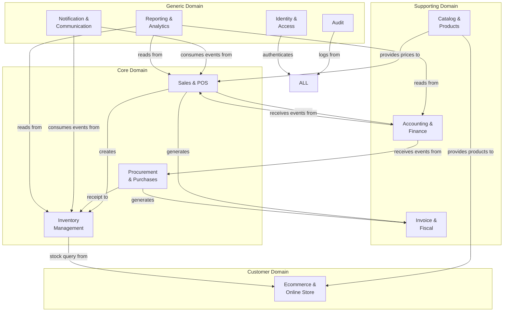

# Domain Model: Enterprise ERP System

## 1. Bounded Contexts Map



## 2. Aggregates & Entities

### Identity Context
```
User (Aggregate Root)
├── id: UUID
├── email: string (unique per company)
├── password_hash: string
├── first_name: string
├── last_name: string
├── phone: string
├── is_active: boolean
├── company_id: UUID (FK)
└── Roles[] (Many-to-Many)
    └── Role (Aggregate Root)
        ├── id: UUID
        ├── name: string (admin, employee, cliente)
        └── Permissions[] (Many-to-Many)
            └── Permission
                ├── module: string
                └── action: string (read, write, delete)
```

### Catalog Context
```
Product (Aggregate Root)
├── id: UUID
├── company_id: UUID
├── name: string
├── slug: string (auto-generated)
├── sku: string (unique per company)
├── barcode: string (unique)
├── price: decimal (selling price)
├── cost: decimal (purchase cost)
├── tax_rate: decimal (default 19%)
├── min_stock: integer
├── max_stock: integer
├── unit: string
├── is_active: boolean
├── Category (FK, optional)
├── Brand (FK, optional)
└── ProductVariant[] (Child)
    ├── id: UUID
    ├── sku: string
    ├── price: decimal
    ├── attributes: JSONB
    └── ProductImage[]
        ├── id: UUID
        ├── url: string
        ├── is_primary: boolean
        └── sort_order: integer

Category (Entity, Tree)
├── id: UUID
├── name: string
├── slug: string
├── parent_id: UUID (self-ref, nullable)
├── image_url: string
└── sort_order: integer

Brand (Entity)
├── id: UUID
├── name: string
├── slug: string
└── logo_url: string
```

### Inventory Context
```
InventoryLedger (Aggregate Root — Append-Only)
├── id: UUID
├── product_id: UUID (FK)
├── warehouse_id: UUID (FK)
├── batch_id: UUID (optional)
├── movement_type: ENUM (15 values)
├── quantity: decimal
├── unit_cost: decimal
├── total_cost: decimal
├── previous_balance: decimal (auto-calculated)
├── new_balance: decimal (auto-calculated)
├── reference_type: string
├── reference_id: UUID
├── notes: text
├── created_by: UUID
├── company_id: UUID
└── branch_id: UUID

Warehouse (Entity)
├── id: UUID
├── name: string
├── code: string
├── address: string
├── is_active: boolean
├── company_id: UUID
└── WarehouseLocation[]
    ├── id: UUID
    ├── aisle: string
    ├── rack: string
    ├── level: string
    └── position: string

InventoryReservation (Value Object)
├── id: UUID
├── product_id: UUID
├── warehouse_id: UUID
├── quantity: decimal
├── reference_type: string
├── reference_id: UUID
├── status: ENUM (active, confirmed, released, expired)
├── expires_at: timestamp
└── created_by: UUID
```

### Sales Context
```
Sale (Aggregate Root)
├── id: UUID
├── client_id: UUID (FK, optional)
├── user_id: UUID (FK — employee)
├── status: ENUM (pending→confirmed→processing→shipped→completed, cancelled)
├── subtotal: decimal
├── tax_amount: decimal
├── discount_amount: decimal
├── total: decimal
├── notes: text
├── company_id: UUID
├── branch_id: UUID
├── cash_register_session_id: UUID (optional)
└── SaleItem[] (Child)
    ├── id: UUID
    ├── product_id: UUID
    ├── quantity: decimal
    ├── unit_price: decimal
    ├── discount: decimal
    ├── tax_rate: decimal
    ├── subtotal: decimal
    └── created_by: UUID

SalePayment (Value Object)
├── id: UUID
├── sale_id: UUID
├── payment_method_id: UUID
├── amount: decimal
├── reference: string
└── notes: text

CashRegisterSession (Aggregate Root)
├── id: UUID
├── cash_register_id: UUID
├── user_id: UUID
├── status: ENUM (open, closed)
├── initial_amount: decimal
├── final_amount: decimal
├── difference: decimal
├── opened_at: timestamp
├── closed_at: timestamp
├── closed_by: UUID
└── CashMovement[] (Child)
    ├── id: UUID
    ├── type: ENUM (income, expense)
    ├── amount: decimal
    ├── description: string
    └── reference: string
```

### Procurement Context
```
Purchase (Aggregate Root)
├── id: UUID
├── supplier_id: UUID (FK)
├── status: ENUM (draft→submitted→confirmed→received→inspected→completed)
├── subtotal: decimal
├── tax_amount: decimal
├── total: decimal
├── expected_date: date
├── company_id: UUID
└── PurchaseItem[] (Child)
    ├── id: UUID
    ├── product_id: UUID
    ├── quantity: decimal
    ├── unit_cost: decimal
    ├── received_quantity: decimal
    └── subtotal: decimal

GoodsReceipt (Value Object)
├── id: UUID
├── purchase_id: UUID
├── received_by: UUID
├── notes: text
└── GoodsReceiptItem[]
    ├── id: UUID
    ├── purchase_item_id: UUID
    ├── quantity_received: decimal
    └── condition: ENUM (good, damaged, partial)

QualityInspection (Value Object)
├── id: UUID
├── goods_receipt_id: UUID
├── inspector_id: UUID
├── result: ENUM (approved, rejected, quarantine)
├── notes: text
└── QualityInspectionItem[]
    ├── id: UUID
    ├── item: string
    ├── status: ENUM (pass, fail)
    └── notes: text
```

### Invoice/Fiscal Context
```
Invoice (Aggregate Root)
├── id: UUID
├── sale_id: UUID (FK)
├── ncf: string (unique, auto-generated)
├── document_type: string (01, 02, 03, 04)
├── status: ENUM (active, voided)
├── issued_at: timestamp
├── company_id: UUID
└── NCFSequence (Reference)

CreditNote (Aggregate Root)
├── id: UUID
├── invoice_id: UUID (FK)
├── ncf: string
├── reason: text
├── amount: decimal
├── company_id: UUID
└── CreditNoteItem[]
```

### Accounting Context
```
AccountingEntry (Aggregate Root)
├── id: UUID
├── entry_number: string
├── date: date
├── description: text
├── type: ENUM (manual, automatic)
├── status: ENUM (draft, posted, voided)
├── period_id: UUID
├── company_id: UUID
└── AccountingEntryItem[] (Child)
    ├── id: UUID
    ├── account_code: string
    ├── debit: decimal
    ├── credit: decimal
    └── description: text

AccountPlan (Entity)
├── id: UUID
├── code: string
├── name: string
├── type: ENUM (asset, liability, equity, revenue, expense)
├── parent_code: string (for sub-accounts)
└── is_active: boolean
```

## 3. Value Objects

| Value Object | Context | Properties |
|-------------|---------|------------|
| Money | All | amount: decimal, currency: string |
| Address | Identity, Sales | street, city, state, zip, country |
| DateRange | Reporting | start: date, end: date |
| MoneyRange | Reporting | min: decimal, max: decimal |
| Pagination | All | page: int, limit: int, cursor: string |
| AuditInfo | All | created_at, updated_at, created_by, updated_by |
