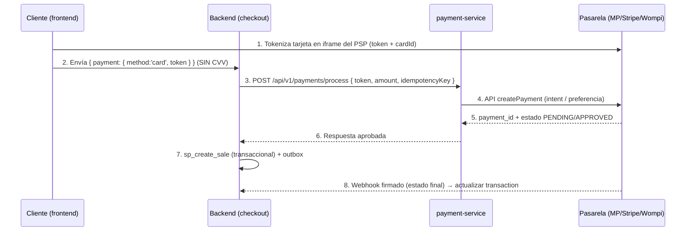
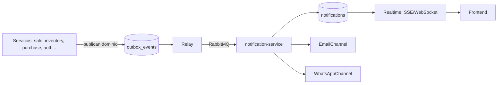

# EVALUACIÓN TÉCNICA Y MEJORAS PRÁCTICAS — PetCare Pro / Animal Store

> **Alcance**: Auditoría verificada sobre código real (archivos y líneas citados). Cada hallazgo incluye: **estado actual → impacto → mejora práctica → solución propuesta**.
> **Fecha**: Revisión de arquitectura previa al rediseño.
> **Sistema**: ERP SaaS multi-tenant (inventario + ventas + ecommerce), Vue 3 + microservicios Node/Express + Supabase/Postgres.

---

## Índice

1. [Bugs de flujo de datos](#1-bugs-de-flujo-de-datos)
2. [Falta de seguridad](#2-falta-de-seguridad)
3. [Fluidez de los procesos](#3-fluidez-de-los-procesos)
4. [Integración con pasarela de pago](#4-integración-con-pasarela-de-pago)
5. [Verificación de puertos y servicios](#5-verificación-de-puertos-y-servicios)
6. [Autenticación y roles de usuario](#6-autenticación-y-roles-de-usuario)
7. [Capacidad de la arquitectura y concurrencia](#7-capacidad-de-la-arquitectura-y-concurrencia)
8. [Sistema de notificaciones](#8-sistema-de-notificaciones)
9. [Plan de mejoras priorizado](#9-plan-de-mejoras-priorizado)

---

## 1. Bugs de flujo de datos

### 🔴 BUG 1.1 — Checkout: el frontend envía datos de tarjeta que el backend descarta

| | |
|---|---|
| **Archivos** | `frontend/src/views/account/CheckoutView.vue` (~líneas 300-340) vs `backend/services/sale-service/src/DTOs/index.js` |
| **Estado actual** | El frontend envía `{ shipping: {...}, payment: { saved_card_id } o { cardholder_name, card_number, expiry, cvv }, notes, source }`. El `CheckoutDTO` del backend solo acepta `{ shippingAddress: string, paymentMethod: string (default 'cash'), notes, source }`. |
| **Impacto** | Los datos de tarjeta/CVV se **descartan silenciosamente**. Todas las ventas ecommerce se registran como `paymentMethod: 'cash'` aunque el cliente pague con tarjeta. El `shipping` (objeto) no llega al backend que espera `shippingAddress` (string) → dirección de envío perdida o null. |

**Mejora práctica**:
- Alinear el DTO del backend con el payload real del frontend: `shipping: { address, city, phone }` y `payment: { method, token/cardId }` **sin CVV** (nunca debe viajar el CVV por HTTP propio — ver sección 4).
- Pasar `paymentMethod` explícito y usarlo al registrar la venta y la factura.

**Solución propuesta**:
```js
// DTOs/index.js (sale-service) — estado objetivo
export const CheckoutDTO = z.object({
  shipping: z.object({
    address: z.string().min(5),
    city: z.string().optional(),
    phone: z.string().optional(),
  }),
  payment: z.object({
    method: z.enum(['cash', 'card', 'transfer']).default('cash'),
    token: z.string().optional(),          // token del PSP, NUNCA el número/CVV
    savedCardId: z.string().uuid().optional(),
  }),
  notes: z.string().optional(),
  source: z.enum(['ecommerce', 'pos']).default('ecommerce'),
});
```

### 🔴 BUG 1.2 — `SaleRepository.save()` inserta venta + items sin transacción

| | |
|---|---|
| **Archivos** | `backend/services/sale-service/src/repository/index.js` (líneas 77-130) |
| **Estado actual** | Inserta `sales` y `sale_items` en **2 llamadas separadas a Supabase**, sin transacción (sin RPC ni `.transaction()`). |
| **Impacto** | Si la segunda llamada falla, queda una **venta huérfana** (sin items) que infla reportes y puede marcar stock mal. |

**Mejora práctica**: Usar una sola llamada `rpc()` con una función Postgres que inserte cabecera + items + ajuste de stock en una transacción SQL real.

**Solución propuesta**:
```sql
-- Migración: función transaccional de venta
CREATE OR REPLACE FUNCTION public.sp_create_sale(
  p_company_id uuid, p_user_id uuid, p_sale_data jsonb, p_items jsonb
) RETURNS jsonb LANGUAGE plpgsql SECURITY DEFINER AS $$
DECLARE v_sale_id uuid;
BEGIN
  INSERT INTO sales (company_id, user_id, ...) VALUES (...) RETURNING id INTO v_sale_id;
  INSERT INTO sale_items (sale_id, product_id, quantity, unit_price, ...)
    SELECT v_sale_id, (item->>'product_id')::uuid, (item->>'quantity')::int, ... FROM jsonb_array_elements(p_items) AS item;
  -- Ajustar stock dentro de la misma transacción
  UPDATE products SET stock = stock - (item->>'quantity')::int ...
  RETURN jsonb_build_object('sale_id', v_sale_id);
END $$;
```

### 🔴 BUG 1.3 — El cliente puede manipular el precio en el carrito

| | |
|---|---|
| **Archivos** | `backend/services/sale-service/src/usecases/index.js` (`AddCartItemUseCase`) |
| **Estado actual** | `AddCartItemUseCase` acepta `unitPrice` del cliente sin re-validar contra el precio del catálogo. |
| **Impacto** | Un cliente puede alterar el payload y comprar a precio 0. Riesgo alto de fraude. |

**Mejora práctica**: El backend siempre debe buscar el precio vigente del producto (`products.price`) y **ignorar** el `unitPrice` enviado por el cliente.

**Solución propuesta**:
```js
// En AddCartItemUseCase
const product = await productRepo.findById(item.productId);
if (!product) throw new Error('Producto no encontrado');
const unitPrice = product.price;          // ← siempre del servidor
const stock = product.stock;              // ← validar stock aquí también
```

### 🟠 BUG 1.4 — No se valida stock al hacer checkout

| | |
|---|---|
| **Archivos** | `backend/services/sale-service/src/usecases/index.js` (`CheckoutUseCase`, ~línea 460+) |
| **Estado actual** | El checkout no valida existencias: marca `paymentStatus: PAID` y `status: COMPLETED` sin verificar stock ni procesar pago real, auto-crea factura (`autoCreateInvoice`), limpia el carrito y publica `CheckoutCompletedEvent` + `SaleCreatedEvent` + `SaleCompletedEvent`. |
| **Impacto** | Ventas de productos agotados, stock negativo, sobreventa. |

**Mejora práctica**: Antes de marcar COMPLETED, validar `products.stock >= cantidad` para cada item (con `SELECT ... FOR UPDATE` o una reserva de stock atómica).

### 🟠 BUG 1.5 — N+1 y consultas ineficientes en reportes

| | |
|---|---|
| **Archivos** | `frontend/src/views/cashRegister/CashRegisterReportView.vue` (llama `salesAPI.getAll` por cada sesión), `frontend/src/views/DynamicDashboardView.vue` (100% mock con `generateMockData` + `Math.random()`), `DashboardView.vue` (`productsAPI.getAll({limit: 99999})` solo para un doughnut) |
| **Estado actual** | Reportes hacen peticiones en cascada; el dashboard de "dinámico" es simulado; el dashboard real trae TODOS los productos para graficar. |
| **Impacto** | Lento, datos falsos en dashboard dinámico, carga innecesaria al servidor. |

**Mejora práctica**: Crear endpoints agregados (`GET /api/v1/reports/dashboard-summary`, `GET /api/v1/reports/cash-register/{id}/summary`) que devuelvan métricas con `COUNT/SUM/GROUP BY` en SQL, apoyados en `mv_company_stats` (ya existe en migración 040).

### 🟠 BUG 1.6 — Doble símbolo de moneda y mutación directa del store

| | |
|---|---|
| **Archivos** | ~5 vistas con doble `$$` (formatPrice con `$` + formatTable), `RegisterView.vue` muta `authStore.user` directamente |
| **Impacto** | Precios mostrados como `$$12,00`, y al mutar el store directo se pierde reactividad/consistencia. |

**Solución**: Centralizar formato en un solo helper (`formatPrice`) y usar `authStore.setUser()` / actions en vez de asignación directa.

---

## 2. Falta de seguridad

### 🔴 SEG 2.1 — Secretos reales en `backend/.env`

| | |
|---|---|
| **Archivos** | `backend/.env` (existe en el workspace con valores reales) |
| **Estado actual** | Contiene `SUPABASE_SERVICE_ROLE_KEY=sb_secret_s3HnYYKmd9lLiVBd5dQNrA_IOPHPu9Q` (duplicada en línea 112) y `JWT_SECRET=inventory-system-jwt-secret-k8x9m2p4v7r3w6q1` (débil y hardcodeado). `.gitignore` incluye `.env`, pero el archivo con valores reales está presente en el workspace. |
| **Impacto** | Si se filtra el repo o el workspace, un atacante tiene acceso total a la BD (service role bypass RLS) y puede firmar JWTs arbitrarios. |

**Mejora práctica (URGENTE)**:
1. Rotar `SUPABASE_SERVICE_ROLE_KEY` en Supabase Dashboard (Settings → API → Service Role Key) y reemplazar la actual.
2. Cambiar `JWT_SECRET` por uno generado con `openssl rand -base64 48`.
3. Mover secretos a variables de entorno del entorno de despliegue (Render/Railway/Docker secrets) — nunca al repo.

### 🔴 SEG 2.2 — CVV y números de tarjeta viajan en claro y se guardan en localStorage

| | |
|---|---|
| **Archivos** | `CheckoutView.vue` (payload con `card_number` + `cvv`), `CardsView.vue` (guarda CVV/número en `localStorage('user_cards')` como fallback), `CheckoutView.vue` lee ese localStorage |
| **Estado actual** | Datos de tarjeta en claro por HTTP y persistidos en el navegador. |
| **Impacto** | PCI-DSS violation. Cualquier XSS roba tarjetas completas con CVV. |

**Mejora práctica (URGENTE)**:
- **Nunca** almacenar CVV, ni en backend ni en localStorage. Eliminar la persistencia de `user_cards` con CVV.
- Usar tokenización con la pasarela (ver sección 4): el cliente introduce los datos en el formulario **iframe del PSP**, y el backend solo recibe un `token`.

### 🟠 SEG 2.3 — El cliente puede editar su propio `credit_limit`

| | |
|---|---|
| **Archivos** | `CreditView.vue` (frontend) |
| **Estado actual** | El cliente puede editar su propio límite de crédito. |
| **Impacto** | Un cliente puede auto-aumentarse el límite y comprar sin pagar. |

**Solución**: `credit_limit` solo editable por `admin/supervisor`; en el backend validar con `authorize(ROLES.ADMIN, ROLES.SUPERVISOR)` en el controller de update y quitar el campo del formulario cliente.

### 🟠 SEG 2.4 — Multi-tenant incompleto y SERVICE_ROLE_KEY en todos los servicios

| | |
|---|---|
| **Archivos** | `backend/shared/middleware/tenant.js` + `tenantClient.js` (existen), migración 031 (RLS + helpers `get_current_user_id()`, `resolve_company_by_domain()`) **NO aplicada**, controladores NO actualizados a `createTenantClient` |
| **Estado actual** | Los servicios usan `SERVICE_ROLE_KEY` directamente (bypass RLS). El middleware multi-tenant existe pero no se usa. |
| **Impacto** | Un tenant podría (en teoría) leer datos de otros tenants si el código no filtra `company_id`. Riesgo crítico en SaaS multi-tenant. |

**Solución**: Aplicar migración 031, migrar controladores a `createTenantClient({ companyId })`, y verificar que **toda** query incluya `company_id`.

### 🟠 SEG 2.5 — Cache de permisos y consistencia de roles (ver sección 6)

---

## 3. Fluidez de los procesos

### Estado actual (verificado)

| Problema | Evidencia |
|---|---|
| **Checkout marca PAID sin pasarela** | `CheckoutUseCase` fija `paymentStatus: PAID` y `status: COMPLETED` sin llamar a payment-service ni a un PSP. |
| **Sin patrón outbox / transacciones distribuidas** | Venta→factura→inventario→pago son llamadas directas a Supabase desde cada servicio, sin saga ni outbox. |
| **Timeouts altos en gateway** | purchases 20s, sales 20s, reports 30s → usuarios perciben lentitud en vez de fallo rápido. |
| **`document.write()` para imprimir** | `POSView.vue` y `SaleDetailView.vue` usan `document.write()` con `companyName='ANIMAL STORE'` hardcodeado (ignora branding del tenant). |
| **Shaders WebGL duplicados ×4** | Auth + landing + account: coste de render/CPU innecesario en dispositivos móviles. |
| **Dobles fetches** | `DashboardView`, `InventoryReportView`, `ClientsReportView`, `CategoriesView` piden datos repetidos (p.ej. dos `onMounted` o doble suscripción). |

### Mejoras prácticas

1. **Outbox pattern**: al crear la venta, insertar evento en tabla `outbox_events` en la **misma transacción** (usando `sp_create_sale` de la sección 1.2); un relay publica los eventos a RabbitMQ/EventBus. Así: venta y factura y ajuste de inventario son consistentes aunque falle un servicio.
2. **Saga de checkout**: estados `PENDING_PAYMENT → PAID/FAILED → COMPLETED` con compensación (si el pago falla, revertir reserva de stock).
3. **Reemplazar `document.write()`** por una ventana imprimible con `window.open` + template con branding real del tenant (usar `ecommerce_settings.company_name`).
4. **Reducir timeouts** a 10s con `AbortController` en el frontend y mensaje de error amigable.
5. **Eliminar dobles fetches**: guardar respuestas en Pinia (o `useFetch` con cache) y unificar el `onMounted`.

---

## 4. Integración con pasarela de pago

### Estado actual (verificado)

- **NO existe ninguna integración**: búsqueda de `stripe|mercadopago|paypal|wompi|epayco|payu` en todo `backend/**` → **vacío**.
- `backend/services/payment-service` (puerto 3019, ESM) existe y gestiona: métodos de pago, transacciones (`process`/`refund`), cajas registradoras (open/close/sessions). Pero **`processPayment` no se conecta a ningún PSP real**: guarda en `payment_methods` local con `PAYMENT_TYPES = ['cash','card','transfer','check','credit','wallet','other']`.
- `CheckoutUseCase` **no llama a payment-service en absoluto**.

### Impacto

El sistema registra pagos "aprobados" sin que exista movimiento real de dinero. No hay conciliación, ni reembolsos reales, ni confirmación bancaria.

### Mejora práctica — integrar un PSP con tokenización

Recomendación según mercado (LatAm): **MercadoPago** (Argentina/México/Chile), **Wompi** (Colombia) o **Stripe** (internacional). Todos con Checkout Pro / Payment Intents.

**Flujo objetivo**:



**Requisitos técnicos**:
- **Webhooks firmados** (`x-signature`) con verificación de firma; endpoints idempotentes.
- **Idempotency key** por checkout (`X-Idempotency-Key`) para evitar doble cobro al reintentar.
- Estados: `PENDING → APPROVED | REJECTED | REFUNDED` y reflejarlos en `transactions` y `sales.payment_status`.
- Activar payment-service en docker-compose (puerto 3019, actualmente ausente — ver sección 5).
- Configuración por tenant: `integration-service` ya existe (puerto 3024) → guardar credenciales cifradas del PSP por tenant.

---

## 5. Verificación de puertos y servicios

### Mapa de puertos verificado

| Puerto | Servicio | docker-compose | Gateway (routes.js) | Nota |
|---|---|---|---|---|
| 6379 | redis:7-alpine | ✅ | — | solo rate-limit/caché |
| 3000 | api-gateway | ✅ | — | entrada única |
| 3001 | auth-service (+users) | ✅ | ✅ | |
| 3002 | user-service | ✅ | ✅ | |
| 3003 | product-service | ✅ | ✅ | |
| 3004 | category-service | ✅ | ✅ | |
| 3005 | inventory-service | ✅ | ✅ | |
| 3006 | purchase-service | ✅ | ✅ | |
| 3007 | sale-service (cart+checkout via rewrite) | ✅ | ✅ | |
| 3008 | report-service | ❌ **NO está en compose** | ✅ | ⚠️ muerto en Docker |
| 3009 | invoice-service | ✅ | ✅ | |
| 3012 | ecommerce-service | ✅ | ✅ | |
| 3013 | catalog-service | ✅ | ✅ | |
| 3014 | email-service | ✅ | ✅ | |
| 3015 | whatsapp-service | ✅ | ✅ | |
| 3016 | notification-service | ✅ | ✅ | |
| 3017 | audit-service | ✅ | ✅ | |
| 3018 | config-service | ✅ | ✅ | |
| 3019 | payment-service | ❌ **NO está en compose** | ✅ (`/api/v1/cash-register` → 3019) | ⚠️ caja registradora rota en Docker |
| 3020 | platform-admin-service | ✅ | ✅ | |
| 3021 | cms-service | ✅ | ✅ | |
| 3022 | form-builder-service | ✅ | ✅ | |
| 3023 | site-builder-service | ✅ | ✅ | |
| 3024 | integration-service | ✅ | ✅ | |
| 8080 | frontend (nginx) | ✅ | — | |

**Otros hallazgos**:
- `backend/services/cart-service/` y `backend/services/checkout-service/` contienen **solo `package.json`** (vacíos) — cart/checkout viven dentro de sale-service.
- `backend/shared/middleware/healthCheck.js` **hardcodea `localhost:300X`** → en Docker apunta a sí mismo, no a los servicios (healthchecks defectuosos).

### Mejoras prácticas

1. **Añadir `report-service` (3008) y `payment-service` (3019)** al docker-compose con sus healthchecks, redes y límites.
2. **Corregir healthCheck.js**: en Docker usar los nombres de servicio (`http://sale-service:3007/health`), detectables por env var.
3. **Decidir el destino de cart-service/checkout-service**: o implementarlos, o eliminarlos y documentar que sale-service los sustituye.
4. **Revisar cada ruta del gateway** contra los puertos reales en compose (script de validación automatizable).

---

## 6. Autenticación y roles de usuario

### Estado actual (verificado)

- **Backend**: `backend/shared/middleware/auth.js` — `authenticate` (JWT), `authorize(...roles)`, `hasPermission(permission)`, cache de permisos, `PERMISSION_MODULE_MAP` (ej. sales→sale, products→product).
- **Roles**: `backend/shared/types/roles.js` — `PERMISSIONS` y `ROLE_PERMISSIONS` (ADMIN tiene todos). Roles del dominio: `admin, supervisor, cajero, inventario, cliente`.
- **JWT**: 15 min + refresh token rotativo; `login` actualiza `refresh_token` y `last_login`.
- **Frontend guards** (`frontend/src/router/index.js`): `requiresAuth && !token → '/'`; cliente bloqueado de `/app`; `role_id !== 1` bloqueado de `/app/platform`; `clientOnly` requiere rol `'cliente'`.

### Problemas encontrados

| # | Problema | Evidencia | Solución |
|---|---|---|---|
| 1 | **Roles mixtos EN/ES** | payment-service usa `ROLES.SALESMAN` (inglés, de `@erp/common`) mientras `shared/types/roles.js` usa `'cajero'` (español) | Unificar en un único set (`admin, supervisor, cajero, inventario, cliente`) en `@erp/common` y eliminarlo de `shared/` |
| 2 | **Permisos finos poco aplicados** | Muchos controllers solo usan `authenticate`, sin `hasPermission('sale:create')` | Aplicar `hasPermission` en mutaciones (create/update/delete); `authenticate` solo para lecturas públicas |
| 3 | **Permisos del frontend no sincronizados** | El menú/UI usa checks locales que pueden divergir del backend | Centralizar permisos en el JWT (`permissions` array) y renderizar UI desde ahí; el backend SIEMPRE valida |
| 4 | **`UserMenu.vue` enlaza "Configuración" a `/account/credit`** | Bug de navegación | Corregir enlace a `/account/settings` (o ruta real) |

### Mejora práctica

Definir matriz única de permisos por rol y validarla en el gateway:

```js
// Matriz objetivo (backend/shared/types/roles.js)
const ROLE_PERMISSIONS = {
  admin:      ['*'],
  supervisor: ['sale:read','sale:create','product:read','product:create','report:read','user:read','cash-register:*'],
  cajero:     ['sale:create','sale:read','cash-register:open','cash-register:close'],
  inventario: ['product:*','inventory:*','purchase:*'],
  cliente:    ['sale:own','cart:*','wishlist:*','credit:read'],
};
```

- Los guards del frontend + el menú deben derivar del mismo JSON (exportado desde `@erp/common`).
- Los endpoints del gateway que requieran `x-user-role` deben validarse con el token (nunca confiar en headers del cliente).

---

## 7. Capacidad de la arquitectura y concurrencia

### Estado actual (verificado)

| Aspecto | Estado | Riesgo |
|---|---|---|
| Instancias | 1 réplica por servicio (sin autoscaling, sin LB, sin réplicas) | Punto único de fallo; sin escala horizontal |
| Límites Docker | 128-256MB RAM / 0.2-0.5 CPU por servicio | Un pico de tráfico satura el servicio |
| Redis | 1 instancia, solo rate-limit/caché | Sin colas, sin cache compartido |
| Rate limiting | In-memory en gateway (no compartido entre instancias) | Si se escala a N réplicas, cada una tiene su contador |
| EventBus | **InMemoryEventBus por defecto** (RabbitMQ solo si `RABBITMQ_URL`) | Eventos se pierden al reiniciar; **no hay rabbitmq en docker-compose** → cross-service async NO funciona de forma fiable |
| BD | Supabase Postgres único, sin pooler configurado | Límite de conexiones (~100); consultas lentas bloquean a todos |
| Trazabilidad | ✅ correlationId en gateway, circuit breaker (failureThreshold 5, successThreshold 2, timeout 30s) | Bueno, pero falta observabilidad (métricas) |
| Índices | ✅ migración 040: 30+ índices compuestos, `mv_company_stats` | Bueno |

### ¿Cuántos usuarios soporta hoy?

- **Lecturas**: OK para decenas de usuarios concurrentes (Supabase + índices).
- **Escrituras (checkout/pago)**: frágil — el checkout hace múltiples llamadas HTTP/supabase secuenciales por venta; bajo 50-100 ventas/minuto empieza a degradarse por conexiones y sin colas.
- **Eventos**: se pierden con InMemoryEventBus (crítico para notificaciones/emails en producción).

### Mejoras prácticas (en orden de impacto)

1. **RabbitMQ obligatorio** en docker-compose (o servicio gestionado CloudAMQP) + `RABBITMQ_URL` en todos los servicios → EventBus persistente, colas `notifications`, `emails`, `audit`.
2. **Rate limiting en Redis** (`express-rate-limit` con store Redis compartido) → escalable a N réplicas.
3. **Supabase Pooler** (PgBouncer/Supavisor) → multiplexar conexiones y soportar más clientes.
4. **Idempotency keys** en endpoints de pago/checkout → reintentos seguros.
5. **Outbox pattern** (sección 3) → consistencia sin acoplar servicios.
6. **Observabilidad**: Prometheus + Grafana (métricas de latencia/errores por servicio), logs centralizados.
7. **Autoscaling en Render**: `autoscaling` por CPU en `render.yaml` para api-gateway, sale-service y payment-service.
8. **Cache de catálogo** en Redis (productos, categorías) para descargar Supabase en lecturas.

---

## 8. Sistema de notificaciones

### Estado actual (verificado)

- `backend/services/notification-service/src/subscribers/index.js`: **los 5 subscribers solo hacen `logger.info`** (events: `notifications.notification.created/read/deleted`, `email.sent`, `whatsapp.sent`). **NO crean ni envían nada real.**
- La creación real de notificaciones in-app está **inline en sale-service** (`createInAppNotification` en `backend/services/sale-service/src/subscribers/index.js`): en `checkout.completed` crea notif al cliente ('¡Compra realizada con éxito!') y a admins ('Nueva venta realizada', userId null = global) + correo al usuario.
- `EmailChannelService` y `WhatsAppChannelService` existen en notification-service pero **no se conectan a los eventos**.
- **No hay push en tiempo real** (sin WebSocket/SSE/supabase realtime): el frontend hace polling (NotificationModal).
- Eventos de dominio NO cubiertos: movimientos de inventario, compras, ajustes, transferencias, eventos de auth.

### Mejora práctica — centralizar notificaciones



**Solución propuesta**:

1. **Todos los servicios publican eventos de dominio** (no crean notificaciones inline): `sale.completed`, `inventory.stock_low`, `purchase.received`, `inventory.adjusted`, `inventory.transfer`, `auth.user_registered`, `payment.refunded`, etc.
2. **notification-service se suscribe y genera** las notificaciones + emails + WhatsApp desde un solo lugar, con plantillas (`notification-service` ya tiene infraestructura de channels).
3. **Outbox** para no perder eventos (sección 3).
4. **Realtime**: agregar SSE (`/api/v1/notifications/stream`) o WebSocket en el gateway; el frontend se suscribe y elimina el polling.
5. **Canales por preferencia**: tabla `notification_preferences` por usuario (email/whatsapp/in-app activables).
6. **Alertas clave**: stock bajo (umbral configurable por producto), venta registrada, factura emitida, pago fallido, cierre de caja, nuevo pedido ecommerce.

---

## 9. Plan de mejoras priorizado

### 🔴 Rápidas (1-2 días, sin cambios de arquitectura)

| # | Acción | Área |
|---|---|---|
| 1 | Rotar `JWT_SECRET` y `SUPABASE_SERVICE_ROLE_KEY`; mover secretos a env del entorno | Seguridad 2.1 |
| 2 | Eliminar CVV/número de `localStorage('user_cards')`; quitar CVV del payload de checkout | Seguridad 2.2 |
| 3 | Bloquear edición de `credit_limit` por el propio cliente | Seguridad 2.3 |
| 4 | Añadir report-service (3008) y payment-service (3019) al docker-compose | Puertos 5 |
| 5 | Corregir healthCheck.js para usar nombres de servicio en Docker | Puertos 5 |
| 6 | Unificar roles EN/ES y corregir `UserMenu.vue` → `/account/settings` | Roles 6 |
| 7 | Alinear CheckoutDTO con el payload real (sin CVV) y pasar `paymentMethod` | Datos 1.1 |
| 8 | Validar precio/stock del servidor en carrito y checkout | Datos 1.3, 1.4 |
| 9 | Eliminar dobles fetches y doble `$$` en vistas | Datos 1.6 |
| 10 | Reemplazar `document.write()` por plantilla imprimible con branding real | Fluidez 3 |

### 🟠 Medias (1-2 semanas)

| # | Acción | Área |
|---|---|---|
| 11 | `sp_create_sale` transaccional + outbox_events | Datos 1.2, Fluidez 3 |
| 12 | Integrar PSP (MercadoPago/Stripe/Wompi) con tokenización, webhooks firmados e idempotency keys | Pasarela 4 |
| 13 | Conectar checkout → payment-service con estados PENDING→PAID/FAILED | Pasarela 4 |
| 14 | Centralizar notificaciones en notification-service (subscribers reales + canales email/whatsapp) | Notificaciones 8 |
| 15 | RabbitMQ en compose + RABBITMQ_URL en todos los servicios | Concurrencia 7 |
| 16 | Aplicar migración 031 + `createTenantClient` en controladores críticos (sale, product, inventory) | Seguridad 2.4 |
| 17 | Rate limiting en Redis compartido | Concurrencia 7 |
| 18 | Endpoints agregados de reportes (dashboard-summary, cash-register-summary) | Datos 1.5 |

### 🟢 Estructurales (1-2 meses)

| # | Acción | Área |
|---|---|---|
| 19 | Saga de checkout con compensación + outbox relay | Fluidez 3 |
| 20 | Supabase Pooler (Supavisor) + cache de catálogo en Redis | Concurrencia 7 |
| 21 | Realtime SSE/WebSocket para notificaciones (eliminar polling) | Notificaciones 8 |
| 22 | Autoscaling en Render para gateway/sale/payment + observabilidad (Prometheus/Grafana) | Concurrencia 7 |
| 23 | Matriz de permisos única exportada desde `@erp/common` y validada en gateway | Roles 6 |
| 24 | Decidir y limpiar cart-service/checkout-service vacíos | Puertos 5 |

---

## 10. Estado de implementación — Fase 2 (agosto 2026)

> Actualización posterior a la auditoría: las mejoras estructurales de la Fase 2 ya están **implementadas, aplicadas a la base de datos real y validadas end-to-end**.

### ✅ Implementado en el código

| Área | Implementación |
|---|---|
| Transacción atómica venta+stock | RPC `sp_create_sale` (SECURITY DEFINER): INSERT `sales` + `sale_items` (triggers descuentan stock y validan existencia) + eventos `transactional_outbox` en la MISMA transacción. Rollback total si falla cualquier paso |
| Outbox pattern | `transactional_outbox` + `OutboxRelay` (poll 5s, batch 100, publica a RabbitMQ `erp.events` y marca published/failed). Activado con `OUTBOX_RELAY=true` en sale-service |
| Tokenización de pagos | `PaymentGatewayClient` (mock `tok_visa`/`tok_mastercard`/`tok_amex`→approved, `tok_declined`→declined) + idempotency keys en `payment_transactions` (índice único parcial) + cobro con token/cardId antes de crear la venta |
| RabbitMQ | Servicio en docker-compose + `RABBITMQ_URL` en 6 servicios + fix del constructor `RabbitMQEventBus` (exchange `erp.events`) |
| Notificaciones centralizadas | Subscribers en notification-service: checkout completado (cliente + staff), venta creada/cancelada (staff), stock bajo (staff), registro de usuario. Inserta en `user_notifications` |
| Multi-tenant + rate limiting | `tenantContext` + `createRequestScopedSupabase` en routers críticos; `tenantLimiter` en api-gateway (x-company-id → `t:id`, JWT → `t:company_id`, fallback `ip:`) |
| Roles | `ROLES.SUPERVISOR` añadido (faltaba en `@erp/common` y se usaba en 47 sitios) |

### ✅ Migraciones aplicadas (Management API v1)

Endpoint funcional: `POST https://api.supabase.com/v1/projects/prspnfxfspokbqxsboby/database/query` (el legacy `/platform/...` devuelve 401). Herramienta: `scripts/apply-migration-v1.ps1`.

| Migración | Contenido |
|---|---|
| `049_sale_rpc_outbox.sql` | `sp_create_sale`, `sp_get_pending_outbox`, `sp_mark_outbox_published`, `sp_mark_outbox_failed`, `idempotency_key` en payment_transactions, `idx_outbox_status_created`. **Fix**: el INSERT de sale_items no usa `company_id` (la tabla no lo tiene) |
| `055_outbox_payment_core_tables.sql` | Crea `transactional_outbox` y `payment_transactions` (la 028 se aplicó antes de que el archivo creciera) + índices |
| `056_fix_automation_trigger_uuid.sql` | **Bug crítico de producción**: `fn_register_webhook_event` casteaba `company_id` (UUID) a INTEGER → toda venta/cliente/lead fallaba con `invalid input syntax for type integer`. Corregido a UUID con guard `NULLIF(...)::uuid`. Archivos locales 046/044/hotfix_002 también corregidos |

### 🔍 Validación en la base real

- **Atomicidad (caso fallo)**: `sp_create_sale` con producto inexistente → `23503 FK sale_items_product_id_fkey`, rollback total (58 ventas intactas, 0 eventos huérfanos).
- **Caso éxito**: venta `SALE-00000053` (notas `PRUEBA-FASE2-RPC`): stock de la crema 26→25, `inventory_movements` `exit_sale`, y eventos `sales.sale.created` + `sales.sale.completed` en `transactional_outbox` (status `pending`, listos para el relay).

### ⏳ Pendiente (opcional)

- Levantar el stack Docker y validar el flujo completo en vivo: sale-service → `sp_create_sale` → OutboxRelay → RabbitMQ → notification-service.
- `scripts/apply_migration_049.mjs` no funciona (conexión pg con password auth) — puede eliminarse.

---

## Resumen ejecutivo

1. **Lo más urgente** es seguridad: rotar secretos, eliminar CVV del flujo y completar el multi-tenant (RLS + `createTenantClient`).
2. **El checkout es el cuello de botella funcional**: DTO desalineado, sin validación de stock/precio, sin transacción y sin pasarela real. Ahí está el mayor riesgo de pérdida de dinero y datos.
3. **payment-service y report-service no existen en Docker**: la caja registradora y los reportes están rotos en el despliegue containerizado.
4. **Las notificaciones son un esqueleto**: hay que centralizarlas en notification-service y conectarlas a eventos reales + realtime.
5. **Para no colapsar bajo carga**: RabbitMQ + outbox + rate-limit Redis + pooler son las 4 piezas que desbloquean concurrencia real.

> Documento generado a partir de auditoría verificada sobre el código. Cada hallazgo cita archivo/línea para trazabilidad durante la implementación de las mejoras.
