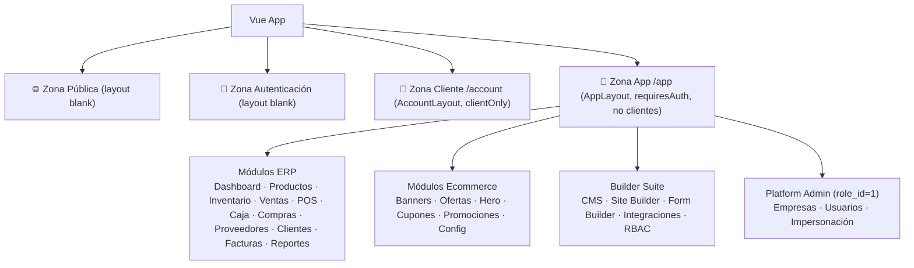
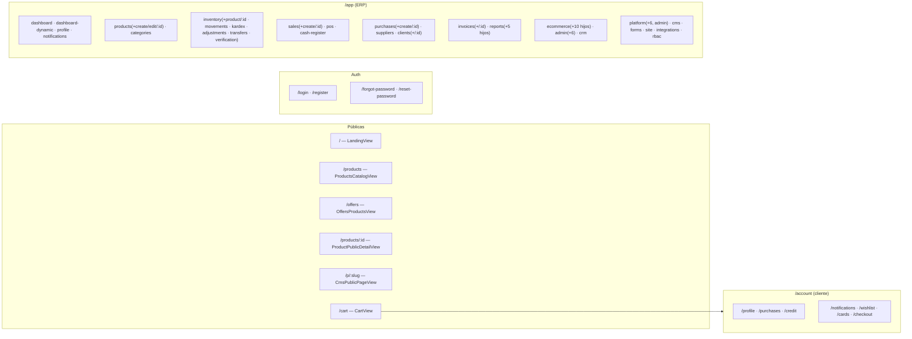
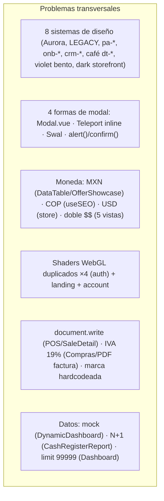

# Frontend por Rutas — Descripción Detallada

> **Objetivo:** documentar **cada sección del frontend según sus rutas**, sus **características funcionales**, y el detalle de todos los **modales** y **vistas de detalle (details)** que existen hoy, para tener un mapa exacto antes del rediseño.

---

## 1. Visión General del Frontend

### 1.1 Stack

| Capa | Tecnología |
|---|---|
| Framework | Vue 3.5 (Composition API, `<script setup>`) |
| Build | Vite 8 (dev server `http://localhost:5173`) |
| Estado | Pinia (7 stores) |
| Enrutado | Vue Router 4 (createWebHistory) |
| UI base | Tailwind + CSS variables Aurora (`--aurora-*`) + estilos scoped |
| Iconos | `material-symbols-outlined` y `material-icons-outlined` (mezclados) |
| Gráficos | Chart.js |
| PDF/Excel | jsPDF, XLSX, html2canvas |
| Notificaciones UI | sweetalert2 (Swal) + alert()/confirm() nativos + modales propios |
| Cliente API | `src/api/index.js` (baseURL `/api/v1`, interceptor `{success,data}`, token `sessionStorage.accessToken`, header `x-company-id`) |

### 1.2 Tres zonas de la aplicación

### 1.3 Guards del router (`router.beforeEach`)

| Regla | Comportamiento |
|---|---|
| `requiresAuth && !token` | Redirige a `/` |
| Token + ruta protegida sin perfil | Carga perfil; si falla → `/login` |
| Rol `cliente` en `/app/*` | Redirige a `/` |
| No `role_id === 1` en `/app/platform/*` | Redirige a `/app/dashboard` |
| `clientOnly` sin rol cliente | Redirige a `/` |
| Título | `document.title = "{meta.title} | PetCare Pro"` |

---

## 2. Mapa de Rutas Completo

### 2.1 Árbol de rutas

### 2.2 Tabla maestra de rutas

| Ruta | Name | Componente | Título | Meta | Acceso |
|---|---|---|---|---|---|
| `/` | Home | `LandingView.vue` | Animal Store | layout blank | Público |
| `/products` | ProductsCatalog | `products/ProductsCatalogView.vue` | Catálogo de Productos | blank | Público |
| `/offers` | OffersProducts | `products/OffersProductsView.vue` | Ofertas Especiales | blank | Público |
| `/products/:id` | ProductPublicDetail | `products/ProductPublicDetailView.vue` | Detalle del Producto | blank | Público |
| `/p/:slug` | CmsPublicPage | `cms/CmsPublicPageView.vue` | Página | blank | Público |
| `/login` | Login | `auth/LoginView.vue` | Iniciar Sesión | blank | Público |
| `/register` | Register | `auth/RegisterView.vue` | Registrarse | blank | Público |
| `/forgot-password` | ForgotPassword | `auth/ForgotPasswordView.vue` | Recuperar Contraseña | blank | Público |
| `/reset-password` | ResetPassword | `auth/ResetPasswordView.vue` | Restablecer Contraseña | blank | Público |
| `/cart` | Cart | `account/CartView.vue` | Carrito de Compras | blank | Público |
| `/account/*` | (7 hijos) | `account/AccountLayout.vue` | — | requiresAuth + clientOnly | Cliente |
| `/app/*` | (60+ rutas) | `components/layout/AppLayout.vue` | — | requiresAuth | Admin/Cajero/etc. |
| `/:pathMatch(.*)*` | NotFound | `errors/NotFoundView.vue` | 404 | blank | — |

---

## 3. Zona Pública (Storefront)

| Ruta | Componente | Características | Componentes usados | APIs | Puntos débiles |
|---|---|---|---|---|---|
| `/` | `LandingView.vue` (341 ln) | Hero dinámico, catálogo destacado, reseñas, contacto, shader WebGL procedural, AppNavBar + AppFooter (menú del Site Builder) | `AppNavBar`, `AppFooter`, `HeroSection`, `ProductShowcase`, `FeaturedReviews`, `ContactForm`, `FloatingBanner`, `WhatsAppWidget` | `ecommerceAPI.getPublicConfig`, `productsAPI`, `reviewsAPI` | Shader sin fallback; `console.log` debug; marca "Animal Store" fija |
| `/products` | `ProductsCatalogView.vue` (567) | Grid + filtros (categoría, precio, orden), sync de URL, skeleton, tilt 3D | `ProductShowcase`, skeletons | `productsAPI.getAll`, `categoriesAPI.getAll` | Shader duplicado; doble fetch (watcher + syncUrlQuery); `formatPrice` local |
| `/offers` | `OffersProductsView.vue` (497) | Grid de productos en oferta con descuento, filtros, skeletons | `ProductShowcase` (reuso) | `productsAPI.getOffers` | Misma estructura que catálogo (código duplicado) |
| `/products/:id` | `ProductPublicDetailView.vue` (814) | Galería, selección de variantes, cantidad, wishlist, agregar al carrito, reseñas con rating | `WishlistButton`, `FeaturedReviews`, `PaymentSplitter` (en checkout no) | `productsAPI.getById`, `reviewsAPI`, `cartAPI` | 814 líneas; lógica de variantes duplicada con ProductDetail ERP; textos en inglés parciales |
| `/p/:slug` | `CmsPublicPageView.vue` (81) | Renderiza una página CMS pública por slug con sus secciones | `RenderSection` | `cmsAPI.getBySlug` | UI mínima; depende de la robustez de RenderSection |
| `/cart` | `CartView.vue` (416) | Lista de items, cantidades, totales, cupón, ir a checkout | `PaymentSplitter` (no), `CouponDiscount` (no usado) | `cartAPI` | Cupón es **placeholder con `alert()`**; `proceedCheckout` envía payload incompleto; doble `$$` |

---

## 4. Zona Autenticación

| Ruta | Componente | Características | Notas |
|---|---|---|---|
| `/login` | `LoginView.vue` (261) | Dark glass + shader WebGL, email/password, recordar, link registro/recuperar | Colores hex hardcodeados; shader ~100 ln |
| `/register` | `RegisterView.vue` (262) | Nombre, email, password, crear cuenta cliente | Muta `authStore.user` directamente; setTimeout 2s mágico; sin validación JS de email; usa variables de color (referencia para el resto) |
| `/forgot-password` | `ForgotPasswordView.vue` (194) | Email → envía enlace | Descarta el error real del servidor |
| `/reset-password` | `ResetPasswordView.vue` (216) | Nueva contraseña + confirmar, token en query | Misma estructura/shader |

**Shaders WebGL duplicados en las 4 vistas (~100 líneas c/u)** → extraer a composable `useAuthBackground`.

---

## 5. Zona Cliente `/account` (AccountLayout)

| Ruta | Componente | Características | Puntos débiles |
|---|---|---|---|
| `/account/profile` | `ProfileView.vue` (254) | Datos personales, cambio de contraseña | "Cambiar contraseña" es **stub con `alert()`**; marca "Animal Store" fija; tema café `dt-*` |
| `/account/purchases` | `PurchasesView.vue` (171) | Historial de compras del cliente | `formatPrice` con `$` → **doble `$$`**; light theme que rompe dark del layout |
| `/account/credit` | `CreditView.vue` (207) | Saldo/límite de crédito, historial | 🔴 **Cliente puede editar su propio `credit_limit`** (bug seguridad) |
| `/account/notifications` | `NotificationsView.vue` (196) | Lista de notificaciones del cliente | Light custom |
| `/account/wishlist` | `WishlistView.vue` (110) | Lista de deseos, agregar al carrito | Doble `$$` |
| `/account/cards` | `CardsView.vue` (283) | Tarjetas guardadas | 🔴 **Guarda CVV/número en localStorage**; usa endpoint equivocado (`getCreditAccount`) |
| `/account/checkout` | `CheckoutView.vue` (376) | Dirección, envío, tarjeta, split de pago | 🔴 **Envía CVV/tarjeta en crudo**; envío "Gratis" hardcodeado; doble `$$`; fecha mostrada pero no enviada |

**Layout `AccountLayout.vue` (132 ln):** sidebar de cuenta + shader per-pixel costoso; **no enlaza Wishlist ni Tarjetas**.

---

## 6. Zona `/app` — Módulos ERP

### 6.1 Dashboard y Perfil

| Ruta | Componente | Características | Modales | Puntos débiles |
|---|---|---|---|---|
| `/app/dashboard` | `DashboardView.vue` (1022) | 9 KPIs (ventas hoy/mes, pedidos, clientes, stock bajo, valor inventario), 4 charts Chart.js (línea, doughnut categorías, barras), contadores animados GSAP/anime.js, listas recientes | — | `productsAPI.getAll({limit: 99999})` solo para un doughnut; footer en inglés |
| `/app/dashboard-dynamic` | `dashboard/DynamicDashboardView.vue` (498) | Dashboard con widgets configurables del catálogo (renderer + picker) | `WidgetPickerModal` (Teleport, catálogo widgets) | 🔴 **100% mock data** (`generateMockData` + `Math.random()`) |
| `/app/profile` | `ProfileView.vue` (257) | Perfil del usuario interno, editar datos | — | "Cambiar contraseña" stub; tema café |
| `/app/notifications` | `dashboard/NotificationsView.vue` (332) | Centro de notificaciones bento, filtros por tipo, marcar leídas, eliminar | `NotificationModal` (dropdown), `NotificationsFeed` | Diseño violet glass distinto al resto |
| `/app/notifications/:id` | `notifications/NotificationDetailView.vue` (348) | Detalle: título, mensaje, datos del evento, enlaces relacionados, metadatos | — | 🔴 Bug: botón `'Vista简约'` (caracteres chinos); tema café |

### 6.2 Productos

| Ruta | Componente | Características | Modales | Puntos débiles |
|---|---|---|---|---|
| `/app/products` | `products/ProductListView.vue` (966) | KPIs, toggle tabla/grid, filtros (categoría, estado, precio), paginación server-side, acciones rápidas | `DataTable` + confirm con Swal | Textos en inglés ("Products Module"); 966 líneas |
| `/app/products/create` y `/edit` | `products/ProductFormView.vue` (860) | Formulario por secciones (info, precio, variantes, imágenes, SEO), upload directo a Supabase | **Teleport modal de variantes** (`showVariantModal`) | Estilo inline masivo (`@focus` mutando borderColor/boxShadow decenas de veces); `alert()` nativo |
| `/app/products/:id` | `products/ProductDetailView.vue` (359) | Galería, 4 stat-cards (stock con color según `min_stock`, precio, ventas), variantes agrupadas, detalles generales, descripción | — | Lógica de variantes duplicada con la vista pública |

### 6.3 Categorías

| Ruta | Componente | Características | Modales | Puntos débiles |
|---|---|---|---|---|
| `/app/categories` | `categories/CategoryListView.vue` (295) | Grid de tarjetas, jerarquía padre/hijo, crear/editar/eliminar | `Modal` + `ConfirmDialog` (compartidos) | Doble fetch (`fetchCategories` + `fetchAllCategories`); `DataTable` importado sin usar |

### 6.4 Inventario

| Ruta | Componente | Características | Modales | Puntos débiles |
|---|---|---|---|---|
| `/app/inventory` | `inventory/InventoryView.vue` (315) | KPIs (valor, bajo stock, agotados, pendientes) + `InventoryTable` (8 columnas, badges por estado) | — | `InventoryList.vue` (38 ln) redundante; estilos inline en InventoryTable |
| `/app/inventory/product/:id` | `inventory/InventoryDetailView.vue` (426) | 4 stat-cards (stock, valor, min_stock, estado), variantes con stock por almacén, detalles, ubicaciones, badge **not_available** (nuevo) | Swal para ajustes de stock | — |
| `/app/inventory/movements` | `inventory/MovementsView.vue` (187) | DataTable + filtro por tipo, detalle de movimiento | **Teleport detail modal** | — |
| `/app/inventory/kardex/:productId?` | `inventory/KardexView.vue` (94) | Kardex por producto | — | 🔴 Roto: `inventoryAPI.getKardex` no existe; columnas Entrada/Salida con misma `key: 'quantity'` |
| `/app/inventory/adjustments` | `inventory/AdjustmentsView.vue` (134) | Lista de ajustes + crear | `Modal` (Nuevo Ajuste) | Sin paginación; `min_stock \|\| 5` hardcodeado |
| `/app/inventory/transfers` | `inventory/TransfersView.vue` (124) | Lista + crear transferencia | `Modal` (Nueva Transferencia) | Almacén en **texto libre** (sin selector) |
| `/app/inventory/verification` | `inventory/VerificationView.vue` (307) | KPIs + verificación de compras con `verified_qty`/`rejected_qty` | **Teleport verify modal** | Lógica duplicada con PurchaseDetailView |

### 6.5 Ventas, POS y Caja

| Ruta | Componente | Características | Modales | Puntos débiles |
|---|---|---|---|---|
| `/app/sales` | `sales/SaleListView.vue` (712) | KPIs + chart + DataTable, filtros (estado, pago, fechas), anular | `confirm()` nativo para anular | Tendencia hardcodeada `12`; meta `$80,000` fija; rango fechas 2024–2026 |
| `/app/sales/create` | `sales/SaleFormView.vue` (224) | Alta manual de venta con cliente, items, IVA desde config | — | — |
| `/app/sales/:id` | `sales/SaleDetailView.vue` (298) | Info venta, items, totales, imprimir borrador, anular | Swal para anular | `printAsDraft()` con **`document.write`** + `companyName='ANIMAL STORE'` hardcodeado |
| `/app/pos` | `sales/POSView.vue` (798) | 2 paneles (catálogo + carrito), búsqueda, turno de caja con verifyAdmin, ticket 80mm, checkout crea venta + movimiento | **Teleport variant modal** + Teleport de verificación admin | 798 líneas; `document.write`; checkout sin composable |
| `/app/cash-register` | `sales/CashRegisterView.vue` (567) | Turnos (abrir/cerrar), movimientos (ingreso/egreso/retiro/depósito), reporte del turno con export | `Modal` (Abrir Turno sm) + Swal | — |

### 6.6 Compras, Proveedores, Clientes

| Ruta | Componente | Características | Modales | Puntos débiles |
|---|---|---|---|---|
| `/app/purchases` | `purchases/PurchaseListView.vue` (427) | DataTable + filtros + resumen (stats) | — | `fetchSummary` usa `getAll({limit:1})` solo para contar |
| `/app/purchases/create` | `purchases/PurchaseFormView.vue` (345) | Autocomplete de productos, crear producto inline, preview de número, IVA | — | 🔴 **IVA 19% hardcodeado** (ventas usa config) |
| `/app/purchases/:id` | `purchases/PurchaseDetailView.vue` (502) | Proveedor, items, editar item, verificar, enviar a inventario, cancelar | **2 Teleport modals** (editar item + verificación) | Overlay custom duplicando `Modal.vue` |
| `/app/suppliers` | `suppliers/SuppliersView.vue` (326) | CRUD con DataTable server-side + vista móvil | **2 Teleport modals** (form + confirm) | No usa ConfirmDialog compartido; `CardGridSkeleton` importado sin usar |
| `/app/clients` | `clients/ClientListView.vue` (146) | DataTable + buscar + crear | `ClientFormModal` (compartido) | Swal para confirmaciones |
| `/app/clients/:id` | `clients/ClientDetailView.vue` (145) | Info contacto, historial de compras, editar, reset de contraseña | Swal | — |

### 6.7 Facturas

| Ruta | Componente | Características | Modales | Puntos débiles |
|---|---|---|---|---|
| `/app/invoices` | `invoices/InvoiceListView.vue` (316) | Stats + DataTable con **orden server-side** (N° factura, total, creada — asc/desc ✅ verificado 2026-08-05), marcar pagada, PDF | Swal (marcar pagada) | Stats solo sobre la página actual |
| `/app/invoices/:id` | `invoices/InvoiceDetailView.vue` (508) | Header factura, grid info (emisor/receptor), items, totales, asiento fiscal, PDF/Excel | `AuroraDownloadModal` | IVA 19% hardcodeado en PDF; `mapInvoiceData` manual |

### 6.8 Reportes

| Ruta | Componente | Características | Modales | Puntos débiles |
|---|---|---|---|---|
| `/app/reports` | `reports/reporthomeview.vue` (6, wrapper vacío) → `ReportsView.vue` (59) | Hub de navegación por tarjetas | — | `reporthomeview` es redundante |
| `/app/reports/sales` | `SalesReportView.vue` (219) | Chart.js ventas por período + tabla + export | `AuroraDownloadModal` (textos en inglés) | `setTimeout(() => buildCharts(), 100)` hack |
| `/app/reports/inventory` | `InventoryReportView.vue` (280) | Stock por producto, valor, export | `AuroraDownloadModal` | Doble fetch (full + paginado) |
| `/app/reports/top-products` | `TopProductsView.vue` (236) | Top vendidos con barras | `AuroraDownloadModal` | Paginación client-side |
| `/app/reports/clients` | `ClientsReportView.vue` (247) | Compras por cliente | `AuroraDownloadModal` | Doble fetch |
| `/app/reports/cash-register` | `CashRegisterReportView.vue` (369) | Turnos por usuario/fechas, detalle de turno | `Modal` (Detalle del Turno xl) | 🔴 **N+1**: `salesAPI.getAll` por cada sesión |

---

## 7. Zona `/app` — Ecommerce Builder, Admin y Builder Suite

### 7.1 Ecommerce (tabs siempre visibles)

| Ruta | Componente | Características | Modales | Puntos débiles |
|---|---|---|---|---|
| `/app/ecommerce` | `EcommerceView.vue` (25) | Contenedor de tabs (10 tabs) | — | Tab "Hero (legacy)" duplicada |
| `/app/ecommerce/` | `EcommerceHome.vue` (64) | KPIs del módulo | — | Sin datos reales |
| `/app/ecommerce/banners` | `BannersView.vue` (102) | CRUD banners **por URL** | Modal propio (custom overlay) + confirm | Sin upload (inconsistente con HeroSlides) |
| `/app/ecommerce/offers` | `OffersView.vue` (277) | CRUD ofertas con descuento % | `Modal` compartido + confirm Swal | `console.log` debug; 3 mecanismos de confirmación distintos en el módulo |
| `/app/ecommerce/hero` | `HeroSettingsView.vue` (175) | **LEGACY** configuración hero | — | Obsoleta (reemplazada por hero-slides) |
| `/app/ecommerce/hero-slides` | `HeroSlidesView.vue` (363) | Carrusel de slides con upload Supabase, orden, activo | Modal propio + confirm | Upload solo aquí |
| `/app/ecommerce/floating-banners` | `FloatingBannersView.vue` (359) | Banners flotantes (posición, página, móvil) | Modal propio + confirm | Duplicado de Banners |
| `/app/ecommerce/reviews` | `ReviewsModerationView.vue` (283) | Moderación de reseñas (aprobar/rechazar/eliminar) | confirm custom | — |
| `/app/ecommerce/coupons` | `CouponsView.vue` (364) | CRUD cupones (código, tipo %, límite, fechas) | Modal propio + confirm | Gemelo copy-paste de Promotions |
| `/app/ecommerce/promotions` | `PromotionsView.vue` (289) | CRUD promociones | Modal propio + confirm | Copia de Coupons |
| `/app/ecommerce/settings` | `SettingsView.vue` (**1693**) | Moneda, impuestos, WhatsApp, SEO, identidad, pagos | — | 🔴 **Monolito 1693 líneas** con CSS scoped propio |

### 7.2 Admin

| Ruta | Componente | Características | Modales | Puntos débiles |
|---|---|---|---|---|
| `/app/admin` | `AdminView.vue` (60) | Tabs (usuarios / auditoría / configuración) | — | Iconos legacy mezclados |
| `/app/admin/users` | `UsersView.vue` (56) | Lista de usuarios, crear | Modal propio | `@mouseenter` JS para hover |
| `/app/admin/users/:id` | `UserDetailView.vue` (53) | Perfil + historial de acceso | — | Tema café `dt-*` |
| `/app/admin/audit` | `AuditLogView.vue` (218) | Logs de auditoría con filtros | — | Vista móvil duplicada (DataTable ya la tiene) |
| `/app/admin/audit/:id` | `AuditDetailView.vue` (173) | Campos del evento + grid de datos | — | — |
| `/app/admin/config` | `ConfigView.vue` (75) | Configuración del sistema | — | Tema café `#624200` |

### 7.3 CRM

| Ruta | Componente | Características | Modales | Puntos débiles |
|---|---|---|---|---|
| `/app/crm` | `crm/PipelineView.vue` (393) | Kanban drag & drop, stats (leads, valor pipeline, conversión), crear lead, convertir a cliente | **2 Teleport modals** (detalle lead + nuevo lead) | 7º sistema de diseño (`crm-*`); fallback `{id:1}` fake |

### 7.4 Platform Admin (SaaS — requiere `role_id === 1`)

| Ruta | Componente | Características | Modales | Puntos débiles |
|---|---|---|---|---|
| `/app/platform` | `PlatformAdminView.vue` (58) | Shell con sidebar `pa-*` 240px + 5 secciones | — | 4º sistema de diseño; emojis de icono |
| `/app/platform/` | `PlatformDashboard.vue` (225) | KPIs globales (empresas, usuarios, ingresos) | — | Helpers duplicados en 4 archivos |
| `/app/platform/companies` | `CompaniesView.vue` (285) | Tabla de empresas, estado, suscripción | **Teleport impersonation modal** | — |
| `/app/platform/companies/create` | `CompanyOnboardingView.vue` (396) | Wizard onboarding 4 pasos (empresa → admin → widgets → plan) | Swal | 🔴 Contraseña temporal `'Admin123!'` hardcodeada; widgets hardcodeados (8); 5º sistema (`onb-*`) |
| `/app/platform/companies/:id` | `CompanyDetailView.vue` (353) | Tabs: overview / widgets / activity / subscription, editar, suspender | Swal (razón de suspensión) | Drag handle decorativo |
| `/app/platform/users` | `GlobalUsersView.vue` (176) | Usuarios globales, activar/desactivar | Swal | — |
| `/app/platform/impersonation` | `ImpersonationLogView.vue` (183) | Log de sesiones de soporte | Swal | — |

### 7.5 Builder Suite (área LEGACY)

| Ruta | Componente | Características | Modales | Puntos débiles |
|---|---|---|---|---|
| `/app/cms` | `cms/PagesManagerView.vue` (393) | CRUD páginas + builder de secciones con preview | Modal create/edit legacy `.modal` | CSS legacy replicado; `alert()`/`confirm()` nativos |
| `/app/forms` | `forms/FormBuilderView.vue` (275) | 10 tipos de campo, builder de campos, submissions en JSON | **2 modales legacy** (crear form + editor de campo) | Guardado N+1 campo por campo |
| `/app/site` | `site/SiteBuilderView.vue` (422) | Media (URL), temas, menús (MenuEditorModal), SEO, código | **Modales legacy** (subir medio, crear menú) + `MenuEditorModal` | Media solo URL; `editCode` es **stub con `alert()`** |
| `/app/integrations` | `integrations/IntegrationsView.vue` (332) | Tabs webhooks/automations, cards con event tags, test, logs, checkbox grid | **2 modales legacy** (nuevo webhook + logs) | Test **simulado** con `alert` |
| `/app/rbac` | `rbac/RolesPermissionsView.vue` (341) | Roles + feature flags + planes, matriz permisos | Modal legacy create/edit rol | `editPlan` **stub con `alert()`**; fallback companyId hardcodeado |

**Componentes legacy compartidos del builder:** `components/cms/ComponentPicker.vue` (131), `SectionEditor.vue` (420), `RenderSection.vue` (368), `components/site/MenuEditorModal.vue` (225) — **todos duplican el mismo bloque CSS legacy**.

---

## 8. Inventario de Modales

### 8.1 Modales compartidos (`components/`)

| Modal | Props | Slots | Emits | Estilo | Usado en |
|---|---|---|---|---|---|
| `shared/Modal.vue` (71 ln) | `show`, `title`, `size` (sm/md/lg/xl/full) | default (body) | `close` | Aurora (z-100, backdrop blur, animación scale) | Adjustments, Transfers, CashRegister, Offers, CashRegisterReport, CategoryList |
| `shared/ConfirmDialog.vue` (73 ln) | `show`, `title`, `message`, `loading` | — | `confirm`, `cancel` | Aurora rojo, **solo eliminar** (icono fijo delete) | CategoryList |
| `shared/AuroraDownloadModal.vue` (349 ln) | `visible`, `title`, `subtitle`, `successMessage`, `fileName` | — | `close` | Aurora | InvoiceDetail + 4 reportes (**textos en inglés, progreso simulado**) |
| `clients/ClientFormModal.vue` | `visible`, `client` | — | `close`, `saved` | Café `#624200` + inline styles | ClientListView (**único modal de formulario reutilizable**) |
| `notifications/NotificationModal.vue` | `show` | — | `close` | Café, **dropdown** (no modal centrado) | NotificationsView, UserMenu |
| `site/MenuEditorModal.vue` (225 ln) | `menu` | — | `close` | LEGACY `.modal` | SiteBuilderView (**fase 2: lo usa AppNavBar**) |
| `dashboard/WidgetPickerModal.vue` | `show` | — | `close`, widgets vía API | `wpm-*` + **Teleport** | DynamicDashboardView |
| `cms/ComponentPicker.vue` (131) | — | — | — | LEGACY | PagesManagerView |
| `cms/SectionEditor.vue` (420) | — | — | — | LEGACY | PagesManagerView |

### 8.2 Modales inline con `<Teleport to="body">` (por vista)

| Vista | Modal(es) | Propósito |
|---|---|---|
| `products/ProductFormView.vue` | Edit Variant Modal | Editar/crear variante con combinaciones |
| `sales/POSView.vue` | Variant Selection + verifyAdmin | Elegir variante al agregar al carrito; verificar credenciales para turno |
| `purchases/PurchaseDetailView.vue` | Item Edit + Verification | Editar item de compra; verificar cantidades recibidas |
| `inventory/MovementsView.vue` | Movement Detail | Detalle de un movimiento |
| `inventory/VerificationView.vue` | Verify Modal | Confirmar verificación con cantidades |
| `suppliers/SuppliersView.vue` | Form + Confirm | Crear/editar proveedor; confirmar borrado |
| `crm/PipelineView.vue` | Lead Detail + New Lead | Ver/crear lead en el kanban |
| `platform-admin/CompaniesView.vue` | Impersonation | Acceder como soporte a una empresa |

### 8.3 SweetAlert2 (Swal) — por vista

| Vista | Uso |
|---|---|
| `inventory/InventoryDetailView.vue` | Confirmaciones de ajuste de stock |
| `invoices/InvoiceListView.vue` | Confirmar marcar pagada |
| `sales/SaleDetailView.vue` | Anular venta |
| `platform-admin/CompanyDetailView.vue` | Editar/suspender empresa (con prompt de razón) |
| `platform-admin/CompanyOnboardingView.vue` | Confirmación final del onboarding |
| `platform-admin/GlobalUsersView.vue` | Activar/desactivar usuario |
| `platform-admin/ImpersonationLogView.vue` | Confirmaciones |

### 8.4 `alert()` / `confirm()` nativos (stubs)

| Vista | Línea | Acción |
|---|---|---|
| `sales/SaleListView.vue` | `confirm(...)` | Anular factura |
| `site/SiteBuilderView.vue` | `alert()` | `editCode` (**stub**) |
| `rbac/RolesPermissionsView.vue` | `alert()` | `editPlan` (**stub**) |
| `account/CartView.vue` | `alert()` | Aplicar cupón (**stub**) |
| `ProfileView.vue` | `alert()` | Cambiar contraseña (**stub**) |
| `integrations/IntegrationsView.vue` | `alert()` | Test de webhook (**simulado**) |
| `products/ProductFormView.vue` | `alert()` | Validaciones varias |

---

## 9. Vistas de Detalle (Details)

### 9.1 Detalle ERP (`/app`)

| Vista | Ruta | Secciones internas | Acciones | Datos |
|---|---|---|---|---|
| **ProductDetailView** | `/app/products/:id` | Galería → Nombre/precio/estado → **Variantes** (agrupadas, expandibles) → 4 stat-cards (stock con color según `min_stock`, precio costo, ventas, fecha) → **Detalles Generales** (SKU, categoría, marca, peso, etc.) → Descripción | Editar, eliminar | `productsAPI.getById` |
| **InventoryDetailView** | `/app/inventory/product/:id` | Header con nombre + badge estado (`available`/`not_available`/`blocked`/`pending` ✅) → 4 stat-cards (stock, valor, min_stock, estado) → **Variantes con stock por almacén** (expandibles) → **Detalles Generales** → Ubicaciones → Descripción | Editar, ajustar stock (Swal) | `inventoryAPI`, `productsAPI` |
| **SaleDetailView** | `/app/sales/:id` | Header `Venta #...` + estado → Grid info (fecha, cliente, cajero, método pago) → **Items** → **Totales** (subtotal, IVA, total) → imprimir | Imprimir borrador (`document.write`), anular (Swal) | `salesAPI.getById` |
| **PurchaseDetailView** | `/app/purchases/:id` | Header + estado → **Proveedor** (grid 4 col) → **Items** (editar modal, verificar modal) → Totales → Enviar a inventario, cancelar | Editar item, verificar, enviar inventario, cancelar | `purchasesAPI.getById` |
| **ClientDetailView** | `/app/clients/:id` | Header (nombre + contacto) → Grid info (email, teléfono, documento, saldo) → **Historial de Compras** | Editar (ClientFormModal), reset password | `clientsAPI.getById` |
| **InvoiceDetailView** | `/app/invoices/:id` | Header "Factura" → Grid info (emisor/receptor, fechas, estado) → **Items** → **Totales** → **Asiento fiscal** → PDF/Excel | Marcar pagada, descargar PDF/Excel | `invoicesAPI.getById` |
| **UserDetailView** | `/app/admin/users/:id` | Header (nombre) → Grid info (email, rol, estado) → **Historial de Acceso** | — | `usersAPI` |
| **AuditDetailView** | `/app/admin/audit/:id` | Header (acción + usuario) → Grid de datos del evento (2-3 col) | — | `auditAPI` |
| **NotificationDetailView** | `/app/notifications/:id` | Título → **Mensaje** → **Datos del Evento** → **Enlaces Relacionados** → **Metadatos** (grid 2 col) | Marcar leída | `notificationsAPI` |
| **CompanyDetailView** | `/app/platform/companies/:id` | Header (nombre + estado) → **Tabs**: overview (contacto + configuración) / widgets (catálogo) / activity / subscription | Editar, suspender (Swal), ver widgets | `platformAdminAPI` |

### 9.2 Detalle Público

| Vista | Ruta | Secciones internas | Acciones |
|---|---|---|---|
| **ProductPublicDetailView** | `/products/:id` | Galería → Título/precio/descuento → **Variantes** → Cantidad + agregar al carrito + wishlist → **Reseñas de Clientes** (rating promedio + lista + form) | Comprar, wishlist, reseñar |
| **CmsPublicPageView** | `/p/:slug` | Renderiza secciones de la página CMS | — |

### 9.3 Detalle de movimiento

| Vista | Ruta | Contenido |
|---|---|---|
| **MovementsView (modal)** | `/app/inventory/movements` | Tipo de movimiento, producto, cantidades, origen/destino, usuario, fecha, notas (modal Teleport) |

---

## 10. Componentes Compartidos Clave

| Componente | Rol | Observaciones |
|---|---|---|
| `layout/AppLayout.vue` | Shell de `/app` (sidebar + navbar + keep-alive) | keep-alive hardcodeado `['Dashboard']` |
| `layout/Sidebar.vue` (295) | Navegación lateral, submenús, permisos | Emojis en labels; 20+ items sin agrupar |
| `layout/Navbar.vue` (110) | Topbar con buscador `⌘K` + badge notificaciones | **Buscador sin funcionalidad** |
| `layout/AppNavBar.vue` (392) | Navbar público con menú del Site Builder (fase 2 ✅) | Tailwind dark |
| `shared/DataTable.vue` (308) | Tabla genérica: sortable, serverPagination, vista móvil | 🔴 **Moneda MXN hardcodeada**; raíz `nexus-card` legacy |
| `shared/PageHeader.vue` (31) | Encabezado con título | Título siempre blanco (solo sobre gradiente) |
| `shared/StatCard.vue` (298) | KPI con contador animado | MXN hardcodeado; iconos mezclados |
| `shared/Alert.vue` (59) | Alertas de error/éxito | — |
| `shared/Loading.vue` (12) | Spinner | Sin usar en 7 vistas (usan skeletons) |
| `shared/UserMenu.vue` (197) | Menú de usuario | Bug: Configuración → `/account/credit` |
| `shared/PaymentSplitter.vue` (123) | División de pago (efectivo/tarjeta) | `step="100"` hardcodeado; doble `$$` |
| `shared/CouponDiscount.vue` (109) | Input de cupón | **No usado en CartView**; doble `$$` |
| `shared/ProductShowcase.vue` (262) | Card de producto público | Textos en inglés; imagen fallback de Google |
| `shared/OfferShowcase.vue` (207) | Card de oferta | 🔴 **Moneda MXN hardcodeada** (`Intl es-MX`) |
| `shared/HeroSection.vue` (709) | Hero del landing con FLIP | Textos inglés/español mezclados en fallback |
| `shared/FeaturedReviews.vue` (208) | Reseñas destacadas | 🔴 Ternario `'star' : 'star'` (nunca vacía) |
| `inventory/InventoryTable.vue` (181) | Tabla de inventario | Estilos inline + JS en template |
| `inventory/InventoryTabs.vue` (55) | Tabs inventario | Estilos inline |
| Skeletons (8) | Loading por dominio | Buen sistema; alinear al theme |

---

## 11. Resumen de Inconsistencias por Ruta (para el rediseño)

### Checklist por zona

| Zona | Vistas con diseño Aurora | Vistas legacy | Vistas con bugs críticos |
|---|---|---|---|
| Pública | Landing, Catálogo, Detalle, Cart | — | Cart (cupón stub, payload incompleto), Detalle (variantes duplicadas) |
| Auth | — | 4 vistas con shader duplicado | Register (muta store, sin validación) |
| Account | — | 7 vistas café/light mixtas | Credit (edita credit_limit), Cards (CVV localStorage), Checkout (CVV crudo) |
| `/app` ERP | Dashboard, Productos, Inventario, Ventas, Facturas, Reportes | Notifications (violet), Profile (café), Kardex | Kardex (roto), DynamicDashboard (mock), CashRegisterReport (N+1) |
| `/app` Ecommerce | Banners, Offers, Hero, Cupones, Promociones | Settings (1693 ln monolito), Hero legacy | Settings monolito |
| `/app` Builder | — | CMS, Site, Forms, Integrations, RBAC (CSS legacy) | Stubs `alert()` en Site/RBAC |
| `/app` Admin | AdminView, Audit | Users (café), Config (café) | — |
| `/app` Platform | — | Todo `pa-*` + `onb-*` | Onboarding password hardcodeada |
| `/app` CRM | — | Pipeline (`crm-*`) | Fallback `{id:1}` |

---

## 12. Conclusión

Este documento es el **mapa exacto de rutas → componentes → modales → detalles** del frontend. Sirve como base para:

1. **Planificar el rediseño**: cada fila indica qué sistema de diseño usa cada ruta y qué modales deberían migrarse a `Modal.vue`/`ConfirmDialog.vue`/`ToastProvider`.
2. **Priorizar bugs**: las filas con 🔴 son correcciones inmediatas de seguridad/funcionalidad.
3. **Medir deuda**: 4 mecanismos de modales, 8 design systems, N+1, mocks y stubs están localizados con su archivo exacto.
4. **Estandarizar**: el objetivo final es que cada ruta use componentes Aurora 2.0 y un único mecanismo de feedback (ver `docs/ANALISIS-REDISENO-COMPLETO.mdx`).

> **Referencias:** `docs/ANALISIS-REDISENO-COMPLETO.mdx` (plan por fases), `docs/ANALISIS-ERP-COMPLETO.mdx` (madurez del ERP), `docs/ARCHITECTURE-AUDIT.md`.
