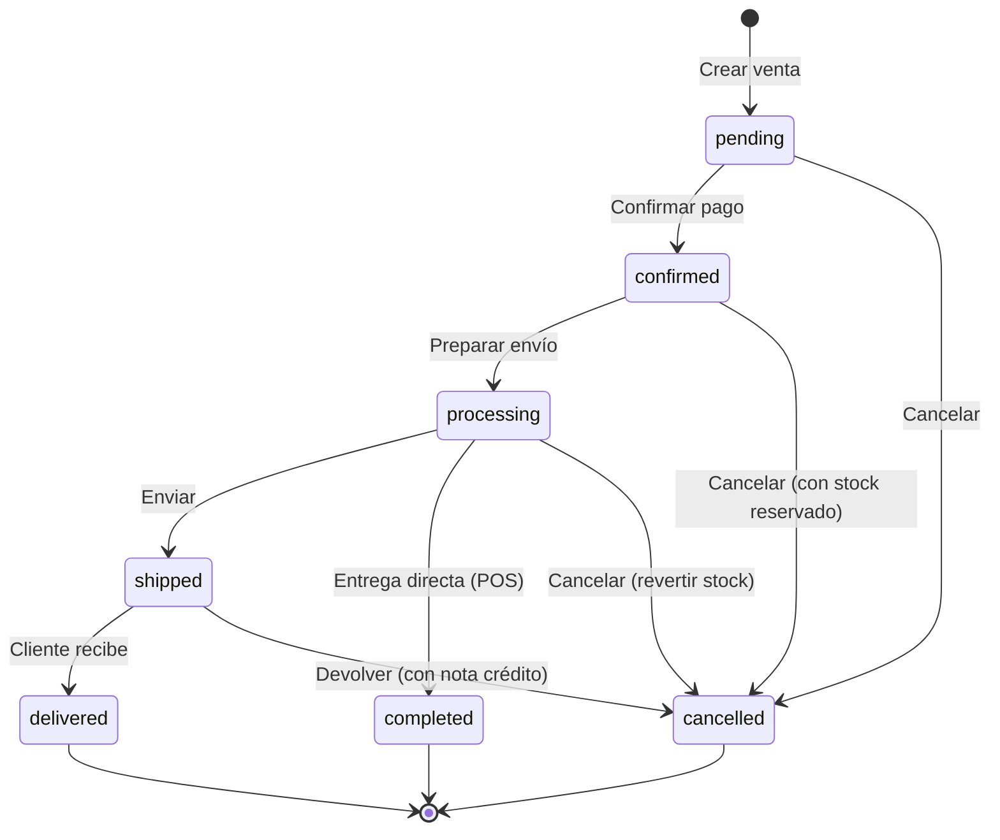
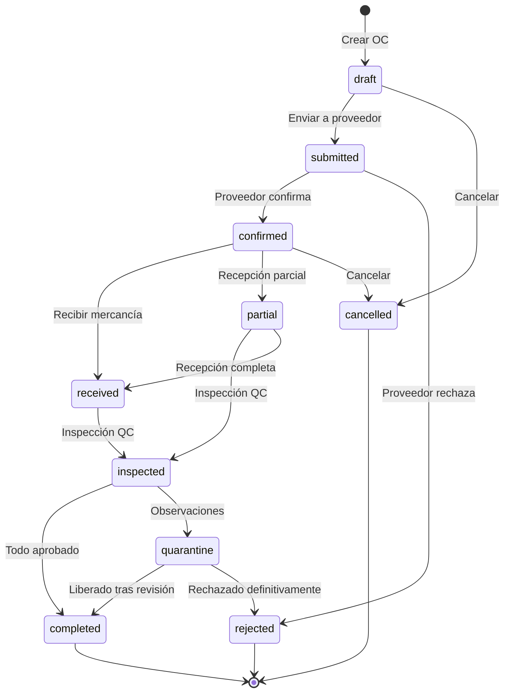
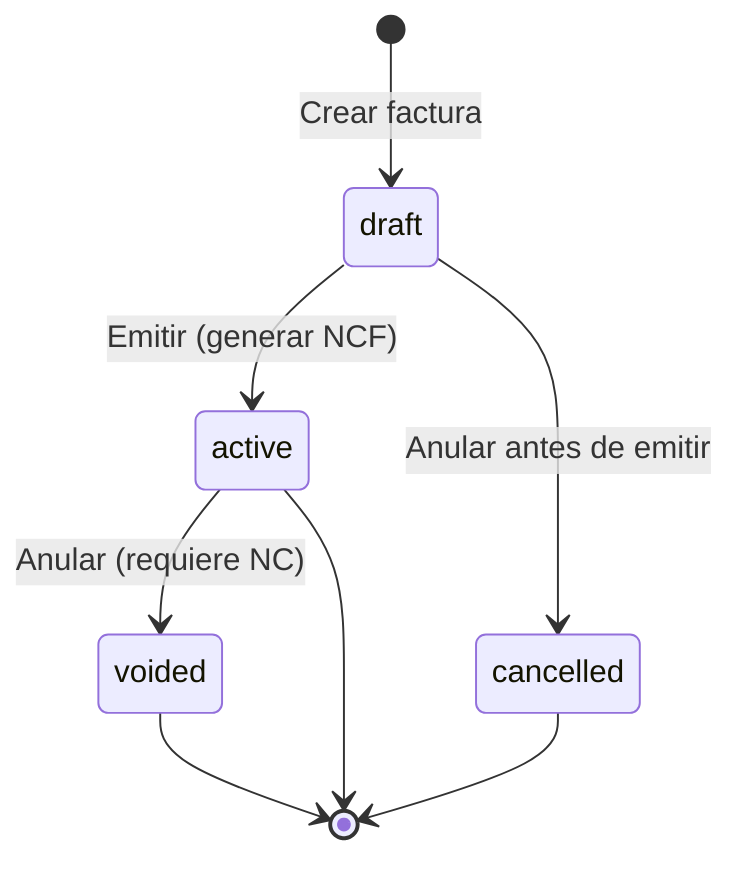
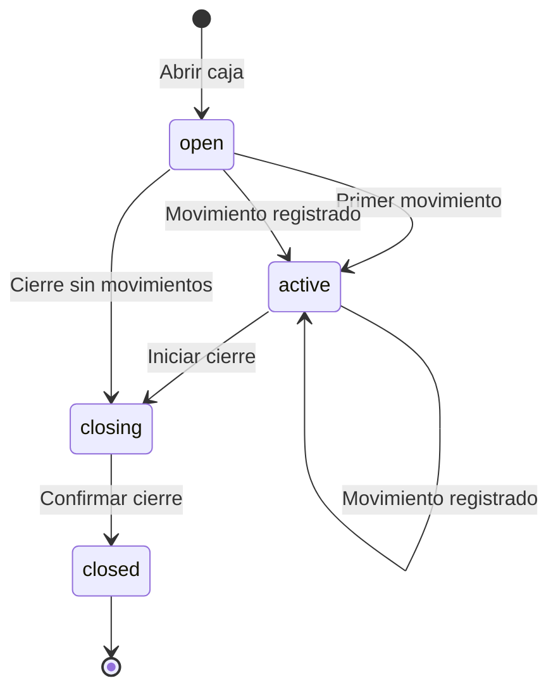
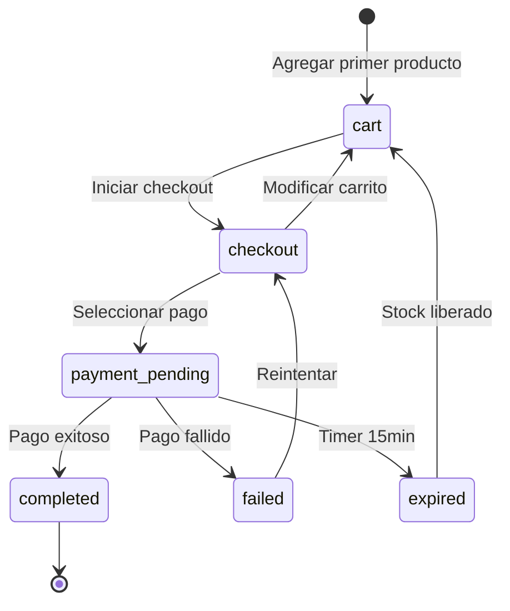
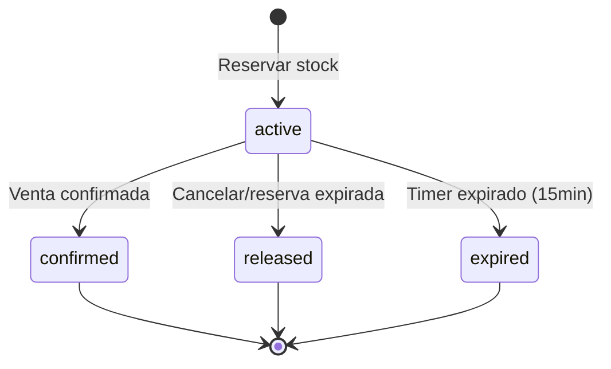
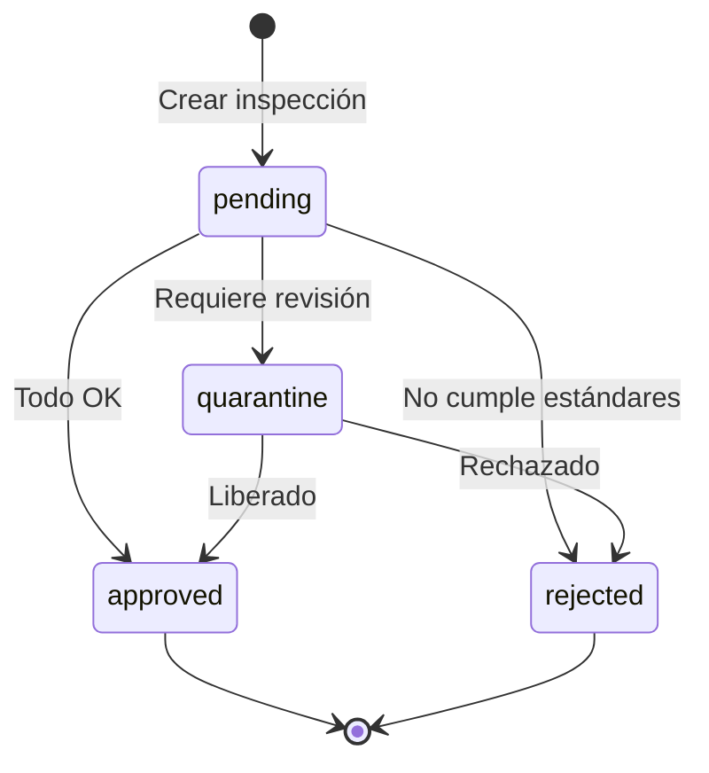
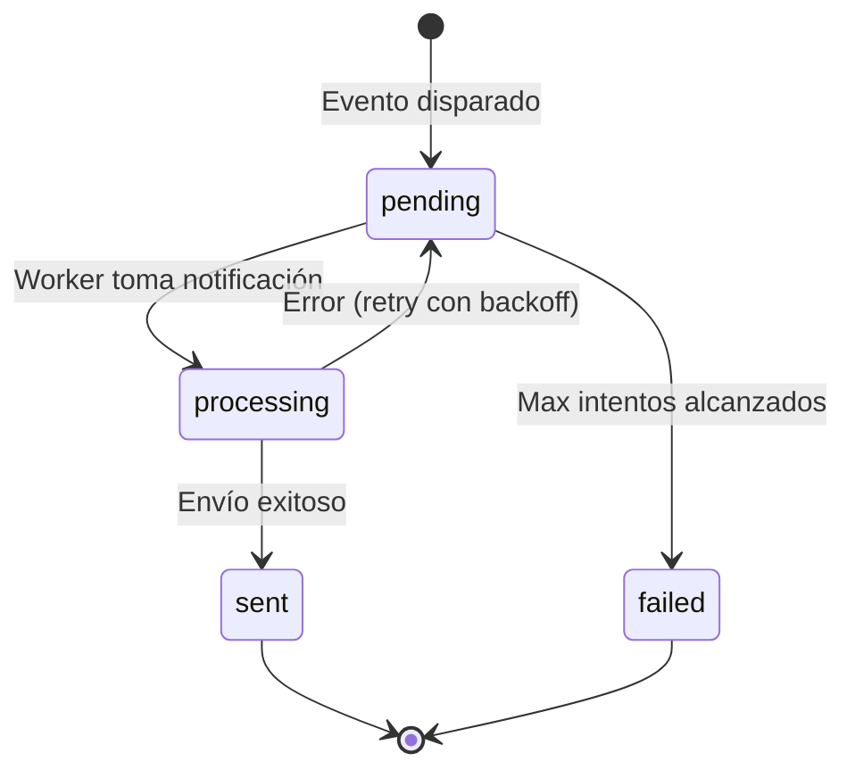
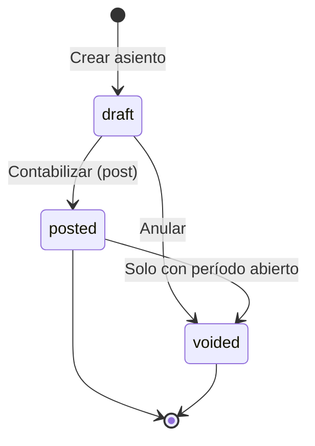

# State Machines: ERP Business Processes

## 1. Sale State Machine



### Transition Rules
```typescript
const SALE_TRANSITIONS = {
  pending: {
    confirmed: { 
      requires: ['payment'],
      effects: ['reserve_stock', 'emit_SaleCreated']
    },
    cancelled: {
      requires: ['reason'],
      effects: ['emit_SaleCancelled']
    }
  },
  confirmed: {
    processing: {
      requires: [],
      effects: ['deduct_stock', 'emit_SaleConfirmed']
    },
    cancelled: {
      requires: ['reason', 'admin_approval'],
      effects: ['release_stock', 'emit_SaleCancelled']
    }
  },
  processing: {
    shipped: {
      requires: ['tracking_number'],
      effects: ['emit_SaleShipped']
    },
    completed: {
      requires: [],
      effects: ['emit_SaleCompleted', 'post_accounting_entry']
    },
    cancelled: {
      requires: ['reason', 'admin_approval'],
      effects: ['restock', 'reverse_accounting', 'emit_SaleCancelled']
    }
  },
  shipped: {
    delivered: {
      requires: [],
      effects: ['emit_SaleDelivered', 'post_accounting_entry']
    },
    cancelled: {
      requires: ['reason', 'admin_approval', 'credit_note'],
      effects: ['restock', 'emit_SaleCancelled']
    }
  }
};
```

## 2. Purchase State Machine



## 3. Invoice State Machine



## 4. Cash Register Session State Machine



### Transition Rules
```typescript
const CASH_SESSION_TRANSITIONS = {
  open: {
    active: {
      requires: [],
      effects: ['log_first_movement']
    },
    closing: {
      requires: ['final_count'],
      effects: ['calculate_difference']
    }
  },
  active: {
    active: {
      requires: [],
      effects: ['record_movement']
    },
    closing: {
      requires: ['final_count'],
      effects: ['calculate_difference']
    }
  },
  closing: {
    closed: {
      requires: ['admin_approval_if_difference'],
      effects: ['emit_CashRegisterClosed', 'post_accounting']
    }
  }
};
```

## 5. Checkout State Machine (Ecommerce)



## 6. Inventory Reservation State Machine



## 7. Quality Inspection State Machine



## 8. Notification State Machine



## 9. Accounting Entry State Machine


