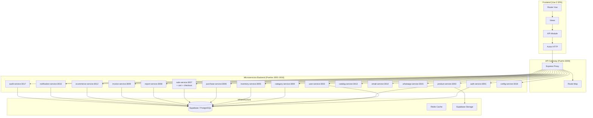
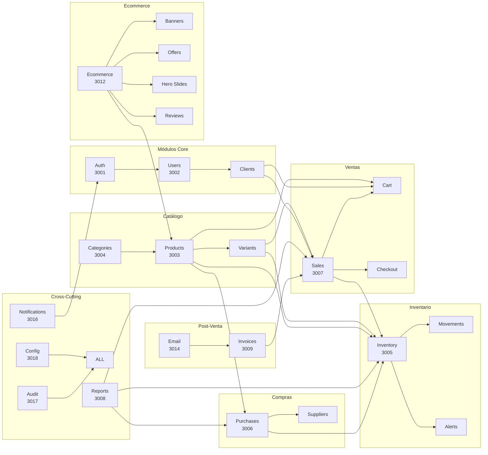
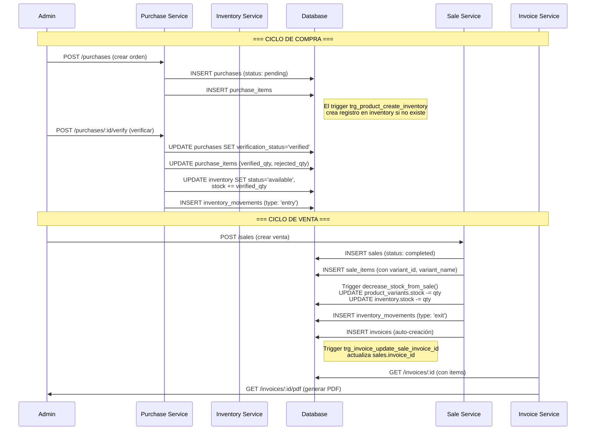
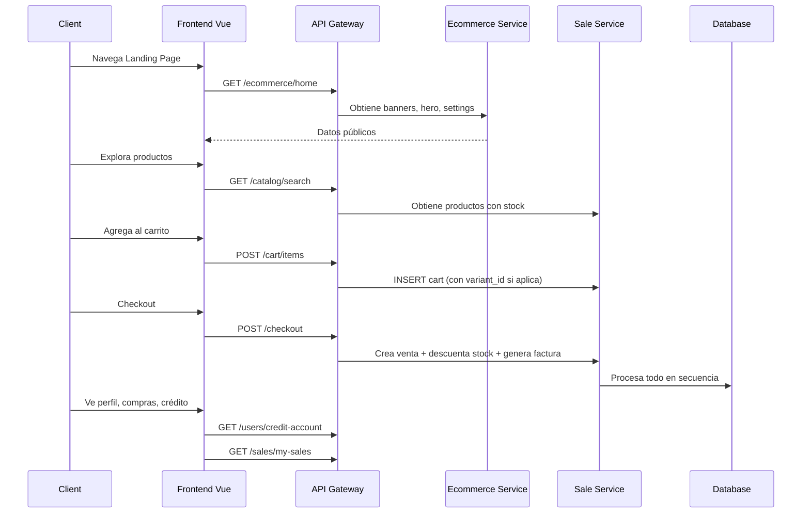
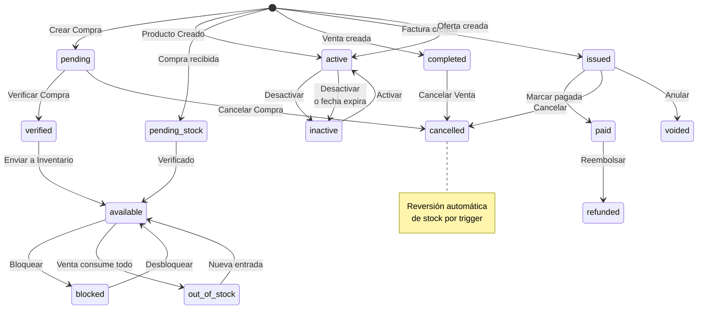

# Análisis Completo del Sistema — Flujo, Fortalezas y Debilidades

## Índice

1. [Visión General de la Arquitectura](#1-visión-general-de-la-arquitectura)
2. [Stack Tecnológico](#2-stack-tecnológico)
3. [Mapa de Módulos y sus Interacciones](#3-mapa-de-módulos-y-sus-interacciones)
4. [Flujo Completo del Sistema](#4-flujo-completo-del-sistema)
5. [Análisis por Módulo — Formularios, Flujos, Fortalezas y Debilidades](#5-análisis-por-módulo)
   - [5.1 Autenticación y Usuarios](#51-autenticación-y-usuarios)
   - [5.2 Productos y Catálogo](#52-productos-y-catálogo)
   - [5.3 Categorías](#53-categorías)
   - [5.4 Inventario](#54-inventario)
   - [5.5 Compras y Proveedores](#55-compras-y-proveedores)
   - [5.6 Ventas (POS + Formulario + Carrito)](#56-ventas)
   - [5.7 Facturación](#57-facturación)
   - [5.8 Ecommerce (Tienda Online)](#58-ecommerce)
   - [5.9 Reportes y Dashboard](#59-reportes-y-dashboard)
   - [5.10 Administración y Configuración](#510-administración)
   - [5.11 Notificaciones y Auditoría](#511-notificaciones-y-auditoría)
6. [Análisis de Base de Datos](#6-análisis-de-base-de-datos)
7. [Análisis de Formularios](#7-análisis-de-formularios)
8. [Debilidades Detectadas (Agenda de Mejora)](#8-debilidades-detectadas)
9. [Fortalezas del Sistema](#9-fortalezas-del-sistema)
10. [Recomendaciones Estratégicas](#10-recomendaciones-estratégicas)

---

## 1. Visión General de la Arquitectura

El sistema es un **ERP completo de gestión empresarial** con orientación a inventarios, ventas y ecommerce. Está construido bajo una arquitectura de **microservicios** con un **API Gateway** centralizado que enruta peticiones a 16 servicios backend independientes, más un frontend SPA en Vue 3.



### 1.1 Principios Arquitectónicos

| Principio | Implementación |
|-----------|---------------|
| **Microservicios** | 16 servicios independientes, cada uno con su propio puerto y responsabilidad única |
| **API Gateway** | Proxy inverso con enrutamiento por prefijo de ruta |
| **Base de Datos Compartida** | Todos los servicios apuntan a la misma base de datos Supabase (esquema único) — **NO es database-per-service** |
| **Autenticación Centralizada** | JWT con middleware compartido en `backend/shared/middleware/auth.js` |
| **Hexagonal parcial** | Algunos servicios (inventory, identity, catalog, procurement, sale) siguen arquitectura hexagonal; otros usan controller-repository simple |
| **Event-Driven (parcial)** | Event bus con `InMemoryEventBus` y `RabbitMQEventBus` en `packages/event-bus/` |

---

## 2. Stack Tecnológico

### 2.1 Frontend

| Tecnología | Versión | Propósito |
|-----------|---------|-----------|
| Vue.js | 3.5 | Framework SPA |
| Vite | 8.0 | Bundler y dev server |
| Pinia | 3.0 | Estado global (stores) |
| Vue Router | 4.6 | Enrutamiento SPA |
| Tailwind CSS | 4.3 | Estilos utilitarios |
| Axios | 1.18 | HTTP Client |
| Chart.js | 4.5 | Gráficos |
| SweetAlert2 | 11.26 | Modales y diálogos |
| jsPDF | 4.2 | Generación PDF |
| VeeValidate | 4.15 | Validación formularios |
| date-fns | 4.4 | Manejo fechas |
| GSAP + AnimeJS | 3.15/4.5 | Animaciones |
| Supabase JS | 2.108 | Cliente Supabase (storage) |

### 2.2 Backend

| Tecnología | Versión | Propósito |
|-----------|---------|-----------|
| Node.js | 18+ | Runtime |
| Express | 4.x | Framework HTTP |
| Supabase JS | 2.x | ORM/Cliente PostgreSQL |
| JWT (jsonwebtoken) | — | Autenticación stateless |
| Zod | — | Validación schemas |
| Redis (opcional) | 7 | Cache y rate limiting |
| Mailtrap SDK | 4.7 | Emails transaccionales |
| RabbitMQ (planeado) | — | Event Bus |
| http-proxy-middleware | — | Gateway proxy |

### 2.3 Base de Datos

| Componente | Detalle |
|-----------|---------|
| Motor | PostgreSQL 15+ (vía Supabase) |
| Host | `db.prspnfxfspokbqxsboby.supabase.co` |
| Storage | Supabase Storage (buckets: product-images, hero-slides, branding) |
| Migraciones | 25 archivos SQL secuenciales en `database/migrations/` |
| Esquema | ~60 tablas, 40+ funciones, 20+ triggers, 7+ vistas |

---

## 3. Mapa de Módulos y sus Interacciones



### 3.1 Dependencias entre Servicios

| Servicio | Depende de | ¿Por qué? |
|----------|-----------|-----------|
| **auth-service** | users, roles, audit_logs | Login/Register escribe en users, audita en audit_logs |
| **product-service** | categories, product_variants | Producto pertenece a categoría; variantes son hijas |
| **inventory-service** | products, inventory, inventory_movements | Stock está vinculado a productos; movimientos referencian productos |
| **purchase-service** | suppliers, products, inventory, purchases | Compra crea entrada a inventario; items referencian productos |
| **sale-service** | products, product_variants, inventory, clients, sales, invoices | Venta descuenta stock variante + inventario, crea factura |
| **invoice-service** | sales, invoices, clients, sale_items | Factura referencia venta; PDF usa datos de venta y cliente |
| **report-service** | sales, inventory, audit_logs | KPIs cruzan datos de ventas, inventario y auditoría |
| **notification-service** | user_notifications, email-service | Crea notificaciones en DB y envía emails vía HTTP |
| **ecommerce-service** | products, offers, banners, reviews, settings | CRUD de contenido público del ecommerce |

---

## 4. Flujo Completo del Sistema

### 4.1 Flujo de Compra → Inventario → Venta (Ciclo Completo)



### 4.2 Flujo de Ecommerce (Cliente)



### 4.3 Mapa de Estados Transaccionales



---

## 5. Análisis por Módulo

### 5.1 Autenticación y Usuarios

#### Servicios Involucrados
- **auth-service** (3001): Login, Register, Refresh, Logout, Forgot/Reset Password
- **user-service** (3002): CRUD usuarios, roles, perfil, historial acceso, clientes

#### Formularios

| Formulario | Archivo | Campos Clave | Validación |
|-----------|---------|-------------|-----------|
| Login | `LoginView.vue` | email, password | Cliente-side + Zod backend |
| Register | `RegisterView.vue` | name, email, password, confirm | VeeValidate + Zod |
| Forgot Password | `ForgotPasswordView.vue` | email | Email vía Mailtrap |
| Reset Password | `ResetPasswordView.vue` | token, password | Token + nueva contraseña |
| Crear/Editar Usuario | `UsersView.vue` (admin) | name, email, role, is_active | Zod en backend |
| Perfil Usuario | `ProfileView.vue` | name, email, phone, avatar | PUT /users/me/perfil |

#### Flujo de Login
1. Usuario ingresa credenciales
2. `POST /api/v1/auth/login` → auth-service verifica password_hash
3. Genera JWT con claims: `sub`, `email`, `role`, `permissions`
4. Frontend guarda `accessToken` y `refreshToken` en `sessionStorage`
5. Axios interceptor añade token a cada request
6. Si 401, intenta refresh automático
7. Si refresh falla, redirige a `/login`

#### Roles y Permisos

| Rol | Acceso Dashboard | Acceso Ecommerce | Permisos Clave |
|-----|-----------------|-----------------|---------------|
| **admin** | Total | Total | CRUD todos los módulos |
| **supervisor** | Total | Lectura | Reportes, auditoría |
| **cajero** | POS + Ventas + parcial inventario | No | Crear ventas, ver inventario |
| **inventario** | Inventario + Compras + Productos | No | Gestionar stock, compras |
| **cliente** | No — solo `/account/*` | Total | Compras, crédito, perfil |

#### Fortalezas
- ✅ Sistema JWT con refresh token automático
- ✅ Rate limiting (5 intentos → lockout 15 min) con Redis/memoria
- ✅ Separación clara de roles con permisos granularizados
- ✅ Auto-registro con creación automática de cliente + preferencias
- ✅ Recuperación de contraseña con flujo completo de email

#### Debilidades
- ❌ **Registro sin verificación email**: No hay flujo de verificación de email después del registro
- ❌ **JWT en sessionStorage**: Vulnerable a XSS; mejor opción sería httpOnly cookies
- ❌ **Roles hardcodeados**: Los permisos están definidos en código (`roles.js`), no configurables desde UI
- ❌ **Sin 2FA**: No hay autenticación de doble factor
- ❌ **Sin historial de sesiones activas**: No se pueden ver/revocar sesiones activas
- ❌ **Contraseña en texto plano en forgot-password**: El email de recuperación debería enviar token, no contraseña

---

### 5.2 Productos y Catálogo

#### Servicios
- **product-service** (3003): CRUD productos, variantes, imágenes
- **catalog-service** (3013): Búsqueda pública con filtros

#### Formularios

| Formulario | Archivo | Campos | Características |
|-----------|---------|--------|----------------|
| Lista Productos | `ProductListView.vue` | Búsqueda, filtro categoría, paginación | Columnas: nombre, SKU, precio, stock, estado |
| Crear/Editar | `ProductFormView.vue` | nombre, SKU, barcode, categoría, marca, precio, costo, precio comparativa, min_stock, unidad, imágenes, descripción | Editor de variantes completo, carga imágenes a Storage |
| Detalle Producto | `ProductDetailView.vue` | Galería imágenes, 4 métricas, variantes expandibles, detalles generales | Diseño 2 columnas (5/12 + 7/12) |
| Detalle Inventario | `InventoryDetailView.vue` | Galería, stock total, precio/costo, variantes, almacenes | Badge de estado inventario, botones Activar/Desactivar, Ver Kardex |

#### Flujo de Variantes
1. Producto padre tiene variantes (talla, color, etc.)
2. Cada variante tiene: nombre, SKU único, precio (opcional), stock, atributos (JSON), imágenes
3. En venta, se selecciona variante → `variant_id` en `sale_items`
4. Trigger `decrease_stock_from_sale()` descuenta stock de **ambos**: `product_variants.stock` y `inventory.stock`
5. En cancelación de venta, trigger `revert_stock_on_sale_cancel()` restaura ambos

#### Gestión de Imágenes
- Subida a Supabase Storage (bucket `product-images`, ruta `products/{productId}/`)
- Soporte: upload directo (multipart), upload por URL, drag & drop
- Variantes: imágenes en `product-variants` bucket
- Trigger `handle_product_image_insert()` en Storage objects (redundancia)

#### Fortalezas
- ✅ Sistema completo de variantes con SKU, precio y stock independiente
- ✅ Doble escritura de stock (variante + inventario general) vía triggers
- ✅ Carga de imágenes a Supabase Storage con URLs públicas
- ✅ Catálogo público separado del admin (catalog-service)
- ✅ Búsqueda con ILIKE en nombre, SKU, descripción
- ✅ Badge de estado (activo/inactivo/descontinuado)
- ✅ Precio de comparativa para mostrar descuentos

#### Debilidades
- ❌ **Sin precios por cliente/escala**: No hay lista de precios diferenciada
- ❌ **Sin bundles/combos**: No se pueden crear paquetes de productos
- ❌ **Sin stock por variante en inventario general**: El `inventory.stock` es único, no desglosado por variante
- ❌ **Sin importación masiva**: No hay carga CSV/XLSX de productos
- ❌ **Sin historial de precios**: No se trackean cambios de precio en el tiempo
- ❌ **Sin código de barras con scanner**: Aunque existe campo barcode, no hay integración con scanner

---

### 5.3 Categorías

#### Servicio
- **category-service** (3004): CRUD con estructura de árbol (parent_id)

#### Formulario
- `CategoryListView.vue`: Tabla jerárquica con paginación cliente-side

#### Fortalezas
- ✅ Estructura de árbol (categorías padre-hijo)
- ✅ Slug automático
- ✅ Imagen por categoría

#### Debilidades
- ❌ **Sin filtro por categoría padre**: No se pueden filtrar subcategorías
- ❌ **Sin arrastrar y soltar**: Reordenar categorías requiere editar manual
- ❌ **Paginación cliente-side**: Backend no soporta paginación servidor

---

### 5.4 Inventario

#### Servicio
- **inventory-service** (3005): Stock, movimientos, alertas, kardex

#### Vistas del Módulo

| Vista | Archivo | Propósito |
|------|---------|-----------|
| Inventario General | `InventoryView.vue` | Lista con filtros, summary cards, paginación |
| Detalle Producto | `InventoryDetailView.vue` | Vista completa con variantes y almacenes |
| Movimientos | `MovementsView.vue` | Historial de entradas/salidas/ajustes |
| Kardex | `KardexView.vue` | Tarjeta Kardex por producto |
| Ajustes | `AdjustmentsView.vue` | Corrección manual de stock |
| Transferencias | `TransfersView.vue` | Movimiento entre almacenes |
| Verificación | `VerificationView.vue` | Verificar compras recibidas |

#### Estados del Inventario
- **available** (verde): Producto listo para venta
- **pending** (amarillo): Pendiente de verificación (compra recién recibida)
- **blocked** (rojo): Bloqueado (dañado, en cuarentena, etc.)

#### Flujo de Movimientos
```
entry → stock += quantity (compra, ajuste positivo, devolución)
exit → stock -= quantity (venta, ajuste negativo, merma)
adjustment → stock = new_value (corrección directa)
transfer → warehouse A -= qty, warehouse B += qty
```

#### Fortalezas
- ✅ Sistema de estados (available/pending/blocked) con badges de colores
- ✅ Kardex completo con historial de movimientos
- ✅ Alertas de stock bajo y agotados
- ✅ Summary cards con valor total del inventario
- ✅ Filtros por categoría y estado
- ✅ Soporte multi-almacén (campo `warehouse`)
- ✅ Verificación de compras con aprobación/rechazo por ítem
- ✅ Transferencias entre almacenes

#### Debilidades
- ❌ **Sin lotes y fechas de vencimiento**: No hay trazabilidad por lote
- ❌ **Sin números de serie**: No hay seguimiento por unidad individual
- ❌ **Sin conteo cíclico**: No hay módulo de inventario físico (conteo)
- ❌ **Sin reserva de stock**: No se puede reservar inventario para pedidos pendientes
- ❌ **Sin notificaciones de stock crítico**: No alerta cuando stock llega a mínimo
- ❌ **Un solo almacén por defecto**: Aunque existe el campo warehouse, la UI no permite gestión completa de almacenes
- ❌ **Sin costeo promedio**: No hay cálculo de costo promedio ponderado

---

### 5.5 Compras y Proveedores

#### Servicio
- **purchase-service** (3006): Órdenes de compra, proveedores, verificación

#### Formularios

| Formulario | Archivo | Campos | Características |
|-----------|---------|--------|----------------|
| Lista Compras | `PurchaseListView.vue` | Filtros estado, proveedor, fechas | Badge verificación |
| Crear Compra | `PurchaseFormView.vue` | Proveedor (buscador), productos (buscador con imagen), cantidades, precios | Preview #orden, desglose subtotal+IVA+total, thumbnail producto |
| Detalle Compra | `PurchaseDetailView.vue` | Info proveedor completa, items con verificación | Botón Verificar, modal de verificación por ítem |
| Verificación | `VerificationView.vue` | Resumen pendientes, lista compras, modal verificación | verified_qty / rejected_qty por ítem |

#### Flujo de Compra Completo
1. Crear orden de compra → `status: 'pending'`
2. Recibir productos → `POST /purchases/:id/send-to-inventory` → inventario `status: 'pending'`
3. Verificar → `POST /purchases/:id/verify` → items obtienen `verified_qty`, `rejected_qty`; inventario pasa a `'available'`
4. Opcional: Cancelar compra → reversión de movimientos

#### Proveedores
- CRUD con campos: nombre, contacto, email, teléfono, dirección, RUC, términos de pago
- Búsqueda por nombre/contacto/email

#### Fortalezas
- ✅ Flujo completo de compra con verificación por ítem
- ✅ Aprobación/rechazo individual de productos
- ✅ Generación automática de número de compra
- ✅ Búsqueda de productos con imagen y SKU al crear compra
- ✅ Integración completa con inventario (status pending → available)

#### Debilidades
- ❌ **Sin órdenes de compra separadas**: No hay concepto de "orden de compra" antes de la recepción
- ❌ **Sin aprobación multi-nivel**: No hay flujo de aprobación (jefe → gerente)
- ❌ **Sin seguimiento de envíos**: No hay tracking de estado de entrega
- ❌ **Sin historial de precios por proveedor**: No se trackea el precio histórico de cada proveedor
- ❌ **Sin gestión de devoluciones**: No hay flujo para devolver productos dañados/incorrectos

---

### 5.6 Ventas (POS + Formulario + Carrito + Checkout)

#### Servicio
- **sale-service** (3007): Maneja TODO el ciclo de venta (sales, cart, checkout)

#### Formularios y Vistas

| Vista | Archivo | Propósito |
|------|---------|-----------|
| POS (Punto de Venta) | `POSView.vue` | Interfaz rápida de venta con teclado, variantes, cliente selector |
| Lista Ventas | `SaleListView.vue` | KPIs: ventas hoy, total, ticket promedio, ventas mes + gráfico mensual |
| Crear Venta | `SaleFormView.vue` | Formulario detallado de venta |
| Detalle Venta | `SaleDetailView.vue` | Items, cliente, factura asociada |
| Carrito (cliente) | `CartView.vue` | Checkout con fechas, impuesto dinámico |
| Compras Cliente | `PurchasesView.vue` | Historial de compras del cliente |

#### Flujo POS
1. Buscar producto por nombre/SKU/barcode
2. Si tiene variantes → modal de selección de variante
3. Agregar al carrito (con `variant_id`, `variant_name`, `variant_attributes`)
4. Seleccionar cliente (opcional, búsqueda por nombre/documento/email)
5. Checkout → `POST /sales` con `source: 'pos'`
6. Sistema crea: venta → descuenta stock → crea factura → asigna invoice_id
7. Modal de éxito → opción "Imprimir Ticket" (diseño térmico)

#### Manejo de Variantes en Ventas
- POS: Badge "2" en productos con variantes → modal selector → cart muestra "(Rojo)"
- SaleForm: Dropdown de variante por item
- Datos guardados en `sale_items`: `variant_id`, `variant_name`, `variant_attributes` (JSON)
- Reportes: `groupByVariant=true` separa variantes en filas individuales

#### Integración con Facturación
- Al crear venta, `autoCreateInvoice()`:
  1. Genera número de factura (`INV-XXXXXXXX`)
  2. Busca datos fiscales del cliente
  3. Inserta en `invoices` con subtotal, impuesto, descuento, total
  4. Items se obtienen dinámicamente de `sale_items`
  5. Trigger actualiza `sales.invoice_id`
- Cliente genérico "Consumidor Final" para POS sin cliente

#### Fortalezas
- ✅ POS rápido con búsqueda, variantes y selección de cliente
- ✅ Doble descuento de stock (variante + inventario general) en triggers DB
- ✅ Auto-creación de factura con datos fiscales del cliente
- ✅ Ticket de impresión térmica
- ✅ Soporte para cliente genérico (Consumidor Final)
- ✅ Cancelación con reversión completa de stock
- ✅ Reportes con agrupación por variante
- ✅ KPIs en lista de ventas (hoy, mes, ticket promedio, total)

#### Debilidades
- ❌ **Sin descuento por ítem en POS**: Solo descuento global en la venta
- ❌ **Sin múltiples métodos de pago**: No permite dividir pago (efectivo + tarjeta)
- ❌ **Sin factura electrónica**: Aunque hay campo `is_electronic`, no hay integración con DGII/API fiscal
- ❌ **Sin POS offline**: No funciona sin conexión a internet
- ❌ **Sin nota de crédito**: No hay flujo para devolución parcial de ítems
- ❌ **Sin envío de factura por email automático**: Hay endpoint pero no se ejecuta automáticamente
- ❌ **Sin comandas/órdenes abiertas**: No hay concepto de "mesa" o "orden en progreso"

---

### 5.7 Facturación

#### Servicio
- **invoice-service** (3009): CRUD facturas, PDF, email, cambio de estado

#### Vistas

| Vista | Archivo | Propósito |
|------|---------|-----------|
| Lista Facturas | `InvoiceListView.vue` | Filtros, paginación, acción "Marcar Pagada" |
| Detalle Factura | `InvoiceDetailView.vue` | Items, PDF, botón "Asiento Fiscal" |

#### Generación PDF
- Librerías: jsPDF + jspdf-autotable
- Campos: invoice_number, sale_number, cliente, items, subtotal, impuesto, total
- Variantes: Muestra `"Producto - Variante"`
- Botón "Asiento Fiscal" con formato fiscal completo

#### Estados de Factura
- **issued** → **paid** → **refunded**
- **issued** → **cancelled** / **voided**

#### Fortalezas
- ✅ PDF funcional con diseño fiscal
- ✅ Marcado como pagada/cancelada cambia estado
- ✅ Integración automática con ventas (trigger invoice_id)
- ✅ Email de factura (endpoint existe)

#### Debilidades
- ❌ **Sin NCF (Números de Comprobante Fiscal)**: No hay integración con sistema fiscal dominicano
- ❌ **Sin envío automático de PDF por email**: Existe endpoint pero no se dispara automáticamente
- ❌ **Sin QR fiscal**: El campo `qr_data` existe pero no se genera
- ❌ **Sin factura electrónica**: No hay envío a DGII
- ❌ **Sin reportes fiscales**: No hay libro de compras/ventas fiscal
- ❌ **Diseño PDF básico**: Podría mejorarse con logo de empresa, diseño más profesional

---

### 5.8 Ecommerce (Tienda Online)

#### Servicio
- **ecommerce-service** (3012): Banners, Hero Slides, Ofertas, Reseñas, Configuración, Tax Rates, WhatsApp

#### Vistas Públicas

| Vista | Archivo | Propósito |
|------|---------|-----------|
| Landing | `LandingView.vue` | Hero carrusel, productos destacados, reseñas, ofertas, contacto |
| Catálogo Productos | `ProductsCatalogView.vue` | Grid productos con búsqueda, filtros, paginación |
| Detalle Producto | `ProductPublicDetailView.vue` | Galería, variantes, precio, reseñas, agregar carrito |
| Ofertas | `OffersProductsView.vue` | Productos en descuento |
| Carrito | `CartView.vue` | Checkout con fecha, impuesto dinámico |

#### Vistas Admin Ecommerce

| Vista | Archivo | Propósito |
|------|---------|-----------|
| General | `EcommerceHome.vue` | Resumen tienda |
| Banners | `BannersView.vue` | CRUD banners principales |
| Ofertas | `OffersView.vue` | CRUD ofertas con selector producto |
| Hero Slides | `HeroSlidesView.vue` | Carrusel hero con upload imágenes |
| Banners Flotantes | `FloatingBannersView.vue` | Sticky banners top/bottom |
| Reseñas | `ReviewsModerationView.vue` | Moderación reseñas clientes |
| Config Tienda | `SettingsView.vue` | Logo, favicon, moneda, impuesto, WhatsApp |

#### Componentes Clave Ecommerce
- **HeroSection.vue**: Carrusel auto-play 6s con dots + flechas, skeleton loader
- **ProductShowcase.vue**: Grid productos con efecto 3D tilt hover
- **FeaturedReviews.vue**: Reseñas destacadas con skeleton cards
- **OfferShowcase.vue**: Ofertas con badge descuento animado, countdown
- **FloatingBanner.vue**: Banner sticky con rotación cada 8s
- **WhatsAppWidget.vue**: Botón flotante verde con enlace wa.me
- **ContactForm.vue**: Formulario contacto con datos empresa desde API

#### Fortalezas
- ✅ Landing completa con hero carrusel, productos, reseñas, ofertas, contacto
- ✅ Efectos visuales premium (WebGL, 3D tilt, glassmorphism)
- ✅ Tema oscuro/claro con paleta luxury dark purple
- ✅ CRUD completo de contenido ecommerce desde admin
- ✅ Upload de imágenes a Supabase Storage (hero slides, branding)
- ✅ Botón WhatsApp flotante
- ✅ Banners flotantes sticky configurables
- ✅ Reseñas de clientes con moderación
- ✅ Configuración dinámica (logo, favicon, moneda, impuesto)

#### Debilidades
- ❌ **Sin pasarela de pago real**: No hay integración con Stripe/Pagar/MP/otros
- ❌ **Sin cálculo de envío**: El campo `shipping_settings` existe pero no hay lógica de envío
- ❌ **Sin SEO avanzado**: Meta tags básicos, falta sitemap, Open Graph, Schema.org
- ❌ **Sin búsqueda avanzada**: No hay filtros por precio, marca, atributos en el catálogo público
- ❌ **Sin cuenta de cliente con dirección**: No se pueden guardar múltiples direcciones de envío
- ❌ **Sin wishlist/lista de deseos**: Clientes no pueden guardar productos favoritos
- ❌ **Sin comparación de productos**: No hay funcionalidad de comparar
- ❌ **Sin inventario visible**: El cliente no ve disponibilidad/stock
- ❌ **Sin cupones de descuento**: No hay sistema de códigos promocionales

---

### 5.9 Reportes y Dashboard

#### Servicio
- **report-service** (3008): Dashboard, ventas, inventario, top productos, clientes

#### Vistas

| Vista | Archivo | Contenido |
|------|---------|-----------|
| Dashboard Principal | `DashboardView.vue` | 6 KPIs, 4 gráficos (hoy, mes, tendencia 7d, categorías), top productos, ventas recientes, alertas stock, activity feed |
| Reporte Ventas | `SalesReportView.vue` | Gráfico ingresos con 3 datasets, filtro fechas |
| Reporte Inventario | `InventoryReportView.vue` | Doughnut distribución stock, bar chart valor |
| Top Productos | `TopProductsView.vue` | Bar chart horizontal productos más vendidos |
| Reporte Clientes | `ClientsReportView.vue` | Gráfico compras por cliente |

#### KPIs del Dashboard
1. **Ventas Hoy** — Ingresos del día actual
2. **Ventas del Mes** — Ingresos del mes corriente
3. **Stock Bajo** — Productos por debajo del mínimo
4. **Total Productos** — Productos activos en catálogo
5. **Total Clientes** — Clientes registrados
6. **Total Usuarios** — Desglose admin + cajero

#### Gráficos
- Ventas hoy (barra, gradiente verde)
- Ventas mes (área, gradiente índigo)
- Tendencia 7 días (área, gradiente púrpura)
- Distribución categorías (doughnut, paleta 10 colores)

#### Fortalezas
- ✅ Dashboard completo con KPIs en tiempo real
- ✅ 4 tipos de gráficos con Chart.js
- ✅ Reportes filtrables por fechas
- ✅ Top productos con agrupación por variante
- ✅ Activity feed desde auditoría

#### Debilidades
- ❌ **10 queries paralelas al DB** por cada carga de dashboard (optimizable a 1 RPC)
- ❌ **Sin exportación programada**: No hay envío programado de reportes por email
- ❌ **Sin drill-down**: KPIs no son clickeables para ver detalle
- ❌ **Sin comparativa períodos**: No hay "vs mes anterior"
- ❌ **Sin reportes fiscales**: No hay libro de IVA, compras, ventas

---

### 5.10 Administración

#### Vistas

| Vista | Archivo | Propósito |
|------|---------|-----------|
| Admin General | `AdminView.vue` | Panel central administración |
| Usuarios | `UsersView.vue` | CRUD usuarios, bloquear/activar, cambiar rol |
| Detalle Usuario | `UserDetailView.vue` | Info completa + historial acceso |
| Auditoría | `AuditLogView.vue` | Logs de actividad con filtros |
| Config Sistema | `ConfigView.vue` | Configuración general del sistema |

#### Fortalezas
- ✅ Gestión completa de usuarios con roles
- ✅ Logs de auditoría con filtros
- ✅ Configuración centralizada

#### Debilidades
- ❌ **Sin backups programados**: No hay interfaz para backup/restore
- ❌ **Sin logs de errores**: No hay visibilidad de errores 500 desde el UI
- ❌ **Sin métricas de rendimiento**: No hay monitoreo de tiempos de respuesta
- ❌ **Sin gestión de almacenes**: No hay CRUD de almacenes desde admin

---

### 5.11 Notificaciones y Auditoría

#### Servicios
- **notification-service** (3016): Notificaciones en base de datos + email
- **audit-service** (3017): Logs de acciones de usuarios
- **email-service** (3014): Envío de emails transaccionales vía Mailtrap

#### Tipos de Notificación
- login, purchase, sale, stock, inventory, warning, info
- Role-based: Cliente, Vendedor, Admin reciben diferentes notificaciones

#### Canales
- **In-app**: Tabla `user_notifications`, modal en navbar, polling 30s
- **Email**: Mailtrap SDK con templates HTML por tipo
- **WhatsApp**: Botón flotante en landing (solo enlace)

#### Fortalezas
- ✅ Notificaciones en tiempo real con polling
- ✅ Diferenciación por rol (cliente vs admin)
- ✅ Modal de notificaciones en navbar con badge
- ✅ Detalle de notificación con datos del evento
- ✅ Marcado individual/todas como leídas
- ✅ Auditoría completa de acciones CRUD
- ✅ Emails transaccionales funcionales (bienvenida, password reset, factura)

#### Debilidades
- ❌ **Sin WebSockets**: Polling cada 30s, no es tiempo real
- ❌ **Sin notificaciones push**: No hay soporte para notificaciones push mobile/desktop
- ❌ **WhatsApp solo link**: No hay integración API de WhatsApp Business (solo enlace wa.me)
- ❌ **Sin plantillas editables**: Templates de email están hardcodeados en JS
- ❌ **Sin cola de notificaciones**: Si el servicio de email falla, la notificación se pierde

---

## 6. Análisis de Base de Datos

### 6.1 Resumen de Tablas Principales

| Tabla | Propósito | Registros Aprox |
|-------|-----------|----------------|
| users | Usuarios del sistema | ~10 |
| roles | Roles con permisos | 5 (admin, supervisor, cajero, inventario, cliente) |
| clients | Clientes (vinculados a users) | ~5 |
| categories | Categorías jerárquicas | ~15 |
| products | Catálogo de productos | ~50 |
| product_variants | Variantes por producto | ~20 |
| inventory | Stock por producto+almacén | ~50 |
| inventory_movements | Historial de movimientos | ~500 |
| suppliers | Proveedores | ~10 |
| purchases | Órdenes de compra | ~20 |
| purchase_items | Items de compra | ~100 |
| sales | Ventas | ~50 |
| sale_items | Items de venta | ~200 |
| invoices | Facturas | ~30 |
| cart | Carrito de compras | ~10 |
| ecommerce_settings | Config tienda | 1 (singleton) |
| ecommerce_banners | Banners | ~5 |
| hero_slides | Slides del carrusel | ~4 |
| offers | Ofertas activas | ~5 |
| product_reviews | Reseñas de productos | ~10 |
| audit_logs | Auditoría de acciones | ~1000+ |
| user_notifications | Notificaciones | ~100 |
| notifications_log | Log de envíos | ~50 |

### 6.2 Triggers Clave

| Trigger | Tabla | Evento | Acción |
|---------|-------|--------|--------|
| `decrease_stock_from_sale()` | sales | AFTER INSERT | Descuenta stock de product_variants + inventory |
| `revert_stock_on_sale_cancel()` | sales | AFTER UPDATE (cancelled) | Restaura stock de variante + inventario |
| `trg_product_create_inventory` | purchase_items | AFTER INSERT | Crea registro en inventory si no existe |
| `handle_product_image_insert` | storage.objects | AFTER INSERT | Sincroniza URL imagen con products.images |
| `handle_hero_slide_image_insert` | storage.objects | AFTER INSERT | Sincroniza imagen hero slide |
| `trg_invoice_update_sale_invoice_id` | invoices | AFTER INSERT/UPDATE | Actualiza sales.invoice_id |
| `trg_auto_create_client` | users | AFTER INSERT | Crea automáticamente cliente + preferencias |
| `sync_client_from_user` | users | AFTER UPDATE | Sincroniza datos usuario → cliente |

### 6.3 Índices y Rendimiento

- `sales(created_at)` — Filtro por fecha en reportes
- `sale_items(sale_id)` — JOIN con ventas
- `inventory(product_id, warehouse)` — Búsqueda stock
- `inventory_movements(product_id, created_at)` — Kardex
- `audit_logs(created_at)` — Filtro temporal

### 6.4 Debilidades de Base de Datos

- ❌ **Sin índices en tablas grandes**: `inventory_movements`, `audit_logs`, `sale_items` carecen de índices compuestos
- ❌ **Triggers sin FOR UPDATE**: Posibles race conditions en concurrencia
- ❌ **Sin soft delete generalizado**: Algunas tablas permiten DELETE físico
- ❌ **Sin políticas RLS**: La mayoría de tablas no tienen row-level security
- ❌ **Función `generate_sale_number()` secuencial**: Podría tener contención en alta concurrencia
- ❌ **Singletons sin protección real**: `ecommerce_settings` tiene trigger pero no CHECK único

---

## 7. Análisis de Formularios

### 7.1 Mapa Completo de Formularios

| Módulo | Formulario | Tipo | Campos | Validación | Estado |
|--------|-----------|------|--------|-----------|--------|
| Auth | Login | Simple | email, password | Client + Zod | ✅ Completo |
| Auth | Register | Complejo | name, email, password, confirm | VeeValidate + Zod | ✅ Completo |
| Auth | Forgot Password | Simple | email | Email vía Mailtrap | ✅ Completo |
| Auth | Reset Password | Simple | token, password | Token + password | ✅ Completo |
| Users | Crear/Editar Usuario | Complejo | name, email, role, is_active | Zod backend | ✅ Completo |
| Profile | Mi Perfil | Simple | name, email, phone, avatar | API | ✅ Completo |
| Products | Crear/Editar Producto | **Muy Complejo** | nombre, SKU, barcode, categoría, marca, precio, costo, comparativa, min_stock, unidad, imágenes, variantes, descripción | Zod + VeeValidate | ✅ Completo |
| Products | Variantes (modal) | Complejo | nombre, SKU, precio, stock, atributos, imágenes | Zod | ✅ Completo |
| Categories | Crear/Editar | Simple | nombre, slug, descripción, padre, imagen | API | ✅ Básico |
| Inventory | Ajuste | Simple | producto, cantidad, razón | API | ✅ Completo |
| Inventory | Transferencia | Simple | producto, almacén origen/destino, cantidad | API | ✅ Completo |
| Purchases | Crear Compra | **Muy Complejo** | proveedor (buscador), productos (buscador), cantidades, precios, descuento, impuesto | Zod + VeeValidate | ✅ Completo |
| Purchases | Verificación (modal) | Complejo | verified_qty, rejected_qty, rejected_reason (por ítem) | API | ✅ Completo |
| Sales | POS | **Muy Complejo** | búsqueda productos, selector variante, cantidades, cliente selector, pago | Interfaz rápida | ✅ Completo |
| Sales | Crear Venta (form) | Complejo | cliente, productos, variantes, cantidades, descuento, pago | Zod | ✅ Completo |
| Invoices | - | Solo lectura + PDF | Acciones: marcar pagada, cancelar, email | - | ✅ Básico |
| Ecommerce | Banners | Simple | título, subtítulo, imagen, link, orden | API | ✅ Completo |
| Ecommerce | Ofertas | Complejo | producto (selector), % descuento, fechas, activo | API | ✅ Completo |
| Ecommerce | Hero Slides | Complejo | título, subtítulo, imagen (upload), botones, orden | API + Storage | ✅ Completo |
| Ecommerce | Banners Flotantes | Complejo | imagen, título, link, posición, colores, fechas | API | ✅ Completo |
| Ecommerce | Settings | Complejo | store_name, logo (upload), favicon, moneda, impuesto, WhatsApp | API + Storage | ✅ Completo |
| Ecommerce | Reseñas (moderar) | Simple | aprobar/rechazar/eliminar | API | ✅ Básico |
| Admin | Config Sistema | Complejo | settings variadas | API | ✅ Básico |

### 7.2 Evaluación de UX en Formularios

| Aspecto | Evaluación | Comentario |
|---------|-----------|-----------|
| **Consistencia visual** | ⭐⭐⭐⭐⭐ | Todos los formularios siguen el mismo diseño (cards, sombras, bordes) |
| **Validación en tiempo real** | ⭐⭐⭐⭐ | VeeValidate en formularios críticos, feedback visual |
| **Manejo de errores** | ⭐⭐⭐⭐ | SweetAlert2 con mensajes descriptivos |
| **Estados de carga** | ⭐⭐⭐⭐⭐ | Loading skeletons y spinners en todos los formularios |
| **Estados vacíos** | ⭐⭐⭐ | Algunas listas no muestran mensaje "sin datos" |
| **Responsive** | ⭐⭐⭐⭐ | Diseño adaptativo, mobile cards en listas |
| **Confirmación destructiva** | ⭐⭐⭐⭐ | SweetAlert2 en eliminaciones y cancelaciones |
| **Autocompletado** | ⭐⭐ | Búsqueda en selectores (productos, clientes) pero no autocomplete completo |
| **Atajos teclado** | ⭐⭐⭐ | POS tiene buen soporte, otros formularios no |
| **Feedback post-acción** | ⭐⭐⭐⭐ | Toast/alert después de crear/editar/eliminar |

---

## 8. Debilidades Detectadas (Agenda de Mejora)

### 8.1 Críticas (Alta Prioridad)

| # | Debilidad | Impacto | Módulo | Solución Propuesta |
|---|-----------|---------|--------|-------------------|
| 1 | **Sin validación email al registrarse** | Medio — Usuarios con email inválido | Auth | Flujo de verificación email con token |
| 2 | **POS sin descuento por ítem** | Alto — Limita flexibilidad ventas | Ventas (POS) | Agregar campo descuento por línea en POS |
| 3 | **Sin factura electrónica / NCF** | Alto — No cumple regulación fiscal RD | Facturación | Integrar con sistema fiscal dominicano |
| 4 | **10 queries paralelas en Dashboard** | Alto — Rendimiento degradado con datos grandes | Reportes | Crear función RPC `fn_get_dashboard_stats()` |
| 5 | **Sin WebSockets para notificaciones** | Medio — No tiempo real | Notificaciones | Migrar de polling a WebSocket/Supabase Realtime |
| 6 | **Sin lotes ni fechas vencimiento** | Alto — No apto para alimentos, medicinas | Inventario | Agregar tabla `inventory_lots` con expiry |
| 7 | **Sin pasarela de pago** | Alto — Ecommerce no puede cobrar | Ecommerce | Integrar Stripe/Pagar/MP |

### 8.2 Importantes (Media Prioridad)

| # | Debilidad | Impacto | Módulo |
|---|-----------|---------|--------|
| 8 | Sin historial de precios de productos | Medio | Productos |
| 9 | Sin importación masiva CSV/XLSX | Medio | Productos, Compras |
| 10 | Sin múltiples direcciones de envío | Medio | Ecommerce |
| 11 | Sin wishlist/lista de deseos | Bajo | Ecommerce |
| 12 | Sin cupones de descuento | Medio | Ecommerce |
| 13 | Sin búsqueda avanzada en catálogo | Medio | Ecommerce |
| 14 | Sin cálculo de envío | Medio | Ecommerce |
| 15 | Sin conteo cíclico de inventario | Medio | Inventario |
| 16 | Sin exportación programada de reportes | Bajo | Reportes |
| 17 | Sin backups desde UI | Bajo | Admin |

### 8.3 Técnicas (Media Prioridad)

| # | Debilidad | Impacto | Componente |
|---|-----------|---------|-----------|
| 18 | JWT en sessionStorage (vs httpOnly cookie) | Medio — Seguridad | Auth |
| 19 | Sin 2FA | Medio — Seguridad | Auth |
| 20 | Sin políticas RLS en tablas | Alto — Seguridad datos | DB |
| 21 | Triggers sin FOR UPDATE | Medio — Race conditions | DB |
| 22 | Sin tests automatizados | Alto — Regresiones | Global |
| 23 | Sin TypeScript | Medio — Mantenibilidad | Frontend/Backend |
| 24 | Sin CI/CD pipeline | Medio — Despliegue | DevOps |

---

## 9. Fortalezas del Sistema

### 9.1 Arquitectura y Diseño

- ✅ **Arquitectura de microservicios** con 16 servicios independientes y API Gateway
- ✅ **Separación Catálogo ↔ Inventario** (principio correcto de ERP)
- ✅ **Sistema completo de variantes** con doble escritura de stock (variante + inventario)
- ✅ **Triggers DB robustos** para consistencia de datos (stock, facturas, clientes)
- ✅ **Flujo completo de verificación de compras** con aprobación/rechazo por ítem
- ✅ **Auto-creación de facturas** al confirmar venta
- ✅ **Sistema de roles y permisos** granular con JWT
- ✅ **Rate limiting** con Redis o fallback a memoria

### 9.2 Frontend y UX

- ✅ **Dashboard informativo** con 6 KPIs y 4 gráficos
- ✅ **POS rápido** con búsqueda, variantes, selección de cliente, ticket térmico
- ✅ **Tema oscuro/claro** completo con paleta personalizada (Nexus ERP)
- ✅ **Ecommerce premium** con efectos visuales avanzados (WebGL, 3D tilt, glassmorphism)
- ✅ **Skeleton loaders** en todos los componentes críticos
- ✅ **Diseño responsive** con mobile cards en listas
- ✅ **Paginación server-side** en todas las listas principales
- ✅ **Formatos de moneda** configurables por país (10 monedas)
- ✅ **Notificaciones in-app** con polling y badge en navbar
- ✅ **Carga de imágenes a Supabase Storage** con drag & drop

### 9.3 Características Completas

- ✅ **ERP completo**: Productos → Compras → Inventario → Ventas → Facturación → Reportes
- ✅ **Ecommerce integrado**: Landing → Catálogo → Carrito → Checkout → Perfil Cliente
- ✅ **Multi-almacén**: Soporte para transferencias entre almacenes
- ✅ **Multi-moneda**: 10 monedas configurables con exchange rates
- ✅ **Emails transaccionales**: Mailtrap con templates HTML por tipo
- ✅ **Auditoría completa**: Log de todas las acciones CRUD
- ✅ **Variantes en todo el pipeline**: Compras → Inventario → Ventas → Facturas → Reportes
- ✅ **Sistema de reseñas** con moderación
- ✅ **WhatsApp flotante** en landing page
- ✅ **Recuperación de contraseña** por email

---

## 10. Recomendaciones Estratégicas

### 10.1 Prioridad Inmediata (Sprint Actual)

1. **Validación email al registro** — Enviar token de verificación, bloquear login si no verificado
2. **Descuento por ítem en POS** — Agregar input de descuento por línea en el POS
3. **Tests automatizados** — Test unitarios para servicios críticos (sale, purchase, inventory)

### 10.2 Corto Plazo (Próximos 2 Sprints)

4. **Optimizar Dashboard** — Crear RPC PostgreSQL `fn_get_dashboard_stats()` para reducir 10→1 query
5. **WebSockets** — Migrar notificaciones de polling a Supabase Realtime
6. **Lotes y fechas de vencimiento** — Extender inventario con trazabilidad por lote
7. **Migrar TypeScript** — Empezar con `backend/shared` y luego servicios críticos

### 10.3 Mediano Plazo (Próximo Mes)

8. **Factura electrónica** — Integrar con DGII/NCF para República Dominicana
9. **Pasarela de pago** — Integrar con Pagar/Stripe/MercadoPago
10. **RLS Policies** — Implementar row-level security en todas las tablas
11. **Backups automáticos** — Programar backups desde UI
12. **CI/CD** — Pipeline de build, test y deploy automático

### 10.4 Largo Plazo (Roadmap v2.0)

13. **Migrar a base de datos multi-tenant** con `company_id` en todas las tablas
14. **State Machine Engine** — Workflow de aprobaciones configurable
15. **Business Rules Engine** — Reglas de negocio dinámicas
16. **CQRS** con Materialized Views para reportes
17. **RabbitMQ** como event bus para comunicación asíncrona entre servicios
18. **Arquitectura hexagonal completa** en todos los servicios
