# Mapa Completo de Secciones — Animal Store | PetCare Pro

## 📋 Índice de Contenido

1. [LandingView (Página Principal Pública)](#landingview)
2. [Auth (Autenticación)](#auth)
3. [Productos Públicos](#productos-públicos)
4. [Dashboard (Panel Principal)](#dashboard)
5. [Productos (Admin)](#productos-admin)
6. [Categorías](#categorías)
7. [Inventario](#inventario)
8. [Punto de Venta (POS)](#punto-de-venta-pos)
9. [Ventas](#ventas)
10. [Compras](#compras)
11. [Clientes](#clientes)
12. [Facturas](#facturas)
13. [Reportes](#reportes)
14. [Ecommerce (Admin)](#ecommerce-admin)
15. [Administración del Sistema](#administración-del-sistema)
16. [Layout y Navegación](#layout-y-navegación)
17. [Microservicios del Backend](#microservicios-del-backend)
18. [Diagrama de Rutas](#diagrama-de-rutas)

---

## LandingView

**Ruta:** `/` (Home)
**Archivo:** `src/views/LandingView.vue`
**Layout:** blank (sin Sidebar)
**Componentes hijos:** `HeroSection`, `ProductShowcase`, `FeaturedReviews`, `ContactForm`, `AppNavBar`, `AppFooter`

### Descripción
Landing page principal con diseño oscuro premium (#151215) y efectos visuales avanzados. Es la cara pública de la tienda "Animal Store | PetCare Pro".

### Secciones Internas

#### 1. WebGL Shader Background
- Canvas de fondo con shader GLSL personalizado
- Efectos de wave/nebula con colores: primary (#37094A), secondary (#7B4F7D), accent (#4F2361)
- Animación continua con `requestAnimationFrame`
- Interacción mouse (u_mouse uniform) para efecto de glow
- Responsive via `ResizeObserver`

#### 2. HeroSection (componente)
**Archivo:** `src/components/shared/HeroSection.vue`

- Hero dinámico obtenido del Ecommerce Service (`/api/v1/ecommerce/hero`)
- Muestra: badge, título (2 líneas), descripción, 2 botones CTA
- Sistema de 3 imágenes decorativas: top-left (w-48), main (w-full h-[500px]), bottom-right (w-56 h-56 circular)
- Tilt effect en las imágenes, glass-card styling
- Datos configurables desde el panel de admin `/app/ecommerce/hero`
- Scroll animations con IntersectionObserver (`entrance-reveal`)
- Magnetic button effect en CTAs

#### 3. ProductShowcase (componente)
**Archivo:** `src/components/shared/ProductShowcase.vue`

- Grid de 3 productos destacados (featured=true) desde Product Service
- Estados: loading (skeleton cards), error (with retry), empty (with icon), success
- Cada producto: imagen principal (con fallback icon `inventory_2`), nombre, precio, badge "Featured", categoría
- Botón "Add to Cart" con loading state y feedback
- Emite eventos: `view-all`, `added-to-cart`, `error`
- Precio con formato currency y descuento (tachado + descuento)

#### 4. FeaturedReviews (componente)
**Archivo:** `src/components/shared/FeaturedReviews.vue`

- Reseñas destacadas aprobadas (desde ecommerce service)
- 3 reseñas en grid: la central sin `-translate-y-24` (destacada)
- Sistema de estrellas con iconos filled/outlined
- Avatar, nombre del cliente, y comentario
- Scroll animation con delay progresivo

#### 5. Newsletter Section
- Formulario de suscripción por email
- Glass card con gradient radial background
- Input + botón "Subscribe" con clase `magnetic-btn`

#### 6. ContactForm (componente)
**Archivo:** `src/components/shared/ContactForm.vue`

- Formulario de contacto: nombre, email, teléfono, mensaje
- Aurora background effect con partículas
- Alert states: success (check_circle), error
- Validación de campos
- Envío via API al backend

#### 7. Efectos Globales
- `entrance-reveal`: Animación scroll via IntersectionObserver
- `tilt-container` / `glass-card`: Efecto 3D tilt con glare
- `magnetic-btn`: Botones que siguen el mouse
- Partículas flotantes CSS
- `mouse-light`: Efecto spotlight que sigue al cursor

---

## Auth

### LoginView
**Ruta:** `/login`
**Archivo:** `src/views/auth/LoginView.vue`
**Layout:** blank

- Fondo con WebGL shader propio
- Formulario: email + password con toggle visibility
- Validación con fieldErrors
- "Recordarme" checkbox
- Link a "Olvidaste tu contraseña?" → `/forgot-password`
- Estados: loading con spinner, error con animación `error-fade` (Transition)
- Glass card con backdrop-blur
- Logo + branding "Gestion de Inventarios - eCommerce de Productos Premium"
- Dark theme consistente (#151215, #e9b3fc, #ebb5ea)

### RegisterView
**Ruta:** `/register`
**Archivo:** `src/views/auth/RegisterView.vue`
**Layout:** blank
- Formulario de registro con nombre, email, password, confirmación
- Link a login

### ForgotPasswordView
**Ruta:** `/forgot-password`
- Solicitud de recuperación de contraseña por email
- Input de email + botón "Enviar"

### ResetPasswordView
**Ruta:** `/reset-password`
- Restablecer contraseña con token
- Formulario: nueva password + confirmación

---

## Productos Públicos

### ProductsCatalogView
**Ruta:** `/products`
**Archivo:** `src/views/products/ProductsCatalogView.vue`
**Layout:** blank

#### Características
- **Paginación:** 16 productos por página con URL query params (`?page=1&search=...&category=...`)
- **Navegación browser:** `watch(route.query)` para botones back/forward del navegador
- **Sincronización:** `syncUrlQuery()` actualiza la URL sin recargar via `router.replace`

#### Componentes
- **Shader Background** WebGL (mismo que Landing)
- **AppNavBar** con detección de ruta `isProductRoute` para active state
- **Search:** Input con debounce y búsqueda en tiempo real
- **Category Pills:** Filtro por categoría (resetea a page 1 al cambiar)
- **Sort:** Selector de ordenamiento (más recientes, precio asc/desc, nombre)
- **Product Cards:** Grid responsive (1→2→3→4 columnas)
  - Imagen del producto con fallback `inventory_2`
  - Nombre, precio, categoría
  - Rating simulado con estrellas
  - Botón "Add to Cart"
- **Pagination Controls:**
  - Botones "Previous" / "Next"
  - Indicadores de página actual
  - Navegación directa entre páginas

#### Estados
- **Loading:** 8 skeleton cards con animate-pulse
- **Empty:** Icono + mensaje "No products found" + botón "Clear filters"
- **Error:** Mensaje de error con retry
- **Success:** Grid de productos con paginación

### ProductPublicDetailView
**Ruta:** `/products/:id`
**Archivo:** `src/views/products/ProductPublicDetailView.vue`
**Layout:** blank

- Vista detalle pública de producto
- **Image Gallery:** Imagen principal + thumbnails si hay múltiples
- Fallback `inventory_2` si no hay imágenes
- Badge "Featured" y descuento "-X% OFF"
- Precio con descuento (tachado)
- Botón "Add to Cart" con cantidad seleccionable (1-99)
- Descripción completa del producto
- **Features list:** Especificaciones técnicas
- **Shipping info:** Información de envío y disponibilidad
- **Estados:** Loading (spinner), Error (with back link), Success
- Breadcrumb: "Back to catalog"

---

## Dashboard

**Ruta:** `/app/dashboard`
**Archivo:** `src/views/DashboardView.vue`
**Layout:** AppLayout (con Sidebar + Navbar)

### Sección 1: KPI Cards (6 cards)
Grid de 6 `StatCard` componentes:
| Card | Descripción |
|------|-------------|
| 💰 **Ventas Hoy** | Total de ventas del día actual (currency) |
| 📅 **Ventas del Mes** | Total acumulado del mes (currency) |
| ⚠️ **Productos Bajos** | Stock ≤ 5 (conteo) |
| 📦 **Total Productos** | Productos registrados |
| 👥 **Clientes** | Clientes registrados |
| 👤 **Usuarios** | Usuarios activos (Admin · Cajeros) |

### Sección 2: Charts Row (2 gráficos)
- **Ventas Hoy (Por Hora):** Chart.js bar chart de distribución horaria
- **Ventas del Mes (Por Día):** Chart.js line chart de evolución diaria

### Sección 3: Middle Row (2 gráficos)
- **Tendencia 7 Días:** Chart.js line chart comparativo
- **Productos por Categoría:** Chart.js doughnut chart

### Sección 4: Activity + Top Products
- **Actividades Recientes:** Lista del audit service con iconos por tipo
- **Top Productos Más Vendidos:** Ranking 1-5 con colores y revenue

### Sección 5: Recent Sales + Stock Alerts
- **Ventas Recientes:** Últimas 5 ventas con monto y tiempo relativo
- **Alertas de Inventario:** Productos sin stock (rojo) o bajo stock (ámbar)

### Funcionalidad
- Chart.js con registerables
- Datos via API: reports, sales, inventory, products, categories, audit
- Formato currency y tiempo relativo
- Dashboard KPI calculations

---

## Productos (Admin)

### ProductListView
**Ruta:** `/app/products`
**Archivo:** `src/views/products/ProductListView.vue`

- Tabla responsive: desktop (table) / mobile (cards)
- Columnas: Imagen, Nombre, SKU, Categoría, Precio, Stock, Estado, Acciones
- Búsqueda con debounce
- Ordenamiento por nombre y precio (toggle asc/desc)
- Filtro por estado (activo/inactivo)
- Botón "Nuevo Producto" (con permiso `can('products', 'create')`)
- Click en fila → `/app/products/:id` (detail)
- Paginación integrada

### ProductFormView
**Ruta:** `/app/products/create` | `/app/products/:id/edit`
**Archivo:** `src/views/products/ProductFormView.vue`

Formulario completo con secciones:
1. **Información Básica:** Nombre, SKU, Código de Barras, Categoría (con jerarquía), Marca
2. **Precios y Stock:** Precio venta, Costo, Comparativa, Stock, Stock mínimo
3. **Descripción:** Textarea WYSIWYG
4. **Imágenes:** Upload múltiple via backend API (multipart → Storage → DB)
5. **Configuración:** Estado (active/inactive), Featured, Especificaciones dinámicas
6. **SEO:** Meta título, descripción, slug
7. **Variantes:** Opciones de variantes (talla, color) con precio/stock individual

### ProductDetailView
**Ruta:** `/app/products/:id`
**Archivo:** `src/views/products/ProductDetailView.vue`

- Galería de imágenes con thumbnails
- Info: Nombre, SKU, código barras, estado
- Cards: Precio Venta, Costo, Stock, Ganancia
- Descripción completa, especificaciones
- Botones: Editar, Eliminar
- Historial de movimientos del producto

---

## Categorías

### CategoryListView
**Ruta:** `/app/categories`
**Archivo:** `src/views/categories/CategoryListView.vue`

- Tabla de categorías con jerarquía (árbol)
- Columnas: Nombre, Slug, Descripción, Productos asociados, Estado
- CRUD completo: crear, editar, eliminar
- Arrastrar para reordenar
- Categorías padre-hijo (niveles)

---

## Inventario

### InventoryList (`InventoryView`)
**Ruta:** `/app/inventory`
**Archivo:** `src/views/inventory/InventoryView.vue`

- Tabla "Stock Actual": Producto, SKU, Stock, Stock Mínimo, Estado
- Badges de estado: Sin stock (rojo), Bajo (ámbar), Disponible (verde)
- Click → Kardex del producto
- Búsqueda y filtros

### MovementsView
**Ruta:** `/app/inventory/movements`
- Historial de movimientos: entrada, salida, ajuste, transferencia
- Filtros por fecha, tipo, producto

### KardexView
**Ruta:** `/app/inventory/kardex/:productId?`
- Kardex de producto individual
- Entradas/salidas con saldo acumulado

### AdjustmentsView
**Ruta:** `/app/inventory/adjustments`
- Ajustes de inventario (físico vs sistema)
- Razón del ajuste, cantidad, responsable

### TransfersView
**Ruta:** `/app/inventory/transfers`
- Transferencias entre almacenes
- Origen, destino, productos, estado

---

## Punto de Venta (POS)

### POSView
**Ruta:** `/app/pos`
**Archivo:** `src/views/sales/POSView.vue`

#### Layout: 2 paneles
1. **Panel izquierdo** (flex-1): Grid de productos buscables
   - Búsqueda en tiempo real
   - Grid 2-4 columnas responsive
   - Cada producto: icono, nombre, precio, stock
2. **Panel derecho** (w-96): Carrito de compra
   - Items con cantidad (+/-)
   - Subtotal, IVA (19%), Total
   - Selector de cliente
   - Método de pago
   - Botón "Completar Venta"

#### Funcionalidad
- Búsqueda de productos por nombre
- Añadir/remover items del carrito
- Actualizar cantidades
- Cálculo automático de impuestos
- Modal de confirmación de venta
- Impresión de ticket (opcional)

---

## Ventas

### SaleListView
**Ruta:** `/app/sales`
**Archivo:** `src/views/sales/SaleListView.vue`

- DataTable con columnas: Factura, Cliente, Total, Estado, Fecha
- Badges: Completada (verde), Cancelada (rojo), Pendiente (ámbar)
- Botón "Nueva Venta" (con permiso)
- Click → detalle de venta

### SaleFormView
**Ruta:** `/app/sales/create`
- Formulario de nueva venta
- Selección de cliente, productos, cantidades
- Método de pago, fechas

### SaleDetailView
**Ruta:** `/app/sales/:id`
- Detalle completo de la venta
- Productos, totales, estado
- Factura asociada
- Botones: Anular, Imprimir

---

## Compras

### PurchaseListView
**Ruta:** `/app/purchases`
**Archivo:** `src/views/purchases/PurchaseListView.vue`

- DataTable: Orden, Proveedor, Total, Estado, Fecha
- Badges: Recibida (verde), Cancelada (rojo), Pendiente (ámbar)
- Botón "Nueva Compra"

### PurchaseFormView
**Ruta:** `/app/purchases/create`
- Formulario: proveedor, productos, cantidades, precios
- Fecha de compra, estado inicial

### PurchaseDetailView
**Ruta:** `/app/purchases/:id`
- Detalle de orden de compra
- Productos, totales, estado
- Botones: Recibir, Anular

---

## Clientes

### ClientListView
**Ruta:** `/app/clients`
**Archivo:** `src/views/clients/ClientListView.vue`

- DataTable: Nombre, Documento, Email, Teléfono, Estado
- Badges: Activo (verde), Inactivo (gris)
- Click → detalle del cliente

### ClientDetailView
**Ruta:** `/app/clients/:id`
- Perfil completo del cliente
- Historial de compras
- Información de contacto
- Documentos asociados

---

## Facturas

### InvoiceListView
**Ruta:** `/app/invoices`
**Archivo:** `src/views/invoices/InvoiceListView.vue`

- DataTable: N° Factura, Cliente, Total, Estado, Fecha
- Badges: Vigente (verde), Anulada (rojo), Pendiente (ámbar)
- Paginación: 15 por página

### InvoiceDetailView
**Ruta:** `/app/invoices/:id`
- Factura completa
- Logo empresa, datos fiscales
- Productos, impuestos, totales
- Botones: PDF, Imprimir, Email

---

## Reportes

### ReportsView
**Ruta:** `/app/reports`
**Archivo:** `src/views/reports/ReportsView.vue`

- Menú de reportes con 4 cards:
  1. 📊 **Reporte de Ventas** - Resumen por período
  2. 🏭 **Reporte de Inventario** - Estado del stock
  3. 📈 **Productos Más Vendidos** - Top productos
  4. 👥 **Reporte de Clientes** - Clientes frecuentes

### SalesReportView
**Ruta:** `/app/reports/sales`
- Filtros: fechas, tipo de gráfico
- Chart.js: ventas por día/semana/mes
- Tabla resumen

### InventoryReportView
**Ruta:** `/app/reports/inventory`
- Valor total del inventario
- Productos por categoría
- Stock bajo y sin stock

### TopProductsView
**Ruta:** `/app/reports/top-products`
- Ranking de productos más vendidos
- Cantidad vendida, ingresos generados

### ClientsReportView
**Ruta:** `/app/reports/clients`
- Clientes frecuentes
- Total comprado por cliente
- Segmentación

---

## Ecommerce (Admin)

### EcommerceView
**Ruta:** `/app/ecommerce`
**Archivo:** `src/views/ecommerce/EcommerceView.vue`

- Layout con tabs de navegación:
  - **General** - Dashboard de ecommerce
  - **Banners** - Gestión de banners promocionales
  - **Ofertas** - Productos en oferta
  - **Hero** - Configuración del Hero de LandingView
  - **Reseñas** - Moderación de reseñas
  - **Configuración** - Ajustes de tienda

### BannersView
**Ruta:** `/app/ecommerce/banners`
- CRUD de banners: título, subtítulo, imagen, link, orden
- Activar/desactivar banners

### OffersView
**Ruta:** `/app/ecommerce/offers`
- Gestión de ofertas y descuentos
- Productos, % descuento, fechas vigencia

### HeroSettingsView
**Ruta:** `/app/ecommerce/hero`
- Configuración dinámica del Hero:
  - Badge text, título (2 líneas), descripción
  - Botones CTA (texto + URL)
  - 3 imágenes (top-left, main, bottom-right)
- Vista previa en tiempo real

### ReviewsModerationView
**Ruta:** `/app/ecommerce/reviews`
- Moderación de reseñas de clientes
- Aprobar/rechazar
- Gestión de estrellas y comentarios

### SettingsView
**Ruta:** `/app/ecommerce/settings`
- Configuración general de la tienda
- Nombre, descripción, logo, colores
- Redes sociales, SEO

---

## Administración del Sistema

### AdminView
**Ruta:** `/app/admin`
**Archivo:** `src/views/admin/AdminView.vue`

- Layout con tabs: Usuarios, Auditoría, Configuración

### UsersView
**Ruta:** `/app/admin/users`
- CRUD de usuarios del sistema
- Roles: Admin, Cajero, etc.
- Permisos por módulo

### UserDetailView
**Ruta:** `/app/admin/users/:id`
- Perfil de usuario
- Roles, permisos, actividad
- Editar datos

### AuditLogView
**Ruta:** `/app/admin/audit`
- Log de auditoría del sistema
- Acciones, entidades, usuarios, fechas
- Filtros por tipo, fecha, usuario

### ConfigView
**Ruta:** `/app/admin/config`
- Configuración del sistema
- Variables globales, prefijos de facturación, etc.

---

## Layout y Navegación

### AppLayout
**Archivo:** `src/components/layout/AppLayout.vue`

Wrapper protegido para rutas `/app/*`:
- **Sidebar:** Menú lateral colapsable (64px / 256px)
- **Navbar:** Barra superior con breadcrumb y notificaciones
- **Main:** Contenido con transiciones `page` (mode="out-in")
- **keep-alive:** Vistas cacheadas según `cachedViews`
- **Breadcrumb:** Dinámico según `appStore.pageBreadcrumb`

### Sidebar
**Archivo:** `src/components/layout/Sidebar.vue`

- Logo "Animal Store" con badge "AS"
- Menú items con iconos Material Symbols:
  - Dashboard, Productos, Categorías, Inventario, POS, Ventas, Compras, Clientes, Facturas, Reportes, Ecommerce, Admin
- Cada item visible según permisos `can(module, action)`
- Collapsable con animación suave (transition-all 300ms)
- Bottom actions: "Mi Perfil", "Salir del Sistema"
- Toggle button para colapsar/expandir

### Navbar
**Archivo:** `src/components/layout/Navbar.vue`

- Barra superior con breadcrumb
- Notificaciones (dropdown)
- Usuario actual (avatar + nombre)
- Dark mode toggle

### AppNavBar (Public)
**Archivo:** `src/components/layout/AppNavBar.vue`

- Navegación pública para Landing y Productos
- Links: Inicio, Productos (router-link), Reseñas, Contacto
- Detección automática de ruta activa:
  - `isProductRoute` para rutas `/products` y `/products/:id`
  - `isHomeRoute` para la Landing `/`
- `navLinkClass(sectionId)`: active state basado en ruta O IntersectionObserver
- Logo como router-link a `/`
- Iconos de usuario (login) y carrito como router-links

---

## Microservicios del Backend

| # | Servicio | Puerto | Descripción |
|---|----------|--------|-------------|
| 1 | **API Gateway** | 3000 | Proxy de entrada, monta todos los microservicios bajo `/api/v1/` |
| 2 | **Auth Service** | 3001 | Autenticación JWT, login, register, refresh tokens |
| 3 | **User Service** | 3002 | CRUD de usuarios del sistema |
| 4 | **Product Service** | 3003 | CRUD productos, imágenes (Storage → DB), variantes |
| 5 | **Category Service** | 3004 | CRUD categorías con jerarquía |
| 6 | **Inventory Service** | 3005 | Control de stock, kardex, alertas |
| 7 | **Purchase Service** | 3006 | Órdenes de compra, recepción |
| 8 | **Sale Service** | 3007 | Ventas, items, totales |
| 9 | **Report Service** | 3008 | Reportes, dashboard KPIs, charts |
| 10 | **Invoice Service** | 3009 | Facturación electrónica, PDF |
| 11 | **Cart Service** | 3010 | Carrito de compras (checkout) |
| 12 | **Checkout Service** | 3011 | Procesamiento de checkout |
| 13 | **Ecommerce Service** | 3012 | Hero, banners, ofertas, reseñas |
| 14 | **Catalog Service** | 3013 | Catálogo público con filtros |
| 15 | **Email Service** | 3014 | Envío de correos transaccionales |
| 16 | **WhatsApp Service** | 3015 | Notificaciones WhatsApp |
| 17 | **Notification Service** | 3016 | Notificaciones push/in-app |
| 18 | **Audit Service** | 3017 | Auditoría de acciones |
| 19 | **Config Service** | 3018 | Configuración global del sistema |

### Conexiones Clave
- **Frontend → Gateway:** Vite proxy `/api` → `localhost:3000`
- **Gateway → Microservicios:** HTTP Proxy con rewrite rules
- **Servicios → Supabase:** Conexión directa via `@supabase/supabase-js`
- **Product Images:** Backend upload → Supabase Storage → URL guardada en DB

---

## Diagrama de Rutas

```mermaid
graph TD
    %% Public Routes
    subgraph "🏠 Rutas Públicas"
        HOME["/ (LandingView)"] --> HERO["HeroSection"]
        HOME --> SHOWCASE["ProductShowcase"]
        HOME --> REVIEWS["FeaturedReviews"]
        HOME --> NEWSLETTER["Newsletter"]
        HOME --> CONTACT["ContactForm"]
        CATALOG["/products (ProductsCatalogView)"]
        DETAIL["/products/:id (ProductPublicDetailView)"]
    end

    subgraph "🔐 Autenticación"
        LOGIN["/login"]
        REGISTER["/register"]
        FORGOT["/forgot-password"]
        RESET["/reset-password"]
    end

    subgraph "📊 Dashboard (Protegido)"
        DASHBOARD["/app/dashboard"]
        PROFILE["/app/profile"]
    end

    subgraph "📦 Gestión de Productos"
        PROD_LIST["/app/products"]
        PROD_CREATE["/app/products/create"]
        PROD_EDIT["/app/products/:id/edit"]
        PROD_DETAIL["/app/products/:id"]
    end

    subgraph "🏷️ Categorías"
        CAT_LIST["/app/categories"]
    end

    subgraph "🏭 Inventario"
        INV["/app/inventory"]
        INV_MOV["/app/inventory/movements"]
        INV_KARDEX["/app/inventory/kardex/:productId?"]
        INV_ADJ["/app/inventory/adjustments"]
        INV_TRANS["/app/inventory/transfers"]
    end

    subgraph "💳 Ventas & POS"
        POS["/app/pos"]
        SALES["/app/sales"]
        SALE_CREATE["/app/sales/create"]
        SALE_DETAIL["/app/sales/:id"]
    end

    subgraph "📥 Compras"
        PURCH["/app/purchases"]
        PURCH_CREATE["/app/purchases/create"]
        PURCH_DETAIL["/app/purchases/:id"]
    end

    subgraph "👥 Clientes"
        CLIENTS["/app/clients"]
        CLIENT_DETAIL["/app/clients/:id"]
    end

    subgraph "📄 Facturas"
        INVOICES["/app/invoices"]
        INV_DETAIL["/app/invoices/:id"]
    end

    subgraph "📈 Reportes"
        REPORTS["/app/reports"]
        REP_SALES["/app/reports/sales"]
        REP_INV["/app/reports/inventory"]
        REP_TOP["/app/reports/top-products"]
        REP_CLIENTS["/app/reports/clients"]
    end

    subgraph "🛒 Ecommerce Admin"
        EC["/app/ecommerce"]
        EC_BANNERS["/app/ecommerce/banners"]
        EC_OFFERS["/app/ecommerce/offers"]
        EC_HERO["/app/ecommerce/hero"]
        EC_REVIEWS["/app/ecommerce/reviews"]
        EC_SETTINGS["/app/ecommerce/settings"]
    end

    subgraph "⚙️ Admin"
        ADMIN["/app/admin"]
        ADMIN_USERS["/app/admin/users"]
        ADMIN_USER["/app/admin/users/:id"]
        ADMIN_AUDIT["/app/admin/audit"]
        ADMIN_CONFIG["/app/admin/config"]
    end

    %% Connections to API
    HOME -->|"GET /ecommerce/hero"| GW["API Gateway :3000"]
    HOME -->|"GET /products?featured=true"| GW
    CATALOG -->|"GET /products?status=active"| GW
    CATALOG -->|"GET /categories"| GW
    DASHBOARD -->|"GET /reports/dashboard"| GW
    DASHBOARD -->|"GET /sales?limit=5"| GW
    DASHBOARD -->|"GET /inventory/alerts"| GW

    GW --> AUTH["Auth :3001"]
    GW --> USERS["Users :3002"]
    GW --> PRODS["Products :3003"]
    GW --> CATS["Categories :3004"]
    GW --> INV_SVC["Inventory :3005"]
    GW --> PURCH_SVC["Purchases :3006"]
    GW --> SALE_SVC["Sales :3007"]
    GW --> REP_SVC["Reports :3008"]
    GW --> INV_SVC["Invoices :3009"]
    GW --> EC_SVC["Ecommerce :3012"]
    GW --> NOTIF["Notifications :3016"]
    GW --> AUDIT["Audit :3017"]
```

---

## Stores (Pinia)

### appStore (`src/stores/app.js`)
- `sidebarOpen` - Estado del sidebar (colapsado/expandido)
- `darkMode` - Modo oscuro (persistente en localStorage)
- `pageTitle` - Título de página actual
- `pageBreadcrumb` - Breadcrumb para navegación
- Métodos: `toggleSidebar()`, `toggleDarkMode()`, `initTheme()`, `setPage(title, breadcrumb)`

### authStore (`src/stores/auth.js`)
- `user` - Usuario autenticado (null si no)
- `loading` / `error` - Estados de petición
- `isAuthenticated` - Computed: true si hay usuario
- `userPermissions` - Permisos del usuario
- Métodos: `login()`, `register()`, `logout()`, `fetchProfile()`, `clearAuth()`, `forgotPassword()`, `resetPassword()`, `updateProfile()`

### cartStore (`src/stores/cart.js`)
- Estado del carrito de compras (público)
- Items, cantidades, totales

---

## API Integration

### Axios Instance (`src/api/index.js`)
- Base URL desde `import.meta.env.VITE_API_URL` (`/api/v1`)
- Interceptor de respuesta: auto-unwrap `{ success, data }` → `data`
- Métodos por módulo: auth, products, categories, inventory, sales, purchases, clients, invoices, reports, ecommerce, notifications, audit
- Upload de imágenes con progreso via `onUploadProgress`

### Supabase Client (`src/api/supabase.js`)
- Cliente Supabase para operaciones directas (auth de Supabase, storage)
- Anon key pública desde environment variable

---

## Temas y Estilos

### Dark Theme (Predeterminado)
- **Background:** `#151215`
- **Surface:** `#1e1a1d`
- **Primary:** `#e9b3fc` (púrpura claro)
- **Secondary:** `#ebb5ea` (rosa púrpura)
- **On Surface:** `#e8e0e4`
- **On Surface Variant:** `#cfc3cf`
- **Selection:** `#e9b3fc` / `#481d5b`

### Dashboard Theme (Light/Dark)
- Light: bg-gray-50, white cards
- Dark: bg-gray-900, gray-800 cards
- Primary: purple-600 / primary-600
- Toggle via `darkMode` store + `class="dark"` en `<html>`

### Tipografía
- **Headlines:** Outfit (sans-serif), bold
- **Body:** Geist (sans-serif)
- **Labels:** Outfit, uppercase, tracking-widest

---

*Documentación generada el 25 de junio de 2026 — Animal Store | PetCare Pro v1.0.0*
