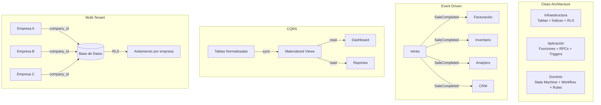

# Arquitectura ERP v2.0 — Base de Datos Completa

## 1. Visión General de la Arquitectura

### 1.1 Principios de Diseño

| Principio | Descripción |
|-----------|-------------|
| **Domain-Driven Design (DDD)** | Cada dominio es autónomo con sus tablas, vistas, funciones, triggers y eventos |
| **Clean Architecture** | Separación estricta de capas: infraestructura → aplicación → dominio |
| **Event-Driven** | Los módulos se comunican exclusivamente por eventos, nunca por llamadas directas |
| **CQRS** | Separación de modelos de lectura (Materialized Views) y escritura (tablas normalizadas) |
| **Multi-Tenant** | Toda tabla tiene `company_id` con RLS policies por empresa |
| **Workflow Engine** | Flujos de aprobación configurables sin modificar código |
| **Business Rules Engine** | Reglas de negocio configurables desde el UI |

### 1.2 Mapa de Dominios

```
┌─────────────────────────────────────────────────────────┐
│                     ERP CORE                            │
│  ┌──────────┐ ┌──────────┐ ┌──────────┐ ┌──────────┐  │
│  │ Identity │ │  Audit   │ │  Config  │ │  Events  │  │
│  └──────────┘ └──────────┘ └──────────┘ └──────────┘  │
├─────────────────────────────────────────────────────────┤
│                    DOMINIOS DE NEGOCIO                   │
│  ┌──────────┐ ┌──────────┐ ┌──────────┐ ┌──────────┐  │
│  │ Catalog  │ │Inventory │ │Purchase  │ │  Sales   │  │
│  └──────────┘ └──────────┘ └──────────┘ └──────────┘  │
│  ┌──────────┐ ┌──────────┐ ┌──────────┐ ┌──────────┐  │
│  │ Billing  │ │   POS    │ │ Checkout │ │   CRM    │  │
│  └──────────┘ └──────────┘ └──────────┘ └──────────┘  │
├─────────────────────────────────────────────────────────┤
│                    MOTORES                              │
│  ┌──────────┐ ┌──────────┐ ┌──────────┐ ┌──────────┐  │
│  │ Workflow │ │  Rules   │ │  State   │ │ Document │  │
│  │  Engine  │ │  Engine  │ │ Machine  │ │  Engine  │  │
│  └──────────┘ └──────────┘ └──────────┘ └──────────┘  │
├─────────────────────────────────────────────────────────┤
│                    REPORTES / ANALYTICS                 │
│  ┌──────────┐ ┌──────────┐ ┌──────────┐ ┌──────────┐  │
│  │   MV     │ │  Redis   │ │  Queue   │ │  Cron    │  │
│  │ Views    │ │  Cache   │ │  Events  │ │  Jobs    │  │
│  └──────────┘ └──────────┘ └──────────┘ └──────────┘  │
└─────────────────────────────────────────────────────────┘
```

---

## 2. ERP CORE (Núcleo del Sistema)

### 2.1 Tablas del Núcleo

#### companies — Empresa / Tenant

```sql
-- ============================================================
-- 2.1.1 companies — Empresa / Tenant raíz del sistema
-- ============================================================
CREATE TABLE IF NOT EXISTS companies (
  id UUID PRIMARY KEY DEFAULT gen_random_uuid(),
  code VARCHAR(20) UNIQUE NOT NULL,
  name VARCHAR(255) NOT NULL,
  legal_name VARCHAR(255),
  tax_id VARCHAR(50),
  tax_id_type VARCHAR(20) DEFAULT 'RUC',
  email VARCHAR(255),
  phone VARCHAR(50),
  website VARCHAR(255),
  address_line1 VARCHAR(255),
  address_line2 VARCHAR(255),
  city VARCHAR(100),
  state VARCHAR(100),
  country VARCHAR(100) DEFAULT 'República Dominicana',
  postal_code VARCHAR(20),
  logo_url TEXT,
  favicon_url TEXT,
  currency_code VARCHAR(5) DEFAULT 'DOP',
  timezone VARCHAR(50) DEFAULT 'America/Santo_Domingo',
  date_format VARCHAR(20) DEFAULT 'DD/MM/YYYY',
  fiscal_year_start DATE,
  fiscal_year_end DATE,
  is_active BOOLEAN DEFAULT true,
  settings JSONB DEFAULT '{}',
  metadata JSONB DEFAULT '{}',
  created_at TIMESTAMPTZ DEFAULT NOW(),
  updated_at TIMESTAMPTZ DEFAULT NOW()
);

-- Una sola empresa activa por defecto
INSERT INTO companies (id, code, name, legal_name, tax_id, currency_code)
VALUES ('00000000-0000-0000-0000-000000000001', 'DEFAULT', 'Empresa Principal', 'Empresa Principal SRL', '000-00000-0', 'DOP')
ON CONFLICT (code) DO NOTHING;
```

#### branches — Sucursales

```sql
-- ============================================================
-- 2.1.2 branches — Sucursales por empresa
-- ============================================================
CREATE TABLE IF NOT EXISTS branches (
  id UUID PRIMARY KEY DEFAULT gen_random_uuid(),
  company_id UUID NOT NULL REFERENCES companies(id) ON DELETE CASCADE,
  code VARCHAR(20) NOT NULL,
  name VARCHAR(255) NOT NULL,
  address_line1 VARCHAR(255),
  address_line2 VARCHAR(255),
  city VARCHAR(100),
  state VARCHAR(100),
  country VARCHAR(100),
  phone VARCHAR(50),
  email VARCHAR(255),
  is_main BOOLEAN DEFAULT false,
  is_active BOOLEAN DEFAULT true,
  settings JSONB DEFAULT '{}',
  created_at TIMESTAMPTZ DEFAULT NOW(),
  updated_at TIMESTAMPTZ DEFAULT NOW(),
  UNIQUE(company_id, code)
);
```

#### warehouses — Almacenes

```sql
-- ============================================================
-- 2.1.3 warehouses — Almacenes por sucursal
-- ============================================================
CREATE TABLE IF NOT EXISTS warehouses (
  id UUID PRIMARY KEY DEFAULT gen_random_uuid(),
  company_id UUID NOT NULL REFERENCES companies(id) ON DELETE CASCADE,
  branch_id UUID REFERENCES branches(id) ON DELETE SET NULL,
  code VARCHAR(20) NOT NULL,
  name VARCHAR(255) NOT NULL,
  type VARCHAR(30) DEFAULT 'physical'
    CHECK (type IN ('physical', 'virtual', 'transit', 'damaged', 'quarantine')),
  address_line1 VARCHAR(255),
  city VARCHAR(100),
  state VARCHAR(100),
  country VARCHAR(100),
  phone VARCHAR(50),
  email VARCHAR(255),
  is_main BOOLEAN DEFAULT false,
  is_active BOOLEAN DEFAULT true,
  settings JSONB DEFAULT '{}',
  created_at TIMESTAMPTZ DEFAULT NOW(),
  updated_at TIMESTAMPTZ DEFAULT NOW(),
  UNIQUE(company_id, code)
);

-- Almacén por defecto
INSERT INTO warehouses (id, company_id, code, name, type, is_main)
SELECT '00000000-0000-0000-0000-000000000001', id, 'PPL', 'Almacén Principal', 'physical', true
FROM companies WHERE code = 'DEFAULT'
AND NOT EXISTS (SELECT 1 FROM warehouses WHERE code = 'PPL');
```

#### warehouse_locations — Ubicaciones dentro de almacén

```sql
-- ============================================================
-- 2.1.4 warehouse_locations — Ubicaciones (estanterías, pasillos)
-- ============================================================
CREATE TABLE IF NOT EXISTS warehouse_locations (
  id UUID PRIMARY KEY DEFAULT gen_random_uuid(),
  warehouse_id UUID NOT NULL REFERENCES warehouses(id) ON DELETE CASCADE,
  code VARCHAR(50) NOT NULL,
  name VARCHAR(255),
  zone VARCHAR(50),
  aisle VARCHAR(50),
  rack VARCHAR(50),
  shelf VARCHAR(50),
  bin VARCHAR(50),
  is_active BOOLEAN DEFAULT true,
  created_at TIMESTAMPTZ DEFAULT NOW(),
  updated_at TIMESTAMPTZ DEFAULT NOW(),
  UNIQUE(warehouse_id, code)
);
```

#### currencies — Monedas

```sql
-- ============================================================
-- 2.1.5 currencies — Catálogo de monedas
-- ============================================================
CREATE TABLE IF NOT EXISTS currencies (
  code VARCHAR(5) PRIMARY KEY,
  name VARCHAR(100) NOT NULL,
  symbol VARCHAR(10) NOT NULL,
  decimal_places INTEGER DEFAULT 2,
  is_active BOOLEAN DEFAULT true,
  created_at TIMESTAMPTZ DEFAULT NOW()
);

INSERT INTO currencies (code, name, symbol, decimal_places) VALUES
  ('DOP', 'Peso Dominicano', 'RD$', 2),
  ('USD', 'US Dollar', '$', 2),
  ('EUR', 'Euro', '€', 2),
  ('COP', 'Peso Colombiano', '$', 0),
  ('MXN', 'Peso Mexicano', '$', 2),
  ('ARS', 'Peso Argentino', '$', 2),
  ('CLP', 'Peso Chileno', '$', 0),
  ('PEN', 'Sol Peruano', 'S/', 2),
  ('GBP', 'British Pound', '£', 2),
  ('CAD', 'Canadian Dollar', 'C$', 2)
ON CONFLICT (code) DO UPDATE SET name = EXCLUDED.name, symbol = EXCLUDED.symbol;
```

#### exchange_rates — Tasas de cambio

```sql
-- ============================================================
-- 2.1.6 exchange_rates — Tasas de cambio históricas
-- ============================================================
CREATE TABLE IF NOT EXISTS exchange_rates (
  id UUID PRIMARY KEY DEFAULT gen_random_uuid(),
  company_id UUID NOT NULL REFERENCES companies(id) ON DELETE CASCADE,
  from_currency VARCHAR(5) NOT NULL REFERENCES currencies(code),
  to_currency VARCHAR(5) NOT NULL REFERENCES currencies(code),
  rate DECIMAL(18,8) NOT NULL,
  date DATE NOT NULL DEFAULT CURRENT_DATE,
  source VARCHAR(50) DEFAULT 'manual',
  created_at TIMESTAMPTZ DEFAULT NOW(),
  UNIQUE(company_id, from_currency, to_currency, date)
);
```

---

## 3. IDENTITY DOMAIN — Usuarios, Roles, Permisos, Autenticación

### 3.1 Tablas del Dominio Identity

#### roles — Roles con permisos

```sql
-- ============================================================
-- 3.1.1 roles — Roles del sistema con permisos
-- ============================================================
CREATE TABLE IF NOT EXISTS roles (
  id SERIAL PRIMARY KEY,
  company_id UUID NOT NULL REFERENCES companies(id) ON DELETE CASCADE,
  name VARCHAR(50) NOT NULL,
  description TEXT,
  permissions JSONB DEFAULT '{}',
  is_system BOOLEAN DEFAULT false,
  is_active BOOLEAN DEFAULT true,
  created_at TIMESTAMPTZ DEFAULT NOW(),
  updated_at TIMESTAMPTZ DEFAULT NOW(),
  UNIQUE(company_id, name)
);
```

#### permissions — Permisos granulares

```sql
-- ============================================================
-- 3.1.2 permissions — Catálogo de permisos del sistema
-- ============================================================
CREATE TABLE IF NOT EXISTS permissions (
  id SERIAL PRIMARY KEY,
  module VARCHAR(50) NOT NULL,
  action VARCHAR(50) NOT NULL,
  name VARCHAR(255) NOT NULL,
  description TEXT,
  UNIQUE(module, action)
);

INSERT INTO permissions (module, action, name) VALUES
  ('catalog', 'view', 'Ver catálogo'),
  ('catalog', 'create', 'Crear productos'),
  ('catalog', 'update', 'Actualizar productos'),
  ('catalog', 'delete', 'Eliminar productos'),
  ('inventory', 'view', 'Ver inventario'),
  ('inventory', 'create', 'Crear movimientos'),
  ('inventory', 'adjust', 'Realizar ajustes'),
  ('inventory', 'transfer', 'Transferir stock'),
  ('inventory', 'count', 'Realizar conteos'),
  ('purchasing', 'view', 'Ver compras'),
  ('purchasing', 'create', 'Crear compras'),
  ('purchasing', 'approve', 'Aprobar compras'),
  ('purchasing', 'receive', 'Recibir compras'),
  ('sales', 'view', 'Ver ventas'),
  ('sales', 'create', 'Crear ventas'),
  ('sales', 'cancel', 'Anular ventas'),
  ('sales', 'discount', 'Autorizar descuentos'),
  ('billing', 'view', 'Ver facturas'),
  ('billing', 'create', 'Crear facturas'),
  ('billing', 'cancel', 'Anular facturas'),
  ('billing', 'ncf', 'Gestionar NCF'),
  ('pos', 'open', 'Abrir caja'),
  ('pos', 'close', 'Cerrar caja'),
  ('pos', 'sell', 'Vender en POS'),
  ('reports', 'view', 'Ver reportes'),
  ('reports', 'export', 'Exportar reportes'),
  ('crm', 'view', 'Ver clientes'),
  ('crm', 'create', 'Crear clientes'),
  ('crm', 'update', 'Actualizar clientes'),
  ('admin', 'access', 'Acceso a administración'),
  ('admin', 'users', 'Gestionar usuarios'),
  ('admin', 'roles', 'Gestionar roles'),
  ('admin', 'config', 'Configurar sistema'),
  ('admin', 'audit', 'Ver auditoría'),
  ('admin', 'workflow', 'Gestionar flujos'),
  ('admin', 'rules', 'Gestionar reglas')
ON CONFLICT (module, action) DO NOTHING;
```

#### role_permissions — Asignación de permisos a roles

```sql
-- ============================================================
-- 3.1.3 role_permissions — Permisos asignados a roles
-- ============================================================
CREATE TABLE IF NOT EXISTS role_permissions (
  role_id INTEGER NOT NULL REFERENCES roles(id) ON DELETE CASCADE,
  permission_id INTEGER NOT NULL REFERENCES permissions(id) ON DELETE CASCADE,
  granted BOOLEAN DEFAULT true,
  created_at TIMESTAMPTZ DEFAULT NOW(),
  PRIMARY KEY (role_id, permission_id)
);
```

#### users — Usuarios del sistema

```sql
-- ============================================================
-- 3.1.4 users — Usuarios del sistema
-- ============================================================
CREATE TABLE IF NOT EXISTS users (
  id UUID PRIMARY KEY DEFAULT gen_random_uuid(),
  company_id UUID NOT NULL REFERENCES companies(id) ON DELETE CASCADE,
  email VARCHAR(255) UNIQUE NOT NULL,
  password_hash VARCHAR(255) NOT NULL,
  name VARCHAR(255) NOT NULL,
  phone VARCHAR(50),
  avatar_url TEXT,
  role_id INTEGER REFERENCES roles(id),
  default_branch_id UUID REFERENCES branches(id),
  default_warehouse_id UUID REFERENCES warehouses(id),
  is_active BOOLEAN DEFAULT true,
  must_change_password BOOLEAN DEFAULT true,
  last_login_at TIMESTAMPTZ,
  metadata JSONB DEFAULT '{}',
  created_at TIMESTAMPTZ DEFAULT NOW(),
  updated_at TIMESTAMPTZ DEFAULT NOW(),
  created_by UUID REFERENCES users(id)
);
```

#### user_sessions — Sesiones activas

```sql
-- ============================================================
-- 3.1.5 user_sessions — Sesiones activas y refresh tokens
-- ============================================================
CREATE TABLE IF NOT EXISTS user_sessions (
  id UUID PRIMARY KEY DEFAULT gen_random_uuid(),
  user_id UUID NOT NULL REFERENCES users(id) ON DELETE CASCADE,
  refresh_token VARCHAR(500) NOT NULL,
  access_token VARCHAR(500),
  ip_address VARCHAR(45),
  user_agent TEXT,
  device_info JSONB DEFAULT '{}',
  is_active BOOLEAN DEFAULT true,
  expires_at TIMESTAMPTZ NOT NULL,
  last_activity_at TIMESTAMPTZ DEFAULT NOW(),
  created_at TIMESTAMPTZ DEFAULT NOW()
);

CREATE INDEX idx_user_sessions_user ON user_sessions(user_id) WHERE is_active = true;
CREATE INDEX idx_user_sessions_token ON user_sessions(refresh_token);
```

---

## 4. AUDIT DOMAIN — Auditoría Completa

### 4.1 Tablas de Auditoría

```sql
-- ============================================================
-- 4.1.1 audit_logs — Registro maestro de auditoría
-- ============================================================
CREATE TABLE IF NOT EXISTS audit_logs (
  id UUID PRIMARY KEY DEFAULT gen_random_uuid(),
  company_id UUID REFERENCES companies(id),
  user_id UUID REFERENCES users(id),
  session_id UUID REFERENCES user_sessions(id),
  action VARCHAR(50) NOT NULL,
  entity VARCHAR(100) NOT NULL,
  entity_id UUID,
  summary VARCHAR(500),
  old_values JSONB,
  new_values JSONB,
  changes_detail JSONB,
  severity VARCHAR(20) DEFAULT 'info'
    CHECK (severity IN ('info', 'warning', 'error', 'critical')),
  ip_address VARCHAR(45),
  user_agent TEXT,
  duration_ms INTEGER,
  created_at TIMESTAMPTZ DEFAULT NOW()
);

CREATE INDEX idx_audit_logs_company ON audit_logs(company_id, created_at DESC);
CREATE INDEX idx_audit_logs_entity ON audit_logs(entity, entity_id);
CREATE INDEX idx_audit_logs_user ON audit_logs(user_id);
CREATE INDEX idx_audit_logs_action ON audit_logs(action, created_at DESC);
```

#### audit_field_changes — Cambios a nivel de campo

```sql
-- ============================================================
-- 4.1.2 audit_field_changes — Cambios individuales por campo
-- ============================================================
CREATE TABLE IF NOT EXISTS audit_field_changes (
  id UUID PRIMARY KEY DEFAULT gen_random_uuid(),
  audit_log_id UUID NOT NULL REFERENCES audit_logs(id) ON DELETE CASCADE,
  field_name VARCHAR(100) NOT NULL,
  old_value TEXT,
  new_value TEXT,
  data_type VARCHAR(50)
);

CREATE INDEX idx_audit_field_changes_log ON audit_field_changes(audit_log_id);
CREATE INDEX idx_audit_field_changes_field ON audit_field_changes(field_name, old_value);
```

---

## 5. CONFIGURATION DOMAIN — Configuración del Sistema

### 5.1 Tablas de Configuración

```sql
-- ============================================================
-- 5.1.1 system_config — Configuración clave-valor
-- ============================================================
CREATE TABLE IF NOT EXISTS system_config (
  id UUID PRIMARY KEY DEFAULT gen_random_uuid(),
  company_id UUID NOT NULL REFERENCES companies(id) ON DELETE CASCADE,
  key VARCHAR(100) NOT NULL,
  value TEXT NOT NULL,
  section VARCHAR(100) DEFAULT 'general',
  data_type VARCHAR(30) DEFAULT 'string'
    CHECK (data_type IN ('string', 'number', 'boolean', 'json', 'array')),
  description TEXT,
  is_encrypted BOOLEAN DEFAULT false,
  created_at TIMESTAMPTZ DEFAULT NOW(),
  updated_at TIMESTAMPTZ DEFAULT NOW(),
  UNIQUE(company_id, key)
);
```

#### number_series — Series de numeración por empresa

```sql
-- ============================================================
-- 5.1.2 number_series — Series de numeración configurables
-- ============================================================
CREATE TABLE IF NOT EXISTS number_series (
  id UUID PRIMARY KEY DEFAULT gen_random_uuid(),
  company_id UUID NOT NULL REFERENCES companies(id) ON DELETE CASCADE,
  branch_id UUID REFERENCES branches(id),
  document_type VARCHAR(50) NOT NULL,
  series VARCHAR(20) NOT NULL DEFAULT 'A',
  prefix VARCHAR(20) NOT NULL,
  next_number INTEGER NOT NULL DEFAULT 1,
  padding INTEGER DEFAULT 8,
  year INTEGER,
  month INTEGER,
  is_active BOOLEAN DEFAULT true,
  created_at TIMESTAMPTZ DEFAULT NOW(),
  updated_at TIMESTAMPTZ DEFAULT NOW(),
  UNIQUE(company_id, document_type, series, year)
);

-- Insertar series por defecto
INSERT INTO number_series (company_id, document_type, prefix, next_number, description)
SELECT id, 'SALE', 'SALE-', 1, 'Ventas' FROM companies
WHERE NOT EXISTS (SELECT 1 FROM number_series WHERE document_type = 'SALE');

INSERT INTO number_series (company_id, document_type, prefix, next_number, description)
SELECT id, 'INVOICE', 'INV-', 1, 'Facturas' FROM companies
WHERE NOT EXISTS (SELECT 1 FROM number_series WHERE document_type = 'INVOICE');

INSERT INTO number_series (company_id, document_type, prefix, next_number, description)
SELECT id, 'PURCHASE', 'PCH-', 1, 'Compras' FROM companies
WHERE NOT EXISTS (SELECT 1 FROM number_series WHERE document_type = 'PURCHASE');
```

---

## 6. STATE MACHINE ENGINE — Motor de Estados Unificado

### 6.1 Tablas del State Machine

```sql
-- ============================================================
-- 6.1.1 state_machines — Definición de máquinas de estado
-- ============================================================
CREATE TABLE IF NOT EXISTS state_machines (
  id UUID PRIMARY KEY DEFAULT gen_random_uuid(),
  name VARCHAR(100) NOT NULL UNIQUE,
  domain VARCHAR(50) NOT NULL,
  description TEXT,
  initial_state VARCHAR(50) NOT NULL,
  is_active BOOLEAN DEFAULT true,
  created_at TIMESTAMPTZ DEFAULT NOW(),
  updated_at TIMESTAMPTZ DEFAULT NOW()
);

-- Máquinas de estado del sistema
INSERT INTO state_machines (name, domain, initial_state, description) VALUES
  ('sale_lifecycle', 'sales', 'draft', 'Ciclo de vida de una venta'),
  ('purchase_lifecycle', 'purchasing', 'draft', 'Ciclo de vida de una compra'),
  ('invoice_lifecycle', 'billing', 'draft', 'Ciclo de vida de una factura'),
  ('payment_lifecycle', 'billing', 'pending', 'Ciclo de vida de un pago'),
  ('shipment_lifecycle', 'sales', 'pending', 'Ciclo de vida de un envío'),
  ('return_lifecycle', 'sales', 'pending', 'Ciclo de vida de una devolución')
ON CONFLICT (name) DO NOTHING;
```

#### states — Estados disponibles

```sql
-- ============================================================
-- 6.1.2 states — Estados por máquina de estado
-- ============================================================
CREATE TABLE IF NOT EXISTS states (
  id UUID PRIMARY KEY DEFAULT gen_random_uuid(),
  state_machine_id UUID NOT NULL REFERENCES state_machines(id) ON DELETE CASCADE,
  name VARCHAR(50) NOT NULL,
  label VARCHAR(100) NOT NULL,
  description TEXT,
  color VARCHAR(20),
  icon VARCHAR(50),
  is_final BOOLEAN DEFAULT false,
  sort_order INTEGER DEFAULT 0,
  UNIQUE(state_machine_id, name)
);

-- Estados de Ventas
INSERT INTO states (state_machine_id, name, label, color, is_final, sort_order)
SELECT id, 'draft', 'Borrador', 'gray', false, 10 FROM state_machines WHERE name = 'sale_lifecycle'
UNION ALL
SELECT id, 'pending', 'Pendiente', 'yellow', false, 20 FROM state_machines WHERE name = 'sale_lifecycle'
UNION ALL
SELECT id, 'confirmed', 'Confirmada', 'blue', false, 30 FROM state_machines WHERE name = 'sale_lifecycle'
UNION ALL
SELECT id, 'preparing', 'Preparando', 'indigo', false, 40 FROM state_machines WHERE name = 'sale_lifecycle'
UNION ALL
SELECT id, 'delivered', 'Entregada', 'purple', false, 50 FROM state_machines WHERE name = 'sale_lifecycle'
UNION ALL
SELECT id, 'completed', 'Completada', 'green', true, 60 FROM state_machines WHERE name = 'sale_lifecycle'
UNION ALL
SELECT id, 'cancelled', 'Anulada', 'red', true, 70 FROM state_machines WHERE name = 'sale_lifecycle'
UNION ALL
SELECT id, 'refunded', 'Reembolsada', 'orange', true, 80 FROM state_machines WHERE name = 'sale_lifecycle'
WHERE NOT EXISTS (SELECT 1 FROM states WHERE state_machine_id = (SELECT id FROM state_machines WHERE name = 'sale_lifecycle') AND name = 'draft');

-- Estados de Compras
INSERT INTO states (state_machine_id, name, label, color, is_final, sort_order)
SELECT id, 'draft', 'Borrador', 'gray', false, 10 FROM state_machines WHERE name = 'purchase_lifecycle'
UNION ALL
SELECT id, 'requested', 'Solicitada', 'yellow', false, 20 FROM state_machines WHERE name = 'purchase_lifecycle'
UNION ALL
SELECT id, 'quoted', 'Cotizada', 'blue', false, 30 FROM state_machines WHERE name = 'purchase_lifecycle'
UNION ALL
SELECT id, 'approved', 'Aprobada', 'green', false, 40 FROM state_machines WHERE name = 'purchase_lifecycle'
UNION ALL
SELECT id, 'ordered', 'Ordenada', 'indigo', false, 50 FROM state_machines WHERE name = 'purchase_lifecycle'
UNION ALL
SELECT id, 'received', 'Recibida', 'purple', false, 60 FROM state_machines WHERE name = 'purchase_lifecycle'
UNION ALL
SELECT id, 'completed', 'Completada', 'green', true, 70 FROM state_machines WHERE name = 'purchase_lifecycle'
UNION ALL
SELECT id, 'cancelled', 'Anulada', 'red', true, 80 FROM state_machines WHERE name = 'purchase_lifecycle'
WHERE NOT EXISTS (SELECT 1 FROM states WHERE state_machine_id = (SELECT id FROM state_machines WHERE name = 'purchase_lifecycle') AND name = 'draft');

-- Estados de Facturas
INSERT INTO states (state_machine_id, name, label, color, is_final, sort_order)
SELECT id, 'draft', 'Borrador', 'gray', false, 10 FROM state_machines WHERE name = 'invoice_lifecycle'
UNION ALL
SELECT id, 'issued', 'Emitida', 'blue', false, 20 FROM state_machines WHERE name = 'invoice_lifecycle'
UNION ALL
SELECT id, 'paid', 'Pagada', 'green', true, 30 FROM state_machines WHERE name = 'invoice_lifecycle'
UNION ALL
SELECT id, 'cancelled', 'Anulada', 'red', true, 40 FROM state_machines WHERE name = 'invoice_lifecycle'
UNION ALL
SELECT id, 'partially_paid', 'Pago Parcial', 'yellow', false, 25 FROM state_machines WHERE name = 'invoice_lifecycle'
WHERE NOT EXISTS (SELECT 1 FROM states WHERE state_machine_id = (SELECT id FROM state_machines WHERE name = 'invoice_lifecycle') AND name = 'draft');
```

#### state_transitions — Transiciones válidas entre estados

```sql
-- ============================================================
-- 6.1.3 state_transitions — Transiciones permitidas
-- ============================================================
CREATE TABLE IF NOT EXISTS state_transitions (
  id UUID PRIMARY KEY DEFAULT gen_random_uuid(),
  state_machine_id UUID NOT NULL REFERENCES state_machines(id) ON DELETE CASCADE,
  from_state_id UUID NOT NULL REFERENCES states(id) ON DELETE CASCADE,
  to_state_id UUID NOT NULL REFERENCES states(id) ON DELETE CASCADE,
  action VARCHAR(100) NOT NULL,
  required_role VARCHAR(100),
  required_permission VARCHAR(100),
  conditions JSONB DEFAULT '{}',
  sort_order INTEGER DEFAULT 0,
  UNIQUE(state_machine_id, from_state_id, to_state_id)
);
```

#### state_history — Historial de cambios de estado

```sql
-- ============================================================
-- 6.1.4 state_history — Historial de cambios de estado
-- ============================================================
CREATE TABLE IF NOT EXISTS state_history (
  id UUID PRIMARY KEY DEFAULT gen_random_uuid(),
  company_id UUID REFERENCES companies(id),
  state_machine_id UUID NOT NULL REFERENCES state_machines(id),
  entity_type VARCHAR(100) NOT NULL,
  entity_id UUID NOT NULL,
  from_state VARCHAR(50),
  to_state VARCHAR(50) NOT NULL,
  action VARCHAR(100),
  user_id UUID REFERENCES users(id),
  reason TEXT,
  metadata JSONB DEFAULT '{}',
  created_at TIMESTAMPTZ DEFAULT NOW()
);

CREATE INDEX idx_state_history_entity ON state_history(entity_type, entity_id);
CREATE INDEX idx_state_history_date ON state_history(created_at DESC);
```

---

## 7. WORKFLOW ENGINE — Motor de Flujos de Aprobación

### 7.1 Tablas del Workflow Engine

```sql
-- ============================================================
-- 7.1.1 workflows — Definición de flujos de trabajo
-- ============================================================
CREATE TABLE IF NOT EXISTS workflows (
  id UUID PRIMARY KEY DEFAULT gen_random_uuid(),
  company_id UUID NOT NULL REFERENCES companies(id) ON DELETE CASCADE,
  name VARCHAR(255) NOT NULL,
  domain VARCHAR(50) NOT NULL,
  description TEXT,
  trigger_event VARCHAR(100),
  is_active BOOLEAN DEFAULT true,
  version INTEGER DEFAULT 1,
  created_at TIMESTAMPTZ DEFAULT NOW(),
  updated_at TIMESTAMPTZ DEFAULT NOW(),
  UNIQUE(company_id, name)
);
```

#### workflow_stages — Etapas del flujo

```sql
-- ============================================================
-- 7.1.2 workflow_stages — Etapas/step del flujo
-- ============================================================
CREATE TABLE IF NOT EXISTS workflow_stages (
  id UUID PRIMARY KEY DEFAULT gen_random_uuid(),
  workflow_id UUID NOT NULL REFERENCES workflows(id) ON DELETE CASCADE,
  name VARCHAR(255) NOT NULL,
  type VARCHAR(30) NOT NULL DEFAULT 'approval'
    CHECK (type IN ('approval', 'notification', 'condition', 'action', 'parallel', 'wait')),
  assignee_role VARCHAR(100),
  assignee_user_id UUID REFERENCES users(id),
  timeout_hours INTEGER,
  conditions JSONB DEFAULT '{}',
  sort_order INTEGER NOT NULL,
  is_active BOOLEAN DEFAULT true,
  UNIQUE(workflow_id, sort_order)
);
```

#### workflow_instances — Instancias de flujo en ejecución

```sql
-- ============================================================
-- 7.1.3 workflow_instances — Instancias activas/completadas
-- ============================================================
CREATE TABLE IF NOT EXISTS workflow_instances (
  id UUID PRIMARY KEY DEFAULT gen_random_uuid(),
  company_id UUID REFERENCES companies(id),
  workflow_id UUID NOT NULL REFERENCES workflows(id),
  entity_type VARCHAR(100) NOT NULL,
  entity_id UUID NOT NULL,
  status VARCHAR(30) DEFAULT 'active'
    CHECK (status IN ('active', 'approved', 'rejected', 'cancelled', 'completed')),
  current_stage_id UUID REFERENCES workflow_stages(id),
  initiated_by UUID REFERENCES users(id),
  current_assignee UUID REFERENCES users(id),
  data JSONB DEFAULT '{}',
  created_at TIMESTAMPTZ DEFAULT NOW(),
  updated_at TIMESTAMPTZ DEFAULT NOW()
);

CREATE INDEX idx_workflow_instances_entity ON workflow_instances(entity_type, entity_id);
CREATE INDEX idx_workflow_instances_assignee ON workflow_instances(current_assignee) WHERE status = 'active';
```

#### workflow_instance_logs — Log de actividades del flujo

```sql
-- ============================================================
-- 7.1.4 workflow_instance_logs — Actividades del flujo
-- ============================================================
CREATE TABLE IF NOT EXISTS workflow_instance_logs (
  id UUID PRIMARY KEY DEFAULT gen_random_uuid(),
  instance_id UUID NOT NULL REFERENCES workflow_instances(id) ON DELETE CASCADE,
  stage_id UUID REFERENCES workflow_stages(id),
  action VARCHAR(50) NOT NULL,
  user_id UUID REFERENCES users(id),
  comment TEXT,
  metadata JSONB DEFAULT '{}',
  created_at TIMESTAMPTZ DEFAULT NOW()
);
```

---

## 8. BUSINESS RULES ENGINE — Motor de Reglas de Negocio

### 8.1 Tablas del Rules Engine

```sql
-- ============================================================
-- 8.1.1 business_rules — Reglas de negocio configurables
-- ============================================================
CREATE TABLE IF NOT EXISTS business_rules (
  id UUID PRIMARY KEY DEFAULT gen_random_uuid(),
  company_id UUID NOT NULL REFERENCES companies(id) ON DELETE CASCADE,
  name VARCHAR(255) NOT NULL,
  domain VARCHAR(50) NOT NULL,
  description TEXT,
  priority INTEGER DEFAULT 0,
  is_active BOOLEAN DEFAULT true,
  execution_order INTEGER DEFAULT 0,
  created_at TIMESTAMPTZ DEFAULT NOW(),
  updated_at TIMESTAMPTZ DEFAULT NOW(),
  UNIQUE(company_id, name)
);
```

#### rule_conditions — Condiciones de la regla

```sql
-- ============================================================
-- 8.1.2 rule_conditions — Condiciones (SI ...)
-- ============================================================
CREATE TABLE IF NOT EXISTS rule_conditions (
  id UUID PRIMARY KEY DEFAULT gen_random_uuid(),
  rule_id UUID NOT NULL REFERENCES business_rules(id) ON DELETE CASCADE,
  field VARCHAR(100) NOT NULL,
  operator VARCHAR(20) NOT NULL
    CHECK (operator IN ('eq','neq','gt','gte','lt','lte','in','between','contains','starts_with','ends_with','is_null','is_not_null')),
  value JSONB NOT NULL,
  logic_group INTEGER DEFAULT 0,
  logic_operator VARCHAR(10) DEFAULT 'AND'
    CHECK (logic_operator IN ('AND', 'OR')),
  sort_order INTEGER DEFAULT 0
);
```

#### rule_actions — Acciones de la regla (ENTONCES)

```sql
-- ============================================================
-- 8.1.3 rule_actions — Acciones (ENTONCES ...)
-- ============================================================
CREATE TABLE IF NOT EXISTS rule_actions (
  id UUID PRIMARY KEY DEFAULT gen_random_uuid(),
  rule_id UUID NOT NULL REFERENCES business_rules(id) ON DELETE CASCADE,
  type VARCHAR(50) NOT NULL
    CHECK (type IN ('apply_discount','change_price','apply_tax','notify','block','approve','reject','set_field','trigger_workflow','send_email')),
  params JSONB NOT NULL,
  sort_order INTEGER DEFAULT 0
);
```

### 8.2 Reglas Semilla (Seed Rules)

```sql
-- Regla: Cliente VIP obtiene 10% descuento en compras > 100,000
INSERT INTO business_rules (company_id, name, domain, description)
SELECT id, 'VIP Discount', 'sales', 'Cliente VIP obtiene 10% descuento en compras mayores a 100,000'
FROM companies WHERE code = 'DEFAULT'
AND NOT EXISTS (SELECT 1 FROM business_rules WHERE name = 'VIP Discount');

-- Regla: Medicamentos tienen ITBIS 0%
INSERT INTO business_rules (company_id, name, domain, description)
SELECT id, 'Medication Tax Exempt', 'catalog', 'Productos categoría Medicamentos tienen ITBIS 0%'
FROM companies WHERE code = 'DEFAULT'
AND NOT EXISTS (SELECT 1 FROM business_rules WHERE name = 'Medication Tax Exempt');

-- Regla: Sucursal Santiago usa Lista de Precio B
INSERT INTO business_rules (company_id, name, domain, description)
SELECT id, 'Santiago Price List', 'sales', 'Sucursal Santiago usa lista de precio B'
FROM companies WHERE code = 'DEFAULT'
AND NOT EXISTS (SELECT 1 FROM business_rules WHERE name = 'Santiago Price List');
```

---

## 9. CATALOG DOMAIN — Catálogo de Productos

### 9.1 Tablas del Catálogo

#### categories — Categorías jerárquicas

```sql
-- ============================================================
-- 9.1.1 categories — Categorías de productos (árbol)
-- ============================================================
CREATE TABLE IF NOT EXISTS categories (
  id UUID PRIMARY KEY DEFAULT gen_random_uuid(),
  company_id UUID NOT NULL REFERENCES companies(id) ON DELETE CASCADE,
  parent_id UUID REFERENCES categories(id) ON DELETE SET NULL,
  name VARCHAR(255) NOT NULL,
  slug VARCHAR(255) NOT NULL,
  description TEXT,
  image_url TEXT,
  icon VARCHAR(50),
  sort_order INTEGER DEFAULT 0,
  is_active BOOLEAN DEFAULT true,
  path ltree,
  created_at TIMESTAMPTZ DEFAULT NOW(),
  updated_at TIMESTAMPTZ DEFAULT NOW(),
  UNIQUE(company_id, slug)
);

CREATE INDEX idx_categories_path ON categories USING GIST(path);
CREATE INDEX idx_categories_parent ON categories(parent_id);
```

#### brands — Marcas

```sql
-- ============================================================
-- 9.1.2 brands — Marcas de productos
-- ============================================================
CREATE TABLE IF NOT EXISTS brands (
  id UUID PRIMARY KEY DEFAULT gen_random_uuid(),
  company_id UUID NOT NULL REFERENCES companies(id) ON DELETE CASCADE,
  name VARCHAR(255) NOT NULL,
  slug VARCHAR(255) NOT NULL,
  description TEXT,
  logo_url TEXT,
  website VARCHAR(255),
  is_active BOOLEAN DEFAULT true,
  created_at TIMESTAMPTZ DEFAULT NOW(),
  updated_at TIMESTAMPTZ DEFAULT NOW(),
  UNIQUE(company_id, slug)
);
```

#### products — Productos

```sql
-- ============================================================
-- 9.1.3 products — Productos (catálogo puro, sin stock)
-- ============================================================
CREATE TABLE IF NOT EXISTS products (
  id UUID PRIMARY KEY DEFAULT gen_random_uuid(),
  company_id UUID NOT NULL REFERENCES companies(id) ON DELETE CASCADE,
  category_id UUID REFERENCES categories(id),
  brand_id UUID REFERENCES brands(id),
  name VARCHAR(255) NOT NULL,
  slug VARCHAR(255) NOT NULL,
  sku VARCHAR(100) NOT NULL,
  barcode VARCHAR(100),
  description TEXT,
  short_description VARCHAR(500),
  type VARCHAR(30) DEFAULT 'simple'
    CHECK (type IN ('simple', 'variant', 'bundle', 'service', 'digital')),
  unit VARCHAR(30) DEFAULT 'unit'
    CHECK (unit IN ('unit', 'kg', 'g', 'lb', 'oz', 'l', 'ml', 'm', 'cm', 'box', 'pack', 'dozen')),
  weight DECIMAL(10,2),
  weight_unit VARCHAR(10) DEFAULT 'kg',
  dimensions JSONB DEFAULT '{}',
  is_active BOOLEAN DEFAULT true,
  is_catalog_only BOOLEAN DEFAULT false,
  available_for_sale BOOLEAN DEFAULT true,
  status VARCHAR(30) DEFAULT 'draft'
    CHECK (status IN ('draft', 'published', 'hidden', 'discontinued')),
  seo_title VARCHAR(255),
  seo_description TEXT,
  tags TEXT[] DEFAULT '{}',
  metadata JSONB DEFAULT '{}',
  created_at TIMESTAMPTZ DEFAULT NOW(),
  updated_at TIMESTAMPTZ DEFAULT NOW(),
  UNIQUE(company_id, sku),
  UNIQUE(company_id, slug)
);

CREATE INDEX idx_products_category ON products(category_id);
CREATE INDEX idx_products_brand ON products(brand_id);
CREATE INDEX idx_products_status ON products(status) WHERE status IN ('published', 'hidden');
CREATE INDEX idx_products_name_trgm ON products USING GIN (name gin_trgm_ops);
CREATE INDEX idx_products_sku_trgm ON products USING GIN (sku gin_trgm_ops);
```

#### product_variants — Variantes de producto

```sql
-- ============================================================
-- 9.1.4 product_variants — Variantes (talla, color, etc.)
-- NOTA: El stock se maneja en inventory, NO aquí
-- ============================================================
CREATE TABLE IF NOT EXISTS product_variants (
  id UUID PRIMARY KEY DEFAULT gen_random_uuid(),
  product_id UUID NOT NULL REFERENCES products(id) ON DELETE CASCADE,
  name VARCHAR(255) NOT NULL,
  sku VARCHAR(100) NOT NULL,
  barcode VARCHAR(100),
  price DECIMAL(12,2),
  compare_price DECIMAL(12,2),
  cost_price DECIMAL(12,2),
  weight DECIMAL(10,2),
  weight_unit VARCHAR(10) DEFAULT 'kg',
  attributes JSONB DEFAULT '{}',
  images TEXT[] DEFAULT '{}',
  is_active BOOLEAN DEFAULT true,
  sort_order INTEGER DEFAULT 0,
  metadata JSONB DEFAULT '{}',
  created_at TIMESTAMPTZ DEFAULT NOW(),
  updated_at TIMESTAMPTZ DEFAULT NOW(),
  UNIQUE(product_id, sku)
);
```

#### product_prices — Precios por lista de precios

```sql
-- ============================================================
-- 9.1.5 product_prices — Precios por producto/variante/lista
-- ============================================================
CREATE TABLE IF NOT EXISTS product_prices (
  id UUID PRIMARY KEY DEFAULT gen_random_uuid(),
  company_id UUID NOT NULL REFERENCES companies(id) ON DELETE CASCADE,
  price_list_id UUID REFERENCES price_lists(id) ON DELETE CASCADE,
  product_id UUID REFERENCES products(id) ON DELETE CASCADE,
  variant_id UUID REFERENCES product_variants(id) ON DELETE CASCADE,
  currency_code VARCHAR(5) NOT NULL DEFAULT 'DOP' REFERENCES currencies(code),
  price DECIMAL(12,2) NOT NULL CHECK (price >= 0),
  compare_price DECIMAL(12,2) CHECK (compare_price >= 0),
  cost_price DECIMAL(12,2) CHECK (cost_price >= 0),
  min_quantity INTEGER DEFAULT 1,
  max_quantity INTEGER,
  valid_from TIMESTAMPTZ,
  valid_to TIMESTAMPTZ,
  is_active BOOLEAN DEFAULT true,
  created_at TIMESTAMPTZ DEFAULT NOW(),
  updated_at TIMESTAMPTZ DEFAULT NOW(),
  CHECK (product_id IS NOT NULL OR variant_id IS NOT NULL)
);

CREATE INDEX idx_product_prices_product ON product_prices(product_id, price_list_id);
CREATE INDEX idx_product_prices_variant ON product_prices(variant_id, price_list_id);
```

#### price_lists — Listas de precios

```sql
-- ============================================================
-- 9.1.6 price_lists — Listas de precios
-- ============================================================
CREATE TABLE IF NOT EXISTS price_lists (
  id UUID PRIMARY KEY DEFAULT gen_random_uuid(),
  company_id UUID NOT NULL REFERENCES companies(id) ON DELETE CASCADE,
  name VARCHAR(255) NOT NULL,
  code VARCHAR(50) NOT NULL,
  description TEXT,
  currency_code VARCHAR(5) NOT NULL DEFAULT 'DOP' REFERENCES currencies(code),
  is_default BOOLEAN DEFAULT false,
  is_active BOOLEAN DEFAULT true,
  valid_from TIMESTAMPTZ,
  valid_to TIMESTAMPTZ,
  created_at TIMESTAMPTZ DEFAULT NOW(),
  updated_at TIMESTAMPTZ DEFAULT NOW(),
  UNIQUE(company_id, code)
);

-- Lista de precio por defecto
INSERT INTO price_lists (company_id, name, code, currency_code, is_default)
SELECT id, 'Lista General', 'GENERAL', 'DOP', true FROM companies
WHERE NOT EXISTS (SELECT 1 FROM price_lists WHERE code = 'GENERAL');
```

#### product_media — Imágenes y multimedia

```sql
-- ============================================================
-- 9.1.7 product_media — Imágenes, videos y documentos
-- ============================================================
CREATE TABLE IF NOT EXISTS product_media (
  id UUID PRIMARY KEY DEFAULT gen_random_uuid(),
  product_id UUID REFERENCES products(id) ON DELETE CASCADE,
  variant_id UUID REFERENCES product_variants(id) ON DELETE CASCADE,
  type VARCHAR(20) NOT NULL DEFAULT 'image'
    CHECK (type IN ('image', 'video', 'document', 'model_3d')),
  url TEXT NOT NULL,
  thumbnail_url TEXT,
  alt_text VARCHAR(255),
  width INTEGER,
  height INTEGER,
  file_size INTEGER,
  mime_type VARCHAR(100),
  sort_order INTEGER DEFAULT 0,
  is_primary BOOLEAN DEFAULT false,
  created_at TIMESTAMPTZ DEFAULT NOW(),
  CHECK (product_id IS NOT NULL OR variant_id IS NOT NULL)
);

CREATE INDEX idx_product_media_product ON product_media(product_id);
CREATE INDEX idx_product_media_variant ON product_media(variant_id);
```

#### product_documents — Documentos asociados

```sql
-- ============================================================
-- 9.1.8 product_documents — Fichas técnicas, manuales, garantías
-- ============================================================
CREATE TABLE IF NOT EXISTS product_documents (
  id UUID PRIMARY KEY DEFAULT gen_random_uuid(),
  product_id UUID NOT NULL REFERENCES products(id) ON DELETE CASCADE,
  name VARCHAR(255) NOT NULL,
  type VARCHAR(50) DEFAULT 'technical_sheet'
    CHECK (type IN ('technical_sheet', 'manual', 'warranty', 'certification', 'safety_sheet', 'other')),
  url TEXT NOT NULL,
  file_size INTEGER,
  mime_type VARCHAR(100),
  language VARCHAR(10) DEFAULT 'es',
  version VARCHAR(20),
  is_active BOOLEAN DEFAULT true,
  created_at TIMESTAMPTZ DEFAULT NOW()
);
```

#### product_attributes — Atributos/Especificaciones

```sql
-- ============================================================
-- 9.1.9 product_attributes — Atributos del producto
-- ============================================================
CREATE TABLE IF NOT EXISTS product_attributes (
  id UUID PRIMARY KEY DEFAULT gen_random_uuid(),
  company_id UUID NOT NULL REFERENCES companies(id) ON DELETE CASCADE,
  name VARCHAR(255) NOT NULL,
  type VARCHAR(30) NOT NULL
    CHECK (type IN ('text', 'number', 'boolean', 'select', 'multi_select', 'color', 'size', 'dimension')),
  unit VARCHAR(50),
  is_filterable BOOLEAN DEFAULT false,
  is_required BOOLEAN DEFAULT false,
  is_active BOOLEAN DEFAULT true,
  sort_order INTEGER DEFAULT 0,
  UNIQUE(company_id, name)
);
```

#### product_attribute_values — Valores de atributos por producto

```sql
-- ============================================================
-- 9.1.10 product_attribute_values — Valores por producto
-- ============================================================
CREATE TABLE IF NOT EXISTS product_attribute_values (
  id UUID PRIMARY KEY DEFAULT gen_random_uuid(),
  product_id UUID NOT NULL REFERENCES products(id) ON DELETE CASCADE,
  attribute_id UUID NOT NULL REFERENCES product_attributes(id) ON DELETE CASCADE,
  value TEXT NOT NULL,
  UNIQUE(product_id, attribute_id)
);
```

#### product_tags — Etiquetas

```sql
-- ============================================================
-- 9.1.11 product_tags — Etiquetas para productos
-- ============================================================
CREATE TABLE IF NOT EXISTS product_tags (
  id UUID PRIMARY KEY DEFAULT gen_random_uuid(),
  company_id UUID NOT NULL REFERENCES companies(id) ON DELETE CASCADE,
  name VARCHAR(100) NOT NULL,
  slug VARCHAR(100) NOT NULL,
  is_active BOOLEAN DEFAULT true,
  UNIQUE(company_id, slug)
);

CREATE TABLE IF NOT EXISTS product_tag_assignments (
  product_id UUID NOT NULL REFERENCES products(id) ON DELETE CASCADE,
  tag_id UUID NOT NULL REFERENCES product_tags(id) ON DELETE CASCADE,
  PRIMARY KEY (product_id, tag_id)
);
```

#### product_bundles — Paquetes de productos

```sql
-- ============================================================
-- 9.1.12 product_bundles — Paquetes / Combos
-- ============================================================
CREATE TABLE IF NOT EXISTS product_bundles (
  id UUID PRIMARY KEY DEFAULT gen_random_uuid(),
  product_id UUID NOT NULL REFERENCES products(id) ON DELETE CASCADE,
  bundle_product_id UUID NOT NULL REFERENCES products(id) ON DELETE CASCADE,
  variant_id UUID REFERENCES product_variants(id) ON DELETE SET NULL,
  quantity DECIMAL(12,2) NOT NULL DEFAULT 1,
  is_required BOOLEAN DEFAULT true,
  sort_order INTEGER DEFAULT 0,
  UNIQUE(product_id, bundle_product_id, variant_id)
);
```

#### product_suppliers — Proveedores por producto

```sql
-- ============================================================
-- 9.1.13 product_suppliers — Proveedores por producto
-- ============================================================
CREATE TABLE IF NOT EXISTS product_suppliers (
  id UUID PRIMARY KEY DEFAULT gen_random_uuid(),
  product_id UUID NOT NULL REFERENCES products(id) ON DELETE CASCADE,
  supplier_id UUID NOT NULL REFERENCES suppliers(id) ON DELETE CASCADE,
  supplier_sku VARCHAR(100),
  lead_time_days INTEGER,
  min_order_quantity INTEGER DEFAULT 1,
  unit_cost DECIMAL(12,2),
  currency_code VARCHAR(5) DEFAULT 'DOP' REFERENCES currencies(code),
  is_preferred BOOLEAN DEFAULT false,
  is_active BOOLEAN DEFAULT true,
  created_at TIMESTAMPTZ DEFAULT NOW(),
  updated_at TIMESTAMPTZ DEFAULT NOW(),
  UNIQUE(product_id, supplier_id)
);
```

#### tax_rates — Tasas de impuesto

```sql
-- ============================================================
-- 9.1.14 tax_rates — Tasas de impuesto
-- ============================================================
CREATE TABLE IF NOT EXISTS tax_rates (
  id UUID PRIMARY KEY DEFAULT gen_random_uuid(),
  company_id UUID NOT NULL REFERENCES companies(id) ON DELETE CASCADE,
  name VARCHAR(100) NOT NULL,
  code VARCHAR(20) NOT NULL,
  rate DECIMAL(5,2) NOT NULL,
  type VARCHAR(20) DEFAULT 'vat'
    CHECK (type IN ('vat', 'sales_tax', 'excise', 'customs', 'luxury', 'none')),
  country_code VARCHAR(5) DEFAULT 'DO',
  is_default BOOLEAN DEFAULT false,
  is_active BOOLEAN DEFAULT true,
  created_at TIMESTAMPTZ DEFAULT NOW(),
  UNIQUE(company_id, code)
);

INSERT INTO tax_rates (company_id, name, code, rate, country_code, is_default)
SELECT id, 'ITEBIS', 'ITEBIS', 18.00, 'DO', true FROM companies
WHERE NOT EXISTS (SELECT 1 FROM tax_rates WHERE code = 'ITEBIS');
```

#### product_taxes — Impuestos asignados a productos

```sql
-- ============================================================
-- 9.1.15 product_taxes — Impuestos por producto
-- ============================================================
CREATE TABLE IF NOT EXISTS product_taxes (
  id UUID PRIMARY KEY DEFAULT gen_random_uuid(),
  product_id UUID REFERENCES products(id) ON DELETE CASCADE,
  variant_id UUID REFERENCES product_variants(id) ON DELETE CASCADE,
  tax_rate_id UUID NOT NULL REFERENCES tax_rates(id) ON DELETE CASCADE,
  is_included BOOLEAN DEFAULT false,
  sort_order INTEGER DEFAULT 0,
  CHECK (product_id IS NOT NULL OR variant_id IS NOT NULL),
  UNIQUE(product_id, tax_rate_id)
);
```

---

## 10. INVENTORY DOMAIN — Inventario / Stock

### 10.1 Tablas de Inventario

#### inventory_stock — Stock actual (reemplaza inventory)

```sql
-- ============================================================
-- 10.1.1 inventory_stock — Stock actual por producto/almacén
-- ============================================================
CREATE TABLE IF NOT EXISTS inventory_stock (
  id UUID PRIMARY KEY DEFAULT gen_random_uuid(),
  company_id UUID NOT NULL REFERENCES companies(id) ON DELETE CASCADE,
  product_id UUID NOT NULL REFERENCES products(id) ON DELETE CASCADE,
  variant_id UUID REFERENCES product_variants(id) ON DELETE CASCADE,
  warehouse_id UUID NOT NULL REFERENCES warehouses(id) ON DELETE CASCADE,
  location_id UUID REFERENCES warehouse_locations(id) ON DELETE SET NULL,
  lot_id UUID REFERENCES inventory_lots(id) ON DELETE SET NULL,

  -- Stock en diferentes estados
  physical_stock DECIMAL(12,2) NOT NULL DEFAULT 0,
  available_stock DECIMAL(12,2) NOT NULL DEFAULT 0,
  reserved_stock DECIMAL(12,2) NOT NULL DEFAULT 0,
  committed_stock DECIMAL(12,2) NOT NULL DEFAULT 0,
  in_transit_stock DECIMAL(12,2) NOT NULL DEFAULT 0,
  damaged_stock DECIMAL(12,2) NOT NULL DEFAULT 0,

  -- Costos
  unit_cost DECIMAL(12,2),
  average_cost DECIMAL(12,2),
  last_cost DECIMAL(12,2),

  -- Alertas
  min_stock DECIMAL(12,2) DEFAULT 0,
  max_stock DECIMAL(12,2),

  created_at TIMESTAMPTZ DEFAULT NOW(),
  updated_at TIMESTAMPTZ DEFAULT NOW(),
  UNIQUE(product_id, variant_id, warehouse_id, location_id)
);

CREATE INDEX idx_inventory_stock_warehouse ON inventory_stock(warehouse_id, product_id);
CREATE INDEX idx_inventory_stock_available ON inventory_stock(warehouse_id) WHERE available_stock > 0;
CREATE INDEX idx_inventory_stock_alerts ON inventory_stock(warehouse_id) WHERE physical_stock <= min_stock;
```

#### inventory_movements — Kardex / Movimientos

```sql
-- ============================================================
-- 10.1.2 inventory_movements — Kardex (nunca calcular, siempre registrar)
-- ============================================================
CREATE TABLE IF NOT EXISTS inventory_movements (
  id UUID PRIMARY KEY DEFAULT gen_random_uuid(),
  company_id UUID NOT NULL REFERENCES companies(id) ON DELETE CASCADE,
  product_id UUID NOT NULL REFERENCES products(id) ON DELETE CASCADE,
  variant_id UUID REFERENCES product_variants(id) ON DELETE SET NULL,
  warehouse_id UUID REFERENCES warehouses(id),
  to_warehouse_id UUID REFERENCES warehouses(id),
  location_id UUID REFERENCES warehouse_locations(id),

  type VARCHAR(30) NOT NULL
    CHECK (type IN (
      'entry_purchase', 'entry_return', 'entry_transfer', 'entry_adjustment', 'entry_production',
      'exit_sale', 'exit_return', 'exit_transfer', 'exit_adjustment', 'exit_damaged',
      'reservation', 'reservation_release',
      'count_adjustment'
    )),

  quantity DECIMAL(12,2) NOT NULL,
  previous_stock DECIMAL(12,2) NOT NULL DEFAULT 0,
  new_stock DECIMAL(12,2) NOT NULL DEFAULT 0,

  unit_cost DECIMAL(12,2),
  total_cost DECIMAL(12,2),

  reference_type VARCHAR(50),
  reference_id UUID,
  reason TEXT,
  user_id UUID REFERENCES users(id),

  lot_id UUID REFERENCES inventory_lots(id),
  serial_number VARCHAR(100),

  created_at TIMESTAMPTZ DEFAULT NOW()
);

CREATE INDEX idx_inventory_movements_product ON inventory_movements(product_id, created_at DESC);
CREATE INDEX idx_inventory_movements_warehouse ON inventory_movements(warehouse_id, created_at DESC);
CREATE INDEX idx_inventory_movements_reference ON inventory_movements(reference_type, reference_id);
CREATE INDEX idx_inventory_movements_type ON inventory_movements(type, created_at DESC);
CREATE INDEX idx_inventory_movements_date ON inventory_movements(created_at DESC);
-- Índice compuesto para consultas de kardex
CREATE INDEX idx_inventory_movements_kardex ON inventory_movements(product_id, variant_id, warehouse_id, created_at);
```

#### inventory_lots — Lotes

```sql
-- ============================================================
-- 10.1.3 inventory_lots — Lotes para trazabilidad
-- ============================================================
CREATE TABLE IF NOT EXISTS inventory_lots (
  id UUID PRIMARY KEY DEFAULT gen_random_uuid(),
  company_id UUID NOT NULL REFERENCES companies(id) ON DELETE CASCADE,
  product_id UUID NOT NULL REFERENCES products(id) ON DELETE CASCADE,
  lot_number VARCHAR(100) NOT NULL,
  manufacture_date DATE,
  expiry_date DATE,
  received_date DATE DEFAULT CURRENT_DATE,
  supplier_id UUID REFERENCES suppliers(id),
  quantity DECIMAL(12,2) DEFAULT 0,
  remaining_quantity DECIMAL(12,2) DEFAULT 0,
  is_active BOOLEAN DEFAULT true,
  created_at TIMESTAMPTZ DEFAULT NOW(),
  UNIQUE(company_id, lot_number)
);

CREATE INDEX idx_inventory_lots_product ON inventory_lots(product_id);
CREATE INDEX idx_inventory_lots_expiry ON inventory_lots(expiry_date) WHERE is_active = true;
```

#### inventory_serials — Números de serie (trazabilidad unitaria)

```sql
-- ============================================================
-- 10.1.4 inventory_serials — Números de serie individuales
-- ============================================================
CREATE TABLE IF NOT EXISTS inventory_serials (
  id UUID PRIMARY KEY DEFAULT gen_random_uuid(),
  company_id UUID NOT NULL REFERENCES companies(id) ON DELETE CASCADE,
  product_id UUID NOT NULL REFERENCES products(id) ON DELETE CASCADE,
  variant_id UUID REFERENCES product_variants(id),
  serial_number VARCHAR(100) NOT NULL,
  lot_id UUID REFERENCES inventory_lots(id),
  warehouse_id UUID REFERENCES warehouses(id),
  status VARCHAR(30) DEFAULT 'available'
    CHECK (status IN ('available', 'reserved', 'sold', 'damaged', 'returned', 'quarantine')),
  purchase_id UUID REFERENCES purchases(id),
  sale_id UUID REFERENCES sales(id),
  sold_at TIMESTAMPTZ,
  created_at TIMESTAMPTZ DEFAULT NOW(),
  UNIQUE(company_id, serial_number)
);

CREATE INDEX idx_inventory_serials_product ON inventory_serials(product_id);
CREATE INDEX idx_inventory_serials_status ON inventory_serials(status) WHERE status = 'available';
```

#### inventory_reservations — Reservas de stock

```sql
-- ============================================================
-- 10.1.5 inventory_reservations — Reservas de inventario
-- ============================================================
CREATE TABLE IF NOT EXISTS inventory_reservations (
  id UUID PRIMARY KEY DEFAULT gen_random_uuid(),
  company_id UUID REFERENCES companies(id),
  product_id UUID NOT NULL REFERENCES products(id) ON DELETE CASCADE,
  variant_id UUID REFERENCES product_variants(id),
  warehouse_id UUID REFERENCES warehouses(id),
  quantity DECIMAL(12,2) NOT NULL,
  status VARCHAR(30) DEFAULT 'active'
    CHECK (status IN ('active', 'released', 'converted', 'expired')),
  reference_type VARCHAR(50) NOT NULL,
  reference_id UUID NOT NULL,
  expires_at TIMESTAMPTZ,
  created_by UUID REFERENCES users(id),
  released_at TIMESTAMPTZ,
  created_at TIMESTAMPTZ DEFAULT NOW()
);

CREATE INDEX idx_inventory_reservations_active ON inventory_reservations(status, expires_at) WHERE status = 'active';
CREATE INDEX idx_inventory_reservations_reference ON inventory_reservations(reference_type, reference_id);
```

#### inventory_counts — Conteos cíclicos

```sql
-- ============================================================
-- 10.1.6 inventory_counts — Conteos de inventario
-- ============================================================
CREATE TABLE IF NOT EXISTS inventory_counts (
  id UUID PRIMARY KEY DEFAULT gen_random_uuid(),
  company_id UUID NOT NULL REFERENCES companies(id) ON DELETE CASCADE,
  warehouse_id UUID NOT NULL REFERENCES warehouses(id),
  count_number VARCHAR(50) NOT NULL,
  count_date DATE NOT NULL DEFAULT CURRENT_DATE,
  status VARCHAR(30) DEFAULT 'draft'
    CHECK (status IN ('draft', 'in_progress', 'completed', 'approved', 'cancelled')),
  type VARCHAR(30) DEFAULT 'partial'
    CHECK (type IN ('full', 'partial', 'cyclical', 'spot')),
  notes TEXT,
  initiated_by UUID REFERENCES users(id),
  approved_by UUID REFERENCES users(id),
  completed_at TIMESTAMPTZ,
  created_at TIMESTAMPTZ DEFAULT NOW(),
  UNIQUE(company_id, count_number)
);

CREATE TABLE IF NOT EXISTS inventory_count_items (
  id UUID PRIMARY KEY DEFAULT gen_random_uuid(),
  count_id UUID NOT NULL REFERENCES inventory_counts(id) ON DELETE CASCADE,
  product_id UUID NOT NULL REFERENCES products(id),
  variant_id UUID REFERENCES product_variants(id),
  location_id UUID REFERENCES warehouse_locations(id),
  expected_quantity DECIMAL(12,2) NOT NULL,
  counted_quantity DECIMAL(12,2),
  difference DECIMAL(12,2),
  unit_cost DECIMAL(12,2),
  notes TEXT,
  counted_by UUID REFERENCES users(id),
  is_counted BOOLEAN DEFAULT false
);
```

---

## 11. PURCHASING DOMAIN — Compras

### 11.1 Tablas de Compras

#### suppliers — Proveedores

```sql
-- ============================================================
-- 11.1.1 suppliers — Proveedores
-- ============================================================
CREATE TABLE IF NOT EXISTS suppliers (
  id UUID PRIMARY KEY DEFAULT gen_random_uuid(),
  company_id UUID NOT NULL REFERENCES companies(id) ON DELETE CASCADE,
  code VARCHAR(20) NOT NULL,
  name VARCHAR(255) NOT NULL,
  legal_name VARCHAR(255),
  contact_name VARCHAR(255),
  email VARCHAR(255),
  phone VARCHAR(50),
  mobile VARCHAR(50),
  tax_id VARCHAR(50),
  tax_id_type VARCHAR(20) DEFAULT 'RUC',
  website VARCHAR(255),
  address_line1 VARCHAR(255),
  address_line2 VARCHAR(255),
  city VARCHAR(100),
  state VARCHAR(100),
  country VARCHAR(100),
  payment_terms VARCHAR(100) DEFAULT '30',
  credit_limit DECIMAL(12,2),
  currency_code VARCHAR(5) DEFAULT 'DOP' REFERENCES currencies(code),
  is_active BOOLEAN DEFAULT true,
  rating INTEGER CHECK (rating BETWEEN 1 AND 5),
  notes TEXT,
  metadata JSONB DEFAULT '{}',
  created_at TIMESTAMPTZ DEFAULT NOW(),
  updated_at TIMESTAMPTZ DEFAULT NOW(),
  UNIQUE(company_id, code)
);

CREATE INDEX idx_suppliers_tax_id ON suppliers(company_id, tax_id);
CREATE INDEX idx_suppliers_active ON suppliers(company_id) WHERE is_active = true;
```

#### purchase_requests — Solicitudes de compra

```sql
-- ============================================================
-- 11.1.2 purchase_requests — Solicitudes de compra
-- ============================================================
CREATE TABLE IF NOT EXISTS purchase_requests (
  id UUID PRIMARY KEY DEFAULT gen_random_uuid(),
  company_id UUID NOT NULL REFERENCES companies(id) ON DELETE CASCADE,
  branch_id UUID REFERENCES branches(id),
  request_number VARCHAR(50) NOT NULL,
  status VARCHAR(30) DEFAULT 'draft'
    CHECK (status IN ('draft', 'pending', 'approved', 'rejected', 'converted', 'cancelled')),
  requested_by UUID REFERENCES users(id),
  approved_by UUID REFERENCES users(id),
  notes TEXT,
  required_date DATE,
  created_at TIMESTAMPTZ DEFAULT NOW(),
  updated_at TIMESTAMPTZ DEFAULT NOW(),
  UNIQUE(company_id, request_number)
);

CREATE TABLE IF NOT EXISTS purchase_request_items (
  id UUID PRIMARY KEY DEFAULT gen_random_uuid(),
  request_id UUID NOT NULL REFERENCES purchase_requests(id) ON DELETE CASCADE,
  product_id UUID REFERENCES products(id),
  variant_id UUID REFERENCES product_variants(id),
  product_name VARCHAR(255) NOT NULL,
  sku VARCHAR(100),
  quantity DECIMAL(12,2) NOT NULL,
  unit_price_estimate DECIMAL(12,2),
  notes TEXT,
  sort_order INTEGER DEFAULT 0
);
```

#### purchase_quotes — Cotizaciones de compra

```sql
-- ============================================================
-- 11.1.3 purchase_quotes — Cotizaciones de proveedores
-- ============================================================
CREATE TABLE IF NOT EXISTS purchase_quotes (
  id UUID PRIMARY KEY DEFAULT gen_random_uuid(),
  company_id UUID NOT NULL REFERENCES companies(id) ON DELETE CASCADE,
  request_id UUID REFERENCES purchase_requests(id),
  supplier_id UUID NOT NULL REFERENCES suppliers(id),
  quote_number VARCHAR(50),
  quote_date DATE DEFAULT CURRENT_DATE,
  valid_until DATE,
  status VARCHAR(30) DEFAULT 'pending'
    CHECK (status IN ('pending', 'accepted', 'rejected', 'expired')),
  subtotal DECIMAL(12,2) DEFAULT 0,
  discount DECIMAL(12,2) DEFAULT 0,
  tax DECIMAL(12,2) DEFAULT 0,
  total DECIMAL(12,2) DEFAULT 0,
  currency_code VARCHAR(5) DEFAULT 'DOP' REFERENCES currencies(code),
  notes TEXT,
  created_by UUID REFERENCES users(id),
  created_at TIMESTAMPTZ DEFAULT NOW(),
  updated_at TIMESTAMPTZ DEFAULT NOW()
);

CREATE TABLE IF NOT EXISTS purchase_quote_items (
  id UUID PRIMARY KEY DEFAULT gen_random_uuid(),
  quote_id UUID NOT NULL REFERENCES purchase_quotes(id) ON DELETE CASCADE,
  product_id UUID REFERENCES products(id),
  variant_id UUID REFERENCES product_variants(id),
  product_name VARCHAR(255) NOT NULL,
  sku VARCHAR(100),
  quantity DECIMAL(12,2) NOT NULL,
  unit_price DECIMAL(12,2) NOT NULL,
  discount DECIMAL(12,2) DEFAULT 0,
  tax_rate DECIMAL(5,2),
  total DECIMAL(12,2) DEFAULT 0
);
```

#### purchase_orders — Órdenes de compra

```sql
-- ============================================================
-- 11.1.4 purchase_orders — Órdenes de compra
-- ============================================================
CREATE TABLE IF NOT EXISTS purchase_orders (
  id UUID PRIMARY KEY DEFAULT gen_random_uuid(),
  company_id UUID NOT NULL REFERENCES companies(id) ON DELETE CASCADE,
  branch_id UUID REFERENCES branches(id),
  supplier_id UUID NOT NULL REFERENCES suppliers(id),
  quote_id UUID REFERENCES purchase_quotes(id),
  order_number VARCHAR(50) NOT NULL,
  status VARCHAR(30) DEFAULT 'draft'
    CHECK (status IN ('draft', 'pending', 'approved', 'ordered', 'partial', 'received', 'completed', 'cancelled')),
  order_date DATE DEFAULT CURRENT_DATE,
  expected_date DATE,
  payment_terms VARCHAR(100),
  shipping_method VARCHAR(255),
  shipping_cost DECIMAL(12,2) DEFAULT 0,
  subtotal DECIMAL(12,2) DEFAULT 0,
  discount DECIMAL(12,2) DEFAULT 0,
  tax DECIMAL(12,2) DEFAULT 0,
  total DECIMAL(12,2) DEFAULT 0,
  currency_code VARCHAR(5) DEFAULT 'DOP' REFERENCES currencies(code),
  exchange_rate DECIMAL(18,8) DEFAULT 1,
  notes TEXT,
  created_by UUID REFERENCES users(id),
  approved_by UUID REFERENCES users(id),
  created_at TIMESTAMPTZ DEFAULT NOW(),
  updated_at TIMESTAMPTZ DEFAULT NOW(),
  UNIQUE(company_id, order_number)
);

CREATE INDEX idx_purchase_orders_supplier ON purchase_orders(supplier_id);
CREATE INDEX idx_purchase_orders_status ON purchase_orders(status);
CREATE INDEX idx_purchase_orders_date ON purchase_orders(order_date DESC);

CREATE TABLE IF NOT EXISTS purchase_order_items (
  id UUID PRIMARY KEY DEFAULT gen_random_uuid(),
  order_id UUID NOT NULL REFERENCES purchase_orders(id) ON DELETE CASCADE,
  product_id UUID REFERENCES products(id),
  variant_id UUID REFERENCES product_variants(id),
  product_name VARCHAR(255) NOT NULL,
  sku VARCHAR(100),
  barcode VARCHAR(100),
  quantity DECIMAL(12,2) NOT NULL,
  received_quantity DECIMAL(12,2) DEFAULT 0,
  unit_price DECIMAL(12,2) NOT NULL,
  discount DECIMAL(12,2) DEFAULT 0,
  tax_rate DECIMAL(5,2),
  total DECIMAL(12,2) DEFAULT 0,
  notes TEXT,
  sort_order INTEGER DEFAULT 0
);
```

#### purchase_receipts — Recepciones de compra

```sql
-- ============================================================
-- 11.1.5 purchase_receipts — Recepciones de mercancía
-- ============================================================
CREATE TABLE IF NOT EXISTS purchase_receipts (
  id UUID PRIMARY KEY DEFAULT gen_random_uuid(),
  company_id UUID NOT NULL REFERENCES companies(id) ON DELETE CASCADE,
  order_id UUID NOT NULL REFERENCES purchase_orders(id),
  warehouse_id UUID NOT NULL REFERENCES warehouses(id),
  receipt_number VARCHAR(50) NOT NULL,
  receipt_date DATE DEFAULT CURRENT_DATE,
  status VARCHAR(30) DEFAULT 'draft'
    CHECK (status IN ('draft', 'completed', 'cancelled')),
  carrier_name VARCHAR(255),
  tracking_number VARCHAR(100),
  notes TEXT,
  received_by UUID REFERENCES users(id),
  created_at TIMESTAMPTZ DEFAULT NOW(),
  UNIQUE(company_id, receipt_number)
);

CREATE TABLE IF NOT EXISTS purchase_receipt_items (
  id UUID PRIMARY KEY DEFAULT gen_random_uuid(),
  receipt_id UUID NOT NULL REFERENCES purchase_receipts(id) ON DELETE CASCADE,
  order_item_id UUID REFERENCES purchase_order_items(id),
  product_id UUID NOT NULL REFERENCES products(id),
  variant_id UUID REFERENCES product_variants(id),
  lot_id UUID REFERENCES inventory_lots(id),
  quantity DECIMAL(12,2) NOT NULL,
  quantity_accepted DECIMAL(12,2),
  quantity_rejected DECIMAL(12,2) DEFAULT 0,
  unit_cost DECIMAL(12,2),
  notes TEXT
);
```

#### purchase_returns — Devoluciones de compra

```sql
-- ============================================================
-- 11.1.6 purchase_returns — Devoluciones a proveedor
-- ============================================================
CREATE TABLE IF NOT EXISTS purchase_returns (
  id UUID PRIMARY KEY DEFAULT gen_random_uuid(),
  company_id UUID NOT NULL REFERENCES companies(id) ON DELETE CASCADE,
  order_id UUID REFERENCES purchase_orders(id),
  supplier_id UUID NOT NULL REFERENCES suppliers(id),
  return_number VARCHAR(50) NOT NULL,
  return_date DATE DEFAULT CURRENT_DATE,
  status VARCHAR(30) DEFAULT 'draft'
    CHECK (status IN ('draft', 'completed', 'cancelled')),
  reason TEXT,
  created_by UUID REFERENCES users(id),
  created_at TIMESTAMPTZ DEFAULT NOW(),
  UNIQUE(company_id, return_number)
);

CREATE TABLE IF NOT EXISTS purchase_return_items (
  id UUID PRIMARY KEY DEFAULT gen_random_uuid(),
  return_id UUID NOT NULL REFERENCES purchase_returns(id) ON DELETE CASCADE,
  product_id UUID NOT NULL REFERENCES products(id),
  variant_id UUID REFERENCES product_variants(id),
  quantity DECIMAL(12,2) NOT NULL,
  unit_cost DECIMAL(12,2),
  reason TEXT
);
```

---

## 12. SALES DOMAIN — Ventas

### 12.1 Tablas de Ventas

#### customers — Clientes (renombrado de clients)

```sql
-- ============================================================
-- 12.1.1 customers — Clientes
-- ============================================================
CREATE TABLE IF NOT EXISTS customers (
  id UUID PRIMARY KEY DEFAULT gen_random_uuid(),
  company_id UUID NOT NULL REFERENCES companies(id) ON DELETE CASCADE,
  user_id UUID REFERENCES users(id),
  code VARCHAR(20),
  name VARCHAR(255) NOT NULL,
  email VARCHAR(255),
  phone VARCHAR(50),
  mobile VARCHAR(50),
  document_type VARCHAR(20) DEFAULT 'cedula'
    CHECK (document_type IN ('cedula', 'rnc', 'passport', 'other')),
  document_number VARCHAR(50),
  address_line1 VARCHAR(255),
  address_line2 VARCHAR(255),
  city VARCHAR(100),
  state VARCHAR(100),
  country VARCHAR(100) DEFAULT 'República Dominicana',
  postal_code VARCHAR(20),
  birth_date DATE,
  gender VARCHAR(10),
  occupation VARCHAR(255),
  notes TEXT,
  category VARCHAR(50) DEFAULT 'regular'
    CHECK (category IN ('regular', 'silver', 'gold', 'platinum', 'vip')),
  credit_limit DECIMAL(12,2) DEFAULT 0,
  current_balance DECIMAL(12,2) DEFAULT 0,
  is_active BOOLEAN DEFAULT true,
  metadata JSONB DEFAULT '{}',
  created_at TIMESTAMPTZ DEFAULT NOW(),
  updated_at TIMESTAMPTZ DEFAULT NOW(),
  UNIQUE(company_id, document_type, document_number),
  UNIQUE(company_id, code)
);

CREATE INDEX idx_customers_email ON customers(email);
CREATE INDEX idx_customers_document ON customers(company_id, document_number);
CREATE INDEX idx_customers_category ON customers(category);
```

#### customer_contacts — Contactos del cliente

```sql
-- ============================================================
-- 12.1.2 customer_contacts — Contactos/múltiples direcciones
-- ============================================================
CREATE TABLE IF NOT EXISTS customer_contacts (
  id UUID PRIMARY KEY DEFAULT gen_random_uuid(),
  customer_id UUID NOT NULL REFERENCES customers(id) ON DELETE CASCADE,
  name VARCHAR(255) NOT NULL,
  email VARCHAR(255),
  phone VARCHAR(50),
  address_line1 VARCHAR(255),
  city VARCHAR(100),
  state VARCHAR(100),
  is_default BOOLEAN DEFAULT false,
  type VARCHAR(30) DEFAULT 'shipping'
    CHECK (type IN ('shipping', 'billing', 'both', 'other')),
  created_at TIMESTAMPTZ DEFAULT NOW()
);
```

#### quotations — Cotizaciones/Presupuestos

```sql
-- ============================================================
-- 12.1.3 quotations — Cotizaciones / Presupuestos
-- ============================================================
CREATE TABLE IF NOT EXISTS quotations (
  id UUID PRIMARY KEY DEFAULT gen_random_uuid(),
  company_id UUID NOT NULL REFERENCES companies(id) ON DELETE CASCADE,
  customer_id UUID REFERENCES customers(id),
  user_id UUID REFERENCES users(id),
  quote_number VARCHAR(50) NOT NULL,
  status VARCHAR(30) DEFAULT 'draft'
    CHECK (status IN ('draft', 'sent', 'accepted', 'rejected', 'expired', 'converted')),
  valid_until DATE,
  subtotal DECIMAL(12,2) DEFAULT 0,
  discount DECIMAL(12,2) DEFAULT 0,
  tax DECIMAL(12,2) DEFAULT 0,
  total DECIMAL(12,2) DEFAULT 0,
  currency_code VARCHAR(5) DEFAULT 'DOP' REFERENCES currencies(code),
  notes TEXT,
  terms_conditions TEXT,
  created_at TIMESTAMPTZ DEFAULT NOW(),
  updated_at TIMESTAMPTZ DEFAULT NOW(),
  UNIQUE(company_id, quote_number)
);

CREATE TABLE IF NOT EXISTS quotation_items (
  id UUID PRIMARY KEY DEFAULT gen_random_uuid(),
  quotation_id UUID NOT NULL REFERENCES quotations(id) ON DELETE CASCADE,
  product_id UUID REFERENCES products(id),
  variant_id UUID REFERENCES product_variants(id),
  product_name VARCHAR(255) NOT NULL,
  sku VARCHAR(100),
  quantity DECIMAL(12,2) NOT NULL,
  unit_price DECIMAL(12,2) NOT NULL,
  discount DECIMAL(12,2) DEFAULT 0,
  tax_rate DECIMAL(5,2),
  total DECIMAL(12,2) DEFAULT 0,
  sort_order INTEGER DEFAULT 0
);
```

#### sales — Ventas

```sql
-- ============================================================
-- 12.1.4 sales — Ventas (cabecera)
-- ============================================================
CREATE TABLE IF NOT EXISTS sales (
  id UUID PRIMARY KEY DEFAULT gen_random_uuid(),
  company_id UUID NOT NULL REFERENCES companies(id) ON DELETE CASCADE,
  branch_id UUID REFERENCES branches(id),
  warehouse_id UUID REFERENCES warehouses(id),
  customer_id UUID REFERENCES customers(id),
  user_id UUID REFERENCES users(id),
  quotation_id UUID REFERENCES quotations(id),

  sale_number VARCHAR(50) NOT NULL,
  status VARCHAR(30) DEFAULT 'draft'
    CHECK (status IN ('draft', 'pending', 'confirmed', 'preparing', 'delivered', 'completed', 'cancelled', 'refunded')),
  sale_date DATE DEFAULT CURRENT_DATE,
  source VARCHAR(30) DEFAULT 'pos'
    CHECK (source IN ('pos', 'ecommerce', 'manual', 'quotation')),

  subtotal DECIMAL(12,2) DEFAULT 0,
  discount DECIMAL(12,2) DEFAULT 0,
  tax DECIMAL(12,2) DEFAULT 0,
  total DECIMAL(12,2) DEFAULT 0,

  currency_code VARCHAR(5) DEFAULT 'DOP' REFERENCES currencies(code),
  exchange_rate DECIMAL(18,8) DEFAULT 1,

  payment_method VARCHAR(50),
  payment_status VARCHAR(30) DEFAULT 'pending'
    CHECK (payment_status IN ('pending', 'paid', 'partially_paid', 'refunded')),

  notes TEXT,
  shipping_address TEXT,
  shipping_cost DECIMAL(12,2) DEFAULT 0,

  created_at TIMESTAMPTZ DEFAULT NOW(),
  updated_at TIMESTAMPTZ DEFAULT NOW(),
  UNIQUE(company_id, sale_number)
);

CREATE INDEX idx_sales_customer ON sales(customer_id);
CREATE INDEX idx_sales_user ON sales(user_id);
CREATE INDEX idx_sales_status ON sales(status);
CREATE INDEX idx_sales_date ON sales(sale_date DESC);
CREATE INDEX idx_sales_company_date ON sales(company_id, sale_date DESC);
```

#### sale_items — Items de venta

```sql
-- ============================================================
-- 12.1.5 sale_items — Items / líneas de venta
-- ============================================================
CREATE TABLE IF NOT EXISTS sale_items (
  id UUID PRIMARY KEY DEFAULT gen_random_uuid(),
  sale_id UUID NOT NULL REFERENCES sales(id) ON DELETE CASCADE,
  product_id UUID REFERENCES products(id),
  variant_id UUID REFERENCES product_variants(id),
  product_name VARCHAR(255) NOT NULL,
  sku VARCHAR(100),
  barcode VARCHAR(100),
  quantity DECIMAL(12,2) NOT NULL,
  unit_price DECIMAL(12,2) NOT NULL,
  discount DECIMAL(12,2) DEFAULT 0,
  tax_rate DECIMAL(5,2),
  tax_amount DECIMAL(12,2) DEFAULT 0,
  total DECIMAL(12,2) DEFAULT 0,
  cost_price DECIMAL(12,2),
  notes TEXT,
  sort_order INTEGER DEFAULT 0
);

CREATE INDEX idx_sale_items_sale ON sale_items(sale_id);
CREATE INDEX idx_sale_items_product ON sale_items(product_id);
```

#### shipments — Envíos / Despachos

```sql
-- ============================================================
-- 12.1.6 shipments — Envíos y despachos
-- ============================================================
CREATE TABLE IF NOT EXISTS shipments (
  id UUID PRIMARY KEY DEFAULT gen_random_uuid(),
  company_id UUID NOT NULL REFERENCES companies(id) ON DELETE CASCADE,
  sale_id UUID REFERENCES sales(id),
  warehouse_id UUID REFERENCES warehouses(id),
  shipment_number VARCHAR(50) NOT NULL,
  status VARCHAR(30) DEFAULT 'pending'
    CHECK (status IN ('pending', 'picking', 'packed', 'shipped', 'delivered', 'cancelled')),
  carrier VARCHAR(255),
  tracking_number VARCHAR(100),
  shipping_method VARCHAR(255),
  shipping_cost DECIMAL(12,2) DEFAULT 0,
  shipped_date TIMESTAMPTZ,
  delivered_date TIMESTAMPTZ,
  notes TEXT,
  created_by UUID REFERENCES users(id),
  created_at TIMESTAMPTZ DEFAULT NOW(),
  updated_at TIMESTAMPTZ DEFAULT NOW(),
  UNIQUE(company_id, shipment_number)
);

CREATE TABLE IF NOT EXISTS shipment_items (
  id UUID PRIMARY KEY DEFAULT gen_random_uuid(),
  shipment_id UUID NOT NULL REFERENCES shipments(id) ON DELETE CASCADE,
  sale_item_id UUID REFERENCES sale_items(id),
  product_id UUID NOT NULL REFERENCES products(id),
  variant_id UUID REFERENCES product_variants(id),
  quantity DECIMAL(12,2) NOT NULL,
  lot_id UUID REFERENCES inventory_lots(id)
);
```

#### returns — Devoluciones de venta

```sql
-- ============================================================
-- 12.1.7 returns — Devoluciones de clientes
-- ============================================================
CREATE TABLE IF NOT EXISTS returns (
  id UUID PRIMARY KEY DEFAULT gen_random_uuid(),
  company_id UUID NOT NULL REFERENCES companies(id) ON DELETE CASCADE,
  sale_id UUID REFERENCES sales(id),
  customer_id UUID REFERENCES customers(id),
  return_number VARCHAR(50) NOT NULL,
  return_date DATE DEFAULT CURRENT_DATE,
  status VARCHAR(30) DEFAULT 'pending'
    CHECK (status IN ('pending', 'approved', 'rejected', 'completed', 'cancelled')),
  type VARCHAR(30) DEFAULT 'refund'
    CHECK (type IN ('refund', 'exchange', 'warranty')),
  reason TEXT,
  disposition VARCHAR(30) DEFAULT 'restock'
    CHECK (disposition IN ('restock', 'discard', 'donation', 'repair')),
  notes TEXT,
  approved_by UUID REFERENCES users(id),
  created_by UUID REFERENCES users(id),
  created_at TIMESTAMPTZ DEFAULT NOW(),
  updated_at TIMESTAMPTZ DEFAULT NOW(),
  UNIQUE(company_id, return_number)
);

CREATE TABLE IF NOT EXISTS return_items (
  id UUID PRIMARY KEY DEFAULT gen_random_uuid(),
  return_id UUID NOT NULL REFERENCES returns(id) ON DELETE CASCADE,
  sale_item_id UUID REFERENCES sale_items(id),
  product_id UUID NOT NULL REFERENCES products(id),
  variant_id UUID REFERENCES product_variants(id),
  quantity DECIMAL(12,2) NOT NULL,
  unit_price DECIMAL(12,2),
  total DECIMAL(12,2),
  reason TEXT,
  condition VARCHAR(30) DEFAULT 'good'
    CHECK (condition IN ('good', 'damaged', 'defective', 'opened'))
);
```

---

## 13. BILLING DOMAIN — Facturación Electrónica

### 13.1 Tablas de Facturación

#### invoices — Facturas

```sql
-- ============================================================
-- 13.1.1 invoices — Facturas (cabecera)
-- ============================================================
CREATE TABLE IF NOT EXISTS invoices (
  id UUID PRIMARY KEY DEFAULT gen_random_uuid(),
  company_id UUID NOT NULL REFERENCES companies(id) ON DELETE CASCADE,
  branch_id UUID REFERENCES branches(id),
  customer_id UUID REFERENCES customers(id),
  user_id UUID REFERENCES users(id),
  sale_id UUID REFERENCES sales(id),

  invoice_number VARCHAR(50) NOT NULL,
  status VARCHAR(30) DEFAULT 'draft'
    CHECK (status IN ('draft', 'issued', 'partially_paid', 'paid', 'cancelled', 'expired')),
  invoice_type VARCHAR(30) DEFAULT 'consumer_final'
    CHECK (invoice_type IN ('consumer_final', 'credit_fiscal', 'debit_fiscal', 'purchase', 'export', 'special')),
  invoice_date DATE DEFAULT CURRENT_DATE,
  due_date DATE,

  -- Relación con facturas anteriores (notas crédito/débito)
  reference_invoice_id UUID REFERENCES invoices(id),

  subtotal DECIMAL(12,2) DEFAULT 0,
  discount DECIMAL(12,2) DEFAULT 0,
  tax DECIMAL(12,2) DEFAULT 0,
  total DECIMAL(12,2) DEFAULT 0,
  currency_code VARCHAR(5) DEFAULT 'DOP' REFERENCES currencies(code),
  exchange_rate DECIMAL(18,8) DEFAULT 1,

  -- NCF (Números de Comprobante Fiscal)
  ncf VARCHAR(50),
  ncf_sequence_id UUID REFERENCES ncf_sequences(id),
  fiscal_document_type_id UUID REFERENCES fiscal_document_types(id),
  electronic_status VARCHAR(30) DEFAULT 'pending'
    CHECK (electronic_status IN ('pending', 'sent', 'approved', 'rejected', 'regenerated')),

  -- Información fiscal del cliente
  customer_document_type VARCHAR(20),
  customer_document_number VARCHAR(50),
  customer_name VARCHAR(255),
  customer_address TEXT,
  customer_email VARCHAR(255),
  customer_phone VARCHAR(50),

  -- Información del vendedor
  seller_name VARCHAR(255),
  payment_method_name VARCHAR(100),
  payment_method_id UUID REFERENCES payment_methods(id),

  -- Notas
  notes TEXT,
  terms_conditions TEXT,

  created_at TIMESTAMPTZ DEFAULT NOW(),
  updated_at TIMESTAMPTZ DEFAULT NOW(),
  UNIQUE(company_id, invoice_number)
);

CREATE INDEX idx_invoices_customer ON invoices(customer_id);
CREATE INDEX idx_invoices_sale ON invoices(sale_id);
CREATE INDEX idx_invoices_status ON invoices(status);
CREATE INDEX idx_invoices_date ON invoices(invoice_date DESC);
CREATE INDEX idx_invoices_ncf ON invoices(ncf) WHERE ncf IS NOT NULL;
```

#### invoice_items — Items de factura (tabla separada ahora)

```sql
-- ============================================================
-- 13.1.2 invoice_items — Líneas de factura
-- ============================================================
CREATE TABLE IF NOT EXISTS invoice_items (
  id UUID PRIMARY KEY DEFAULT gen_random_uuid(),
  invoice_id UUID NOT NULL REFERENCES invoices(id) ON DELETE CASCADE,
  sale_item_id UUID REFERENCES sale_items(id),
  product_id UUID REFERENCES products(id),
  variant_id UUID REFERENCES product_variants(id),
  product_name VARCHAR(255) NOT NULL,
  sku VARCHAR(100),
  quantity DECIMAL(12,2) NOT NULL,
  unit_price DECIMAL(12,2) NOT NULL,
  discount DECIMAL(12,2) DEFAULT 0,
  tax_rate DECIMAL(5,2),
  tax_amount DECIMAL(12,2) DEFAULT 0,
  total DECIMAL(12,2) DEFAULT 0,
  sort_order INTEGER DEFAULT 0
);

CREATE INDEX idx_invoice_items_invoice ON invoice_items(invoice_id);
```

#### invoice_payments — Pagos asociados a facturas

```sql
-- ============================================================
-- 13.1.3 invoice_payments — Pagos / Abonos a facturas
-- ============================================================
CREATE TABLE IF NOT EXISTS invoice_payments (
  id UUID PRIMARY KEY DEFAULT gen_random_uuid(),
  invoice_id UUID NOT NULL REFERENCES invoices(id) ON DELETE CASCADE,
  payment_id UUID REFERENCES payment_transactions(id),
  amount DECIMAL(12,2) NOT NULL,
  created_at TIMESTAMPTZ DEFAULT NOW()
);
```

#### credit_notes — Notas de crédito

```sql
-- ============================================================
-- 13.1.4 credit_notes — Notas de crédito (anulación parcial/total)
-- ============================================================
CREATE TABLE IF NOT EXISTS credit_notes (
  id UUID PRIMARY KEY DEFAULT gen_random_uuid(),
  company_id UUID NOT NULL REFERENCES companies(id) ON DELETE CASCADE,
  invoice_id UUID NOT NULL REFERENCES invoices(id),
  credit_number VARCHAR(50) NOT NULL,
  status VARCHAR(30) DEFAULT 'draft'
    CHECK (status IN ('draft', 'issued', 'applied', 'cancelled')),
  credit_date DATE DEFAULT CURRENT_DATE,
  reason TEXT NOT NULL,
  subtotal DECIMAL(12,2) DEFAULT 0,
  tax DECIMAL(12,2) DEFAULT 0,
  total DECIMAL(12,2) DEFAULT 0,
  ncf VARCHAR(50),
  created_by UUID REFERENCES users(id),
  created_at TIMESTAMPTZ DEFAULT NOW(),
  UNIQUE(company_id, credit_number)
);

CREATE TABLE IF NOT EXISTS credit_note_items (
  id UUID PRIMARY KEY DEFAULT gen_random_uuid(),
  credit_note_id UUID NOT NULL REFERENCES credit_notes(id) ON DELETE CASCADE,
  invoice_item_id UUID REFERENCES invoice_items(id),
  product_name VARCHAR(255),
  quantity DECIMAL(12,2) NOT NULL,
  unit_price DECIMAL(12,2) NOT NULL,
  total DECIMAL(12,2) DEFAULT 0
);
```

#### debit_notes — Notas de débito

```sql
-- ============================================================
-- 13.1.5 debit_notes — Notas de débito (incremento)
-- ============================================================
CREATE TABLE IF NOT EXISTS debit_notes (
  id UUID PRIMARY KEY DEFAULT gen_random_uuid(),
  company_id UUID NOT NULL REFERENCES companies(id) ON DELETE CASCADE,
  invoice_id UUID NOT NULL REFERENCES invoices(id),
  debit_number VARCHAR(50) NOT NULL,
  status VARCHAR(30) DEFAULT 'draft'
    CHECK (status IN ('draft', 'issued', 'applied', 'cancelled')),
  debit_date DATE DEFAULT CURRENT_DATE,
  reason TEXT NOT NULL,
  total DECIMAL(12,2) DEFAULT 0,
  ncf VARCHAR(50),
  created_by UUID REFERENCES users(id),
  created_at TIMESTAMPTZ DEFAULT NOW(),
  UNIQUE(company_id, debit_number)
);
```

#### payment_transactions — Transacciones de pago

```sql
-- ============================================================
-- 13.1.6 payment_transactions — Transacciones de pago
-- ============================================================
CREATE TABLE IF NOT EXISTS payment_transactions (
  id UUID PRIMARY KEY DEFAULT gen_random_uuid(),
  company_id UUID NOT NULL REFERENCES companies(id) ON DELETE CASCADE,
  payment_method_id UUID REFERENCES payment_methods(id),
  invoice_id UUID REFERENCES invoices(id),
  sale_id UUID REFERENCES sales(id),
  transaction_number VARCHAR(50),
  type VARCHAR(30) DEFAULT 'payment'
    CHECK (type IN ('payment', 'refund', 'deposit', 'withdrawal')),
  amount DECIMAL(12,2) NOT NULL,
  currency_code VARCHAR(5) DEFAULT 'DOP' REFERENCES currencies(code),
  exchange_rate DECIMAL(18,8) DEFAULT 1,
  status VARCHAR(30) DEFAULT 'pending'
    CHECK (status IN ('pending', 'completed', 'failed', 'refunded', 'cancelled')),
  gateway VARCHAR(50),
  gateway_transaction_id VARCHAR(255),
  gateway_response JSONB,
  notes TEXT,
  processed_by UUID REFERENCES users(id),
  processed_at TIMESTAMPTZ,
  created_at TIMESTAMPTZ DEFAULT NOW()
);

CREATE INDEX idx_payment_transactions_invoice ON payment_transactions(invoice_id);
CREATE INDEX idx_payment_transactions_gateway ON payment_transactions(gateway, gateway_transaction_id);
```

#### payment_methods — Métodos de pago

```sql
-- ============================================================
-- 13.1.7 payment_methods — Métodos de pago
-- ============================================================
CREATE TABLE IF NOT EXISTS payment_methods (
  id UUID PRIMARY KEY DEFAULT gen_random_uuid(),
  company_id UUID NOT NULL REFERENCES companies(id) ON DELETE CASCADE,
  code VARCHAR(30) NOT NULL,
  name VARCHAR(100) NOT NULL,
  type VARCHAR(30) DEFAULT 'cash'
    CHECK (type IN ('cash', 'card', 'transfer', 'check', 'credit', 'mobile', 'crypto', 'other')),
  is_active BOOLEAN DEFAULT true,
  UNIQUE(company_id, code)
);

INSERT INTO payment_methods (company_id, code, name, type)
SELECT id, 'cash', 'Efectivo', 'cash' FROM companies
UNION ALL
SELECT id, 'card', 'Tarjeta de Crédito/Débito', 'card' FROM companies
UNION ALL
SELECT id, 'transfer', 'Transferencia Bancaria', 'transfer' FROM companies
UNION ALL
SELECT id, 'check', 'Cheque', 'check' FROM companies
UNION ALL
SELECT id, 'credit', 'Crédito', 'credit' FROM companies
UNION ALL
SELECT id, 'mobile', 'Pago Móvil', 'mobile' FROM companies
WHERE NOT EXISTS (SELECT 1 FROM payment_methods WHERE code = 'cash');
```

#### fiscal_document_types — Tipos de documentos fiscales

```sql
-- ============================================================
-- 13.1.8 fiscal_document_types — Tipos NCF según DGII
-- ============================================================
CREATE TABLE IF NOT EXISTS fiscal_document_types (
  id UUID PRIMARY KEY DEFAULT gen_random_uuid(),
  code VARCHAR(10) NOT NULL UNIQUE,
  name VARCHAR(255) NOT NULL,
  description TEXT,
  is_active BOOLEAN DEFAULT true
);

INSERT INTO fiscal_document_types (code, name, description) VALUES
  ('01', 'Consumidor Final', 'Factura para consumidores finales'),
  ('02', 'Crédito Fiscal', 'Factura para contribuyentes con registro NCF'),
  ('03', 'Débito Fiscal', 'Nota de débito fiscal'),
  ('04', 'Compras', 'Registro de compras locales'),
  ('05', 'Gastos Menores', 'Comprobante de gastos menores'),
  ('06', 'Regímenes Especiales', 'Factura para regímenes especiales'),
  ('07', 'Exportaciones', 'Factura de exportación'),
  ('11', 'Nota de Crédito', 'Nota de crédito fiscal'),
  ('12', 'Nota de Débito', 'Nota de débito fiscal'),
  ('14', 'Proveedores Informales', 'Comprobante de proveedores informales'),
  ('15', 'Ingresos Varios', 'Comprobante de ingresos varios')
ON CONFLICT (code) DO NOTHING;
```

#### ncf_sequences — Secuencias NCF

```sql
-- ============================================================
-- 13.1.9 ncf_sequences — Secuencias NCF por tipo/empresa
-- ============================================================
CREATE TABLE IF NOT EXISTS ncf_sequences (
  id UUID PRIMARY KEY DEFAULT gen_random_uuid(),
  company_id UUID NOT NULL REFERENCES companies(id) ON DELETE CASCADE,
  fiscal_document_type_id UUID NOT NULL REFERENCES fiscal_document_types(id),
  branch_code VARCHAR(20) DEFAULT '001',
  area_code VARCHAR(20) DEFAULT '01',
  current_number INTEGER NOT NULL DEFAULT 1,
  prefix VARCHAR(50) NOT NULL,
  valid_from DATE NOT NULL,
  valid_to DATE NOT NULL,
  is_active BOOLEAN DEFAULT true,
  created_at TIMESTAMPTZ DEFAULT NOW(),
  updated_at TIMESTAMPTZ DEFAULT NOW(),
  UNIQUE(company_id, fiscal_document_type_id, branch_code, valid_from)
);
```

---

## 14. POS DOMAIN — Punto de Venta

### 14.1 Tablas de POS

#### cash_registers — Cajas registradoras

```sql
-- ============================================================
-- 14.1.1 cash_registers — Cajas registradoras
-- ============================================================
CREATE TABLE IF NOT EXISTS cash_registers (
  id UUID PRIMARY KEY DEFAULT gen_random_uuid(),
  company_id UUID NOT NULL REFERENCES companies(id) ON DELETE CASCADE,
  branch_id UUID REFERENCES branches(id),
  warehouse_id UUID REFERENCES warehouses(id),
  code VARCHAR(30) NOT NULL,
  name VARCHAR(255) NOT NULL,
  type VARCHAR(30) DEFAULT 'physical'
    CHECK (type IN ('physical', 'mobile', 'virtual')),
  is_active BOOLEAN DEFAULT true,
  created_at TIMESTAMPTZ DEFAULT NOW(),
  UNIQUE(company_id, code)
);
```

#### cash_sessions — Sesiones de caja (apertura/cierre)

```sql
-- ============================================================
-- 14.1.2 cash_sessions — Sesiones de caja
-- ============================================================
CREATE TABLE IF NOT EXISTS cash_sessions (
  id UUID PRIMARY KEY DEFAULT gen_random_uuid(),
  company_id UUID NOT NULL REFERENCES companies(id) ON DELETE CASCADE,
  cash_register_id UUID NOT NULL REFERENCES cash_registers(id),
  user_id UUID NOT NULL REFERENCES users(id),
  opening_balance DECIMAL(12,2) NOT NULL DEFAULT 0,
  closing_balance DECIMAL(12,2),
  expected_balance DECIMAL(12,2),
  difference DECIMAL(12,2),
  status VARCHAR(30) DEFAULT 'open'
    CHECK (status IN ('open', 'closed', 'suspended')),
  opened_at TIMESTAMPTZ DEFAULT NOW(),
  closed_at TIMESTAMPTZ,
  notes TEXT,
  closed_by UUID REFERENCES users(id)
);

CREATE INDEX idx_cash_sessions_register ON cash_sessions(cash_register_id, status) WHERE status = 'open';
```

#### cash_movements — Movimientos de caja

```sql
-- ============================================================
-- 14.1.3 cash_movements — Movimientos (ingresos/egresos)
-- ============================================================
CREATE TABLE IF NOT EXISTS cash_movements (
  id UUID PRIMARY KEY DEFAULT gen_random_uuid(),
  session_id UUID NOT NULL REFERENCES cash_sessions(id) ON DELETE CASCADE,
  type VARCHAR(30) NOT NULL
    CHECK (type IN ('sale', 'payment', 'expense', 'withdrawal', 'deposit', 'adjustment')),
  amount DECIMAL(12,2) NOT NULL,
  reference_type VARCHAR(50),
  reference_id UUID,
  reason VARCHAR(255),
  created_by UUID REFERENCES users(id),
  created_at TIMESTAMPTZ DEFAULT NOW()
);
```

---

## 15. CHECKOUT DOMAIN — Proceso de Compra (E-commerce)

### 15.1 Tablas de Checkout

#### carts — Carritos de compra

```sql
-- ============================================================
-- 15.1.1 carts — Carritos de compra (e-commerce)
-- ============================================================
CREATE TABLE IF NOT EXISTS carts (
  id UUID PRIMARY KEY DEFAULT gen_random_uuid(),
  company_id UUID REFERENCES companies(id),
  customer_id UUID REFERENCES customers(id),
  session_id VARCHAR(255),
  status VARCHAR(30) DEFAULT 'active'
    CHECK (status IN ('active', 'abandoned', 'converted', 'merged')),
  currency_code VARCHAR(5) DEFAULT 'DOP',
  created_at TIMESTAMPTZ DEFAULT NOW(),
  updated_at TIMESTAMPTZ DEFAULT NOW()
);

CREATE TABLE IF NOT EXISTS cart_items (
  id UUID PRIMARY KEY DEFAULT gen_random_uuid(),
  cart_id UUID NOT NULL REFERENCES carts(id) ON DELETE CASCADE,
  product_id UUID NOT NULL REFERENCES products(id),
  variant_id UUID REFERENCES product_variants(id),
  quantity DECIMAL(12,2) NOT NULL,
  unit_price DECIMAL(12,2) NOT NULL,
  created_at TIMESTAMPTZ DEFAULT NOW()
);
```

#### checkout_sessions — Sesiones de checkout

```sql
-- ============================================================
-- 15.1.2 checkout_sessions — Sesiones de checkout
-- ============================================================
CREATE TABLE IF NOT EXISTS checkout_sessions (
  id UUID PRIMARY KEY DEFAULT gen_random_uuid(),
  company_id UUID REFERENCES companies(id),
  customer_id UUID REFERENCES customers(id),
  cart_id UUID REFERENCES carts(id),
  status VARCHAR(30) DEFAULT 'pending'
    CHECK (status IN ('pending', 'completed', 'failed', 'expired', 'cancelled')),
  payment_intent_id VARCHAR(255),
  payment_method_id UUID REFERENCES payment_methods(id),
  shipping_address_id UUID REFERENCES customer_contacts(id),
  billing_address_id UUID REFERENCES customer_contacts(id),
  subtotal DECIMAL(12,2) DEFAULT 0,
  shipping_cost DECIMAL(12,2) DEFAULT 0,
  tax DECIMAL(12,2) DEFAULT 0,
  total DECIMAL(12,2) DEFAULT 0,
  currency_code VARCHAR(5) DEFAULT 'DOP',
  coupon_code VARCHAR(50),
  discount_amount DECIMAL(12,2) DEFAULT 0,
  notes TEXT,
  created_at TIMESTAMPTZ DEFAULT NOW(),
  updated_at TIMESTAMPTZ DEFAULT NOW()
);

CREATE TABLE IF NOT EXISTS checkout_items (
  id UUID PRIMARY KEY DEFAULT gen_random_uuid(),
  checkout_id UUID NOT NULL REFERENCES checkout_sessions(id) ON DELETE CASCADE,
  product_id UUID NOT NULL REFERENCES products(id),
  variant_id UUID REFERENCES product_variants(id),
  quantity DECIMAL(12,2) NOT NULL,
  unit_price DECIMAL(12,2) NOT NULL,
  total DECIMAL(12,2) DEFAULT 0
);
```

---

## 16. CRM DOMAIN — Gestión de Clientes

### 16.1 Tablas de CRM

#### customer_segments — Segmentos de clientes

```sql
-- ============================================================
-- 16.1.1 customer_segments — Segmentos de mercado
-- ============================================================
CREATE TABLE IF NOT EXISTS customer_segments (
  id UUID PRIMARY KEY DEFAULT gen_random_uuid(),
  company_id UUID NOT NULL REFERENCES companies(id) ON DELETE CASCADE,
  name VARCHAR(100) NOT NULL,
  description TEXT,
  criteria JSONB DEFAULT '{}',
  is_active BOOLEAN DEFAULT true,
  created_at TIMESTAMPTZ DEFAULT NOW(),
  UNIQUE(company_id, name)
);

CREATE TABLE IF NOT EXISTS customer_segment_assignments (
  customer_id UUID NOT NULL REFERENCES customers(id) ON DELETE CASCADE,
  segment_id UUID NOT NULL REFERENCES customer_segments(id) ON DELETE CASCADE,
  assigned_at TIMESTAMPTZ DEFAULT NOW(),
  PRIMARY KEY (customer_id, segment_id)
);
```

#### customer_interactions — Interacciones con clientes

```sql
-- ============================================================
-- 16.1.2 customer_interactions — Historial de interacciones
-- ============================================================
CREATE TABLE IF NOT EXISTS customer_interactions (
  id UUID PRIMARY KEY DEFAULT gen_random_uuid(),
  company_id UUID NOT NULL REFERENCES companies(id) ON DELETE CASCADE,
  customer_id UUID NOT NULL REFERENCES customers(id) ON DELETE CASCADE,
  user_id UUID REFERENCES users(id),
  type VARCHAR(30) NOT NULL
    CHECK (type IN ('call', 'email', 'whatsapp', 'visit', 'purchase', 'support', 'complaint', 'follow_up', 'other')),
  subject VARCHAR(255),
  description TEXT,
  outcome VARCHAR(255),
  follow_up_date DATE,
  is_completed BOOLEAN DEFAULT false,
  created_at TIMESTAMPTZ DEFAULT NOW()
);

CREATE INDEX idx_customer_interactions_customer ON customer_interactions(customer_id, created_at DESC);
CREATE INDEX idx_customer_interactions_followup ON customer_interactions(follow_up_date) WHERE is_completed = false;
```

#### customer_notes — Notas internas

```sql
-- ============================================================
-- 16.1.3 customer_notes — Notas internas por cliente
-- ============================================================
CREATE TABLE IF NOT EXISTS customer_notes (
  id UUID PRIMARY KEY DEFAULT gen_random_uuid(),
  customer_id UUID NOT NULL REFERENCES customers(id) ON DELETE CASCADE,
  user_id UUID REFERENCES users(id),
  note TEXT NOT NULL,
  type VARCHAR(30) DEFAULT 'general'
    CHECK (type IN ('general', 'warning', 'important', 'reminder')),
  is_pinned BOOLEAN DEFAULT false,
  created_at TIMESTAMPTZ DEFAULT NOW()
);
```

#### loyalty_program — Programa de fidelidad

```sql
-- ============================================================
-- 16.1.4 loyalty_program — Puntos y recompensas
-- ============================================================
CREATE TABLE IF NOT EXISTS loyalty_programs (
  id UUID PRIMARY KEY DEFAULT gen_random_uuid(),
  company_id UUID NOT NULL REFERENCES companies(id) ON DELETE CASCADE,
  name VARCHAR(255) NOT NULL,
  points_per_currency INTEGER DEFAULT 1,
  currency_per_point DECIMAL(12,2) DEFAULT 1,
  min_points_to_redeem INTEGER DEFAULT 100,
  expiry_days INTEGER DEFAULT 365,
  is_active BOOLEAN DEFAULT true,
  created_at TIMESTAMPTZ DEFAULT NOW()
);

CREATE TABLE IF NOT EXISTS loyalty_points (
  id UUID PRIMARY KEY DEFAULT gen_random_uuid(),
  company_id UUID REFERENCES companies(id),
  customer_id UUID NOT NULL REFERENCES customers(id) ON DELETE CASCADE,
  program_id UUID REFERENCES loyalty_programs(id),
  points INTEGER NOT NULL,
  type VARCHAR(20) DEFAULT 'earned'
    CHECK (type IN ('earned', 'redeemed', 'expired', 'adjusted')),
  reference_type VARCHAR(50),
  reference_id UUID,
  expires_at TIMESTAMPTZ,
  created_at TIMESTAMPTZ DEFAULT NOW()
);

CREATE INDEX idx_loyalty_points_customer ON loyalty_points(customer_id);
```

#### wishlist — Lista de deseos

```sql
-- ============================================================
-- 16.1.5 wishlist — Lista de deseos del cliente
-- ============================================================
CREATE TABLE IF NOT EXISTS wishlists (
  id UUID PRIMARY KEY DEFAULT gen_random_uuid(),
  customer_id UUID NOT NULL REFERENCES customers(id) ON DELETE CASCADE,
  name VARCHAR(255) DEFAULT 'Mi lista',
  is_public BOOLEAN DEFAULT false,
  created_at TIMESTAMPTZ DEFAULT NOW()
);

CREATE TABLE IF NOT EXISTS wishlist_items (
  id UUID PRIMARY KEY DEFAULT gen_random_uuid(),
  wishlist_id UUID NOT NULL REFERENCES wishlists(id) ON DELETE CASCADE,
  product_id UUID NOT NULL REFERENCES products(id),
  variant_id UUID REFERENCES product_variants(id),
  priority INTEGER DEFAULT 0,
  notes TEXT,
  created_at TIMESTAMPTZ DEFAULT NOW(),
  UNIQUE(wishlist_id, product_id, variant_id)
);
```

---

## 17. DOCUMENT ENGINE — Gestión de Documentos

### 17.1 Tablas de Documentación

```sql
-- ============================================================
-- 17.1.1 document_templates — Plantillas de documentos
-- ============================================================
CREATE TABLE IF NOT EXISTS document_templates (
  id UUID PRIMARY KEY DEFAULT gen_random_uuid(),
  company_id UUID NOT NULL REFERENCES companies(id) ON DELETE CASCADE,
  name VARCHAR(255) NOT NULL,
  code VARCHAR(50) NOT NULL,
  document_type VARCHAR(50) NOT NULL,
  template_text TEXT,
  template_html TEXT,
  variables JSONB DEFAULT '[]',
  page_size VARCHAR(20) DEFAULT 'letter',
  is_active BOOLEAN DEFAULT true,
  created_at TIMESTAMPTZ DEFAULT NOW(),
  updated_at TIMESTAMPTZ DEFAULT NOW(),
  UNIQUE(company_id, code)
);

-- ============================================================
-- 17.1.2 document_queue — Cola de generación de documentos
-- ============================================================
CREATE TABLE IF NOT EXISTS document_queue (
  id UUID PRIMARY KEY DEFAULT gen_random_uuid(),
  company_id UUID REFERENCES companies(id),
  document_type VARCHAR(50) NOT NULL,
  entity_type VARCHAR(100) NOT NULL,
  entity_id UUID NOT NULL,
  template_code VARCHAR(50),
  status VARCHAR(30) DEFAULT 'pending'
    CHECK (status IN ('pending', 'processing', 'completed', 'failed')),
  output_format VARCHAR(20) DEFAULT 'pdf',
  output_url TEXT,
  error_message TEXT,
  retry_count INTEGER DEFAULT 0,
  created_at TIMESTAMPTZ DEFAULT NOW(),
  completed_at TIMESTAMPTZ
);

-- ============================================================
-- 17.1.3 signed_documents — Documentos firmados digitalmente
-- ============================================================
CREATE TABLE IF NOT EXISTS signed_documents (
  id UUID PRIMARY KEY DEFAULT gen_random_uuid(),
  company_id UUID REFERENCES companies(id),
  document_type VARCHAR(50) NOT NULL,
  entity_type VARCHAR(100) NOT NULL,
  entity_id UUID NOT NULL,
  original_url TEXT NOT NULL,
  signed_url TEXT,
  signature_hash VARCHAR(255),
  signed_by UUID REFERENCES users(id),
  signed_at TIMESTAMPTZ,
  is_valid BOOLEAN DEFAULT true,
  created_at TIMESTAMPTZ DEFAULT NOW()
);
```

---

## 18. NOTIFICATION DOMAIN — Centro de Notificaciones

### 18.1 Tablas de Notificaciones

```sql
-- ============================================================
-- 18.1.1 notification_queue — Cola de notificaciones
-- ============================================================
CREATE TABLE IF NOT EXISTS notification_queue (
  id UUID PRIMARY KEY DEFAULT gen_random_uuid(),
  company_id UUID REFERENCES companies(id),
  user_id UUID REFERENCES users(id),
  channel VARCHAR(20) NOT NULL
    CHECK (channel IN ('email', 'whatsapp', 'push', 'sms', 'in_app')),
  template_code VARCHAR(50),
  title VARCHAR(255),
  message TEXT NOT NULL,
  data JSONB DEFAULT '{}',
  priority VARCHAR(20) DEFAULT 'normal'
    CHECK (priority IN ('low', 'normal', 'high', 'urgent')),
  status VARCHAR(30) DEFAULT 'pending'
    CHECK (status IN ('pending', 'sent', 'delivered', 'read', 'failed', 'cancelled')),
  scheduled_at TIMESTAMPTZ,
  sent_at TIMESTAMPTZ,
  read_at TIMESTAMPTZ,
  error_message TEXT,
  retry_count INTEGER DEFAULT 0,
  created_at TIMESTAMPTZ DEFAULT NOW()
);

CREATE INDEX idx_notification_queue_user ON notification_queue(user_id, status);
CREATE INDEX idx_notification_queue_pending ON notification_queue(status, scheduled_at) WHERE status = 'pending';

-- ============================================================
-- 18.1.2 user_notifications — Notificaciones in-app
-- ============================================================
CREATE TABLE IF NOT EXISTS user_notifications (
  id UUID PRIMARY KEY DEFAULT gen_random_uuid(),
  company_id UUID REFERENCES companies(id),
  user_id UUID NOT NULL REFERENCES users(id) ON DELETE CASCADE,
  type VARCHAR(50) NOT NULL,
  title VARCHAR(255),
  message TEXT,
  data JSONB DEFAULT '{}',
  is_read BOOLEAN DEFAULT false,
  read_at TIMESTAMPTZ,
  created_at TIMESTAMPTZ DEFAULT NOW()
);

CREATE INDEX idx_user_notifications_user ON user_notifications(user_id, is_read, created_at DESC);

-- ============================================================
-- 18.1.3 notification_channels — Canales por usuario
-- ============================================================
CREATE TABLE IF NOT EXISTS notification_channels (
  id UUID PRIMARY KEY DEFAULT gen_random_uuid(),
  company_id UUID REFERENCES companies(id),
  user_id UUID NOT NULL REFERENCES users(id) ON DELETE CASCADE,
  channel VARCHAR(20) NOT NULL,
  enabled BOOLEAN DEFAULT true,
  config JSONB DEFAULT '{}',
  UNIQUE(user_id, channel)
);
```

---

## 19. INTEGRATION DOMAIN — Hub de Integraciones

### 19.1 Tablas de Integraciones

```sql
-- ============================================================
-- 19.1.1 integration_configs — Configuración de integraciones
-- ============================================================
CREATE TABLE IF NOT EXISTS integration_configs (
  id UUID PRIMARY KEY DEFAULT gen_random_uuid(),
  company_id UUID NOT NULL REFERENCES companies(id) ON DELETE CASCADE,
  provider VARCHAR(100) NOT NULL,
  config JSONB NOT NULL DEFAULT '{}',
  credentials JSONB DEFAULT '{}',
  is_active BOOLEAN DEFAULT true,
  last_sync_at TIMESTAMPTZ,
  created_at TIMESTAMPTZ DEFAULT NOW(),
  updated_at TIMESTAMPTZ DEFAULT NOW(),
  UNIQUE(company_id, provider)
);

-- ============================================================
-- 19.1.2 integration_logs — Logs de sincronización
-- ============================================================
CREATE TABLE IF NOT EXISTS integration_logs (
  id UUID PRIMARY KEY DEFAULT gen_random_uuid(),
  company_id UUID REFERENCES companies(id),
  provider VARCHAR(100) NOT NULL,
  type VARCHAR(30) NOT NULL
    CHECK (type IN ('sync', 'api_call', 'webhook', 'error')),
  direction VARCHAR(10) DEFAULT 'outbound'
    CHECK (direction IN ('inbound', 'outbound')),
  endpoint VARCHAR(255),
  request_body JSONB,
  response_body JSONB,
  status_code INTEGER,
  status VARCHAR(30) DEFAULT 'success'
    CHECK (status IN ('success', 'error', 'pending')),
  error_message TEXT,
  duration_ms INTEGER,
  created_at TIMESTAMPTZ DEFAULT NOW()
);

CREATE INDEX idx_integration_logs_provider ON integration_logs(provider, created_at DESC);

-- ============================================================
-- 19.1.3 webhook_events — Eventos webhook
-- ============================================================
CREATE TABLE IF NOT EXISTS webhook_events (
  id UUID PRIMARY KEY DEFAULT gen_random_uuid(),
  company_id UUID REFERENCES companies(id),
  event_type VARCHAR(100) NOT NULL,
  payload JSONB NOT NULL,
  status VARCHAR(30) DEFAULT 'pending'
    CHECK (status IN ('pending', 'delivered', 'failed', 'cancelled')),
  destination_url VARCHAR(500),
  retry_count INTEGER DEFAULT 0,
  max_retries INTEGER DEFAULT 3,
  last_error TEXT,
  created_at TIMESTAMPTZ DEFAULT NOW(),
  delivered_at TIMESTAMPTZ
);
```

---

## 20. MATERIALIZED VIEWS — Vistas Materializadas (CQRS)

### 20.1 Vistas para Dashboard

```sql
-- ============================================================
-- 20.1.1 mv_dashboard_sales — Resumen de ventas para dashboard
-- ============================================================
CREATE MATERIALIZED VIEW IF NOT EXISTS mv_dashboard_sales AS
SELECT
  company_id,
  DATE(sale_date) AS date,
  COUNT(*) AS total_sales,
  COUNT(DISTINCT customer_id) AS unique_customers,
  COALESCE(SUM(total), 0) AS total_revenue,
  COALESCE(SUM(tax), 0) AS total_tax,
  COALESCE(SUM(discount), 0) AS total_discount,
  COALESCE(AVG(total), 0) AS average_ticket
FROM sales
WHERE status NOT IN ('cancelled', 'refunded')
GROUP BY company_id, DATE(sale_date)
WITH DATA;

CREATE UNIQUE INDEX IF NOT EXISTS idx_mv_dashboard_sales
  ON mv_dashboard_sales(company_id, date);

-- ============================================================
-- 20.1.2 mv_dashboard_inventory — Resumen de inventario
-- ============================================================
CREATE MATERIALIZED VIEW IF NOT EXISTS mv_dashboard_inventory AS
SELECT
  company_id,
  warehouse_id,
  COUNT(*) AS total_products,
  SUM(physical_stock) AS total_physical_stock,
  SUM(available_stock) AS total_available,
  SUM(reserved_stock) AS total_reserved,
  SUM(committed_stock) AS total_committed,
  SUM(CASE WHEN physical_stock <= min_stock THEN 1 ELSE 0 END) AS low_stock_count,
  SUM(CASE WHEN physical_stock = 0 THEN 1 ELSE 0 END) AS out_of_stock_count,
  COALESCE(SUM(physical_stock * average_cost), 0) AS total_inventory_value
FROM inventory_stock
GROUP BY company_id, warehouse_id
WITH DATA;

CREATE UNIQUE INDEX IF NOT EXISTS idx_mv_dashboard_inventory
  ON mv_dashboard_inventory(company_id, warehouse_id);

-- ============================================================
-- 20.1.3 mv_dashboard_finance — Resumen financiero
-- ============================================================
CREATE MATERIALIZED VIEW IF NOT EXISTS mv_dashboard_finance AS
SELECT
  company_id,
  DATE(sale_date) AS date,
  SUM(total) AS sales_total,
  SUM(tax) AS tax_total,
  (SELECT COALESCE(SUM(total), 0) FROM purchases
   WHERE company_id = s.company_id AND DATE(order_date) = DATE(s.sale_date)
   AND status NOT IN ('cancelled')) AS purchases_total
FROM sales s
WHERE status NOT IN ('cancelled', 'refunded')
GROUP BY company_id, DATE(sale_date)
WITH DATA;

CREATE UNIQUE INDEX IF NOT EXISTS idx_mv_dashboard_finance
  ON mv_dashboard_finance(company_id, date);

-- ============================================================
-- 20.1.4 mv_top_products — Productos más vendidos
-- ============================================================
CREATE MATERIALIZED VIEW IF NOT EXISTS mv_top_products AS
SELECT
  p.company_id,
  p.id AS product_id,
  p.name AS product_name,
  p.sku,
  COUNT(DISTINCT si.sale_id) AS order_count,
  SUM(si.quantity) AS total_quantity,
  SUM(si.total) AS total_revenue,
  AVG(si.unit_price) AS avg_price
FROM sale_items si
JOIN products p ON p.id = si.product_id
GROUP BY p.company_id, p.id, p.name, p.sku
WITH DATA;

CREATE UNIQUE INDEX IF NOT EXISTS idx_mv_top_products
  ON mv_top_products(company_id, product_id);

-- ============================================================
-- 20.1.5 mv_customer_balance — Balance de clientes
-- ============================================================
CREATE MATERIALIZED VIEW IF NOT EXISTS mv_customer_balance AS
SELECT
  c.company_id,
  c.id AS customer_id,
  c.name AS customer_name,
  c.document_number,
  COUNT(DISTINCT s.id) AS total_sales,
  COALESCE(SUM(s.total), 0) AS total_purchases,
  COALESCE(SUM(s.total) FILTER (WHERE s.created_at >= NOW() - INTERVAL '30 days'), 0) AS last_30_days,
  COALESCE(MAX(s.created_at), c.created_at) AS last_purchase_date,
  COUNT(DISTINCT i.id) AS total_invoices,
  COALESCE(SUM(i.total) FILTER (WHERE i.status IN ('issued', 'partially_paid')), 0) AS outstanding_balance
FROM customers c
LEFT JOIN sales s ON s.customer_id = c.id AND s.status NOT IN ('cancelled', 'refunded')
LEFT JOIN invoices i ON i.customer_id = c.id AND i.status IN ('issued', 'partially_paid')
GROUP BY c.company_id, c.id, c.name, c.document_number
WITH DATA;

CREATE UNIQUE INDEX IF NOT EXISTS idx_mv_customer_balance
  ON mv_customer_balance(company_id, customer_id);

-- ============================================================
-- 20.1.6 mv_supplier_balance — Balance de proveedores
-- ============================================================
CREATE MATERIALIZED VIEW IF NOT EXISTS mv_supplier_balance AS
SELECT
  s.company_id,
  s.id AS supplier_id,
  s.name AS supplier_name,
  s.tax_id,
  COUNT(DISTINCT po.id) AS total_orders,
  COALESCE(SUM(po.total), 0) AS total_purchases,
  COALESCE(SUM(po.total) FILTER (WHERE po.status IN ('ordered', 'partial')), 0) AS pending_amount,
  MAX(po.order_date) AS last_order_date
FROM suppliers s
LEFT JOIN purchase_orders po ON po.supplier_id = s.id AND po.status NOT IN ('cancelled')
GROUP BY s.company_id, s.id, s.name, s.tax_id
WITH DATA;

CREATE UNIQUE INDEX IF NOT EXISTS idx_mv_supplier_balance
  ON mv_supplier_balance(company_id, supplier_id);

-- ============================================================
-- 20.1.7 mv_monthly_profit — Utilidad mensual
-- ============================================================
CREATE MATERIALIZED VIEW IF NOT EXISTS mv_monthly_profit AS
SELECT
  s.company_id,
  DATE_TRUNC('month', s.sale_date) AS month,
  COUNT(*) AS total_sales,
  SUM(s.total) AS revenue,
  SUM(COALESCE(si.cost_price * si.quantity, 0)) AS total_cost,
  SUM(s.total) - SUM(COALESCE(si.cost_price * si.quantity, 0)) AS gross_profit,
  CASE WHEN SUM(s.total) > 0
    THEN ROUND(((SUM(s.total) - SUM(COALESCE(si.cost_price * si.quantity, 0))) / SUM(s.total) * 100)::numeric, 2)
    ELSE 0 END AS profit_margin_percent
FROM sales s
JOIN sale_items si ON si.sale_id = s.id
WHERE s.status NOT IN ('cancelled', 'refunded')
GROUP BY s.company_id, DATE_TRUNC('month', s.sale_date)
WITH DATA;

CREATE UNIQUE INDEX IF NOT EXISTS idx_mv_monthly_profit
  ON mv_monthly_profit(company_id, month);
```

---

## 21. FUNCTIONS — Funciones PostgreSQL (40+)

### 21.1 Funciones de Numeración

```sql
-- ============================================================
-- 21.1.1 fn_get_next_number — Obtener siguiente número de serie
-- ============================================================
CREATE OR REPLACE FUNCTION fn_get_next_number(
  p_company_id UUID,
  p_document_type VARCHAR(50),
  p_branch_id UUID DEFAULT NULL,
  p_year INTEGER DEFAULT NULL
) RETURNS VARCHAR(100) AS $$
DECLARE
  v_series RECORD;
  v_number VARCHAR(100);
  v_year INTEGER;
BEGIN
  v_year := COALESCE(p_year, EXTRACT(YEAR FROM NOW())::INTEGER);

  SELECT * INTO v_series
  FROM number_series
  WHERE company_id = p_company_id
    AND document_type = p_document_type
    AND (branch_id = p_branch_id OR branch_id IS NULL AND p_branch_id IS NULL)
    AND (year = v_year OR year IS NULL)
    AND is_active = true
  ORDER BY year DESC NULLS LAST, branch_id NULLS LAST
  LIMIT 1
  FOR UPDATE;

  IF NOT FOUND THEN
    RAISE EXCEPTION 'No se encontró serie activa para %/%', p_document_type, v_year;
  END IF;

  v_number := v_series.prefix || LPAD(v_series.next_number::TEXT, v_series.padding, '0');

  UPDATE number_series
  SET next_number = next_number + 1,
      updated_at = NOW()
  WHERE id = v_series.id;

  RETURN v_number;
END;
$$ LANGUAGE plpgsql;
```

### 21.2 Funciones de Inventario

```sql
-- ============================================================
-- 21.2.1 fn_inventory_entry — Registrar entrada en inventario
-- ============================================================
CREATE OR REPLACE FUNCTION fn_inventory_entry(
  p_company_id UUID,
  p_product_id UUID,
  p_warehouse_id UUID,
  p_quantity DECIMAL,
  p_unit_cost DECIMAL DEFAULT NULL,
  p_reference_type VARCHAR(50) DEFAULT 'manual',
  p_reference_id UUID DEFAULT NULL,
  p_user_id UUID DEFAULT NULL,
  p_lot_id UUID DEFAULT NULL,
  p_variant_id UUID DEFAULT NULL,
  p_location_id UUID DEFAULT NULL,
  p_reason TEXT DEFAULT NULL
) RETURNS UUID AS $$
DECLARE
  v_stock_id UUID;
  v_current_stock DECIMAL;
  v_new_stock DECIMAL;
  v_avg_cost DECIMAL;
  v_movement_id UUID;
BEGIN
  -- Obtener o crear registro de stock
  INSERT INTO inventory_stock (company_id, product_id, variant_id, warehouse_id, location_id, lot_id,
    physical_stock, available_stock, unit_cost, average_cost, last_cost)
  VALUES (p_company_id, p_product_id, p_variant_id, p_warehouse_id, p_location_id, p_lot_id,
    p_quantity, p_quantity, p_unit_cost, p_unit_cost, p_unit_cost)
  ON CONFLICT (product_id, variant_id, warehouse_id, location_id) DO UPDATE SET
    physical_stock = inventory_stock.physical_stock + p_quantity,
    available_stock = inventory_stock.available_stock + p_quantity,
    last_cost = COALESCE(p_unit_cost, inventory_stock.last_cost, 0),
    average_cost = CASE
      WHEN (inventory_stock.physical_stock + p_quantity) > 0
      THEN ((COALESCE(inventory_stock.average_cost, 0) * inventory_stock.physical_stock) +
            (COALESCE(p_unit_cost, 0) * p_quantity)) /
           (inventory_stock.physical_stock + p_quantity)
      ELSE inventory_stock.average_cost
    END,
    updated_at = NOW()
  RETURNING id, physical_stock - p_quantity, physical_stock
    INTO v_stock_id, v_current_stock, v_new_stock;

  -- Registrar movimiento en kardex
  INSERT INTO inventory_movements (company_id, product_id, variant_id, warehouse_id, location_id,
    type, quantity, previous_stock, new_stock, unit_cost, total_cost,
    reference_type, reference_id, reason, user_id, lot_id)
  VALUES (p_company_id, p_product_id, p_variant_id, p_warehouse_id, p_location_id,
    CASE WHEN p_reference_type IN ('purchase', 'return', 'transfer', 'adjustment', 'production')
         THEN 'entry_' || p_reference_type ELSE 'entry_adjustment' END,
    p_quantity, v_current_stock, v_new_stock,
    p_unit_cost, COALESCE(p_unit_cost, 0) * p_quantity,
    p_reference_type, p_reference_id, p_reason, p_user_id, p_lot_id)
  RETURNING id INTO v_movement_id;

  RETURN v_movement_id;
END;
$$ LANGUAGE plpgsql;

-- ============================================================
-- 21.2.2 fn_inventory_exit — Registrar salida en inventario
-- ============================================================
CREATE OR REPLACE FUNCTION fn_inventory_exit(
  p_company_id UUID,
  p_product_id UUID,
  p_warehouse_id UUID,
  p_quantity DECIMAL,
  p_reference_type VARCHAR(50) DEFAULT 'manual',
  p_reference_id UUID DEFAULT NULL,
  p_user_id UUID DEFAULT NULL,
  p_variant_id UUID DEFAULT NULL,
  p_location_id UUID DEFAULT NULL,
  p_reason TEXT DEFAULT NULL
) RETURNS UUID AS $$
DECLARE
  v_stock RECORD;
  v_new_stock DECIMAL;
  v_movement_id UUID;
BEGIN
  -- Verificar stock disponible con LOCK
  SELECT * INTO v_stock
  FROM inventory_stock
  WHERE product_id = p_product_id
    AND (variant_id = p_variant_id OR variant_id IS NULL AND p_variant_id IS NULL)
    AND warehouse_id = p_warehouse_id
    AND (location_id = p_location_id OR location_id IS NULL AND p_location_id IS NULL)
  FOR UPDATE;

  IF NOT FOUND THEN
    RAISE EXCEPTION 'Producto sin inventario en almacén';
  END IF;

  IF v_stock.available_stock < p_quantity THEN
    RAISE EXCEPTION 'Stock insuficiente: disponible %, requerido %',
      v_stock.available_stock, p_quantity;
  END IF;

  v_new_stock := v_stock.physical_stock - p_quantity;

  UPDATE inventory_stock
  SET physical_stock = v_new_stock,
      available_stock = available_stock - p_quantity,
      updated_at = NOW()
  WHERE id = v_stock.id;

  -- Registrar movimiento
  INSERT INTO inventory_movements (company_id, product_id, variant_id, warehouse_id, location_id,
    type, quantity, previous_stock, new_stock, unit_cost, total_cost,
    reference_type, reference_id, reason, user_id, lot_id)
  VALUES (p_company_id, p_product_id, p_variant_id, p_warehouse_id, p_location_id,
    CASE WHEN p_reference_type IN ('sale', 'return', 'transfer', 'adjustment', 'damaged')
         THEN 'exit_' || p_reference_type ELSE 'exit_adjustment' END,
    p_quantity, v_stock.physical_stock, v_new_stock,
    v_stock.average_cost, v_stock.average_cost * p_quantity,
    p_reference_type, p_reference_id, p_reason, p_user_id, v_stock.lot_id)
  RETURNING id INTO v_movement_id;

  RETURN v_movement_id;
END;
$$ LANGUAGE plpgsql;

-- ============================================================
-- 21.2.3 fn_inventory_reserve — Reservar stock
-- ============================================================
CREATE OR REPLACE FUNCTION fn_inventory_reserve(
  p_company_id UUID,
  p_product_id UUID,
  p_warehouse_id UUID,
  p_quantity DECIMAL,
  p_reference_type VARCHAR(50),
  p_reference_id UUID,
  p_user_id UUID DEFAULT NULL,
  p_variant_id UUID DEFAULT NULL,
  p_expires_at TIMESTAMPTZ DEFAULT NULL
) RETURNS UUID AS $$
DECLARE
  v_stock_id UUID;
  v_reservation_id UUID;
BEGIN
  -- Verificar y reservar stock
  UPDATE inventory_stock
  SET reserved_stock = reserved_stock + p_quantity,
      available_stock = available_stock - p_quantity,
      updated_at = NOW()
  WHERE product_id = p_product_id
    AND (variant_id = p_variant_id OR variant_id IS NULL AND p_variant_id IS NULL)
    AND warehouse_id = p_warehouse_id
    AND available_stock >= p_quantity
  RETURNING id INTO v_stock_id;

  IF NOT FOUND THEN
    RAISE EXCEPTION 'Stock insuficiente para reservar % unidades', p_quantity;
  END IF;

  INSERT INTO inventory_reservations (company_id, product_id, variant_id, warehouse_id,
    quantity, reference_type, reference_id, expires_at, created_by)
  VALUES (p_company_id, p_product_id, p_variant_id, p_warehouse_id,
    p_quantity, p_reference_type, p_reference_id,
    COALESCE(p_expires_at, NOW() + INTERVAL '24 hours'), p_user_id)
  RETURNING id INTO v_reservation_id;

  INSERT INTO inventory_movements (company_id, product_id, variant_id, warehouse_id,
    type, quantity, reference_type, reference_id, user_id)
  VALUES (p_company_id, p_product_id, p_variant_id, p_warehouse_id,
    'reservation', p_quantity, p_reference_type, p_reference_id, p_user_id);

  RETURN v_reservation_id;
END;
$$ LANGUAGE plpgsql;

-- ============================================================
-- 21.2.4 fn_inventory_release — Liberar reserva
-- ============================================================
CREATE OR REPLACE FUNCTION fn_inventory_release(
  p_reservation_id UUID
) RETURNS BOOLEAN AS $$
DECLARE
  v_reservation RECORD;
BEGIN
  SELECT * INTO v_reservation
  FROM inventory_reservations
  WHERE id = p_reservation_id AND status = 'active'
  FOR UPDATE;

  IF NOT FOUND THEN
    RETURN false;
  END IF;

  UPDATE inventory_stock
  SET reserved_stock = reserved_stock - v_reservation.quantity,
      available_stock = available_stock + v_reservation.quantity,
      updated_at = NOW()
  WHERE product_id = v_reservation.product_id
    AND (variant_id = v_reservation.variant_id OR variant_id IS NULL AND v_reservation.variant_id IS NULL)
    AND warehouse_id = v_reservation.warehouse_id;

  UPDATE inventory_reservations
  SET status = 'released', released_at = NOW()
  WHERE id = p_reservation_id;

  INSERT INTO inventory_movements (company_id, product_id, variant_id, warehouse_id,
    type, quantity, previous_stock, new_stock,
    reference_type, reference_id)
  VALUES ((SELECT company_id FROM inventory_reservations WHERE id = p_reservation_id),
    v_reservation.product_id, v_reservation.variant_id, v_reservation.warehouse_id,
    'reservation_release', v_reservation.quantity, 0, 0,
    'reservation', p_reservation_id);

  RETURN true;
END;
$$ LANGUAGE plpgsql;

-- ============================================================
-- 21.2.5 fn_inventory_transfer — Transferir entre almacenes
-- ============================================================
CREATE OR REPLACE FUNCTION fn_inventory_transfer(
  p_company_id UUID,
  p_product_id UUID,
  p_from_warehouse_id UUID,
  p_to_warehouse_id UUID,
  p_quantity DECIMAL,
  p_user_id UUID DEFAULT NULL,
  p_variant_id UUID DEFAULT NULL,
  p_reason TEXT DEFAULT NULL
) RETURNS UUID AS $$
DECLARE
  v_movement_id UUID;
BEGIN
  -- Salida del almacén origen
  PERFORM fn_inventory_exit(p_company_id, p_product_id, p_from_warehouse_id,
    p_quantity, 'transfer', NULL, p_user_id, p_variant_id, NULL,
    COALESCE(p_reason, 'Transferencia a ' || p_to_warehouse_id::TEXT));

  -- Entrada al almacén destino
  PERFORM fn_inventory_entry(p_company_id, p_product_id, p_to_warehouse_id,
    p_quantity, NULL, 'transfer', NULL, p_user_id, NULL, p_variant_id, NULL,
    COALESCE(p_reason, 'Transferencia desde ' || p_from_warehouse_id::TEXT));

  RETURN NULL;
END;
$$ LANGUAGE plpgsql;
```

### 21.3 Funciones de Ventas

```sql
-- ============================================================
-- 21.3.1 fn_process_sale_completed — Procesar venta completada
-- ============================================================
CREATE OR REPLACE FUNCTION fn_process_sale_completed()
RETURNS TRIGGER AS $$
DECLARE
  v_item RECORD;
BEGIN
  IF NEW.status = 'completed' AND OLD.status != 'completed' THEN
    -- Liberar reservas si existen
    UPDATE inventory_reservations
    SET status = 'converted'
    WHERE reference_type = 'sale' AND reference_id = NEW.id AND status = 'active';

    -- Actualizar mv_customer_balance si existe
    -- (la MV se refresca por cron, pero podemos hint)
  END IF;

  RETURN NEW;
END;
$$ LANGUAGE plpgsql;

-- ============================================================
-- 21.3.2 fn_cancel_sale — Anular venta y revertir inventario
-- ============================================================
CREATE OR REPLACE FUNCTION fn_cancel_sale(
  p_sale_id UUID,
  p_user_id UUID DEFAULT NULL,
  p_reason TEXT DEFAULT NULL
) RETURNS BOOLEAN AS $$
DECLARE
  v_item RECORD;
  v_sale RECORD;
BEGIN
  SELECT * INTO v_sale FROM sales WHERE id = p_sale_id FOR UPDATE;

  IF NOT FOUND THEN
    RAISE EXCEPTION 'Venta no encontrada';
  END IF;

  IF v_sale.status IN ('cancelled', 'refunded') THEN
    RAISE EXCEPTION 'Venta ya está anulada';
  END IF;

  -- Revertir inventario: entrada por cada item
  FOR v_item IN SELECT * FROM sale_items WHERE sale_id = p_sale_id LOOP
    PERFORM fn_inventory_entry(
      v_sale.company_id, v_item.product_id, v_sale.warehouse_id,
      v_item.quantity, NULL, 'sale', p_sale_id, p_user_id,
      NULL, v_item.variant_id, NULL, 'Venta anulada - reversión de inventario'
    );
  END LOOP;

  -- Anular factura asociada
  UPDATE invoices
  SET status = 'cancelled', updated_at = NOW()
  WHERE sale_id = p_sale_id AND status NOT IN ('cancelled', 'paid');

  UPDATE sales
  SET status = 'cancelled', updated_at = NOW()
  WHERE id = p_sale_id;

  RETURN true;
END;
$$ LANGUAGE plpgsql;

-- ============================================================
-- 21.3.3 fn_create_sale_with_items — Crear venta completa
-- ============================================================
CREATE OR REPLACE FUNCTION fn_create_sale_with_items(
  p_company_id UUID,
  p_customer_id UUID,
  p_user_id UUID,
  p_warehouse_id UUID,
  p_items JSONB,
  p_payment_method VARCHAR(50) DEFAULT 'cash',
  p_source VARCHAR(30) DEFAULT 'pos',
  p_branch_id UUID DEFAULT NULL
) RETURNS JSONB AS $$
DECLARE
  v_sale_id UUID;
  v_sale_number VARCHAR(50);
  v_item JSONB;
  v_subtotal DECIMAL := 0;
  v_tax DECIMAL := 0;
  v_total DECIMAL := 0;
  v_item_cost DECIMAL;
  v_tax_rate DECIMAL;
  v_invoice_id UUID;
BEGIN
  -- Generar número de venta
  v_sale_number := fn_get_next_number(p_company_id, 'SALE');

  -- Crear la venta
  INSERT INTO sales (company_id, customer_id, user_id, warehouse_id, branch_id,
    sale_number, status, sale_date, source, payment_method, payment_status)
  VALUES (p_company_id, p_customer_id, p_user_id, p_warehouse_id, p_branch_id,
    v_sale_number, 'completed', CURRENT_DATE, p_source, p_payment_method, 'paid')
  RETURNING id INTO v_sale_id;

  -- Insertar items y descontar inventario
  FOR v_item IN SELECT * FROM jsonb_array_elements(p_items) LOOP
    INSERT INTO sale_items (sale_id, product_id, variant_id,
      product_name, sku, quantity, unit_price, total)
    SELECT v_sale_id,
      (v_item->>'product_id')::UUID,
      (v_item->>'variant_id')::UUID,
      COALESCE(v_item->>'product_name', p.name),
      COALESCE(v_item->>'sku', p.sku),
      (v_item->>'quantity')::DECIMAL,
      (v_item->>'unit_price')::DECIMAL,
      (v_item->>'quantity')::DECIMAL * (v_item->>'unit_price')::DECIMAL
    FROM products p WHERE p.id = (v_item->>'product_id')::UUID;

    -- Descontar inventario (usa la función centralizada)
    PERFORM fn_inventory_exit(
      p_company_id,
      (v_item->>'product_id')::UUID,
      p_warehouse_id,
      (v_item->>'quantity')::DECIMAL,
      'sale', v_sale_id, p_user_id,
      (v_item->>'variant_id')::UUID
    );
  END LOOP;

  -- Calcular totales
  SELECT COALESCE(SUM(total), 0), COALESCE(SUM(total * COALESCE(tax_rate, 0) / 100), 0)
  INTO v_subtotal, v_tax
  FROM sale_items WHERE sale_id = v_sale_id;

  v_total := v_subtotal + v_tax;

  UPDATE sales SET subtotal = v_subtotal, tax = v_tax, total = v_total
  WHERE id = v_sale_id;

  -- Auto-crear factura
  v_invoice_id := fn_create_invoice(v_sale_id, p_user_id);

  RETURN jsonb_build_object(
    'sale_id', v_sale_id,
    'sale_number', v_sale_number,
    'total', v_total,
    'invoice_id', v_invoice_id
  );
END;
$$ LANGUAGE plpgsql;
```

### 21.4 Funciones de Facturación

```sql
-- ============================================================
-- 21.4.1 fn_create_invoice — Crear factura desde venta
-- ============================================================
CREATE OR REPLACE FUNCTION fn_create_invoice(
  p_sale_id UUID,
  p_user_id UUID DEFAULT NULL
) RETURNS UUID AS $$
DECLARE
  v_sale RECORD;
  v_customer RECORD;
  v_invoice_number VARCHAR(50);
  v_invoice_id UUID;
  v_item RECORD;
BEGIN
  SELECT s.*, c.name AS customer_name, c.document_type, c.document_number,
    c.email AS customer_email, c.phone AS customer_phone,
    u.name AS seller_name
  INTO v_sale
  FROM sales s
  JOIN customers c ON c.id = s.customer_id
  JOIN users u ON u.id = s.user_id
  WHERE s.id = p_sale_id;

  IF NOT FOUND THEN
    RAISE EXCEPTION 'Venta no encontrada';
  END IF;

  -- Generar número de factura
  v_invoice_number := fn_get_next_number(v_sale.company_id, 'INVOICE');

  -- Crear factura
  INSERT INTO invoices (company_id, customer_id, sale_id, user_id,
    invoice_number, status, invoice_date, invoice_type,
    subtotal, tax, total, ncf,
    customer_name, customer_document_type, customer_document_number,
    customer_email, customer_phone, seller_name)
  VALUES (v_sale.company_id, v_sale.customer_id, p_sale_id, p_user_id,
    v_invoice_number, 'issued', CURRENT_DATE,
    CASE WHEN v_sale.document_type = 'rnc' THEN 'credit_fiscal' ELSE 'consumer_final' END,
    v_sale.subtotal, v_sale.tax, v_sale.total, NULL,
    v_sale.customer_name, v_sale.document_type, v_sale.document_number,
    v_sale.customer_email, v_sale.customer_phone, v_sale.seller_name)
  RETURNING id INTO v_invoice_id;

  -- Copiar items de sale_items a invoice_items
  INSERT INTO invoice_items (invoice_id, sale_item_id, product_id,
    product_name, sku, quantity, unit_price, discount, tax_rate, tax_amount, total)
  SELECT v_invoice_id, si.id, si.product_id,
    si.product_name, si.sku, si.quantity, si.unit_price, si.discount,
    0, si.tax_amount, si.total
  FROM sale_items si
  WHERE si.sale_id = p_sale_id;

  RETURN v_invoice_id;
END;
$$ LANGUAGE plpgsql;

-- ============================================================
-- 21.4.2 fn_generate_ncf — Generar próximo NCF
-- ============================================================
CREATE OR REPLACE FUNCTION fn_generate_ncf(
  p_company_id UUID,
  p_fiscal_document_type_id UUID
) RETURNS VARCHAR(50) AS $$
DECLARE
  v_sequence RECORD;
  v_ncf VARCHAR(50);
BEGIN
  SELECT * INTO v_sequence
  FROM ncf_sequences
  WHERE company_id = p_company_id
    AND fiscal_document_type_id = p_fiscal_document_type_id
    AND CURRENT_DATE BETWEEN valid_from AND valid_to
    AND is_active = true
  FOR UPDATE;

  IF NOT FOUND THEN
    RAISE EXCEPTION 'No hay secuencia NCF activa para este tipo de documento';
  END IF;

  v_ncf := v_sequence.prefix || LPAD(v_sequence.current_number::TEXT, 8, '0');

  UPDATE ncf_sequences
  SET current_number = current_number + 1,
      updated_at = NOW()
  WHERE id = v_sequence.id;

  RETURN v_ncf;
END;
$$ LANGUAGE plpgsql;

-- ============================================================
-- 21.4.3 fn_cancel_invoice — Anular factura
-- ============================================================
CREATE OR REPLACE FUNCTION fn_cancel_invoice(
  p_invoice_id UUID,
  p_user_id UUID DEFAULT NULL,
  p_reason TEXT DEFAULT NULL
) RETURNS BOOLEAN AS $$
DECLARE
  v_invoice RECORD;
  v_credit_number VARCHAR(50);
BEGIN
  SELECT * INTO v_invoice FROM invoices WHERE id = p_invoice_id FOR UPDATE;

  IF NOT FOUND THEN
    RAISE EXCEPTION 'Factura no encontrada';
  END IF;

  IF v_invoice.status = 'cancelled' THEN
    RAISE EXCEPTION 'La factura ya está anulada';
  END IF;

  -- Si la factura está pagada, crear nota de crédito primero
  IF v_invoice.status = 'paid' THEN
    v_credit_number := fn_get_next_number(v_invoice.company_id, 'CREDIT_NOTE');

    INSERT INTO credit_notes (company_id, invoice_id, credit_number, reason,
      subtotal, tax, total, created_by)
    VALUES (v_invoice.company_id, p_invoice_id, v_credit_number,
      COALESCE(p_reason, 'Anulación de factura'),
      v_invoice.subtotal, v_invoice.tax, v_invoice.total, p_user_id);
  END IF;

  UPDATE invoices
  SET status = 'cancelled', updated_at = NOW()
  WHERE id = p_invoice_id;

  -- Si la venta no está completada, no la cancelamos automáticamente
  -- (debe hacerse explícitamente con fn_cancel_sale)

  RETURN true;
END;
$$ LANGUAGE plpgsql;
```

### 21.5 Funciones de Compras

```sql
-- ============================================================
-- 21.5.1 fn_receive_purchase — Recibir orden de compra
-- ============================================================
CREATE OR REPLACE FUNCTION fn_receive_purchase(
  p_order_id UUID,
  p_warehouse_id UUID,
  p_user_id UUID DEFAULT NULL,
  p_items JSONB DEFAULT NULL
) RETURNS UUID AS $$
DECLARE
  v_receipt_id UUID;
  v_receipt_number VARCHAR(50);
  v_order RECORD;
  v_item JSONB;
  v_order_item RECORD;
BEGIN
  SELECT * INTO v_order FROM purchase_orders WHERE id = p_order_id FOR UPDATE;

  IF NOT FOUND THEN
    RAISE EXCEPTION 'Orden de compra no encontrada';
  END IF;

  IF v_order.status NOT IN ('ordered', 'partial') THEN
    RAISE EXCEPTION 'La orden no está en estado recibible';
  END IF;

  v_receipt_number := fn_get_next_number(v_order.company_id, 'RECEIPT');

  INSERT INTO purchase_receipts (company_id, order_id, warehouse_id,
    receipt_number, receipt_date, status, received_by)
  VALUES (v_order.company_id, p_order_id, p_warehouse_id,
    v_receipt_number, CURRENT_DATE, 'completed', p_user_id)
  RETURNING id INTO v_receipt_id;

  -- Si no se especifican items, recibir todos los pendientes
  IF p_items IS NULL THEN
    FOR v_order_item IN
      SELECT * FROM purchase_order_items
      WHERE order_id = p_order_id
      AND quantity > received_quantity
    LOOP
      INSERT INTO purchase_receipt_items (receipt_id, order_item_id, product_id,
        variant_id, quantity, quantity_accepted, unit_cost)
      VALUES (v_receipt_id, v_order_item.id, v_order_item.product_id,
        v_order_item.variant_id,
        v_order_item.quantity - v_order_item.received_quantity,
        v_order_item.quantity - v_order_item.received_quantity,
        v_order_item.unit_price);

      UPDATE purchase_order_items
      SET received_quantity = v_order_item.quantity
      WHERE id = v_order_item.id;

      -- Entrada a inventario
      PERFORM fn_inventory_entry(v_order.company_id, v_order_item.product_id,
        p_warehouse_id, v_order_item.quantity - v_order_item.received_quantity,
        v_order_item.unit_price, 'purchase', p_order_id, p_user_id,
        NULL, v_order_item.variant_id);
    END LOOP;
  ELSE
    FOR v_item IN SELECT * FROM jsonb_array_elements(p_items) LOOP
      INSERT INTO purchase_receipt_items (receipt_id, order_item_id, product_id,
        variant_id, quantity, quantity_accepted, unit_cost)
      VALUES (v_receipt_id,
        (v_item->>'order_item_id')::UUID,
        (v_item->>'product_id')::UUID,
        (v_item->>'variant_id')::UUID,
        (v_item->>'quantity')::DECIMAL,
        (v_item->>'quantity_accepted')::DECIMAL,
        (v_item->>'unit_cost')::DECIMAL);

      UPDATE purchase_order_items
      SET received_quantity = received_quantity + (v_item->>'quantity')::DECIMAL
      WHERE id = (v_item->>'order_item_id')::UUID;

      PERFORM fn_inventory_entry(v_order.company_id,
        (v_item->>'product_id')::UUID, p_warehouse_id,
        (v_item->>'quantity_accepted')::DECIMAL,
        (v_item->>'unit_cost')::DECIMAL, 'purchase', p_order_id, p_user_id);
    END LOOP;
  END IF;

  -- Actualizar estado de la orden
  IF EXISTS (SELECT 1 FROM purchase_order_items WHERE order_id = p_order_id AND quantity > received_quantity) THEN
    UPDATE purchase_orders SET status = 'partial', updated_at = NOW() WHERE id = p_order_id;
  ELSE
    UPDATE purchase_orders SET status = 'received', updated_at = NOW() WHERE id = p_order_id;
  END IF;

  RETURN v_receipt_id;
END;
$$ LANGUAGE plpgsql;

-- ============================================================
-- 21.5.2 fn_get_supplier_balance — Obtener balance proveedor
-- ============================================================
CREATE OR REPLACE FUNCTION fn_get_supplier_balance(
  p_supplier_id UUID
) RETURNS JSONB AS $$
DECLARE
  v_result JSONB;
BEGIN
  SELECT jsonb_build_object(
    'supplier_id', s.id,
    'supplier_name', s.name,
    'total_orders', COUNT(DISTINCT po.id),
    'total_amount', COALESCE(SUM(po.total), 0),
    'pending_amount', COALESCE(SUM(po.total) FILTER (WHERE po.status IN ('ordered', 'partial')), 0),
    'last_order_date', MAX(po.order_date)
  ) INTO v_result
  FROM suppliers s
  LEFT JOIN purchase_orders po ON po.supplier_id = s.id AND po.status NOT IN ('cancelled')
  WHERE s.id = p_supplier_id
  GROUP BY s.id, s.name;

  RETURN COALESCE(v_result, '{}'::JSONB);
END;
$$ LANGUAGE plpgsql STABLE;
```

### 21.6 Funciones de Dashboard

```sql
-- ============================================================
-- 21.6.1 fn_get_dashboard_stats — Estadísticas completas (1 query)
-- ============================================================
CREATE OR REPLACE FUNCTION fn_get_dashboard_stats(
  p_company_id UUID
) RETURNS JSONB AS $$
DECLARE
  v_result JSONB;
BEGIN
  SELECT jsonb_build_object(
    'total_products', (SELECT COUNT(*) FROM products WHERE company_id = p_company_id AND status IN ('published', 'hidden')),
    'active_products', (SELECT COUNT(*) FROM products WHERE company_id = p_company_id AND status = 'published'),
    'total_categories', (SELECT COUNT(*) FROM categories WHERE company_id = p_company_id AND is_active = true),
    'total_brands', (SELECT COUNT(*) FROM brands WHERE company_id = p_company_id AND is_active = true),
    'total_sales', (SELECT COUNT(*) FROM sales WHERE company_id = p_company_id AND status NOT IN ('cancelled', 'refunded')),
    'month_sales', (SELECT COALESCE(SUM(total), 0) FROM sales WHERE company_id = p_company_id AND status NOT IN ('cancelled', 'refunded') AND sale_date >= DATE_TRUNC('month', NOW())),
    'today_sales', (SELECT COALESCE(SUM(total), 0) FROM sales WHERE company_id = p_company_id AND status NOT IN ('cancelled', 'refunded') AND sale_date = CURRENT_DATE),
    'total_customers', (SELECT COUNT(*) FROM customers WHERE company_id = p_company_id AND is_active = true),
    'total_suppliers', (SELECT COUNT(*) FROM suppliers WHERE company_id = p_company_id AND is_active = true),
    'total_users', (SELECT COUNT(*) FROM users WHERE company_id = p_company_id AND is_active = true),
    'low_stock', (SELECT COUNT(*) FROM inventory_stock WHERE company_id = p_company_id AND physical_stock > 0 AND physical_stock <= min_stock),
    'out_of_stock', (SELECT COUNT(*) FROM inventory_stock WHERE company_id = p_company_id AND physical_stock = 0),
    'inventory_value', (SELECT COALESCE(SUM(physical_stock * average_cost), 0) FROM inventory_stock WHERE company_id = p_company_id),
    'pending_orders', (SELECT COUNT(*) FROM purchase_orders WHERE company_id = p_company_id AND status IN ('ordered', 'partial')),
    'pending_invoices', (SELECT COUNT(*) FROM invoices WHERE company_id = p_company_id AND status IN ('issued', 'partially_paid')),
    'open_cash_sessions', (SELECT COUNT(*) FROM cash_sessions cs JOIN cash_registers cr ON cr.id = cs.cash_register_id WHERE cr.company_id = p_company_id AND cs.status = 'open')
  ) INTO v_result;

  RETURN v_result;
END;
$$ LANGUAGE plpgsql STABLE;

-- ============================================================
-- 21.6.2 fn_get_sales_chart — Datos para gráficos de ventas
-- ============================================================
CREATE OR REPLACE FUNCTION fn_get_sales_chart(
  p_company_id UUID,
  p_period VARCHAR(20) DEFAULT 'month'
) RETURNS JSONB AS $$
DECLARE
  v_result JSONB;
BEGIN
  IF p_period = 'today' THEN
    SELECT jsonb_build_object(
      'labels', (SELECT jsonb_agg(h::TEXT) FROM generate_series(0, 23) AS h),
      'data', (SELECT jsonb_agg(COALESCE(d.total, 0)) FROM
        generate_series(0, 23) AS h
        LEFT JOIN (SELECT EXTRACT(HOUR FROM created_at)::INT AS hour, SUM(total) AS total
          FROM sales WHERE company_id = p_company_id AND sale_date = CURRENT_DATE
          GROUP BY hour) d ON d.hour = h)
    ) INTO v_result;
  ELSIF p_period = 'month' THEN
    SELECT jsonb_agg(jsonb_build_object(
      'date', d::DATE, 'total', COALESCE(s.total, 0), 'count', COALESCE(s.count, 0)
    )) INTO v_result
    FROM generate_series(DATE_TRUNC('month', NOW())::DATE, DATE_TRUNC('month', NOW()) + INTERVAL '1 month - 1 day', '1 day') d
    LEFT JOIN (SELECT sale_date, SUM(total) AS total, COUNT(*) AS count
      FROM sales WHERE company_id = p_company_id AND status NOT IN ('cancelled', 'refunded')
      AND sale_date >= DATE_TRUNC('month', NOW())
      GROUP BY sale_date) s ON s.sale_date = d::DATE;
  ELSE
    SELECT jsonb_agg(jsonb_build_object(
      'date', d::DATE, 'total', COALESCE(s.total, 0), 'count', COALESCE(s.count, 0)
    )) INTO v_result
    FROM generate_series(NOW() - INTERVAL '7 days', NOW(), '1 day') d
    LEFT JOIN (SELECT sale_date, SUM(total) AS total, COUNT(*) AS count
      FROM sales WHERE company_id = p_company_id AND status NOT IN ('cancelled', 'refunded')
      AND sale_date >= NOW() - INTERVAL '7 days'
      GROUP BY sale_date) s ON s.sale_date = d::DATE;
  END IF;

  RETURN v_result;
END;
$$ LANGUAGE plpgsql STABLE;
```

### 21.7 Funciones de POS

```sql
-- ============================================================
-- 21.7.1 fn_open_cash_session — Abrir caja
-- ============================================================
CREATE OR REPLACE FUNCTION fn_open_cash_session(
  p_cash_register_id UUID,
  p_user_id UUID,
  p_opening_balance DECIMAL DEFAULT 0
) RETURNS UUID AS $$
DECLARE
  v_session_id UUID;
BEGIN
  -- Verificar que no haya sesión abierta
  IF EXISTS (SELECT 1 FROM cash_sessions
    WHERE cash_register_id = p_cash_register_id AND status = 'open') THEN
    RAISE EXCEPTION 'Ya hay una sesión abierta en esta caja';
  END IF;

  INSERT INTO cash_sessions (cash_register_id, user_id, opening_balance, status)
  VALUES (p_cash_register_id, p_user_id, p_opening_balance, 'open')
  RETURNING id INTO v_session_id;

  RETURN v_session_id;
END;
$$ LANGUAGE plpgsql;

-- ============================================================
-- 21.7.2 fn_close_cash_session — Cerrar caja
-- ============================================================
CREATE OR REPLACE FUNCTION fn_close_cash_session(
  p_session_id UUID,
  p_closing_balance DECIMAL,
  p_user_id UUID DEFAULT NULL
) RETURNS JSONB AS $$
DECLARE
  v_session RECORD;
  v_expected DECIMAL;
  v_difference DECIMAL;
  v_sales_total DECIMAL;
BEGIN
  SELECT * INTO v_session FROM cash_sessions WHERE id = p_session_id FOR UPDATE;

  IF NOT FOUND THEN
    RAISE EXCEPTION 'Sesión no encontrada';
  END IF;

  IF v_session.status != 'open' THEN
    RAISE EXCEPTION 'La sesión no está abierta';
  END IF;

  -- Calcular ventas del día en esta caja
  SELECT COALESCE(SUM(s.total), 0) INTO v_sales_total
  FROM sales s
  WHERE s.user_id = v_session.user_id
    AND s.created_at >= v_session.opened_at
    AND s.status NOT IN ('cancelled');

  v_expected := v_session.opening_balance + v_sales_total;
  v_difference := p_closing_balance - v_expected;

  UPDATE cash_sessions
  SET closing_balance = p_closing_balance,
      expected_balance = v_expected,
      difference = v_difference,
      status = 'closed',
      closed_at = NOW(),
      closed_by = p_user_id
  WHERE id = p_session_id;

  RETURN jsonb_build_object(
    'session_id', p_session_id,
    'opening_balance', v_session.opening_balance,
    'sales_total', v_sales_total,
    'expected_balance', v_expected,
    'closing_balance', p_closing_balance,
    'difference', v_difference
  );
END;
$$ LANGUAGE plpgsql;
```

### 21.8 Funciones de Workflow

```sql
-- ============================================================
-- 21.8.1 fn_trigger_workflow — Iniciar flujo de trabajo
-- ============================================================
CREATE OR REPLACE FUNCTION fn_trigger_workflow(
  p_workflow_name VARCHAR(255),
  p_entity_type VARCHAR(100),
  p_entity_id UUID,
  p_initiated_by UUID DEFAULT NULL,
  p_data JSONB DEFAULT '{}'
) RETURNS UUID AS $$
DECLARE
  v_workflow RECORD;
  v_first_stage RECORD;
  v_instance_id UUID;
BEGIN
  SELECT * INTO v_workflow FROM workflows
  WHERE name = p_workflow_name AND is_active = true
  LIMIT 1;

  IF NOT FOUND THEN
    RAISE EXCEPTION 'Workflow % no encontrado o inactivo', p_workflow_name;
  END IF;

  SELECT * INTO v_first_stage FROM workflow_stages
  WHERE workflow_id = v_workflow.id AND is_active = true
  ORDER BY sort_order LIMIT 1;

  INSERT INTO workflow_instances (workflow_id, entity_type, entity_id,
    status, current_stage_id, initiated_by, current_assignee, data)
  VALUES (v_workflow.id, p_entity_type, p_entity_id,
    'active', v_first_stage.id, p_initiated_by,
    CASE WHEN v_first_stage.assignee_user_id IS NOT NULL THEN v_first_stage.assignee_user_id
         ELSE NULL END,
    p_data)
  RETURNING id INTO v_instance_id;

  RETURN v_instance_id;
END;
$$ LANGUAGE plpgsql;

-- ============================================================
-- 21.8.2 fn_approve_workflow_stage — Aprobar etapa
-- ============================================================
CREATE OR REPLACE FUNCTION fn_approve_workflow_stage(
  p_instance_id UUID,
  p_user_id UUID,
  p_approved BOOLEAN DEFAULT true,
  p_comment TEXT DEFAULT NULL
) RETURNS JSONB AS $$
DECLARE
  v_instance RECORD;
  v_current_stage RECORD;
  v_next_stage RECORD;
BEGIN
  SELECT * INTO v_instance FROM workflow_instances WHERE id = p_instance_id FOR UPDATE;

  IF NOT FOUND THEN
    RAISE EXCEPTION 'Instancia no encontrada';
  END IF;

  IF v_instance.status != 'active' THEN
    RAISE EXCEPTION 'La instancia no está activa';
  END IF;

  SELECT * INTO v_current_stage FROM workflow_stages WHERE id = v_instance.current_stage_id;

  -- Registrar log
  INSERT INTO workflow_instance_logs (instance_id, stage_id, action, user_id, comment)
  VALUES (p_instance_id, v_instance.current_stage_id,
    CASE WHEN p_approved THEN 'approved' ELSE 'rejected' END,
    p_user_id, p_comment);

  IF NOT p_approved THEN
    UPDATE workflow_instances SET status = 'rejected', updated_at = NOW() WHERE id = p_instance_id;
    RETURN jsonb_build_object('status', 'rejected');
  END IF;

  -- Buscar siguiente etapa
  SELECT ws.* INTO v_next_stage
  FROM workflow_stages ws
  WHERE ws.workflow_id = v_instance.workflow_id
    AND ws.sort_order > v_current_stage.sort_order
    AND ws.is_active = true
  ORDER BY ws.sort_order
  LIMIT 1;

  IF NOT FOUND THEN
    -- No hay más etapas → flujo completado
    UPDATE workflow_instances
    SET status = 'completed', current_stage_id = NULL, updated_at = NOW()
    WHERE id = p_instance_id;
    RETURN jsonb_build_object('status', 'completed');
  END IF;

  -- Avanzar a siguiente etapa
  UPDATE workflow_instances
  SET current_stage_id = v_next_stage.id,
      current_assignee = CASE WHEN v_next_stage.assignee_user_id IS NOT NULL THEN v_next_stage.assignee_user_id ELSE NULL END,
      updated_at = NOW()
  WHERE id = p_instance_id;

  RETURN jsonb_build_object('status', 'active', 'next_stage', v_next_stage.name);
END;
$$ LANGUAGE plpgsql;
```

---

## 22. MASTER TRIGGERS — Triggers Maestros por Dominio

### 22.1 updated_at — Todas las tablas

```sql
-- ============================================================
-- 22.1 fn_set_updated_at — Función genérica para updated_at
-- ============================================================
CREATE OR REPLACE FUNCTION fn_set_updated_at()
RETURNS TRIGGER AS $$
BEGIN
  NEW.updated_at = NOW();
  RETURN NEW;
END;
$$ LANGUAGE plpgsql;
```

### 22.2 Trigger Maestro de Ventas

```sql
-- ============================================================
-- 22.2 trg_sales_master — Trigger maestro del dominio Ventas
-- ============================================================
CREATE OR REPLACE FUNCTION fn_sales_master_trigger()
RETURNS TRIGGER AS $$
BEGIN
  -- Actualizar timestamp
  NEW.updated_at = NOW();

  -- Si la venta se completa, procesar inventario (salida)
  IF TG_OP = 'UPDATE' AND NEW.status = 'completed' AND OLD.status != 'completed' THEN
    -- Descontar inventario por cada item
    INSERT INTO inventory_movements (company_id, product_id, variant_id, warehouse_id,
      type, quantity, previous_stock, new_stock, reference_type, reference_id, reason, user_id)
    SELECT NEW.company_id, si.product_id, si.variant_id, NEW.warehouse_id,
      'exit_sale', si.quantity, COALESCE(is2.physical_stock, 0), COALESCE(is2.physical_stock, 0) - si.quantity,
      'sale', NEW.id, 'Venta realizada', NEW.user_id
    FROM sale_items si
    LEFT JOIN inventory_stock is2 ON is2.product_id = si.product_id AND is2.warehouse_id = NEW.warehouse_id
    WHERE si.sale_id = NEW.id;

    UPDATE inventory_stock is2
    SET physical_stock = physical_stock - si.quantity,
        available_stock = available_stock - si.quantity,
        updated_at = NOW()
    FROM sale_items si
    WHERE si.sale_id = NEW.id AND is2.product_id = si.product_id AND is2.warehouse_id = NEW.warehouse_id;
  END IF;

  -- Si la venta se anula, revertir inventario
  IF TG_OP = 'UPDATE' AND NEW.status = 'cancelled' AND OLD.status NOT IN ('cancelled', 'refunded') THEN
    INSERT INTO inventory_movements (company_id, product_id, variant_id, warehouse_id,
      type, quantity, reference_type, reference_id, reason, user_id)
    SELECT NEW.company_id, si.product_id, si.variant_id, NEW.warehouse_id,
      'entry_return', si.quantity, 'sale', NEW.id, 'Venta anulada - reversión', NEW.user_id
    FROM sale_items si WHERE si.sale_id = NEW.id;

    UPDATE inventory_stock is2
    SET physical_stock = physical_stock + si.quantity,
        available_stock = available_stock + si.quantity,
        updated_at = NOW()
    FROM sale_items si
    WHERE si.sale_id = NEW.id AND is2.product_id = si.product_id AND is2.warehouse_id = NEW.warehouse_id;
  END IF;

  RETURN NEW;
END;
$$ LANGUAGE plpgsql;

-- Trigger único para ventas
DROP TRIGGER IF EXISTS trg_sales_master ON sales;
CREATE TRIGGER trg_sales_master
  BEFORE UPDATE ON sales
  FOR EACH ROW
  EXECUTE FUNCTION fn_sales_master_trigger();

DROP TRIGGER IF EXISTS trg_sales_updated_at ON sales;
CREATE TRIGGER trg_sales_updated_at
  BEFORE UPDATE ON sales
  FOR EACH ROW
  EXECUTE FUNCTION fn_set_updated_at();
```

### 22.3 Trigger Maestro de Compras

```sql
-- ============================================================
-- 22.3 trg_purchases_master — Trigger maestro del dominio Compras
-- ============================================================
CREATE OR REPLACE FUNCTION fn_purchases_master_trigger()
RETURNS TRIGGER AS $$
BEGIN
  NEW.updated_at = NOW();
  RETURN NEW;
END;
$$ LANGUAGE plpgsql;

DROP TRIGGER IF EXISTS trg_purchases_updated_at ON purchase_orders;
CREATE TRIGGER trg_purchases_updated_at
  BEFORE UPDATE ON purchase_orders
  FOR EACH ROW
  EXECUTE FUNCTION fn_set_updated_at();
```

### 22.4 Trigger Maestro de Inventario

```sql
-- ============================================================
-- 22.4 trg_inventory_movement_kardex — Registrar kardex automático
-- Cuando se inserta un movimiento, actualizar inventory_stock
-- como respaldo (la función fn_inventory_entry/exit ya lo hace)
-- ============================================================
CREATE OR REPLACE FUNCTION fn_inventory_movement_audit()
RETURNS TRIGGER AS $$
BEGIN
  -- Registrar en audit_logs los movimientos de inventario
  INSERT INTO audit_logs (company_id, user_id, action, entity, entity_id,
    summary, new_values, severity)
  VALUES (NEW.company_id, NEW.user_id,
    CASE
      WHEN NEW.type LIKE 'entry%' THEN 'inventory.entry'
      WHEN NEW.type LIKE 'exit%' THEN 'inventory.exit'
      WHEN NEW.type LIKE 'transfer%' THEN 'inventory.transfer'
      ELSE 'inventory.movement'
    END,
    'inventory_movements', NEW.id,
    CASE WHEN NEW.type LIKE 'entry%' THEN 'Entrada: ' ELSE 'Salida: ' END ||
    ABS(NEW.quantity)::TEXT || ' unidades del producto ' || NEW.product_id::TEXT,
    jsonb_build_object('product_id', NEW.product_id, 'quantity', NEW.quantity,
      'previous_stock', NEW.previous_stock, 'new_stock', NEW.new_stock),
    'info');

  RETURN NEW;
END;
$$ LANGUAGE plpgsql;

DROP TRIGGER IF EXISTS trg_inventory_movement_audit ON inventory_movements;
CREATE TRIGGER trg_inventory_movement_audit
  AFTER INSERT ON inventory_movements
  FOR EACH ROW
  EXECUTE FUNCTION fn_inventory_movement_audit();
```

### 22.5 Trigger de Auto-Creación de Cliente

```sql
-- ============================================================
-- 22.5 trg_auto_create_customer — Crear cliente al registrar usuario
-- ============================================================
CREATE OR REPLACE FUNCTION fn_auto_create_customer()
RETURNS TRIGGER AS $$
BEGIN
  INSERT INTO customers (company_id, user_id, name, email, phone, is_active)
  VALUES (NEW.company_id, NEW.id, NEW.name, NEW.email, NEW.phone, NEW.is_active)
  ON CONFLICT DO NOTHING;
  RETURN NEW;
END;
$$ LANGUAGE plpgsql;
```

### 22.6 Trigger de Auditoría General

```sql
-- ============================================================
-- 22.6 fn_audit_trigger — Auditoría genérica para cualquier tabla
-- ============================================================
CREATE OR REPLACE FUNCTION fn_audit_trigger()
RETURNS TRIGGER AS $$
DECLARE
  v_changes JSONB;
  v_field TEXT;
  v_old_val TEXT;
  v_new_val TEXT;
BEGIN
  IF TG_OP = 'DELETE' THEN
    INSERT INTO audit_logs (company_id, action, entity, entity_id,
      old_values, summary, severity)
    VALUES (OLD.company_id, TG_TABLE_NAME || '.deleted', TG_TABLE_NAME, OLD.id,
      row_to_json(OLD)::JSONB,
      'Registro eliminado de ' || TG_TABLE_NAME, 'warning');
    RETURN OLD;
  ELSIF TG_OP = 'UPDATE' THEN
    v_changes := '{}'::JSONB;
    FOR v_field IN
      SELECT key FROM jsonb_each(row_to_json(NEW)::JSONB)
      WHERE key NOT IN ('updated_at', 'created_at', 'last_login_at')
    LOOP
      v_old_val := jsonb_extract_path_text(row_to_json(OLD)::JSONB, v_field);
      v_new_val := jsonb_extract_path_text(row_to_json(NEW)::JSONB, v_field);
      IF v_old_val IS DISTINCT FROM v_new_val THEN
        v_changes := jsonb_set(v_changes, ARRAY[v_field],
          jsonb_build_object('old', v_old_val, 'new', v_new_val));
      END IF;
    END LOOP;

    IF v_changes != '{}'::JSONB THEN
      INSERT INTO audit_logs (company_id, user_id, action, entity, entity_id,
        old_values, new_values, changes_detail, summary, severity)
      VALUES (NEW.company_id, NEW.user_id, TG_TABLE_NAME || '.updated',
        TG_TABLE_NAME, NEW.id,
        row_to_json(OLD)::JSONB, row_to_json(NEW)::JSONB, v_changes,
        'Actualizado ' || TG_TABLE_NAME, 'info');
    END IF;
    RETURN NEW;
  ELSIF TG_OP = 'INSERT' THEN
    INSERT INTO audit_logs (company_id, user_id, action, entity, entity_id,
      new_values, summary, severity)
    VALUES (NEW.company_id, NEW.user_id, TG_TABLE_NAME || '.created',
      TG_TABLE_NAME, NEW.id,
      row_to_json(NEW)::JSONB,
      'Creado ' || TG_TABLE_NAME, 'info');
    RETURN NEW;
  END IF;
  RETURN NULL;
END;
$$ LANGUAGE plpgsql;
```

### 22.7 Configurar Triggers de Auditoría en Tablas Críticas

```sql
-- NOTA: Aplicar selectivamente en tablas críticas
-- Ejemplo para sales:
-- DROP TRIGGER IF EXISTS trg_sales_audit ON sales;
-- CREATE TRIGGER trg_sales_audit
--   AFTER INSERT OR UPDATE OR DELETE ON sales
--   FOR EACH ROW
--   EXECUTE FUNCTION fn_audit_trigger();
```

---

## 23. RPCs — Remote Procedure Calls

### 23.1 RPCs de Ventas

```sql
-- ============================================================
-- 23.1 rpc_create_sale — RPC para crear venta completa
-- ============================================================
CREATE OR REPLACE FUNCTION rpc_create_sale(
  p_company_id UUID,
  p_customer_id UUID,
  p_user_id UUID,
  p_warehouse_id UUID,
  p_items JSONB,
  p_payment_method VARCHAR(50) DEFAULT 'cash',
  p_source VARCHAR(30) DEFAULT 'pos'
) RETURNS JSONB AS $$
BEGIN
  RETURN fn_create_sale_with_items(
    p_company_id, p_customer_id, p_user_id, p_warehouse_id,
    p_items, p_payment_method, p_source
  );
END;
$$ LANGUAGE plpgsql;

-- ============================================================
-- 23.2 rpc_cancel_sale — Anular venta
-- ============================================================
CREATE OR REPLACE FUNCTION rpc_cancel_sale(
  p_sale_id UUID,
  p_user_id UUID DEFAULT NULL,
  p_reason TEXT DEFAULT NULL
) RETURNS BOOLEAN AS $$
BEGIN
  RETURN fn_cancel_sale(p_sale_id, p_user_id, p_reason);
END;
$$ LANGUAGE plpgsql;

-- ============================================================
-- 23.3 rpc_get_sale_detail — Obtener detalle completo de venta
-- ============================================================
CREATE OR REPLACE FUNCTION rpc_get_sale_detail(
  p_sale_id UUID
) RETURNS JSONB AS $$
DECLARE
  v_result JSONB;
BEGIN
  SELECT jsonb_build_object(
    'sale', row_to_json(s),
    'items', (SELECT jsonb_agg(row_to_json(si)) FROM sale_items si WHERE si.sale_id = s.id),
    'customer', (SELECT row_to_json(c) FROM customers c WHERE c.id = s.customer_id),
    'invoice', (SELECT row_to_json(i) FROM invoices i WHERE i.sale_id = s.id)
  ) INTO v_result
  FROM sales s WHERE s.id = p_sale_id;

  RETURN v_result;
END;
$$ LANGUAGE plpgsql STABLE;
```

### 23.4 RPCs de Inventario

```sql
-- ============================================================
-- 23.4 rpc_inventory_entry — Registrar entrada
-- ============================================================
CREATE OR REPLACE FUNCTION rpc_inventory_entry(
  p_company_id UUID,
  p_product_id UUID,
  p_warehouse_id UUID,
  p_quantity DECIMAL,
  p_unit_cost DECIMAL DEFAULT NULL,
  p_reference_type VARCHAR(50) DEFAULT 'adjustment',
  p_reference_id UUID DEFAULT NULL,
  p_user_id UUID DEFAULT NULL
) RETURNS UUID AS $$
BEGIN
  RETURN fn_inventory_entry(p_company_id, p_product_id, p_warehouse_id,
    p_quantity, p_unit_cost, p_reference_type, p_reference_id, p_user_id);
END;
$$ LANGUAGE plpgsql;

-- ============================================================
-- 23.5 rpc_inventory_exit — Registrar salida
-- ============================================================
CREATE OR REPLACE FUNCTION rpc_inventory_exit(
  p_company_id UUID,
  p_product_id UUID,
  p_warehouse_id UUID,
  p_quantity DECIMAL,
  p_reference_type VARCHAR(50) DEFAULT 'adjustment',
  p_reference_id UUID DEFAULT NULL,
  p_user_id UUID DEFAULT NULL
) RETURNS UUID AS $$
BEGIN
  RETURN fn_inventory_exit(p_company_id, p_product_id, p_warehouse_id,
    p_quantity, p_reference_type, p_reference_id, p_user_id);
END;
$$ LANGUAGE plpgsql;

-- ============================================================
-- 23.6 rpc_inventory_transfer — Transferir stock
-- ============================================================
CREATE OR REPLACE FUNCTION rpc_inventory_transfer(
  p_company_id UUID,
  p_product_id UUID,
  p_from_warehouse_id UUID,
  p_to_warehouse_id UUID,
  p_quantity DECIMAL,
  p_user_id UUID DEFAULT NULL
) RETURNS VOID AS $$
BEGIN
  PERFORM fn_inventory_transfer(p_company_id, p_product_id,
    p_from_warehouse_id, p_to_warehouse_id, p_quantity, p_user_id);
END;
$$ LANGUAGE plpgsql;

-- ============================================================
-- 23.7 rpc_get_kardex — Obtener kardex de producto
-- ============================================================
CREATE OR REPLACE FUNCTION rpc_get_kardex(
  p_product_id UUID,
  p_company_id UUID DEFAULT NULL,
  p_warehouse_id UUID DEFAULT NULL,
  p_from_date DATE DEFAULT NULL,
  p_to_date DATE DEFAULT NULL
) RETURNS JSONB AS $$
DECLARE
  v_result JSONB;
BEGIN
  SELECT jsonb_agg(jsonb_build_object(
    'date', im.created_at,
    'type', im.type,
    'quantity', im.quantity,
    'previous_stock', im.previous_stock,
    'new_stock', im.new_stock,
    'reference_type', im.reference_type,
    'reason', im.reason,
    'user', u.name,
    'warehouse', w.name
  ) ORDER BY im.created_at DESC)
  INTO v_result
  FROM inventory_movements im
  LEFT JOIN users u ON u.id = im.user_id
  LEFT JOIN warehouses w ON w.id = im.warehouse_id
  WHERE im.product_id = p_product_id
    AND (p_company_id IS NULL OR im.company_id = p_company_id)
    AND (p_warehouse_id IS NULL OR im.warehouse_id = p_warehouse_id)
    AND (p_from_date IS NULL OR im.created_at >= p_from_date)
    AND (p_to_date IS NULL OR im.created_at <= p_to_date + INTERVAL '1 day');

  RETURN COALESCE(v_result, '[]'::JSONB);
END;
$$ LANGUAGE plpgsql STABLE;
```

### 23.5 RPCs de Facturación

```sql
-- ============================================================
-- 23.8 rpc_create_invoice — Crear factura desde venta
-- ============================================================
CREATE OR REPLACE FUNCTION rpc_create_invoice(
  p_sale_id UUID,
  p_user_id UUID DEFAULT NULL
) RETURNS UUID AS $$
BEGIN
  RETURN fn_create_invoice(p_sale_id, p_user_id);
END;
$$ LANGUAGE plpgsql;

-- ============================================================
-- 23.9 rpc_generate_ncf — Generar NCF
-- ============================================================
CREATE OR REPLACE FUNCTION rpc_generate_ncf(
  p_company_id UUID,
  p_fiscal_document_type_id UUID
) RETURNS VARCHAR(50) AS $$
BEGIN
  RETURN fn_generate_ncf(p_company_id, p_fiscal_document_type_id);
END;
$$ LANGUAGE plpgsql;

-- ============================================================
-- 23.10 rpc_cancel_invoice — Anular factura
-- ============================================================
CREATE OR REPLACE FUNCTION rpc_cancel_invoice(
  p_invoice_id UUID,
  p_user_id UUID DEFAULT NULL,
  p_reason TEXT DEFAULT NULL
) RETURNS BOOLEAN AS $$
BEGIN
  RETURN fn_cancel_invoice(p_invoice_id, p_user_id, p_reason);
END;
$$ LANGUAGE plpgsql;

-- ============================================================
-- 23.11 rpc_get_invoice_detail — Detalle completo de factura
-- ============================================================
CREATE OR REPLACE FUNCTION rpc_get_invoice_detail(
  p_invoice_id UUID
) RETURNS JSONB AS $$
DECLARE
  v_result JSONB;
BEGIN
  SELECT jsonb_build_object(
    'invoice', row_to_json(i),
    'items', (SELECT jsonb_agg(row_to_json(ii)) FROM invoice_items ii WHERE ii.invoice_id = i.id),
    'customer', (SELECT row_to_json(c) FROM customers c WHERE c.id = i.customer_id),
    'sale', (SELECT row_to_json(s) FROM sales s WHERE s.id = i.sale_id),
    'payments', (SELECT jsonb_agg(row_to_json(ip)) FROM invoice_payments ip WHERE ip.invoice_id = i.id)
  ) INTO v_result
  FROM invoices i WHERE i.id = p_invoice_id;

  RETURN v_result;
END;
$$ LANGUAGE plpgsql STABLE;
```

### 23.6 RPCs de POS

```sql
-- ============================================================
-- 23.12 rpc_open_cash — Abrir caja
-- ============================================================
CREATE OR REPLACE FUNCTION rpc_open_cash(
  p_cash_register_id UUID,
  p_user_id UUID,
  p_opening_balance DECIMAL DEFAULT 0
) RETURNS UUID AS $$
BEGIN
  RETURN fn_open_cash_session(p_cash_register_id, p_user_id, p_opening_balance);
END;
$$ LANGUAGE plpgsql;

-- ============================================================
-- 23.13 rpc_close_cash — Cerrar caja
-- ============================================================
CREATE OR REPLACE FUNCTION rpc_close_cash(
  p_session_id UUID,
  p_closing_balance DECIMAL,
  p_user_id UUID DEFAULT NULL
) RETURNS JSONB AS $$
BEGIN
  RETURN fn_close_cash_session(p_session_id, p_closing_balance, p_user_id);
END;
$$ LANGUAGE plpgsql;
```

### 23.7 RPCs de Dashboard

```sql
-- ============================================================
-- 23.14 rpc_get_dashboard — Dashboard completo (1 llamada)
-- ============================================================
CREATE OR REPLACE FUNCTION rpc_get_dashboard(
  p_company_id UUID
) RETURNS JSONB AS $$
DECLARE
  v_stats JSONB;
  v_sales_chart JSONB;
  v_top_products JSONB;
  v_alerts JSONB;
BEGIN
  v_stats := fn_get_dashboard_stats(p_company_id);
  v_sales_chart := fn_get_sales_chart(p_company_id, 'week');
  v_top_products := (SELECT jsonb_agg(row_to_json(t))
    FROM (SELECT * FROM mv_top_products WHERE company_id = p_company_id
          ORDER BY total_revenue DESC LIMIT 10) t);
  v_alerts := (SELECT jsonb_agg(jsonb_build_object(
    'type', 'low_stock',
    'product_id', is2.product_id,
    'product_name', p.name,
    'current_stock', is2.physical_stock,
    'min_stock', is2.min_stock,
    'warehouse', w.name
  ))
  FROM inventory_stock is2
  JOIN products p ON p.id = is2.product_id
  JOIN warehouses w ON w.id = is2.warehouse_id
  WHERE is2.company_id = p_company_id AND is2.physical_stock > 0 AND is2.physical_stock <= is2.min_stock
  ORDER BY is2.physical_stock ASC LIMIT 5);

  RETURN jsonb_build_object(
    'stats', v_stats,
    'sales_chart', v_sales_chart,
    'top_products', COALESCE(v_top_products, '[]'::JSONB),
    'alerts', COALESCE(v_alerts, '[]'::JSONB)
  );
END;
$$ LANGUAGE plpgsql STABLE;
```

### 23.8 RPCs de Clientes

```sql
-- ============================================================
-- 23.15 rpc_get_customer_statement — Estado de cuenta del cliente
-- ============================================================
CREATE OR REPLACE FUNCTION rpc_get_customer_statement(
  p_customer_id UUID,
  p_from_date DATE DEFAULT NULL,
  p_to_date DATE DEFAULT NULL
) RETURNS JSONB AS $$
DECLARE
  v_result JSONB;
BEGIN
  SELECT jsonb_build_object(
    'customer', (SELECT row_to_json(c) FROM customers c WHERE c.id = p_customer_id),
    'balance', (SELECT current_balance FROM customers WHERE id = p_customer_id),
    'transactions', (SELECT jsonb_agg(jsonb_build_object(
      'date', COALESCE(s.sale_date, i.invoice_date, pt.processed_at::DATE),
      'type', CASE WHEN pt.id IS NOT NULL THEN 'payment' ELSE 'invoice' END,
      'reference', COALESCE(s.sale_number, i.invoice_number, pt.transaction_number),
      'debit', CASE WHEN pt.id IS NULL THEN COALESCE(i.total, s.total) ELSE NULL END,
      'credit', CASE WHEN pt.id IS NOT NULL THEN pt.amount ELSE NULL END,
      'balance', NULL
    ) ORDER BY COALESCE(s.sale_date, i.invoice_date, pt.processed_at::DATE) DESC)
    FROM (
      SELECT sale_date, sale_number, total FROM sales
      WHERE customer_id = p_customer_id AND status NOT IN ('cancelled')
      AND (p_from_date IS NULL OR sale_date >= p_from_date)
      AND (p_to_date IS NULL OR sale_date <= p_to_date)
    ) s
    FULL JOIN (
      SELECT invoice_date, invoice_number, total FROM invoices
      WHERE customer_id = p_customer_id AND status NOT IN ('cancelled')
      AND (p_from_date IS NULL OR invoice_date >= p_from_date)
      AND (p_to_date IS NULL OR invoice_date <= p_to_date)
    ) i ON 1=0
    FULL JOIN (
      SELECT processed_at, transaction_number, amount FROM payment_transactions
      WHERE company_id = (SELECT company_id FROM customers WHERE id = p_customer_id)
      AND (p_from_date IS NULL OR processed_at::DATE >= p_from_date)
      AND (p_to_date IS NULL OR processed_at::DATE <= p_to_date)
    ) pt ON 1=0)
  ) INTO v_result;

  RETURN v_result;
END;
$$ LANGUAGE plpgsql STABLE;
```

---

## 24. RLS POLICIES — Seguridad a nivel de fila

### 24.1 Políticas RLS por Empresa

```sql
-- ============================================================
-- 24.1 RLS — Toda tabla con company_id hereda esta política
-- ============================================================

-- Habilitar RLS en tablas principales
ALTER TABLE companies ENABLE ROW LEVEL SECURITY;
ALTER TABLE branches ENABLE ROW LEVEL SECURITY;
ALTER TABLE warehouses ENABLE ROW LEVEL SECURITY;
ALTER TABLE users ENABLE ROW LEVEL SECURITY;
ALTER TABLE customers ENABLE ROW LEVEL SECURITY;
ALTER TABLE products ENABLE ROW LEVEL SECURITY;
ALTER TABLE categories ENABLE ROW LEVEL SECURITY;
ALTER TABLE sales ENABLE ROW LEVEL SECURITY;
ALTER TABLE sale_items ENABLE ROW LEVEL SECURITY;
ALTER TABLE invoices ENABLE ROW LEVEL SECURITY;
ALTER TABLE invoice_items ENABLE ROW LEVEL SECURITY;
ALTER TABLE purchase_orders ENABLE ROW LEVEL SECURITY;
ALTER TABLE purchase_order_items ENABLE ROW LEVEL SECURITY;
ALTER TABLE inventory_stock ENABLE ROW LEVEL SECURITY;
ALTER TABLE inventory_movements ENABLE ROW LEVEL SECURITY;
ALTER TABLE audit_logs ENABLE ROW LEVEL SECURITY;

-- Política base: usuario solo ve datos de su empresa
CREATE POLICY company_isolation ON products
  FOR ALL
  USING (company_id = (SELECT company_id FROM users WHERE id = auth.uid()))
  WITH CHECK (company_id = (SELECT company_id FROM users WHERE id = auth.uid()));

-- Crear función helper para obtener company_id del usuario autenticado
CREATE OR REPLACE FUNCTION auth_user_company_id()
RETURNS UUID AS $$
BEGIN
  RETURN (SELECT company_id FROM users WHERE id = auth.uid());
END;
$$ LANGUAGE plpgsql STABLE;

-- Política genérica para tablas con company_id
CREATE POLICY company_isolation_generic ON sales
  FOR ALL
  USING (company_id = auth_user_company_id())
  WITH CHECK (company_id = auth_user_company_id());

-- Aplicar misma política a tablas relevantes (se repite para cada tabla)
-- Ejemplo: todas las tablas con company_id
DO $$
DECLARE
  v_table TEXT;
BEGIN
  FOR v_table IN
    SELECT t.table_name FROM information_schema.tables t
    JOIN information_schema.columns c ON c.table_name = t.table_name AND c.column_name = 'company_id'
    WHERE t.table_schema = 'public' AND t.table_type = 'BASE TABLE'
  LOOP
    EXECUTE format('DROP POLICY IF EXISTS company_isolation_%I ON %I', v_table, v_table);
    EXECUTE format('
      CREATE POLICY company_isolation_%I ON %I
        FOR ALL USING (company_id = auth_user_company_id())
        WITH CHECK (company_id = auth_user_company_id())',
      v_table, v_table);
  END LOOP;
END;
$$ LANGUAGE plpgsql;

-- Política para admins: pueden ver todo
CREATE POLICY admin_full_access ON products
  FOR ALL
  USING (EXISTS (
    SELECT 1 FROM users u JOIN roles r ON r.id = u.role_id
    WHERE u.id = auth.uid() AND r.permissions->'admin' ? 'access'
  ));
```

---

## 25. INDEXES — Índices Compuestos

### 25.1 Índices para Consultas Frecuentes

```sql
-- ============================================================
-- 25.1 Índices de rendimiento para consultas comunes
-- ============================================================

-- Ventas: consultas por fecha + estado
CREATE INDEX IF NOT EXISTS idx_sales_company_status_date
  ON sales(company_id, status, sale_date DESC);

-- Items de venta: por producto (top products)
CREATE INDEX IF NOT EXISTS idx_sale_items_product_revenue
  ON sale_items(product_id, total DESC);

-- Facturas: consultas por empresa + estado
CREATE INDEX IF NOT EXISTS idx_invoices_company_status
  ON invoices(company_id, status);

-- Facturas: búsqueda por NCF
CREATE INDEX IF NOT EXISTS idx_invoices_ncf_lookup
  ON invoices(ncf) WHERE ncf IS NOT NULL;

-- Inventario: alertas de stock bajo
CREATE INDEX IF NOT EXISTS idx_inventory_stock_alerts_company
  ON inventory_stock(company_id, physical_stock, min_stock)
  WHERE physical_stock > 0 AND physical_stock <= min_stock;

-- Movimientos de inventario: kardex por producto
CREATE INDEX IF NOT EXISTS idx_inventory_movements_kardex_comp
  ON inventory_movements(company_id, product_id, warehouse_id, created_at DESC);

-- Órdenes de compra: por proveedor
CREATE INDEX IF NOT EXISTS idx_purchase_orders_supplier_status
  ON purchase_orders(supplier_id, status);

-- Clientes: búsqueda por documento
CREATE INDEX IF NOT EXISTS idx_customers_document_company
  ON customers(company_id, document_number);

-- Productos: búsqueda de texto completo
CREATE INDEX IF NOT EXISTS idx_products_name_search
  ON products USING GIN (to_tsvector('spanish', name || ' ' || COALESCE(description, '')));

-- Notificaciones: bandeja por usuario
CREATE INDEX IF NOT EXISTS idx_user_notifications_inbox
  ON user_notifications(company_id, user_id, is_read, created_at DESC);

-- Sesiones de caja: sesiones abiertas
CREATE INDEX IF NOT EXISTS idx_cash_sessions_open
  ON cash_sessions(cash_register_id, status)
  WHERE status = 'open';

-- Eventos de integración: pendientes
CREATE INDEX IF NOT EXISTS idx_integration_logs_pending
  ON integration_logs(provider, status, created_at);

-- Workflow: tareas pendientes por usuario
CREATE INDEX IF NOT EXISTS idx_workflow_instances_tasks
  ON workflow_instances(current_assignee, status)
  WHERE status = 'active';
```

---

## 26. CRON JOBS — Trabajos Programados

### 26.1 Configuración de pg_cron (requiere extensión)

```sql
-- ============================================================
-- 26.1 Extension pg_cron para jobs programados
-- ============================================================

-- Refrescar Materialized Views cada 5 minutos
SELECT cron.schedule('refresh-mv-dashboard', '*/5 * * * *', $$
  REFRESH MATERIALIZED VIEW CONCURRENTLY mv_dashboard_sales;
  REFRESH MATERIALIZED VIEW CONCURRENTLY mv_dashboard_inventory;
  REFRESH MATERIALIZED VIEW CONCURRENTLY mv_dashboard_finance;
  REFRESH MATERIALIZED VIEW CONCURRENTLY mv_top_products;
  REFRESH MATERIALIZED VIEW CONCURRENTLY mv_customer_balance;
  REFRESH MATERIALIZED VIEW CONCURRENTLY mv_supplier_balance;
  REFRESH MATERIALIZED VIEW CONCURRENTLY mv_monthly_profit;
$$);

-- Liberar reservas expiradas cada hora
SELECT cron.schedule('release-expired-reservations', '0 * * * *', $$
  UPDATE inventory_reservations
  SET status = 'expired'
  WHERE status = 'active' AND expires_at < NOW();

  -- Revertir stock de reservas expiradas
  UPDATE inventory_stock is2
  SET reserved_stock = reserved_stock - ir.quantity,
      available_stock = available_stock + ir.quantity,
      updated_at = NOW()
  FROM inventory_reservations ir
  WHERE ir.status = 'expired' AND ir.updated_at IS NULL
    AND is2.product_id = ir.product_id
    AND is2.warehouse_id = ir.warehouse_id;
$$);

-- Limpiar sesiones expiradas cada hora
SELECT cron.schedule('cleanup-expired-sessions', '0 * * * *', $$
  UPDATE user_sessions SET is_active = false
  WHERE expires_at < NOW() AND is_active = true;
$$);

-- Generar reporte diario de auditoría a las 11 PM
SELECT cron.schedule('daily-audit-summary', '0 23 * * *', $$
  INSERT INTO audit_logs (company_id, action, entity, summary, severity)
  SELECT DISTINCT company_id, 'daily.summary', 'system',
    'Resumen diario: ' || COUNT(*)::TEXT || ' eventos de auditoría', 'info'
  FROM audit_logs
  WHERE created_at >= CURRENT_DATE
  GROUP BY company_id;
$$);

-- Sincronizar precios (marcar price_lists expirados) cada día
SELECT cron.schedule('deactivate-expired-price-lists', '0 0 * * *', $$
  UPDATE price_lists SET is_active = false
  WHERE valid_to < NOW() AND is_active = true;
$$);
```

---

## 27. MIGRATION STRATEGY — Estrategia de Migración v1.0 → v2.0

### 27.1 Fases de Migración

| Fase | Contenido | Duración Estimada |
|------|-----------|-------------------|
| **Fase 0** | Backup completo de BD + código | 1 día |
| **Fase 1** | Crear nuevas tablas (companies, branches, warehouses, etc.) | 2 días |
| **Fase 2** | Migrar datos existentes a nuevas tablas con company_id | 3 días |
| **Fase 3** | Crear funciones, triggers, RPCs y vistas materializadas | 2 días |
| **Fase 4** | Actualizar microservicios para usar nueva arquitectura | 5 días |
| **Fase 5** | Workflow Engine + Business Rules Engine | 3 días |
| **Fase 6** | Pruebas de integración y rendimiento | 3 días |
| **Fase 7** | Corte a producción | 1 día |

### 27.2 Script de Migración de Datos (Ejemplo)

```sql
-- ============================================================
-- Migración: Agregar company_id a tablas existentes
-- ============================================================

-- Paso 1: Agregar columna company_id con valor por defecto
ALTER TABLE customers ADD COLUMN IF NOT EXISTS company_id UUID
  REFERENCES companies(id);
UPDATE customers SET company_id = '00000000-0000-0000-0000-000000000001'
WHERE company_id IS NULL;
ALTER TABLE customers ALTER COLUMN company_id SET NOT NULL;

ALTER TABLE sales ADD COLUMN IF NOT EXISTS company_id UUID
  REFERENCES companies(id);
UPDATE sales SET company_id = '00000000-0000-0000-0000-000000000001'
FROM customers WHERE sales.customer_id = customers.id;
ALTER TABLE sales ALTER COLUMN company_id SET NOT NULL;

ALTER TABLE suppliers ADD COLUMN IF NOT EXISTS company_id UUID
  REFERENCES companies(id);
UPDATE suppliers SET company_id = '00000000-0000-0000-0000-000000000001'
WHERE company_id IS NULL;
ALTER TABLE suppliers ALTER COLUMN company_id SET NOT NULL;

-- Paso 2: Migrar warehouse VARCHAR a warehouse_id UUID
ALTER TABLE inventory_stock ADD COLUMN IF NOT EXISTS warehouse_id UUID
  REFERENCES warehouses(id);
UPDATE inventory_stock SET warehouse_id = '00000000-0000-0000-0000-000000000001'
WHERE warehouse_id IS NULL;

-- Paso 3: Migrar cart a carts y conectar con customers
-- (La tabla actual se llama cart, pero debe ser carts con FK a customers)
ALTER TABLE carts RENAME TO carts_old;
CREATE TABLE carts (LIKE carts_old INCLUDING ALL);
-- ... migrar datos ...

-- Paso 4: Renombrar clients a customers
ALTER TABLE clients RENAME TO customers_old;
CREATE TABLE customers (LIKE clients_old INCLUDING ALL);
INSERT INTO customers (id, company_id, user_id, name, email, phone,
  document_type, document_number, address_line1, city, state, is_active)
SELECT id, '00000000-0000-0000-0000-000000000001', user_id, name, email, phone,
  COALESCE(document_type, 'cedula'), COALESCE(document_number, ''),
  address, city, state, COALESCE(is_active, true)
FROM clients_old;
```

---

## 28. EVENTOS DEL DOMINIO — Domain Events

### 28.1 Catálogo de Eventos

| Evento | Disparador | Payload | Escuchado Por |
|--------|------------|---------|---------------|
| `sale.created` | Venta creada | `{saleId, saleNumber, customerId, total}` | Billing, Inventory, Analytics, CRM |
| `sale.completed` | Venta completada | `{saleId, saleNumber, total}` | Billing, Inventory, Notifications |
| `sale.cancelled` | Venta anulada | `{saleId, saleNumber, reason}` | Billing, Inventory, CRM |
| `sale.refunded` | Venta reembolsada | `{saleId, saleNumber, total}` | Billing, Inventory |
| `invoice.issued` | Factura emitida | `{invoiceId, invoiceNumber, total, ncf}` | Reports, Notifications, DGII |
| `invoice.paid` | Factura pagada | `{invoiceId, invoiceNumber, amount}` | CRM, Reports, Accounting |
| `invoice.cancelled` | Factura anulada | `{invoiceId, invoiceNumber, reason}` | CRM, Reports |
| `purchase.ordered` | Compra ordenada | `{orderId, orderNumber, supplierId, total}` | Inventory, Notifications |
| `purchase.received` | Compra recibida | `{receiptId, orderId, items}` | Inventory, Accounting |
| `inventory.low_stock` | Stock bajo | `{productId, currentStock, minStock}` | Notifications, Purchasing |
| `inventory.out_of_stock` | Sin stock | `{productId, warehouseId}` | Notifications, Purchasing |
| `inventory.transfer` | Transferencia | `{productId, fromWarehouse, toWarehouse, quantity}` | Audit |
| `payment.completed` | Pago realizado | `{transactionId, invoiceId, amount, method}` | Billing, CRM, Reports |
| `customer.created` | Cliente creado | `{customerId, name, email}` | CRM, Analytics |
| `workflow.completed` | Flujo completado | `{instanceId, entityType, entityId, result}` | Notifications |

---

## 29. RESUMEN DE LA ARQUITECTURA

### 29.1 Tablas por Dominio

| Dominio | Tablas | Funciones | Vistas |
|---------|--------|-----------|--------|
| **ERP Core** | 6 | — | — |
| **Identity** | 6 | — | — |
| **Audit** | 2 | — | — |
| **Configuration** | 2 | — | — |
| **State Machine** | 4 | — | — |
| **Workflow Engine** | 4 | 2 | — |
| **Business Rules** | 3 | — | — |
| **Catalog** | 15 | — | — |
| **Inventory** | 8 | 5 | — |
| **Purchasing** | 12 | 2 | — |
| **Sales** | 10 | 3 | — |
| **Billing** | 9 | 3 | — |
| **POS** | 4 | 2 | — |
| **Checkout** | 4 | — | — |
| **CRM** | 8 | — | — |
| **Document Engine** | 3 | — | — |
| **Notifications** | 3 | — | — |
| **Integration** | 3 | — | — |
| **Materialized Views** | 7 | — | 7 |
| **RPCs** | — | 15+ | — |

**Total:** ~110 tablas | 40+ funciones | 15+ RPCs | 7 MV | 50+ índices

### 29.2 Principios de Diseño Aplicados



### 29.3 Lo que NO DEBE HACER el nuevo código

```javascript
// ❌ NUNCA modificar stock directamente desde el servicio
await supabase.from('inventory').update({ stock: stock - quantity });

// ✅ SIEMPRE usar la función centralizada
await supabase.rpc('rpc_inventory_exit', { ... });

// ❌ NUNCA crear facturas con INSERT directo
await supabase.from('invoices').insert({ ... });

// ✅ SIEMPRE usar fn_create_invoice
await supabase.rpc('rpc_create_invoice', { p_sale_id: saleId });

// ❌ NUNCA hardcodear reglas de negocio
if (total > 100000) { discount = 0.1; }

// ✅ SIEMPRE evaluar desde Business Rules Engine
const rules = await getActiveRules('sales', total, customerId);
```

---

## 30. CONCLUSIÓN

Esta arquitectura v2.0 transforma el sistema actual en un **ERP empresarial completo** con:

1. ✅ **Multi-empresa** — company_id en TODAS las tablas + RLS
2. ✅ **Multi-sucursal** — branches vinculados a empresas
3. ✅ **Multi-almacén** — warehouses con ubicaciones físicas
4. ✅ **Multi-moneda** — currencies + exchange_rates en todas las transacciones
5. ✅ **Workflow Engine** — Flujos de aprobación configurables
6. ✅ **Business Rules Engine** — Reglas de negocio dinámicas
7. ✅ **State Machine** — Estados unificados en todo el sistema
8. ✅ **CQRS** — 7 Materialized Views para dashboard y reportes
9. ✅ **Event-Driven** — Eventos de dominio entre módulos
10. ✅ **Centralización** — 40+ funciones PostgreSQL para operaciones críticas
11. ✅ **Rendimiento** — 50+ índices, consultas optimizadas, kardex centralizado
12. ✅ **Escalabilidad** — Separación en 18 dominios independientes
