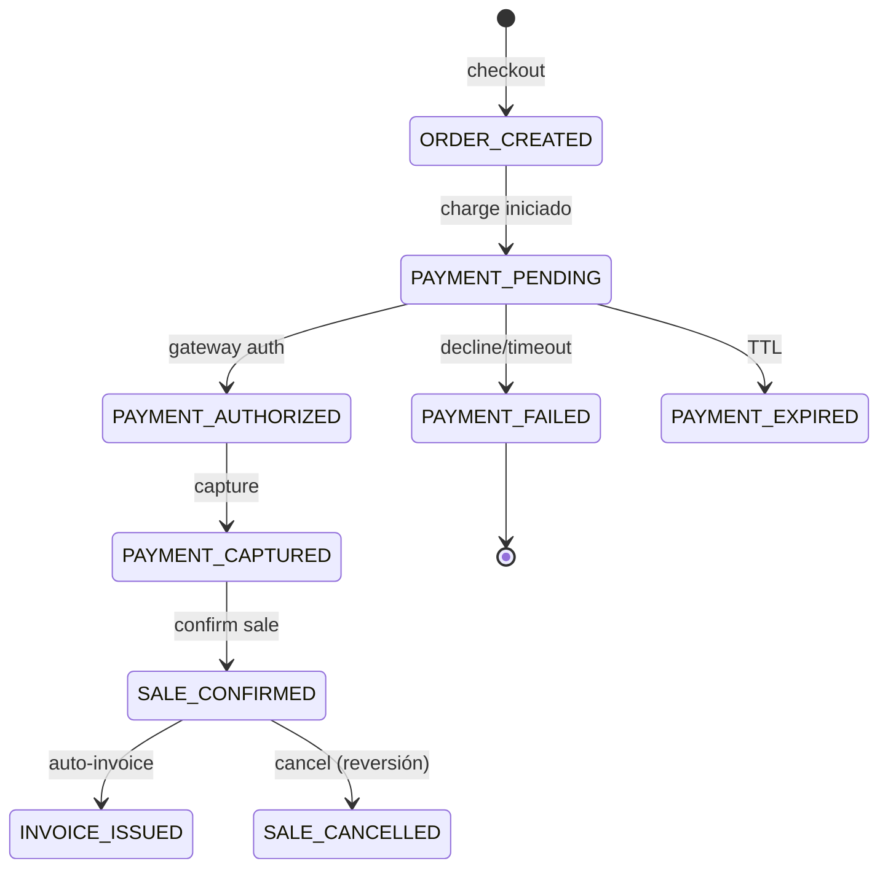

# PHASE 6 — PAYMENTS (P1)

> Documento de ingeniería 07 · Estado: ⬜ PENDIENTE
> Objetivo: máquina de estados formal ORDER / PAYMENT / SALE / INVOICE / FULFILLMENT — sin mezclar estados.

## 1. Estado actual

- ✅ `payment_transactions` (028/055) con idempotency_key.
- ✅ PaymentGatewayClient (PSP mock: tok_visa/tok_mastercard/tok_amex→approved, tok_declined→declined, tok_pending→pending) con header Idempotency-Key.
- ✅ Checkout con tarjeta: `_chargeWithGateway` ANTES de crear venta; PAYMENT_DECLINED → error.
- ✅ Si payment-service no responde → venta queda `pending` (fallback documentado).
- ⚠️ Fallback "payment down → pending → checkout OK" debe comunicar al usuario "Pedido creado, pago pendiente", NO "Compra realizada".

## 2. Máquina de estados objetivo



### Estados por entidad
| Entidad | Estados |
|---|---|
| Order | draft, pending, confirmed, cancelled, completed |
| Payment | pending, authorized, captured, failed, cancelled, expired, refunded, partially_refunded |
| Sale | draft, confirmed, cancelled, refunded |
| Invoice | draft, issued, paid, partially_paid, voided |
| Fulfillment | pending, processing, ready, shipped, delivered, cancelled |

## 3. Brechas / plan

| # | Tarea |
|---|---|
| 6.1 | Documentar `docs/payments/PAYMENT-STATE-MACHINE.md` con las transiciones válidas por entidad |
| 6.2 | Refactor `payment_transactions.status` para usar los estados objetivo |
| 6.3 | En checkout: distinguir respuesta al usuario (order.created + payment.pending) |
| 6.4 | Webhooks de pago: payment.created/authorized/captured/failed/refunded con firma + idempotencia + replay protection |
| 6.5 | `scripts/test-payment/run-payment-suite.mjs`: success/failure/timeout/refund/duplicate callback |
| 6.6 | El flujo POS (cash) no debe pasar por gateway — solo ecommerce con tarjeta |

## 4. Criterios de aceptación

```text
- estados correctos en todas las transiciones probadas
- webhook duplicado = no-op
- fallo de pago NUNCA deja sale.confirmed
- 54/54 E2E PASS
```
