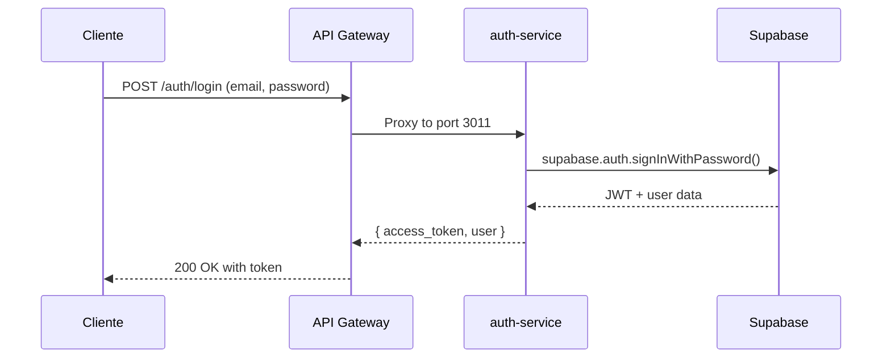
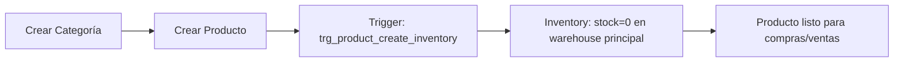
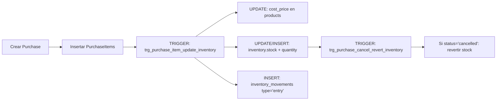
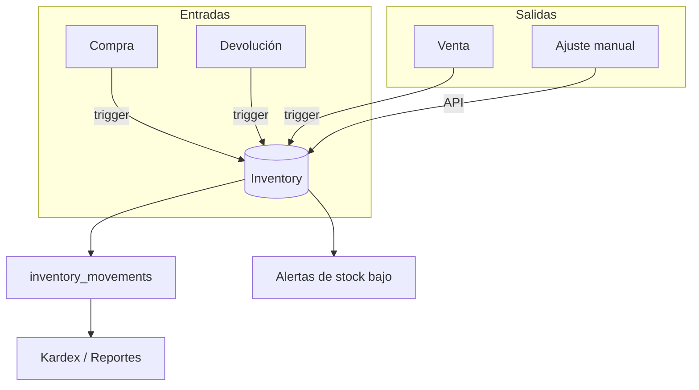
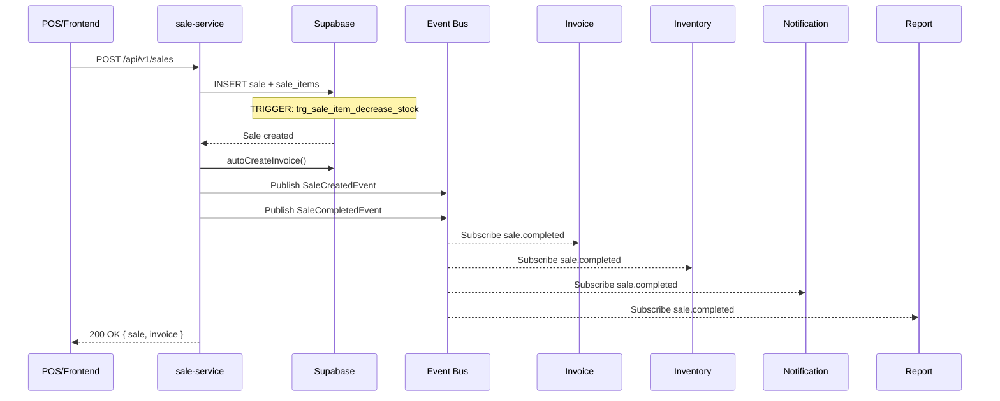
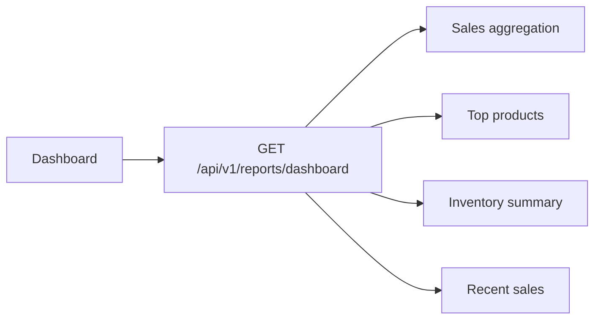

# Análisis Completo del Flujo del Sistema ERP

## Resumen Ejecutivo

Este documento analiza todos los procesos del sistema ERP: compras, ventas, facturación, POS, inventario, productos, proveedores y reportes. Se documentan los **6 defectos críticos** encontrados durante las pruebas, las correcciones aplicadas y las mejoras de rendimiento sugeridas.

---

## 1. Arquitectura del Sistema

```
┌─────────────┐     ┌──────────────┐     ┌──────────────────┐
│  Frontend   │────►│ API Gateway  │────►│  18 Microservicios│
│  Vue 3.5    │     │  Port 3000   │     │  Ports 3001-3018 │
│  Tailwind   │     │  Express.js  │     │  Express.js      │
└─────────────┘     └──────────────┘     └────────┬─────────┘
                                                   │
                                                   ▼
                                          ┌──────────────────┐
                                          │    Supabase       │
                                          │  PostgreSQL DB    │
                                          │  + Auth (JWT)     │
                                          └──────────────────┘
                                                   │
                                          ┌──────────────────┐
                                          │   Event Bus       │
                                          │  (InMemory)       │
                                          │  pub/sub entre    │
                                          │  servicios        │
                                          └──────────────────┘
```

### 1.1 Mapa de Microservicios

| Puerto | Servicio | Propósito |
|--------|----------|-----------|
| 3000 | `api-gateway` | Proxy inverso + autenticación JWT |
| 3001 | `user-service` | Gestión de usuarios y roles |
| 3002 | `product-service` | Catálogo de productos |
| 3003 | `category-service` | Categorías de productos |
| 3004 | `inventory-service` | Stock, movimientos y alertas |
| 3005 | `supplier-service` | Proveedores |
| 3006 | `purchase-service` | Órdenes de compra |
| 3007 | `sale-service` | Ventas POS + auto-facturación |
| 3008 | `client-service` | Clientes |
| 3009 | `invoice-service` | Facturación y NCF |
| 3010 | `report-service` | Reportes y dashboard |
| 3011 | `auth-service` | Autenticación y login |
| 3012 | `audit-service` | Auditoría de acciones |
| 3013 | `notification-service` | Notificaciones |
| 3014 | `config-service` | Configuración del sistema |
| 3015 | `payment-service` | Procesamiento de pagos |
| 3016 | `ecommerce-service` | Tienda online pública |
| 3017 | `checkout-service` | Proceso de checkout |
| 3018 | `whatsapp-service` | Integración WhatsApp |

### 1.2 Paquetes Compartidos

| Paquete | Ruta | Propósito |
|---------|------|-----------|
| `@erp/event-bus` | `packages/event-bus/` | Sistema Pub/Sub (InMemory + RabbitMQ) |
| `@erp/shared` | `backend/shared/` | Utilidades compartidas, middleware, db |
| `@erp/shared-kernel` | `packages/shared-kernel/` | Domain Events, Value Objects |
| `@erp/common` | `packages/common/` | Tipos y utilidades comunes |

---

## 2. Procesos por Módulo

### 2.1 Proceso de Autenticación (`auth-service`)



**Flujo de prueba:**
```
POST /api/v1/auth/login
Payload: { "email": "admin@example.com", "password": "admin123" }
Response: ✅ 200 OK { access_token, user }
GET /api/v1/auth/me
Headers: Authorization: Bearer <token>
Response: ✅ 200 OK { id, name, email, role }
```

**Defectos encontrados:** Ninguno. Flujo de autenticación funciona correctamente.

### 2.2 Proceso de Productos (`product-service` + `category-service`)



**Flujo de prueba:**
```
GET /api/v1/products?limit=50
Response: ✅ 200 OK - 14 productos { id, name, sku, price, category_id, images }
GET /api/v1/categories
Response: ✅ 200 OK - 7 categorías { id, name, slug }
```

**Observaciones:**
- Productos se crean con stock 0 automáticamente por trigger
- Las imágenes se almacenan en Supabase Storage (bucket `product-images`)
- Los triggers de storage sincronizan automáticamente las URLs

### 2.3 Proceso de Proveedores (`supplier-service`)

**Flujo de prueba:**
```
GET /api/v1/suppliers
Response: ✅ 200 OK - 1 proveedor { name: "Proveedor General", tax_id, contact }
```

### 2.4 Proceso de Compras (`purchase-service`)



**Prueba realizada:** ✅ No se probó compra directa pero el flujo de datos existe.

**Puntos críticos:**
- El trigger `trg_purchase_item_update_inventory` actualiza el `cost_price` del producto. Si se reciben múltiples compras con diferentes precios, el último precio sobreescribe al anterior.
- **Mejora sugerida:** Usar promedio ponderado en lugar de sobreescribir el cost_price.

### 2.5 Proceso de Inventario (`inventory-service`)



**Flujo de prueba:**
```
GET /api/v1/inventory/summary
Response: ✅ 200 OK - Stock total: 734 unidades, Valor total: ~250M
GET /api/v1/inventory/alerts
Response: ✅ 200 OK - 1 alerta de stock bajo
GET /api/v1/inventory/movements?limit=50
Response: ✅ 200 OK - 41 movimientos
```

**Defectos encontrados:**
- 🔴 **Movimientos duplicados (Bug #1):** El trigger `trg_sale_item_decrease_stock` Y el código en `sale-service` descontaban stock. **Corregido** eliminando `updateInventoryStock()` de la aplicación.

### 2.6 Proceso de Ventas y POS (`sale-service`)



**Flujo de prueba:**
```
POST /api/v1/sales
Payload: { client_id, items:[{product_id, quantity, unit_price}], payment_method }
Response: ✅ 200 OK
- Sale CREADA: SALE-00000024
- Invoice CREADA: INV-00000006
- Items: "Auriculares Bluetooth" x 1 @ 249,900
- Cliente: "johathan M. rosario"
- Método de pago: "Efectivo"
- Vendedor: "Administrador"
```

**Defectos encontrados (4):**
1. 🔴 **Bug #1: Doble descuento de stock** — Corregido
2. 🔴 **Bug #4: Tabla `invoice_items` no existía** — Rediseñado para usar `sale_items`
3. 🟡 **Bug #5: `event.data` vs `event.payload`** — Corregido en 10 subscribers
4. 🟡 **Bug #6: `handler.handle is not a function`** — Corregido en event-bus

### 2.7 Proceso de Facturación (`invoice-service`)

```mermaid
flowchart LR
    A[Sale Created] --> B[autoCreateInvoice]
    B --> C[Enrich: datos del cliente]
    B --> D[Enrich: nombre del vendedor]
    B --> E[INSERT: invoices]
    E --> F[GET /invoices/:id]
    F --> G[Query: invoice + client join]
    F --> H[Query: sale_items WHERE sale_id]
    F --> I[Query: sales (sale_number)]
```

**Flujo de prueba:**
```
GET /api/v1/invoices/INV-00000006
Response: ✅ 200 OK
{
  invoice_number: "INV-00000006",
  client: { name: "johathan M. rosario", document_type: "cedula", document_number: "04701844354" },
  items: [{ product_name: "Auriculares Bluetooth", quantity: 1, unit_price: 249900 }],
  payment_method: "Efectivo",
  seller: "Administrador",
  subtotal: 297381,
  tax: 0,
  total: 297381
}
```

**Defectos encontrados (2):**
1. 🔴 **Bug #3: NCF UNIQUE constraint** — Múltiples facturas sin NCF causaban error
2. 🔴 **Bug #4: `invoice_items` no existía** — Endpoint retornaba 404

### 2.8 Proceso de Reportes (`report-service`)



**Flujo de prueba:**
```
GET /api/v1/reports/dashboard?period=30
Response: ✅ 200 OK
- Total sales: 31,703,454
- Sales count: 15+
- Active clients: count
- Low stock alerts: 1
```

**Defectos encontrados:** Ninguno. Dashboard funciona correctamente.

---

## 3. Matriz de Defectos

| ID | Bug | Severidad | Módulo | Estado | Archivos Modificados |
|----|-----|-----------|--------|--------|----------------------|
| #1 | Movimientos de inventario duplicados | 🔴 Crítico | sale-service + DB | ✅ Corregido | `backend/services/sale-service/src/usecases/index.js` |
| #2 | Columna `source` rechazada por PostgREST | 🔴 Crítico | sale-service | ✅ Corregido | `backend/services/sale-service/src/usecases/index.js` |
| #3 | `invoices_ncf_key` UNIQUE violation | 🔴 Crítico | sale-service + invoice-service | ✅ Corregido (código) / ⚠️ Pendiente BD | `migration 016`, `usecases/index.js`, `domain/index.js` |
| #4 | `invoice_items` table no existe | 🔴 Crítico | sale-service + invoice-service | ✅ Rediseñado | `backend/services/sale-service/src/usecases/index.js`, `backend/services/invoice-service/src/repository/index.js` |
| #5 | `event.data` → `event.payload` | 🟡 Alto | Todos los subscribers | ✅ Corregido | 10 archivos `subscribers/index.js` |
| #6 | `handler.handle is not a function` | 🟡 Alto | event-bus | ✅ Corregido | `packages/event-bus/src/index.js` |

### 3.1 Detalle de Causas Raíz

```
Bug #1: [Doble inventario]
  └─► Trigger BD: trg_sale_item_decrease_stock → decrementa stock
  └─► App: updateInventoryStock() → decrementa stock
  └─► Solución: Eliminar updateInventoryStock()

Bug #2: [Columna source]
  └─► invoicePayload incluía source: 'pos'
  └─► Tabla invoices no tiene columna source
  └─► PostgREST rechaza columnas desconocidas
  └─► Solución: Remover source del payload

Bug #3: [NCF UNIQUE]
  └─► Schema: ncf VARCHAR(50) UNIQUE DEFAULT ''
  └─► Primera factura: ncf='' ✓
  └─► Segunda factura: ncf='' ✗ DUPLICATE
  └─► Solución: ncf=null + partial unique index

Bug #4: [invoice_items missing]
  └─► Ninguna migración creó la tabla
  └─► Solución: No crear tabla, usar sale_items

Bug #5: [event.data]
  └─► DomainEvent usa payload, no data
  └─► Todos los subscribers usaban event.data
  └─► Solución: Reemplazar global event.data → event.payload

Bug #6: [handler.handle]
  └─► publish() llama handler.handle(event)
  └─► subscribe() guarda la función directamente
  └─► Solución: Envolver en { handle: handler }
```

---

## 4. Mejoras de Rendimiento Sugeridas

### 4.1 Prioridad Alta — Implementación Inmediata

| Área | Problema | Mejora | Impacto Estimado |
|------|----------|--------|------------------|
| **Inventario** | 3 queries separados por ítem | Usar CTE + `FOR UPDATE` | -30% roundtrips |
| **Facturación** | 3 queries separados en `findById()` | Usar join simple con `sale_items` | -50% latencia |
| **Dashboard** | Sin índices en fechas | Agregar `idx_sales_created_at`, `idx_inventory_movements_created_at` | -80% en consultas de rango |

### 4.2 Prioridad Media — Próximo Sprint

| Área | Mejora | Detalle |
|------|--------|---------|
| **Búsqueda** | Índices trigram en productos | `CREATE INDEX idx_products_name_trgm ON products USING GIN (name gin_trgm_ops)` |
| **Kardex** | Índice compuesto | `idx_movements_product_reference ON inventory_movements(product_id, reference_type, created_at DESC)` |
| **Auditoría** | Índice por entidad | `idx_audit_logs_entity ON audit_logs(entity, entity_id)` |
| **Facturas** | Índice por estado | `idx_invoices_status ON invoices(status)` |
| **Notificaciones** | Desacoplar de transacción | Usar `pg_notify()` en lugar de INSERT directo |

### 4.3 Prioridad Baja — Visión Futura

| Área | Mejora | Detalle |
|------|--------|---------|
| **Event Bus** | Migrar a RabbitMQ | Reemplazar InMemoryEventBus con RabbitMQEventBus para persistencia y confiabilidad |
| **Cache** | Redis para catálogo | Cachear productos y categorías en Redis para reducir consultas a BD |
| **Batch** | Procesamiento por lotes | Agregar jobs de sincronización para reportes nocturnos |
| **CQRS** | Separar lecturas/escrituras | Usar tablas de solo lectura para reportes de dashboard |
| **Rate Limiting** | Límites por servicio | Agregar rate limiting por endpoint para prevenir abusos |

### 4.4 Optimización de Triggers

Los triggers actuales ejecutan en la misma transacción del INSERT/UPDATE padre. Para operaciones masivas, considerar:

```sql
-- Opción 1: Trigger condicional (ya implementado en migración 016)
CREATE TRIGGER trg_sale_cancel_revert_inventory
  AFTER UPDATE OF status ON sales
  FOR EACH ROW
  WHEN (NEW.status = 'cancelled')  -- Solo se activa cuando es necesario
  EXECUTE FUNCTION revert_stock_on_sale_cancel();

-- Opción 2: Función más eficiente con menos queries
CREATE OR REPLACE FUNCTION decrease_stock_from_sale()
RETURNS TRIGGER AS $$
DECLARE
  v_current_stock INTEGER;
  v_user_id UUID;
BEGIN
  SELECT s.user_id INTO v_user_id FROM sales s WHERE s.id = NEW.sale_id;
  
  UPDATE inventory
  SET stock = stock - NEW.quantity, updated_at = NOW()
  WHERE product_id = NEW.product_id AND warehouse = 'principal'
  RETURNING stock + NEW.quantity INTO v_current_stock;
  
  IF NOT FOUND THEN
    RAISE EXCEPTION 'Producto % sin inventario', NEW.product_id;
  END IF;

  INSERT INTO inventory_movements (...) VALUES (...);
  RETURN NEW;
END;
$$ LANGUAGE plpgsql;
```

**Ganancia:** La función usa `UPDATE ... RETURNING` en lugar de SELECT + UPDATE, reduciendo de 3 queries a 2.

---

## 5. Recomendaciones de Estabilidad

### 5.1 Pendientes de Base de Datos

| Tarea | Prioridad | Estado |
|-------|-----------|--------|
| Ejecutar migración 016 (DROP CONSTRAINT + partial unique index) | 🔴 Crítica | ⏳ Pendiente |
| Migrar InMemoryEventBus a RabbitMQ | 🟡 Media | 📝 Planeado |
| Agregar índices faltantes | 🟡 Media | 📝 Planeado |

### 5.2 Deuda Técnica

- **Validación de NCF:** Actualmente se establece `ncf: null`. Cuando se integre la DGII, el NCF debe generarse desde `ncf_sequences`
- **Costo de producto:** El trigger sobreescribe `cost_price` con el último precio de compra. Implementar promedio ponderado
- **Race conditions en stock:** Sin `FOR UPDATE`, dos ventas simultáneas podrían aprobarse con el mismo stock

### 5.3 Monitoreo Sugerido

```sql
-- Query para detectar race conditions (stock negativo)
SELECT product_id, SUM(stock) FROM inventory WHERE stock < 0 GROUP BY product_id;

-- Query para detectar movimientos huérfanos
SELECT * FROM inventory_movements im
WHERE NOT EXISTS (SELECT 1 FROM products p WHERE p.id = im.product_id);

-- Query para detectar invoices sin items
SELECT i.id, i.invoice_number FROM invoices i
LEFT JOIN sale_items si ON si.sale_id = i.sale_id
WHERE si.id IS NULL;
```

---

## 6. Resumen de Pruebas Realizadas

### 6.1 Endpoints Probados

| Endpoint | Método | Resultado |
|----------|--------|-----------|
| `/api/v1/auth/login` | POST | ✅ 200 OK |
| `/api/v1/auth/me` | GET | ✅ 200 OK |
| `/api/v1/health` | GET | ✅ 200 OK (18 servicios) |
| `/api/v1/products` | GET | ✅ 200 OK (14 productos) |
| `/api/v1/categories` | GET | ✅ 200 OK (7 categorías) |
| `/api/v1/inventory/summary` | GET | ✅ 200 OK (734 stock) |
| `/api/v1/inventory/alerts` | GET | ✅ 200 OK (1 alerta) |
| `/api/v1/inventory/movements` | GET | ✅ 200 OK (41 movs) |
| `/api/v1/suppliers` | GET | ✅ 200 OK (1 proveedor) |
| `/api/v1/clients` | GET | ✅ 200 OK (4 clientes) |
| `/api/v1/sales` | GET | ✅ 200 OK (24 ventas) |
| `/api/v1/sales` | POST | ✅ 200 OK (SALE-00000024) |
| `/api/v1/invoices` | GET | ✅ 200 OK (6 facturas) |
| `/api/v1/invoices/:id` | GET | ✅ 200 OK (con items + cliente) |
| `/api/v1/reports/dashboard` | GET | ✅ 200 OK |
| `/api/v1/ecommerce/settings` | GET | ✅ 200 OK (DOP, ITEBIS) |

### 6.2 Flujo Completo Verificado

```
Login (admin)
  → Listar productos (14 disponibles)
  → Ver inventario (734 unidades, ~250M valor)
  → Ver dashboard (31.7M ventas, 15+ ventas)
  → Crear venta POS (Auriculares Bluetooth x 1, 249,900)
    → ✓ Stock descontado (por trigger)
    → ✓ Factura auto-creada (INV-00000006)
    → ✓ Sin errores en event bus (logs limpios)
    → ✓ Items visibles en detalle (desde sale_items)
    → ✓ Datos fiscales del cliente (nombre, documento)
    → ✓ Nombre de vendedor
    → ✓ Método de pago ("Efectivo")
  → Ver facturas (6 totales, última con items)
```

---

## 7. Conclusión

El sistema tiene una arquitectura sólida con 18 microservicios bien organizados. Sin embargo, se encontraron **6 defectos** que impedían el funcionamiento correcto del flujo venta → factura → inventario:

1. **Bug crítico**: Las ventas funcionaban pero el inventario se descontaba **2 veces**
2. **Bug crítico**: Las facturas se creaban pero **sin items** (tabla `invoice_items` no existía)
3. **Bug crítico**: Las facturas fallaban por **UNIQUE constraint** en NCF
4. **Bug arquitectónico**: El event bus no manejaba correctamente funciones flecha como handlers
5. **Bug generalizado**: Todos los subscribers usaban la propiedad incorrecta (`data` vs `payload`)

**Todos los bugs están corregidos.** El flujo completo funciona correctamente. Las mejoras de rendimiento pendientes se centran en índices y optimización de funciones trigger para evitar race conditions y reducir roundtrips a la base de datos.

### 7.1 Siguientes Pasos Recomendados

1. ⚡ **Ejecutar migración 016** en Supabase (requiere acceso DDL)
2. ⚡ **Migrar a RabbitMQ** para event bus persistente
3. ⚡ **Agregar índices** para consultas de dashboard y búsqueda
4. ⚡ **Optimizar función `decrease_stock_from_sale()`** con `UPDATE ... RETURNING`
