# Gestor Integral de Inventario, Compras y Ventas (GIICV)

> También referido como **Deep Intelligence Inventory ERP**

---

## 1. Principios de Arquitectura

### 1.1 Separación Catálogo ↔ Inventario

Los **Productos** (Catálogo) y el **Inventario** (Stock) son entidades completamente separadas:

| Entidad | Contiene | NO contiene |
|---|---|---|
| **Producto** (Catálogo) | Nombre, SKU, Código Barra, Categoría, Marca, Unidad, Descripción, Imágenes, Videos, Especificaciones, Precio sugerido, Precio mínimo, Precio máximo, Estado | ❌ Stock |
| **Inventario** (Stock) | Producto, Almacén, Cantidad, Reservado, Disponible, Costo Promedio, Último costo, Ubicación, Lote, Serie, Fecha vencimiento | ❌ Datos del producto |

Esto permite que un producto exista en el catálogo aunque nunca haya sido comprado aún, exactamente como funcionan SAP, Odoo, Microsoft Dynamics y Oracle NetSuite.

### 1.2 Flujo Correcto de Compras

```
Proveedor
    ↓
Orden de Compra
    ↓
Compra Pendiente
    ↓
Recepción Física
    ↓
Inspección de Calidad
    ↓
Aprobado
    ↓
Entrada a Inventario
    ↓
Disponible para Venta
```

### 1.3 Flujo Correcto de Ventas

```
Cliente
    ↓
Carrito
    ↓
Checkout
    ↓
Pago
    ↓
Venta Confirmada
    ↓
Salida de Inventario
    ↓
Factura
    ↓
Notificación / Reportes
```

---

## 2. Mapa General de Navegación

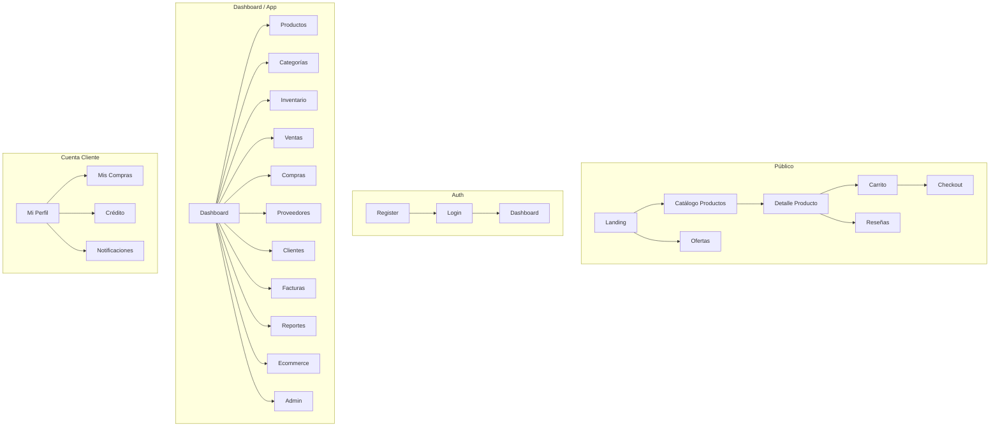

---

## 3. Rutas Completas del Sistema

### 3.1 Rutas Públicas

| Path | Nombre | Componente | Descripción |
|---|---|---|---|
| `/` | `Home` | `LandingView.vue` | Página de aterrizaje principal |
| `/products` | `ProductsCatalog` | `ProductsCatalogView.vue` | Catálogo público (solo productos con stock > 0) |
| `/offers` | `OffersProducts` | `OffersProductsView.vue` | Productos en oferta con descuentos |
| `/products/:id` | `ProductPublicDetail` | `ProductPublicDetailView.vue` | Detalle público + reseñas |
| `/cart` | `Cart` | `CartView.vue` | Carrito de compras |
| `/checkout` | `Checkout` | `CheckoutView.vue` | **NUEVO:** Checkout completo con datos de envío y pago |

### 3.2 Rutas de Autenticación

| Path | Nombre | Componente | Descripción |
|---|---|---|---|
| `/login` | `Login` | `LoginView.vue` | Inicio de sesión |
| `/register` | `Register` | `RegisterView.vue` | Registro de usuarios |
| `/forgot-password` | `ForgotPassword` | `ForgotPasswordView.vue` | Recuperación de contraseña |
| `/reset-password` | `ResetPassword` | `ResetPasswordView.vue` | Restablecimiento de contraseña |

### 3.3 Rutas de Cuenta Cliente

Layout padre: `AccountLayout.vue` (requiere rol `cliente`)

| Path | Nombre | Componente | Descripción |
|---|---|---|---|
| `/account` | — | (redirect → AccountProfile) | Redirección al perfil |
| `/account/profile` | `AccountProfile` | `ProfileView.vue` | Perfil personal |
| `/account/purchases` | `AccountPurchases` | `PurchasesView.vue` | Historial de compras |
| `/account/credit` | `AccountCredit` | `CreditView.vue` | Cuenta de crédito |
| `/account/notifications` | `AccountNotifications` | `NotificationsView.vue` | Notificaciones |

### 3.4 Rutas del Dashboard

Layout padre: `AppLayout.vue` (requiere autenticación)

| Path | Nombre | Componente | Descripción |
|---|---|---|---|
| `/app` | — | (redirect → /app/dashboard) | Redirección |
| `/app/dashboard` | `Dashboard` | `DashboardView.vue` | KPIs y gráficos |
| `/app/profile` | `Profile` | `ProfileView.vue` | Perfil usuario interno |
| `/app/notifications` | `Notifications` | `NotificationsView.vue` | Centro de notificaciones |

### 3.5 Módulo de Productos (Catálogo)

| Path | Nombre | Componente | Descripción |
|---|---|---|---|
| `/app/products` | `Products` | `ProductListView.vue` | Catálogo de productos (sin stock) |
| `/app/products/create` | `ProductCreate` | `ProductFormView.vue` | Crear producto en catálogo |
| `/app/products/:id/edit` | `ProductEdit` | `ProductFormView.vue` | Editar producto (siempre permitido) |
| `/app/products/:id` | `ProductDetail` | `ProductDetailView.vue` | Detalle del producto |

> **Nota:** El producto siempre se puede editar, pero ciertos campos son inmutables después de crear movimientos: SKU, Código Barra, Costo histórico.

### 3.6 Módulo de Categorías

| Path | Nombre | Componente | Descripción |
|---|---|---|---|
| `/app/categories` | `Categories` | `CategoryListView.vue` | CRUD con árbol jerárquico |

### 3.7 Módulo de Inventario

| Path | Nombre | Componente | Descripción |
|---|---|---|---|
| `/app/inventory` | `Inventory` | `InventoryView.vue` | Stock actual: disponible, reservado, bajo, agotado |
| `/app/inventory/movements` | `InventoryMovements` | `MovementsView.vue` | Todos los movimientos (10+ tipos) |
| `/app/inventory/kardex/:productId?` | `InventoryKardex` | `KardexView.vue` | Kardex por producto con saldo corriente |
| `/app/inventory/adjustments` | `InventoryAdjustments` | `AdjustmentsView.vue` | Ajustes de inventario (+/-) |
| `/app/inventory/transfers` | `InventoryTransfers` | `TransfersView.vue` | Transferencias entre almacenes |

### 3.8 Módulo de Compras

| Path | Nombre | Componente | Descripción |
|---|---|---|---|
| `/app/purchases` | `Purchases` | `PurchaseListView.vue` | Órdenes de compra con filtros por estado |
| `/app/purchases/create` | `PurchaseCreate` | `PurchaseFormView.vue` | Crear orden (borrador) |
| `/app/purchases/:id` | `PurchaseDetail` | `PurchaseDetailView.vue` | Detalle con timeline de estados |

### 3.9 Módulo de Recepción de Mercancía

| Path | Nombre | Componente | Descripción |
|---|---|---|---|
| `/app/receipts` | `GoodsReceipts` | `GoodsReceiptsView.vue` | **NUEVO:** Recepciones de mercancía |
| `/app/receipts/create/:purchaseId` | `GoodsReceiptCreate` | `GoodsReceiptForm.vue` | **NUEVO:** Crear recepción desde compra |
| `/app/receipts/:id` | `GoodsReceiptDetail` | `GoodsReceiptDetail.vue` | **NUEVO:** Detalle de recepción |

### 3.10 Módulo de Inspección de Calidad

| Path | Nombre | Componente | Descripción |
|---|---|---|---|
| `/app/inspections` | `QualityInspections` | `InspectionsView.vue` | **NUEVO:** Inspecciones de calidad |
| `/app/inspections/create/:receiptId` | `InspectionCreate` | `InspectionForm.vue` | **NUEVO:** Crear inspección |
| `/app/inspections/:id` | `InspectionDetail` | `InspectionDetail.vue` | **NUEVO:** Detalle de inspección |

### 3.11 Módulo de Ventas y POS

| Path | Nombre | Componente | Descripción |
|---|---|---|---|
| `/app/sales` | `Sales` | `SaleListView.vue` | Ventas con filtros por estado (8 estados) |
| `/app/sales/create` | `SaleCreate` | `SaleFormView.vue` | Crear venta manual |
| `/app/sales/:id` | `SaleDetail` | `SaleDetailView.vue` | Detalle con timeline de estados |
| `/app/pos` | `POS` | `POSView.vue` | Punto de Venta rápido |

### 3.12 Módulo de Proveedores

| Path | Nombre | Componente | Descripción |
|---|---|---|---|
| `/app/suppliers` | `Suppliers` | `SuppliersView.vue` | CRUD de proveedores |

### 3.13 Módulo de Clientes

| Path | Nombre | Componente | Descripción |
|---|---|---|---|
| `/app/clients` | `Clients` | `ClientListView.vue` | Listado de clientes |
| `/app/clients/:id` | `ClientDetail` | `ClientDetailView.vue` | Detalle del cliente |

### 3.14 Módulo de Facturas (Fiscales)

| Path | Nombre | Componente | Descripción |
|---|---|---|---|
| `/app/invoices` | `Invoices` | `InvoiceListView.vue` | Facturas con filtros fiscales |
| `/app/invoices/:id` | `InvoiceDetail` | `InvoiceDetailView.vue` | Detalle con NCF, QR, XML, descarga PDF |

### 3.15 Módulo de Reportes

Layout padre: `reporthomeview.vue` (wrapper con `<router-view>`).

| Path | Nombre | Componente | Descripción |
|---|---|---|---|
| `/app/reports` | `reports` | `ReportsView.vue` | Menú selector de reportes con tarjetas de navegación |
| `/app/reports/sales` | `SalesReport` | `SalesReportView.vue` | Ventas diarias, mensuales, por vendedor, sucursal, categoría |
| `/app/reports/inventory` | `InventoryReport` | `InventoryReportView.vue` | Stock, rotación, agotados, mínimos, vencidos, kardex |
| `/app/reports/top-products` | `TopProductsReport` | `TopProductsView.vue` | Top productos + utilidad + margen |
| `/app/reports/clients` | `ClientsReport` | `ClientsReportView.vue` | Clientes nuevos, frecuentes, inactivos, crédito |
| `/app/reports/cash-register` | `CashRegisterReport` | `CashRegisterReportView.vue` | Turnos de caja, movimientos, resumen por período |

### 3.16 Módulo de Ecommerce (Admin)

Layout padre: `EcommerceView.vue` (tabs siempre visibles con nested routes).

| Path | Nombre | Componente | Descripción |
|---|---|---|---|
| `/app/ecommerce` | `EcommerceHome` | `EcommerceHome.vue` | Panel general del ecommerce |
| `/app/ecommerce/banners` | `EcommerceBanners` | `BannersView.vue` | Banners promocionales |
| `/app/ecommerce/offers` | `EcommerceOffers` | `OffersView.vue` | Ofertas y descuentos |
| `/app/ecommerce/hero` | `EcommerceHero` | `HeroSettingsView.vue` | Configuración Hero |
| `/app/ecommerce/hero-slides` | `EcommerceHeroSlides` | `HeroSlidesView.vue` | Carrusel de slides |
| `/app/ecommerce/floating-banners` | `EcommerceFloatingBanners` | `FloatingBannersView.vue` | Banners flotantes |
| `/app/ecommerce/reviews` | `EcommerceReviews` | `ReviewsModerationView.vue` | Moderación de reseñas |
| `/app/ecommerce/coupons` | `EcommerceCoupons` | `CouponsView.vue` | Cupones de descuento |
| `/app/ecommerce/promotions` | `EcommercePromotions` | `PromotionsView.vue` | Promociones activas |
| `/app/ecommerce/settings` | `EcommerceSettings` | `SettingsView.vue` | Configuración tienda |

### 3.17 Módulo de Administración

| Path | Nombre | Componente | Descripción |
|---|---|---|---|
| `/app/admin` | `Admin` | `AdminView.vue` | Panel de administración |
| `/app/admin/users` | `AdminUsers` | `UsersView.vue` | Gestión de usuarios |
| `/app/admin/users/:id` | `AdminUserDetail` | `UserDetailView.vue` | Detalle de usuario |
| `/app/admin/audit` | `AdminAudit` | `AuditLogView.vue` | Registro de auditoría completo |
| `/app/admin/audit/:id` | `AdminAuditDetail` | `AuditDetailView.vue` | Detalle de evento de auditoría |
| `/app/admin/config` | `AdminConfig` | `ConfigView.vue` | Configuración global |

### 3.18 Ruta Catch-all

| Path | Nombre | Componente | Descripción |
|---|---|---|---|
| `/:pathMatch(.*)*` | `NotFound` | `NotFoundView.vue` | Página 404 |

**Total: ~70 rutas definidas**

---

## 4. Flujos Transaccionales GIICV

### 4.1 Flujo Completo de Compras (10 estados)

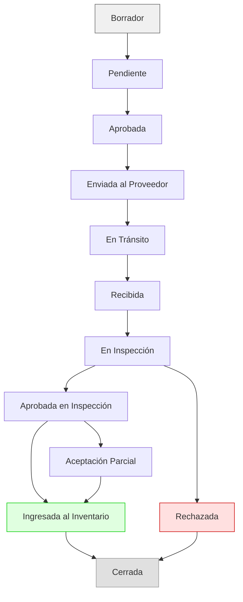

| Estado | Descripción | Transición a |
|---|---|---|
| **Borrador** | Orden en creación, editable | Pendiente |
| **Pendiente** | En espera de aprobación | Aprobada |
| **Aprobada** | Aprobada por supervisor | Enviada al Proveedor |
| **Enviada al Proveedor** | Orden enviada al proveedor | En Tránsito |
| **En Tránsito** | Mercancía en camino | Recibida |
| **Recibida** | Mercancía llegó físicamente | En Inspección |
| **En Inspección** | Control de calidad | Aprobada / Rechazada / Aceptación Parcial |
| **Aprobada** | Pasó inspección | Ingresada al Inventario |
| **Ingresada al Inventario** | Stock actualizado | Cerrada |
| **Cerrada** | Proceso completado | — |

### 4.2 Flujo de Recepción de Mercancía

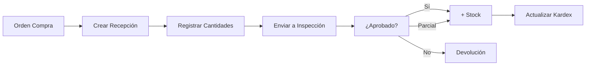

**Descripción:** Cuando la mercancía llega, se crea una recepción desde la orden de compra. Se registran las cantidades recibidas vs. solicitadas. Luego pasa a inspección de calidad. Según el resultado, el stock se incrementa total o parcialmente, o se rechaza la mercancía generando devolución.

### 4.3 Flujo de Inspección de Calidad

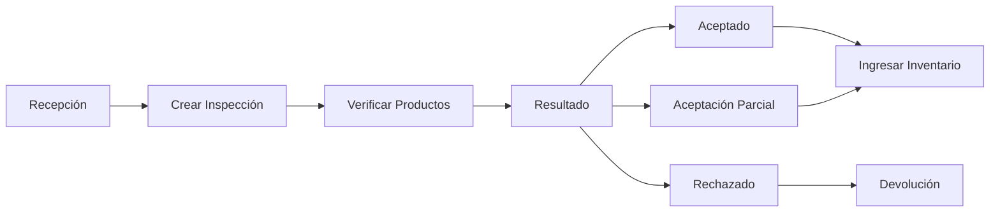

**Atributos de inspección:**
- **Producto** inspeccionado
- **Cantidad revisada**
- **Cantidad aprobada / rechazada**
- **Motivo de rechazo** (dañado, vencido, defectuoso, incorrecto)
- **Observaciones**
- **Inspector** (usuario que realizó la inspección)
- **Fecha de inspección**
- **Evidencia** (fotos adjuntas)

### 4.4 Flujo de Ventas (8 estados)

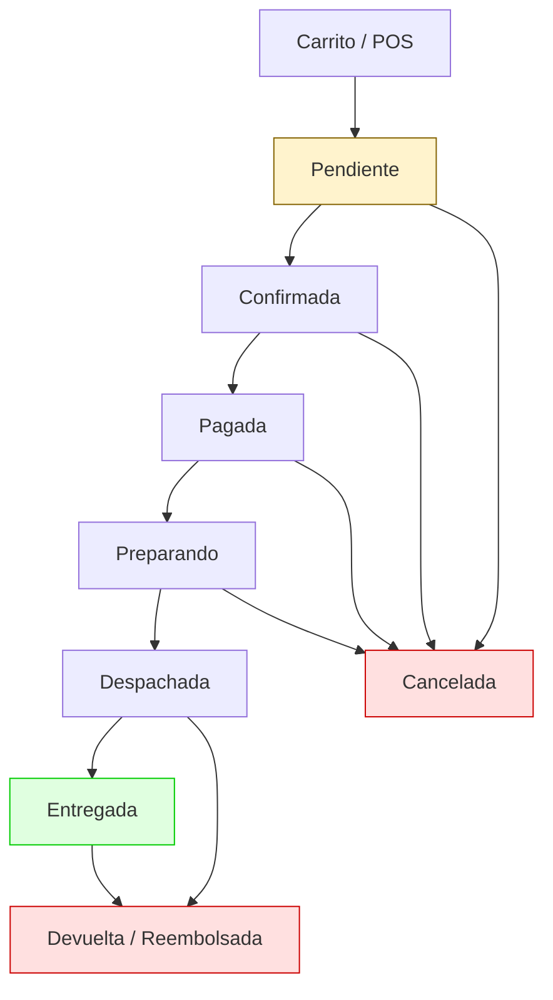

| Estado | Descripción | Acción en Inventario |
|---|---|---|
| **Pendiente** | Venta iniciada | Sin cambio |
| **Confirmada** | Cliente confirmó | **Reserva** de stock |
| **Pagada** | Pago recibido | Reserva confirmada |
| **Preparando** | Armando pedido | — |
| **Despachada** | Enviada al cliente | **Salida definitiva** de stock |
| **Entregada** | Cliente recibió | — |
| **Cancelada** | Venta cancelada | **Liberación** de reserva |
| **Devuelta / Reembolsada** | Devolución | **Entrada** por devolución |

### 4.5 Flujo de Checkout (Ecommerce)

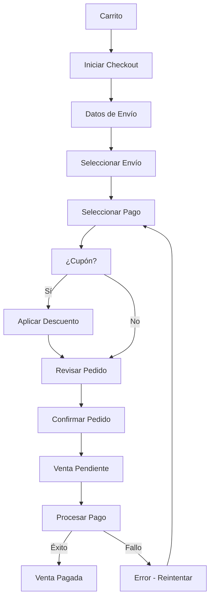

**Elementos del checkout:**
- Dirección de envío (nueva o guardada)
- Método de envío (seleccionar de `shipping_methods`)
- Cupón de descuento (válido, no vencido, no excedido)
- Resumen del pedido (subtotal, descuento, impuesto, envío, total)
- Método de pago (efectivo, transferencia, tarjeta, contra entrega)
- Generación de venta en estado **Pendiente**

### 4.6 Flujo de Inventario y Movimientos (11 tipos)

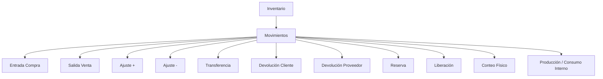

### 4.7 Flujo de Facturación Fiscal

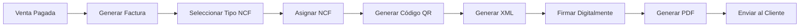

**Tipos de comprobantes fiscales (NCF):**
| Código | Tipo | Descripción |
|---|---|---|
| **01** | Consumidor Final | Factura para consumidor final |
| **02** | Crédito Fiscal | Factura con derecho a crédito fiscal |
| **03** | Gubernamental | Factura para entidades gubernamentales |
| **04** | Especial | Regímenes especiales |
| **05** | Exportación | Factura de exportación |
| **06** | Nota de Crédito | Anulación parcial/total de factura |
| **07** | Nota de Débito | Incremento de factura |
| **08** | Anulación | Anulación de NCF |

### 4.8 Flujo de Devoluciones

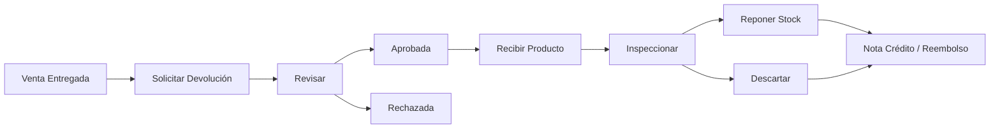

### 4.9 Flujo de Contabilidad (Asientos Automáticos)

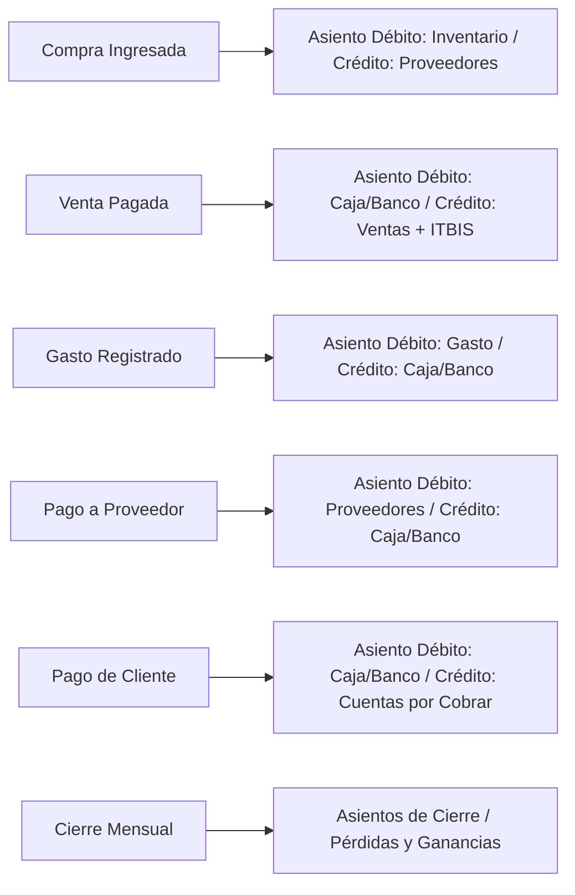

---

## 5. Resumen de Arquitectura

### 5.1 Distribución por Módulos

| Módulo | # Vistas | # API | Descripción |
|---|---|---|---|
| 🌐 **Público** | 6 | 2 | Landing, catálogo, detalle, ofertas, carrito, checkout |
| 🔐 **Auth** | 4 | 1 | Login, registro, recuperación |
| 👤 **Cuenta Cliente** | 5 | 3 | Perfil, compras, crédito, notificaciones |
| 📦 **Productos (Catálogo)** | 4 | 1 | CRUD de productos, marcas, especificaciones |
| 🏷️ **Categorías** | 1 | 1 | Árbol jerárquico |
| 🏭 **Marcas** | 1 | 1 | **NUEVO:** CRUD de marcas |
| 📊 **Inventario** | 7 | 4 | Stock, movimientos, kardex, ajustes, transferencias, lotes, reservas |
| 🛒 **Compras** | 3 | 2 | Órdenes de compra (10 estados) |
| 📦 **Recepción** | 3 | 2 | **NUEVO:** Recepción de mercancía |
| 🔍 **Inspección** | 3 | 1 | **NUEVO:** Control de calidad |
| 💰 **Ventas + POS** | 4 | 2 | Ventas (8 estados), POS |
| 🚚 **Proveedores** | 1 | 1 | CRUD de proveedores |
| 👥 **Clientes** | 2 | 1 | Listado y detalle |
| 📄 **Facturas** | 2 | 2 | Facturas fiscales (NCF, QR, XML, PDF) |
| 🔄 **Devoluciones** | 2 | 1 | **NUEVO:** Devoluciones y reembolsos |
| 📈 **Reportes** | 7 | 5 | Ventas, inventario, compras, clientes, financieros, top productos |
| 🏪 **Ecommerce Admin** | 8 | 8 | Banners, ofertas, hero, reseñas, settings |
| 🏛️ **Contabilidad** | 3 | 2 | **NUEVO:** Plan de cuentas, asientos, diario |
| ⚙️ **Admin** | 5 | 4 | Usuarios, auditoría, config, roles |

**Total: ~75 vistas funcionales** (+20 respecto a la versión anterior)

### 5.2 Stack Técnico

| Capa | Tecnología |
|---|---|
| **Frontend** | Vue 3.5 (Composition API, `<script setup>`) |
| **Build** | Vite 8 |
| **Routing** | vue-router 4 (createWebHistory) |
| **Gráficos** | Chart.js 4.5 con registerables |
| **HTTP** | Axios con interceptores (auto-auth, refresh tokens) |
| **PDF** | jsPDF + jspdf-autotable |
| **Excel** | XLSX |
| **UI** | Tailwind CSS v4 + diseño propio (clases `dt-*`) |
| **Backend** | Node.js con API Gateway (microservicios) |
| **Base de Datos** | Supabase (PostgreSQL) con RLS, triggers, funciones |
| **Componentes** | 23+ compartidos |
| **Módulos API** | 25+ (nuevos: brands, receipts, inspections, returns, accounting) |

### 5.3 Módulos API (Backend)

| Export | Endpoints | Propósito |
|---|---|---|
| `authAPI` | `/auth/*` | Autenticación y registro |
| `usersAPI` | `/users/*` | CRUD de usuarios |
| `productsAPI` | `/products/*` | Catálogo de productos, marcas, especificaciones |
| `categoriesAPI` | `/categories/*` | CRUD de categorías, árbol |
| `inventoryAPI` | `/inventory/*` | Stock disponible, reservado, lotes, movimientos |
| `inventoryMovementsAPI` | `/inventory/movements/*` | 11 tipos de movimientos |
| `inventoryAdjustmentsAPI` | `/inventory/adjustments/*` | Ajustes de stock |
| `inventoryTransfersAPI` | `/inventory/transfers/*` | Transferencias entre almacenes |
| `inventoryBatchesAPI` | `/inventory/batches/*` | Lotes, series, vencimientos |
| `purchasesAPI` | `/purchases/*` | Órdenes de compra (10 estados) |
| `purchaseStatusAPI` | `/purchases/status/*` | Transiciones de estado de compra |
| `suppliersAPI` | `/purchases/suppliers/*` | Proveedores |
| `goodsReceiptsAPI` | `/receipts/*` | **NUEVO:** Recepción de mercancía |
| `inspectionsAPI` | `/inspections/*` | **NUEVO:** Inspección de calidad |
| `salesAPI` | `/sales/*` | Ventas (8 estados), reservas |
| `saleStatusAPI` | `/sales/status/*` | Transiciones de estado de venta |
| `invoicesAPI` | `/invoices/*` | Facturas, NCF, QR, XML, PDF |
| `invoiceTypesAPI` | `/invoices/types/*` | **NUEVO:** Tipos de comprobantes fiscales |
| `invoiceSequencesAPI` | `/invoices/sequences/*` | **NUEVO:** Secuencias NCF |
| `returnsAPI` | `/returns/*` | **NUEVO:** Devoluciones y reembolsos |
| `cartAPI` | `/cart/*` | Carrito de compras |
| `checkoutAPI` | `/checkout/*` | Checkout completo (dirección, envío, pago, cupón) |
| `shippingMethodsAPI` | `/checkout/shipping/*` | **NUEVO:** Métodos de envío |
| `couponsAPI` | `/checkout/coupons/*` | **NUEVO:** Cupones de descuento |
| `ecommerceAPI` | `/ecommerce/*` | Banners, ofertas, hero, reseñas, settings |
| `catalogAPI` | `/catalog/*` | Catálogo público y búsqueda |
| `clientsAPI` | `/users/clients/*` | Clientes, cuentas de crédito |
| `reportsAPI` | `/reports/*` | Reportes de ventas, inventario, compras, clientes, financieros |
| `accountingAPI` | `/accounting/*` | **NUEVO:** Plan de cuentas, asientos contables |
| `notificationsAPI` | `/notifications/*` | Notificaciones |
| `auditAPI` | `/audit/*` | Auditoría del sistema (antes/después, IP, sucursal) |
| `configAPI` | `/config/*` | Configuración del sistema |
| `emailAPI` | `/email/*` | Envío de correos |
| `whatsappAPI` | `/whatsapp/*` | Mensajería WhatsApp |
| `brandsAPI` | `/brands/*` | **NUEVO:** Marcas de productos |

---

## 6. Flujo Transaccional Global GIICV

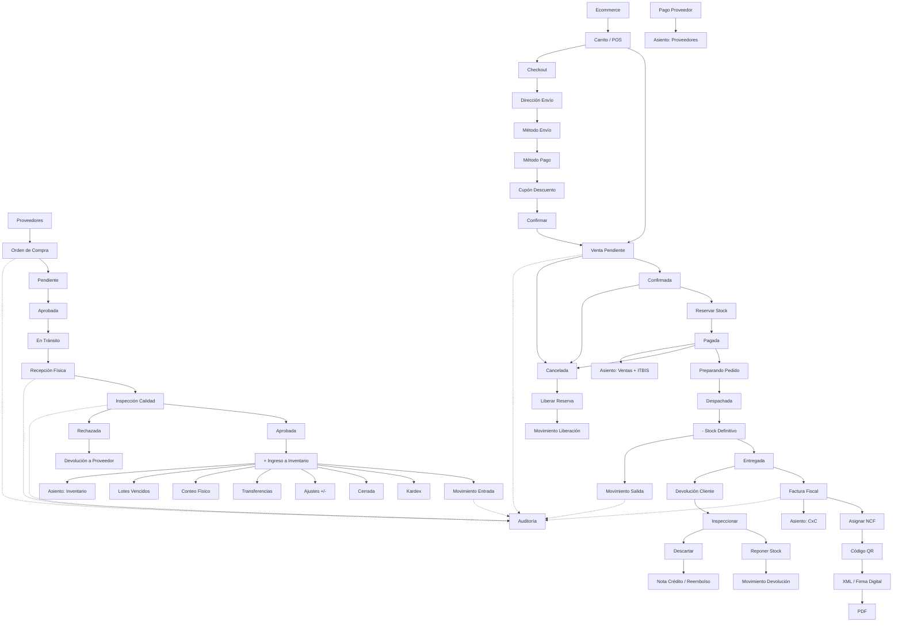

---

## 7. Estructura de Archivos del Frontend (Actualizada)

### 7.1 Vistas (`src/views/`) — GIICV

```
views/
├── account/
│   ├── AccountLayout.vue
│   ├── CartView.vue
│   ├── CreditView.vue
│   ├── NotificationsView.vue
│   ├── ProfileView.vue
│   └── PurchasesView.vue
├── admin/
│   ├── AdminView.vue
│   ├── AuditLogView.vue
│   ├── ConfigView.vue
│   ├── UserDetailView.vue
│   └── UsersView.vue
├── auth/
│   ├── ForgotPasswordView.vue
│   ├── LoginView.vue
│   ├── RegisterView.vue
│   └── ResetPasswordView.vue
├── brands/                          ★ NUEVO
│   └── BrandListView.vue
├── categories/
│   └── CategoryListView.vue
├── checkout/                        ★ NUEVO
│   └── CheckoutView.vue
├── clients/
│   ├── ClientDetailView.vue
│   └── ClientListView.vue
├── dashboard/
│   └── NotificationsView.vue
├── ecommerce/
│   ├── BannersView.vue
│   ├── EcommerceHome.vue
│   ├── EcommerceView.vue
│   ├── FloatingBannersView.vue
│   ├── HeroSettingsView.vue
│   ├── HeroSlidesView.vue
│   ├── OffersView.vue
│   ├── ReviewsModerationView.vue
│   └── SettingsView.vue
├── errors/
│   └── NotFoundView.vue
├── goods-reception/                 ★ NUEVO
│   ├── GoodsReceiptsView.vue
│   ├── GoodsReceiptForm.vue
│   └── GoodsReceiptDetail.vue
├── inspection/                      ★ NUEVO
│   ├── InspectionsView.vue
│   ├── InspectionForm.vue
│   └── InspectionDetail.vue
├── inventory/
│   ├── AdjustmentsView.vue
│   ├── InventoryList.vue
│   ├── InventoryView.vue
│   ├── KardexView.vue
│   ├── MovementsView.vue
│   └── TransfersView.vue
├── invoices/
│   ├── InvoiceDetailView.vue
│   └── InvoiceListView.vue
├── products/
│   ├── OffersProductsView.vue
│   ├── ProductDetailView.vue
│   ├── ProductFormView.vue          (separar campos catálogo de stock)
│   ├── ProductListView.vue
│   ├── ProductPublicDetailView.vue
│   └── ProductsCatalogView.vue
├── purchases/
│   ├── PurchaseDetailView.vue       (timeline 10 estados)
│   ├── PurchaseFormView.vue         (incluir workflow completo)
│   └── PurchaseListView.vue
├── reports/
│   ├── ClientsReportView.vue
│   ├── FinancialReportView.vue      ★ NUEVO
│   ├── InventoryReportView.vue
│   ├── PurchasesReportView.vue      ★ NUEVO
│   ├── ReportsView.vue
│   ├── SalesReportView.vue
│   └── TopProductsView.vue
├── returns/                         ★ NUEVO
│   ├── ReturnsView.vue
│   └── ReturnDetailView.vue
├── sales/
│   ├── POSView.vue                  (reservar stock al confirmar)
│   ├── SaleDetailView.vue           (timeline 8 estados)
│   ├── SaleFormView.vue             (workflow completo)
│   └── SaleListView.vue
├── accounting/                      ★ NUEVO
│   ├── AccountPlanView.vue          (plan de cuentas)
│   ├── JournalEntriesView.vue       (asientos contables)
│   └── TrialBalanceView.vue         (balance de comprobación)
├── suppliers/
│   └── SuppliersView.vue
├── DashboardView.vue
├── LandingView.vue
├── ProfileView.vue
└── error/ (empty)
```

**★ NUEVO =** Módulos agregados en la arquitectura GIICV

### 7.2 Componentes Compartidos (`src/components/`)

```
components/
├── inventory/
│   └── InventoryTabs.vue
├── layout/
│   ├── AppFooter.vue
│   ├── AppLayout.vue
│   ├── AppNavBar.vue
│   ├── Navbar.vue
│   ├── Sidebar.vue
│   └── SidebarItem.vue
├── notifications/
│   └── NotificationsFeed.vue
├── shared/
│   ├── Alert.vue
│   ├── ConfirmDialog.vue
│   ├── ContactForm.vue
│   ├── DataTable.vue
│   ├── FeaturedReviews.vue
│   ├── FloatingBanner.vue
│   ├── HeroSection.vue
│   ├── Loading.vue
│   ├── Modal.vue
│   ├── OfferShowcase.vue
│   ├── ProductReviewForm.vue
│   ├── ProductReviewList.vue
│   ├── ProductShowcase.vue
│   ├── StatCard.vue
│   ├── StatusTimeline.vue           ★ NUEVO (timeline de estados)
│   ├── FiscalInvoicePDF.vue         ★ NUEVO (template PDF fiscal)
│   └── WhatsAppWidget.vue
└── HelloWorld.vue
```

---

## 8. Base de Datos — Migraciones

| Migración | Archivo | Propósito |
|---|---|---|
| 001 | `001_initial_schema.sql` | Esquema inicial (usuarios, productos, categorías, inventario, ventas, compras, facturas) |
| 002 | `002_seed_data.sql` | Datos de prueba iniciales |
| 003 | `003_hero_reviews.sql` | Tabla `product_reviews` + hero section |
| 004 | `004_storage_product_images_trigger.sql` | Trigger limpieza imágenes storage |
| 005 | `005_ensure_bucket_public.sql` | Buckets públicos de storage |
| 006 | `006_ecommerce_enhancements.sql` | Mejoras ecommerce (banners, ofertas, config) |
| 007 | `007_hero_slides_storage_trigger.sql` | Trigger slides hero storage |
| 008 | `008_add_is_active_to_ecommerce_settings.sql` | Campo `is_active` en settings |
| 008 | `008_clients_from_users.sql` | Vista/relación clientes desde usuarios |
| 009 | `009_fix_hero_slides_storage_rls.sql` | Fix RLS hero slides |
| 009 | `009_suppliers_inventory_triggers.sql` | Triggers inventario para proveedores |
| 010 | `010_purchase_items_enhancements.sql` | Mejoras items de compra |
| 011 | `011_ecommerce_settings_singleton.sql` | Garantizar singleton en settings |
| 012 | `012_branding_storage_trigger.sql` | Trigger branding storage |
| 013 | `013_floating_banners_storage_trigger.sql` | Trigger banners flotantes storage |
| hotfix | `hotfix_001_fix_trigger.sql` | Hotfix correctivo de triggers |
| **014** | **`014_erp_enhancements.sql`** | **★ NUEVO — Mejoras ERP GIICV:** 15+ tablas (warehouses, batches, brands, purchase_statuses, goods_receptions, inspections, sale_statuses, checkout, coupons, shipping_methods, invoice_types, invoice_sequences, returns, accounting), alter tables (products, purchases, sales, invoices, inventory_movements, audit_logs), 50+ índices, triggers, funciones, RLS policies, vistas materializadas |

---

## 9. Seguridad y Control de Acceso

### 9.1 Roles del Sistema

| Rol | Acceso a `/app/*` | Acceso a `/account/*` |
|---|---|---|
| `admin` | ✅ Completo | ❌ |
| `employee` | ✅ Completo | ❌ |
| `cliente` | ❌ Bloqueado | ✅ Completo |

### 9.2 Protección de Rutas

- **Global before-guard**: Verifica `accessToken` en `sessionStorage`
- **Auto-login**: Carga perfil via `authStore.fetchProfile()` cuando hay token
- **Redirección**: 401 desde API → refresh token → redirect a `/login` si falla
- **Permisos por acción**: Función `can('module', 'action')` en componentes
