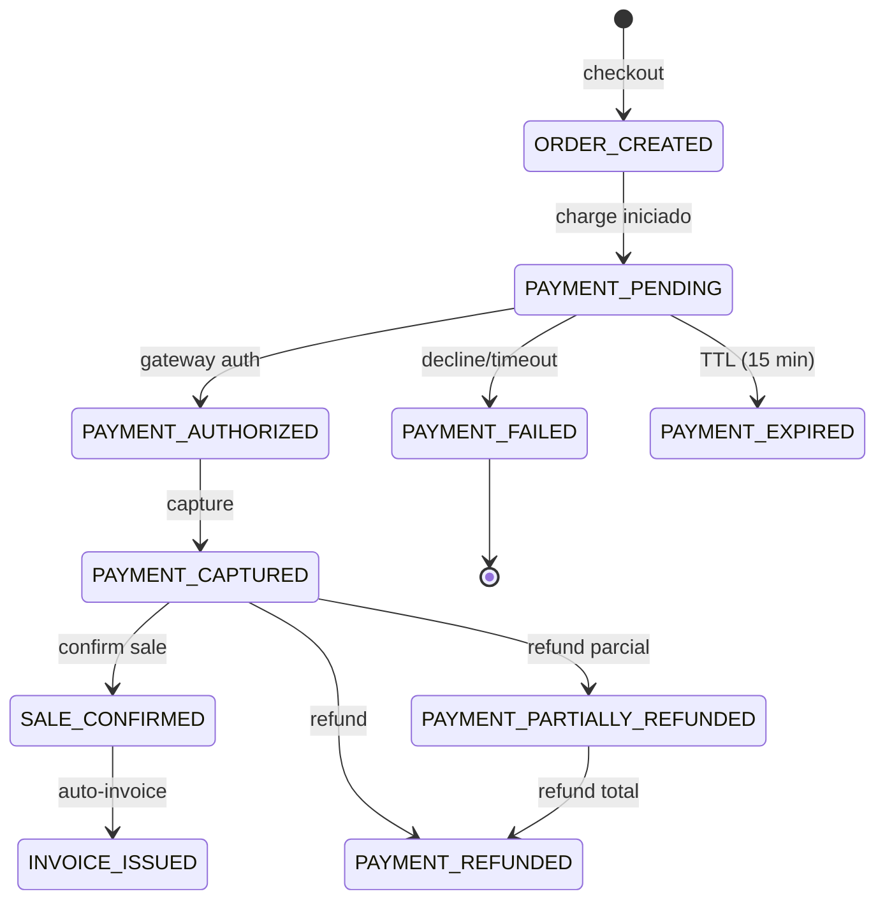

# PAYMENT STATE MACHINE — Fase 6

> Documento de referencia: `docs/engineering/07-PAYMENTS.md` (PHASE 6)
> Última actualización: 2026-08-11 · Commit: pendiente

Este documento define la **máquina de estados formal** de las entidades de
pago del sistema. Regla de oro: **cada entidad tiene UN solo campo de estado**
y las transiciones son **explícitas y validadas** — nunca se mezclan estados
de entidades distintas (un Order no puede estar `paid`, un Payment no puede
estar `completed` como venta, etc.).

## 1. Estados por entidad

| Entidad | Estados válidos |
|---|---|
| **Order** (pedido) | `draft`, `pending`, `confirmed`, `cancelled`, `completed` |
| **Payment** (payment_transactions) | `pending`, `authorized`, `captured`, `failed`, `cancelled`, `expired`, `refunded`, `partially_refunded` |
| **Sale** (venta) | `draft`, `confirmed`, `cancelled`, `refunded` |
| **Invoice** (factura) | `draft`, `issued`, `paid`, `partially_paid`, `voided` |
| **Fulfillment** (envío) | `pending`, `processing`, `ready`, `shipped`, `delivered`, `cancelled` |

> La venta usa además `payment_status` (`pending | paid | refunded`) como
> proyección rápida del pago; la **autoridad** del estado del pago vive en
> `payment_transactions.status`.

## 2. Diagrama de transiciones



## 3. Transiciones válidas por entidad

### 3.1 Payment (`payment_transactions.status`)

| Desde | Hasta | Disparador | Validación |
|---|---|---|---|
| `pending` | `authorized` | Webhook `payment.authorized` | gateway_transaction_id presente |
| `pending` | `captured` | Charge aprobado (auth+capture en 1 paso del PSP mock) | resultado gateway `approved` |
| `authorized` | `captured` | Webhook `payment.captured` | transición válida |
| `pending` | `failed` | Charge rechazado / error de pasarela | resultado gateway `declined` |
| `authorized` | `failed` | Webhook `payment.failed` | transición válida |
| `pending` | `expired` | TTL vencido (15 min sin captura) | `expires_at < NOW()` |
| `pending` | `cancelled` | Cancelación manual pre-captura | solo desde `pending` |
| `captured` | `refunded` | Refund total | importe refund == importe total |
| `captured` | `partially_refunded` | Refund parcial | importe refund < total |
| `partially_refunded` | `refunded` | Refund total restante | suma refunds == total |

**Transiciones PROHIBIDAS** (se rechazan con `INVALID_TRANSITION`):
- `captured` → `failed` · `failed` → `captured` · `refunded` → cualquier estado
- `expired` → `captured` · `cancelled` → `captured`

### 3.2 Order
`draft → pending → confirmed → completed`; `pending → cancelled`.
`confirmed` puede volver a `cancelled` solo si el pago no fue capturado.

### 3.3 Sale
`draft → confirmed` (checkout OK, pago capturado o pendiente documentado);
`confirmed → cancelled` (con reversión de inventario);
`confirmed → refunded` (refund del pago).

> **Regla crítica**: un fallo de pago **NUNCA** deja una `sale.confirmed`.
> Si el charge es rechazado, el checkout falla ANTES de crear la venta.

### 3.4 Invoice
`draft → issued` (auto-invoice tras venta confirmada);
`issued → paid` (pago capturado) · `issued → partially_paid` (pago parcial);
`issued → voided` (solo si no hubo pago).

### 3.5 Fulfillment
`pending → processing → ready → shipped → delivered`; `cancelled` desde
cualquier estado pre-`shipped`.

## 4. Implementación

### 4.1 Valores en código (`payment-service/src/domain/index.js`)

```js
export const TRANSACTION_STATUSES = {
  PENDING: 'pending',
  AUTHORIZED: 'authorized',
  CAPTURED: 'captured',          // antes 'completed' (migración 074)
  FAILED: 'failed',
  CANCELLED: 'cancelled',
  EXPIRED: 'expired',
  REFUNDED: 'refunded',
  PARTIALLY_REFUNDED: 'partially_refunded',
};
```

### 4.2 Transiciones validadas en el dominio

Los métodos del agregado `PaymentTransaction` validan el estado actual:

| Método | Solo desde | Nuevo estado |
|---|---|---|
| `authorize()` | `pending` | `authorized` |
| `capture()` | `pending`, `authorized` | `captured` |
| `fail(reason)` | `pending`, `authorized` | `failed` |
| `cancel()` | `pending` | `cancelled` |
| `expire()` | `pending` | `expired` |
| `partialRefund()` | `captured` | `partially_refunded` |
| `refund()` | `captured`, `partially_refunded` | `refunded` |

Cualquier otra transición lanza `INVALID_TRANSITION`.

### 4.3 TTL de expiración
Cuando el gateway responde `pending`, la transacción recibe
`expires_at = NOW() + 15 min`. Un job/webhook posterior con estado `expired`
solo aplica si `expires_at` ya venció.

### 4.4 Webhooks de pago (firma + idempotencia + replay)

- Endpoint: `POST /api/payments/webhooks/gateway` (sin auth de usuario;
  autenticado por firma HMAC).
- Cabecera `x-webhook-signature: sha256=<hmac-sha256(secret, rawBody)>`.
- Idempotencia: `event.id` deduplicado en `payment_webhook_events`
  (un mismo evento procesado una sola vez → no-op).
- Replay protection: eventos con `created_at` más de 5 min en el pasado se
  rechazan con `WEBHOOK_REPLAY_REJECTED`.

Eventos soportados: `payment.authorized`, `payment.captured`, `payment.failed`,
`payment.refunded`, `payment.partially_refunded`, `payment.expired`.

## 5. Criterios de aceptación (verificados por `run-payment-suite.mjs`)

- [x] Estados correctos en todas las transiciones probadas
- [x] Webhook duplicado = no-op (dedup por event_id)
- [x] Firma inválida → 401; replay (evento viejo) → rechazado
- [x] Fallo de pago NUNCA deja `sale.confirmed`
- [x] POS cash no pasa por la pasarela (sin token → captura directa)
- [ ] 54/54 E2E PASS (validación tras la fase)
