# Rediseño Completo del Sistema

## 📋 Índice

1. [Landing Page (Pública)](#landing-page)
2. [Autenticación (Auth)](#autenticación)
3. [Catálogo Público de Productos](#catálogo-público)
4. [Carrito de Compras](#carrito-de-compras)
5. [Área de Cuenta del Cliente](#área-de-cuenta-del-cliente)
6. [Layout del Dashboard](#layout-del-dashboard)
7. [Dashboard Principal](#dashboard-principal)
8. [Productos (Admin)](#productos-admin)
9. [Categorías](#categorías)
10. [Inventario](#inventario)
11. [Punto de Venta (POS)](#punto-de-venta-pos)
12. [Ventas](#ventas)
13. [Compras](#compras)
14. [Clientes](#clientes)
15. [Facturas](#facturas)
16. [Proveedores](#proveedores)
17. [Reportes](#reportes)
18. [E-commerce (Admin)](#ecommerce-admin)
19. [Administración del Sistema](#administración-del-sistema)
20. [Notificaciones](#notificaciones)
21. [Perfiles](#perfiles)
22. [Componentes Compartidos Reutilizables](#componentes-compartidos)
23. [Diagrama General de Rutas y Navegación](#diagrama-de-rutas)

---

## Landing Page

**Ruta:** `/`
**Archivo:** `src/views/LandingView.vue`
**Layout:** `blank` (sin sidebar ni navbar del dashboard)

### Estructura General

```
┌──────────────────────────────────────────────────┐
│  AppNavBar (barra de navegación pública)         │
├──────────────────────────────────────────────────┤
│  FloatingBanner (banner flotante sticky)         │
├──────────────────────────────────────────────────┤
│                                                  │
│  HeroSection (hero dinámico con slider)          │
│  ──────────────────────────────────────────────  │
│  ProductShowcase (3 productos destacados)         │
│  ──────────────────────────────────────────────  │
│  FeaturedReviews (3 reseñas destacadas)           │
│  ──────────────────────────────────────────────  │
│  OfferShowcase (3 ofertas con descuento)          │
│  ──────────────────────────────────────────────  │
│  ContactForm (formulario de contacto)             │
│                                                  │
├──────────────────────────────────────────────────┤
│  AppFooter                                       │
│  WhatsAppWidget (flotante)                       │
└──────────────────────────────────────────────────┘
```

### Secciones Internas

#### 1. Fondo WebGL Shader
- **Canvas GLSL** con efecto wave/nebula en tiempo real
- Colores: primary (#37094A), secondary (#7B4F7D), accent (#4F2361)
- Animación continua con `requestAnimationFrame` + interacción mouse (glow)
- ResizeObserver para responsive
- Se destruye en `onUnmounted`

#### 2. AppNavBar (Navegación Pública)
- **Links:** Inicio, Productos, Reseñas, Contacto
- **Detección de ruta activa:** `isProductRoute`, `isHomeRoute`
- **Estado activo:** basado en ruta O IntersectionObserver para scroll
- **Logo** como router-link a `/`
- **Iconos:** usuario (login), carrito (cart)

#### 3. HeroSection
- **Slides dinámicos** desde Supabase (ecommerce service)
- **Contenido:** badge, título línea 1 y 2, descripción, 2 botones CTA
- **Imágenes:** top-left (w-48), main (w-full h-[500px]), bottom-right (w-56 h-56 circular)
- **Efectos:** tilt 3D, glass-card, magnetic buttons, crossfade entre slides
- **Slider:** dots + flechas atrás/siguiente
- **Estados:** loading (skeleton completo), success, error

#### 4. ProductShowcase
- **Grid de 3 tarjetas** de productos destacados
- **Cada tarjeta:** imagen (con fallback `inventory_2`), nombre, precio, badge "Featured", categoría
- **Botón "Add to Cart"** con loading state
- **Eventos:** `view-all`, `added-to-cart`, `error`
- **Estados:** loading (3 skeleton cards), error (con retry), empty, success

#### 5. FeaturedReviews
- **Grid de 3 reseñas** aprobadas, la central destacada sin `-translate-y-24`
- **Estrellas** con iconos filled/outlined
- **Avatar + nombre** del cliente + comentario
- Scroll animation con delay progresivo

#### 6. OfferShowcase
- **Grid de ofertas** con badge animado de descuento (`pulse-discount`)
- **Countdown** de días restantes por oferta
- **Efecto 3D tilt** en hover
- **Link** al detalle del producto
- **Fallback** a productos destacados si no hay ofertas activas
- **Estados:** loading (skeleton), error (retry), empty, success

#### 7. ContactForm
- **Campos:** nombre, email, teléfono, mensaje (textarea)
- **Efecto:** aurora background con partículas
- **Alertas:** success (check_circle), error
- **Validación** de campos requeridos
- **Envío** via API

#### 8. FloatingBanner
- Banner sticky (top o bottom) configurable desde admin
- **Contenido:** título, subtítulo, imagen, enlace
- **Fechas** de inicio y fin de vigencia

#### 9. WhatsAppWidget
- Botón flotante de WhatsApp
- **Animación bounce-in** con anime.js

#### 10. AppFooter
- Links de navegación (# anchors)
- Redes sociales
- Información de contacto

#### 11. Efectos Globales de la Landing
- `entrance-reveal`: animación scroll con IntersectionObserver
- `tilt-container` / `glass-card`: efecto 3D tilt con glare
- `magnetic-btn`: botones que siguen el mouse
- Partículas flotantes CSS
- `mouse-light`: spotlight que sigue al cursor
- Animaciones GSAP (ScrollTrigger)
- Animaciones anime.js (bounce, letter stagger)

---

## Autenticación

### LoginView
**Ruta:** `/login`
**Archivo:** `src/views/auth/LoginView.vue`
**Layout:** blank

**Estructura:**
```
┌──────────────────────────────────────┐
│  Fondo WebGL Shader                   │
│  ┌────────────────────────────────┐  │
│  │  Logo + Branding               │  │
│  │  ────────────────────────────  │  │
│  │  Input Email                   │  │
│  │  Input Password + toggle eye   │  │
│  │  Checkbox "Recordarme"         │  │
│  │  Botón "Ingresar" (loading)    │  │
│  │  Link "¿Olvidaste contraseña?" │  │
│  │  Link "Crear cuenta"           │  │
│  └────────────────────────────────┘  │
└──────────────────────────────────────┘
```

**Formulario:** email (type=email), password (type=password con toggle visibility), checkbox recordarme
**Estados:** loading (spinner en botón), error (mensaje animado con Transition `error-fade`)
**Estilo:** glass-card con backdrop-blur, tema oscuro (#151215)

### RegisterView
**Ruta:** `/register`
**Archivo:** `src/views/auth/RegisterView.vue`
**Layout:** blank

**Formulario:** nombre completo, email, teléfono, contraseña (min 8 chars), confirmar contraseña
**Estados:** loading (spinner), error, success
**Estilo:** glass-card, fondo WebGL, enlace a login

### ForgotPasswordView
**Ruta:** `/forgot-password`
**Archivo:** `src/views/auth/ForgotPasswordView.vue`
**Layout:** blank

**Formulario:** input email, botón "Enviar Instrucciones"
**Estados:** loading, error, success
**Estilo:** glass-card, fondo WebGL

### ResetPasswordView
**Ruta:** `/reset-password`
**Archivo:** `src/views/auth/ResetPasswordView.vue`
**Layout:** blank

**Formulario:** nueva contraseña (con toggle), confirmar contraseña, botón "Restablecer"
**Token:** leído de query params de la URL
**Estados:** loading, error, success

---

## Catálogo Público

### ProductsCatalogView
**Ruta:** `/products`
**Archivo:** `src/views/products/ProductsCatalogView.vue`
**Layout:** blank

**Estructura:**
```
┌──────────────────────────────────────────────┐
│  AppNavBar                                    │
├──────────────────────────────────────────────┤
│  Fondo WebGL Shader                           │
│  ┌────────────────────────────────────────┐  │
│  │  Search Input + Category Pills + Sort  │  │
│  ├────────────────────────────────────────┤  │
│  │  Grid de Productos (1-4 col)           │  │
│  │  ┌────┐ ┌────┐ ┌────┐ ┌────┐          │  │
│  │  │Card│ │Card│ │Card│ │Card│          │  │
│  │  └────┘ └────┘ └────┘ └────┘          │  │
│  ├────────────────────────────────────────┤  │
│  │  Paginación (Previous/Next + números)  │  │
│  └────────────────────────────────────────┘  │
└──────────────────────────────────────────────┘
```

**Formularios:** input de búsqueda con debounce, select de ordenamiento, pills de categorías
**Listas:** grid de tarjetas de productos (responsive: 1→2→3→4 columnas)
**Paginación:** 16 productos/página, URL query params sincronizados
**Estados:** loading (8 skeleton cards), empty (icono + "No products found" + botón "Clear filters"), error (retry), success

### ProductPublicDetailView
**Ruta:** `/products/:slug`
**Archivo:** `src/views/products/ProductPublicDetailView.vue`
**Layout:** blank

**Estructura:**
```
┌──────────────────────────────────────────────┐
│  AppNavBar + FloatingBanner                   │
├──────────────────────────────────────────────┤
│  Fondo WebGL                                  │
│  ┌──────────────┐ ┌────────────────────────┐ │
│  │ Image Gallery│ │ Información Producto   │ │
│  │ [Thumbnails] │ │ Nombre, Precio, Desc.  │ │
│  │              │ │ Selector Cantidad (+/-) │ │
│  │              │ │ Badge Featured/% OFF   │ │
│  │              │ │ Botón "Add to Cart"    │ │
│  └──────────────┘ └────────────────────────┘ │
│  ┌────────────────────────────────────────┐  │
│  │  Reseñas del Producto (estrellas +     │  │
│  │  comentarios)                           │  │
│  └────────────────────────────────────────┘  │
└──────────────────────────────────────────────┘
```

**Formularios:** selector de cantidad (1-99 con +/-), botón "Add to Cart"
**Modales:** ninguno
**Listas:** galería de imágenes, lista de reseñas
**Estados:** loading (spinner), error (con back link), success

### OffersProductsView
**Ruta:** `/offers`
**Archivo:** `src/views/products/OffersProductsView.vue`
**Layout:** blank

**Estructura:** similar a ProductsCatalogView pero solo ofertas
**Listas:** grid de 3 columnas con precio original tachado, % descuento, badge "OFFER"
**Estados:** loading (skeleton), empty, error, success

---

## Carrito de Compras

### CartView
**Ruta:** `/cart`
**Archivo:** `src/views/account/CartView.vue`
**Layout:** blank (con AppNavBar)

**Estructura:**
```
┌──────────────────────────────────────────────┐
│  AppNavBar                                    │
├──────────────────────────────────────────────┤
│  ┌───────── Items del Carrito ───────────┐   │
│  │  ┌──────────────────────────────────┐ │   │
│  │  │ Img | Nombre | SKU | Qty | Prec │ │   │
│  │  │              (+/-) | Subtotal    │ │   │
│  │  │              [Eliminar]          │ │   │
│  │  └──────────────────────────────────┘ │   │
│  │  ... más items ...                    │   │
│  └───────────────────────────────────────┘   │
│  ┌──────────── Resumen ──────────────────┐   │
│  │  Subtotal: $X                         │   │
│  │  IVA (19%): $X                        │   │
│  │  Envío: $X                            │   │
│  │  Total: $X                            │   │
│  │  [Vaciar Carrito]  [Proceder al Pago] │   │
│  └───────────────────────────────────────┘   │
└──────────────────────────────────────────────┘
```

**Formularios:** controles de cantidad (+/-) por item, botones "Eliminar", "Vaciar carrito", "Proceder al pago"
**Listas:** lista de items del carrito con imagen, nombre, SKU, precio unitario, cantidad, subtotal
**Estados:** loading, error, empty, success

---

## Área de Cuenta del Cliente

### AccountLayout
**Ruta:** `/account/*`
**Archivo:** `src/views/account/AccountLayout.vue`

**Estructura:**
```
┌──────────────────────────────────────────────┐
│  Navbar (logo, carrito, logout)               │
├────────────────────┬─────────────────────────┤
│  Sidebar           │  Router-View            │
│  ─────────         │  (contenido dinámico)    │
│  • Mi Perfil       │                         │
│  • Mis Compras     │                         │
│  • Crédito         │                         │
│  • Notificaciones  │                         │
│                    │                         │
│  Info Usuario      │                         │
└────────────────────┴─────────────────────────┘
```

### ProfileView (Cuenta)
**Ruta:** `/account/profile`
**Archivo:** `src/views/account/ProfileView.vue`

**Formulario (modo edición):** Nombre, Teléfono, Tipo Documento (select), Número Documento, Dirección, Ciudad, Estado, Código Postal
**Listas:** grid de información del perfil (tarjetas de datos)
**Estados:** loading, error, empty, success
**Características:** toggle edición/visualización, avatar

### PurchasesView (Cuenta)
**Ruta:** `/account/purchases`
**Archivo:** `src/views/account/PurchasesView.vue`

**Listas:** historial de compras del cliente con items, subtotales, badges de estado, paginación
**Estados:** loading, error, empty
**Botones:** "Comprar de nuevo"

### CreditView
**Ruta:** `/account/credit`
**Archivo:** `src/views/account/CreditView.vue`

**Formulario:** número de cuenta, tipo, tasa de interés, estado
**Estructura:** tarjeta de gradiente con saldo disponible, grid de información financiera
**Estados:** loading, error, empty

### NotificationsView (Cuenta)
**Ruta:** `/account/notifications`
**Archivo:** `src/views/account/NotificationsView.vue`

**Formularios:** toggles de preferencias (email/WhatsApp para notificaciones, confirmación de compra, actualizaciones de envío)
**Listas:** NotificationsFeed component con scroll infinito
**Tabs:** "Actividad Reciente" / "Preferencias"

---

## Layout del Dashboard

### AppLayout
**Archivo:** `src/components/layout/AppLayout.vue`

**Estructura:**
```
┌──────────────┬───────────────────────────────┐
│              │  Navbar                        │
│   Sidebar    │  (breadcrumb, notificaciones,  │
│  (64/256px)  │   usuario, dark mode toggle)   │
│              ├───────────────────────────────┤
│   Logo       │                               │
│              │   Router-View                 │
│   Menú       │   (con keep-alive +           │
│   Items      │    transiciones page)         │
│              │                               │
│   Perfil     │                               │
│   Logout     │                               │
└──────────────┴───────────────────────────────┘
```

**Sidebar:** colapsable (64px / 256px) con animación suave. Items: Dashboard, Productos, Categorías, Inventario, POS, Ventas, Compras, Clientes, Facturas, Reportes, Ecommerce, Admin. Visibilidad por permisos.
**Navbar:** breadcrumb dinámico, dropdown de notificaciones, avatar de usuario, dark mode toggle

---

## Dashboard Principal

### DashboardView
**Ruta:** `/app/dashboard`
**Archivo:** `src/views/DashboardView.vue`

**Estructura:**
```
┌──────────────────────────────────────────────┐
│  6 StatCards (KPIs)                           │
│  ┌──────┐ ┌──────┐ ┌──────┐ ┌──────┐       │
│  │Ventas│ │Ventas│ │Prod. │ │Total │       │
│  │ Hoy  │ │  Mes  │ │Bajos │ │Prod. │       │
│  └──────┘ └──────┘ └──────┘ └──────┘       │
│  ┌──────┐ ┌──────┐                          │
│  │Client│ │User. │                          │
│  └──────┘ └──────┘                          │
├──────────────────────────────────────────────┤
│  Gráfico Ventas Hoy    │  Gráfico Ventas Mes │
│  (Chart.js barras)     │  (Chart.js línea)   │
├──────────────────────────────────────────────┤
│  Tendencia 7 Días      │  Categorías (Donut) │
│  (Chart.js línea)      │  (Chart.js dona)    │
├──────────────────────────────────────────────┤
│  Actividades Recientes │  Top Productos      │
│  (lista con iconos)    │  (ranking 1-5)      │
├──────────────────────────────────────────────┤
│  Ventas Recientes      │  Alertas Stock      │
│  (últimas 5)           │  (sin stock/bajo)   │
└──────────────────────────────────────────────┘
```

**Formularios:** ninguno (solo visualización)
**Modales:** ninguno
**Listas:** actividades recientes (icono, acción, entidad, usuario, fecha), top 10 productos más vendidos, ventas recientes, alertas de inventario
**Gráficos:** Chart.js (bar, line, doughnut) con registerables
**Estados:** loading, error, success

---

## Productos (Admin)

### ProductListView
**Ruta:** `/app/products`
**Archivo:** `src/views/products/ProductListView.vue`

**Estructura:**
```
┌──────────────────────────────────────────────┐
│  PageHeader (título + acciones)               │
│  ┌──────── Search ────────┐ [Nuevo Producto] │
├──────────────────────────────────────────────┤
│  FilterBar (Filtrar | Ordenar | Vista)        │
│  ┌── Filtros Expandibles ──────────────────┐ │
│  │  Categoría | Estado | Rango Precio slider│ │
│  │  [Aplicar] [Limpiar]                     │ │
│  └──────────────────────────────────────────┘ │
├──────────────────────────────────────────────┤
│  ┌────────── DataTable ────────────────────┐ │
│  │  Img | Nombre | SKU | Cat | Prec | Stk │ │
│  │  ... filas ...                          │ │
│  └─────────────────────────────────────────┘ │
│  ó                                            │
│  ┌────────── Grid View ────────────────────┐ │
│  │  ┌────┐ ┌────┐ ┌────┐ ┌────┐           │ │
│  │  │Card│ │Card│ │Card│ │Card│           │ │
│  │  └────┘ └────┘ └────┘ └────┘           │ │
│  └─────────────────────────────────────────┘ │
│  Paginación                                   │
├──────────────────────────────────────────────┤
│  Mobile: Cards con Acordeón                   │
└──────────────────────────────────────────────┘
```

**Vistas:** tabla (desktop) / grid (desktop) / cards con acordeón (mobile)
**Formularios:** input de búsqueda con debounce, filtros (categoría select, estado select, rango de precio slider dual)
**Modales:** panel de filtros expandible
**Listas:** DataTable con columnas: Imagen, Nombre, SKU, Categoría, Precio, Stock, Estado, Acciones (ver, editar)
**Paginación:** servidor-side
**Estados:** loading, empty, success
**Características:** toggle vista tabla/grid, ordenamiento por nombre y precio, filtros con indicador de activos, permisos CRUD

### ProductFormView
**Ruta:** `/app/products/create` | `/app/products/:id/edit`
**Archivo:** `src/views/products/ProductFormView.vue`

**Estructura del Formulario:**
```
┌──────────────────────────────────────────────┐
│  PageHeader "Nuevo Producto" / "Editar"       │
├──────────────────────────────────────────────┤
│  ──── SECCIÓN: Información Básica ────────  │
│  Nombre [____________________]               │
│  SKU [____] (uppercase)  Código Barras [___] │
│  Categoría [ Select con jerarquía ▼]         │
│  Marca [____________________]                │
├──────────────────────────────────────────────┤
│  ──── SECCIÓN: Precios y Stock ───────────  │
│  Precio [$____]  Costo [$____]  Impuesto [%]│
│  Stock [____]  Stock Mínimo [____]           │
│  Ubicación [____________________]            │
├──────────────────────────────────────────────┤
│  ──── SECCIÓN: Imágenes ──────────────────  │
│  ┌── Drop Zone ────────────┐  ┌─┐ ┌─┐ ┌─┐ │
│  │  Arrastra imágenes aquí │  │x│ │x│ │x│ │
│  │  o haz clic para subir  │  └─┘ └─┘ └─┘ │
│  └─────────────────────────┘  previsualiz.  │
├──────────────────────────────────────────────┤
│  ──── SECCIÓN: Estado ────────────────────  │
│  [Activo] [Destacado]                       │
│  Descripción [textarea]                     │
├──────────────────────────────────────────────┤
│  [Guardar] [Cancelar]                        │
└──────────────────────────────────────────────┘
```

**Campos:** nombre, SKU (uppercase automático), código de barras, categoría (select jerárquico con indentación), marca, precio, costo, impuesto, stock, stock mínimo, ubicación, upload múltiple de imágenes (drag & drop con preview), toggle activo/destacado, descripción (textarea)
**Modales:** alert de error/success
**Validaciones:** campos requeridos, SKU único, formato precio
**Características:** modo crear/editar, drag & drop para imágenes con vistas previas, select con flecha SVG personalizada

### ProductDetailView
**Ruta:** `/app/products/:id`
**Archivo:** `src/views/products/ProductDetailView.vue`

**Estructura:**
```
┌──────────────────────────────────────────────┐
│  PageHeader + [Editar Producto]               │
├──────────────────────────────────────────────┤
│  ┌──────────────┐ ┌────────────────────────┐ │
│  │ Mini galería │ │ Nombre, SKU, Barcode   │ │
│  │ de imágenes  │ │ Badge: Activo/Inactivo │ │
│  │ + thumbnails │ │ Badge: Destacado       │ │
│  └──────────────┘ └────────────────────────┘ │
│  ┌──────┐ ┌──────┐ ┌──────┐ ┌──────┐       │
│  │Precio│ │ Costo│ │ Stock│ │Margen│       │
│  └──────┘ └──────┘ └──────┘ └──────┘       │
│  Descripción completa                        │
│  Categoría (breadcrumb)                      │
│  Fechas de creación/actualización            │
└──────────────────────────────────────────────┘
```

**Formularios:** ninguno (solo lectura)
**Listas:** mini galería de imágenes con thumbnails, métricas en tarjetas

---

## Categorías

### CategoryListView
**Ruta:** `/app/categories`
**Archivo:** `src/views/categories/CategoryListView.vue`

**Estructura:**
```
┌──────────────────────────────────────────────┐
│  PageHeader + [Nueva Categoría]               │
├──────────────────────────────────────────────┤
│  ┌──────── Search ─────────┐ [Filtrar]       │
├──────────────────────────────────────────────┤
│  ┌────────── DataTable ────────────────────┐ │
│  │  Nombre (icono + indentación por nivel) │ │
│  │  Slug | Estado (badge) | Acciones       │ │
│  └─────────────────────────────────────────┘ │
│  Mobile: cards                               │
│  Paginación                                  │
└──────────────────────────────────────────────┘
```

**Modal — Crear/Editar Categoría:**
```
┌────────────────────────────────┐
│  ✕  Nueva Categoría            │
├────────────────────────────────┤
│  Nombre [________________]     │
│  Slug [________________]      │
│  Descripción [textarea]       │
│  Categoría Padre [ Select ▼]  │
│  Estado [ Activo ]            │
├────────────────────────────────┤
│  [Cancelar] [Guardar]          │
└────────────────────────────────┘
```

**Modal — ConfirmDialog para eliminar:**
```
┌────────────────────────────────┐
│  ⚠ Confirmar Acción           │
├────────────────────────────────┤
│  ¿Estás seguro de eliminar     │
│  esta categoría?               │
├────────────────────────────────┤
│  [Cancelar] [Eliminar]         │
└────────────────────────────────┘
```

**Formularios:** input de búsqueda
**Modales:** modal crear/editar (nombre, slug, descripción, categoría padre, estado), ConfirmDialog para eliminar
**Listas:** DataTable con nombre (icono + indentación por nivel jerárquico), slug, estado (badge), acciones (editar/eliminar)
**Estados:** loading, empty, success

---

## Inventario

### InventoryView (Vista General)
**Ruta:** `/app/inventory`
**Archivo:** `src/views/inventory/InventoryView.vue`

**Estructura:**
```
┌──────────────────────────────────────────────┐
│  InventoryTabs (navegación secundaria)        │
│  [General] [Movimientos] [Kardex] [Ajustes]  │
│  [Transferencias]                             │
├──────────────────────────────────────────────┤
│  ┌──────┐ ┌──────┐ ┌──────┐                  │
│  │Valor │ │Stock │ │Agot. │                  │
│  │Total │ │ Bajo │ │      │                  │
│  └──────┘ └──────┘ └──────┘                  │
├──────────────────────────────────────────────┤
│  Search [________________]  Categoría [▼]    │
│  [Exportar]                                   │
├──────────────────────────────────────────────┤
│  InventoryTable (DataTable)                   │
│  Producto | SKU | Stock | Stock Mín. | Estado│
│  (verde/ámbar/rojo según nivel)              │
└──────────────────────────────────────────────┘
```

**Formularios:** input de búsqueda, filtro por categoría, botón "Exportar"

### MovementsView
**Ruta:** `/app/inventory/movements`
**Archivo:** `src/views/inventory/MovementsView.vue`

**Estructura:**
```
┌──────────────────────────────────────────────┐
│  InventoryTabs                                │
├──────────────────────────────────────────────┤
│  Filtro tipo: [Todos | Entrada | Salida |    │
│               Ajuste | Transferencia]         │
├──────────────────────────────────────────────┤
│  DataTable: Producto | Tipo (badge) | Cant.  │
│            | Referencia | Fecha               │
│  Mobile: cards                                │
└──────────────────────────────────────────────┘
```

**Modal — Detalle de Movimiento:**
```
┌────────────────────────────────┐
│  ✕  Detalle del Movimiento     │
├────────────────────────────────┤
│  Producto ID: 123              │
│  Nombre: Producto X            │
│  Tipo: Entrada de Stock        │
│  Cantidad: +50                  │
│  Referencia: ORD-001           │
│  Fecha: 2024-01-15 10:30       │
│  Notas: texto...               │
└────────────────────────────────┘
```

**Formularios:** select de filtro por tipo de movimiento
**Modales:** modal de detalle del movimiento al hacer click

### KardexView
**Ruta:** `/app/inventory/kardex/:productId?`
**Archivo:** `src/views/inventory/KardexView.vue`

**Estructura:**
```
┌──────────────────────────────────────────────┐
│  InventoryTabs                                │
├──────────────────────────────────────────────┤
│  Producto [ Select con búsqueda ▼]            │
├──────────────────────────────────────────────┤
│  DataTable: Fecha | Tipo | Entrada (+) |     │
│            Salida (-) | Saldo | Referencia    │
│  (colores verde/rojo para entrada/salida)    │
└──────────────────────────────────────────────┘
```

**Formularios:** selector de producto con búsqueda
**Listas:** DataTable con saldo acumulado (running balance)

### AdjustmentsView
**Ruta:** `/app/inventory/adjustments`
**Archivo:** `src/views/inventory/AdjustmentsView.vue`

**Estructura:**
```
┌──────────────────────────────────────────────┐
│  InventoryTabs                                │
├──────────────────────────────────────────────┤
│  [Nuevo Ajuste]                               │
├──────────────────────────────────────────────┤
│  DataTable: Producto | Tipo (badge) | Cant.  │
│            | Motivo | Fecha                   │
└──────────────────────────────────────────────┘
```

**Modal — Nuevo Ajuste:**
```
┌────────────────────────────────┐
│  ✕  Nuevo Ajuste de Inventario │
├────────────────────────────────┤
│  Producto [ Select ▼]          │
│  Tipo: [Incremento] [Decremento]│
│  Cantidad [___] (mín 1)        │
│  Motivo [textarea]             │
├────────────────────────────────┤
│  [Cancelar] [Guardar]          │
└────────────────────────────────┘
```

**Formularios:** modal de creación con select de producto, tipo (incremento/decremento), cantidad, motivo (textarea)
**Modales:** modal de nuevo ajuste

### TransfersView
**Ruta:** `/app/inventory/transfers`
**Archivo:** `src/views/inventory/TransfersView.vue`

**Modal — Nueva Transferencia:**
```
┌────────────────────────────────┐
│  ✕  Nueva Transferencia        │
├────────────────────────────────┤
│  Producto [ Select ▼]          │
│  Origen [ Select ▼]            │
│  Destino [ Select ▼]           │
│  Cantidad [___]                │
├────────────────────────────────┤
│  [Cancelar] [Transferir]       │
└────────────────────────────────┘
```

**Listas:** DataTable: Producto, Origen, Destino, Cantidad, Fecha
**Modales:** modal de nueva transferencia

---

## Punto de Venta (POS)

### POSView
**Ruta:** `/app/pos`
**Archivo:** `src/views/sales/POSView.vue`

**Estructura (2 paneles):**
```
┌─────────────────────────────┬────────────────┐
│  PANEL IZQUIERDO            │ PANEL DERECHO   │
│                             │ (Carrito)       │
│  ┌── Búsqueda ──────────┐  │ ┌──────────────┐│
│  │ [Buscar productos..]  │  │ │ Cliente      ││
│  └───────────────────────┘  │ │ [Buscar ▼]   ││
│                             │ ├──────────────┤│
│  Grid de Productos (2-4col)│ │ Items        ││
│  ┌────┐ ┌────┐ ┌────┐     │ │ ┌──┐ ┌──┐    ││
│  │Card│ │Card│ │Card│     │ │ │P1│ │P2│    ││
│  └────┘ └────┘ └────┘     │ │ └──┘ └──┘    ││
│  ┌────┐ ┌────┐ ┌────┐     │ │ Cant: 2      ││
│  │Card│ │Card│ │Card│     │ │ Subtotal: $X ││
│  └────┘ └────┘ └────┘     │ ├──────────────┤│
│                             │ │ Subtotal    ││
│                             │ │ IVA (19%)   ││
│                             │ │ Total       ││
│                             │ ├──────────────┤│
│                             │ │ Pago: [▼]   ││
│                             │ │ [Cobrar]    ││
│                             │ └──────────────┘│
└─────────────────────────────┴────────────────┘
```

**Formularios:** input de búsqueda de productos, carrito lateral con controles de cantidad (+/-) y eliminar, selector de cliente con búsqueda y dropdown, selector de tipo de pago, botón "Cobrar"
**Modales:** dropdown de búsqueda de clientes
**Listas:** grid de productos (imagen, nombre, precio, stock), carrito con items, cantidades y subtotales
**Estados:** loading, empty, success
**Características:** cálculos en tiempo real, diseño responsivo, stock visible

---

## Ventas

### SaleListView
**Ruta:** `/app/sales`
**Archivo:** `src/views/sales/SaleListView.vue`

**Estructura:**
```
┌──────────────────────────────────────────────┐
│  KPIs: Ventas Hoy | Total Gen. | Ticket Prom │
│        | Ventas Mes                           │
├──────────────────────────────────────────────┤
│  Search + [Nueva Venta]                       │
├──────────────────────────────────────────────┤
│  Panel de Filtros expandible                  │
├──────────────────────────────────────────────┤
│  DataTable: Factura | Cliente | Items | Total│
│            | Pago | Estado | Cajero | Fecha   │
│  Mobile: cards                                │
│  Paginación servidor                          │
└──────────────────────────────────────────────┘
```

**Formularios:** input de búsqueda, panel de filtros expandible
**Listas:** DataTable con KPIs financieros, badges de estado (completada/cancelada/pendiente)

### SaleFormView
**Ruta:** `/app/sales/create`
**Archivo:** `src/views/sales/SaleFormView.vue`

**Estructura del Formulario:**
```
┌──────────────────────────────────────────────┐
│  PageHeader "Nueva Venta"                     │
├──────────────────────────────────────────────┤
│  Cliente [ Select con búsqueda ▼]             │
│           [✓] Cliente General                 │
│  Tipo Pago: [Efectivo] [Tarjeta] [Transf.]   │
│             [Crédito]                         │
├──────────────────────────────────────────────┤
│  ──── Productos ──────────────────────────  │
│  ┌────────────────────────────────────────┐ │
│  │ Producto | Cant | P.Unit | Subtotal  ✕│ │
│  │ [Select ▼] | [___] | [$___] | [$___] │ │
│  ├────────────────────────────────────────┤ │
│  │ Producto | Cant | P.Unit | Subtotal  ✕│ │
│  │ [Select ▼] | [___] | [$___] | [$___] │ │
│  └────────────────────────────────────────┘ │
│  [+ Agregar Producto]                       │
├──────────────────────────────────────────────┤
│  Subtotal: $X                                │
│  Impuesto: $X                                │
│  Descuento: [$___]                           │
│  Total: $X                                   │
├──────────────────────────────────────────────┤
│  [Cancelar] [Completar Venta]                │
└──────────────────────────────────────────────┘
```

**Formularios:** selector de cliente, tipo de pago (cash/card/transfer/credit), filas dinámicas de productos (selector + cantidad + precio unitario + subtotal + eliminar), botón "Agregar Producto", campos de subtotal/impuesto/descuento/total
**Modales:** alert de error
**Listas:** lista dinámica de items del carrito
**Características:** cálculos automáticos, IVA configurable, validación de stock

### SaleDetailView
**Ruta:** `/app/sales/:id`
**Archivo:** `src/views/sales/SaleDetailView.vue`

**Estructura:**
```
┌──────────────────────────────────────────────┐
│  Badge Estado | [Imprimir Factura]            │
├──────────────────────────────────────────────┤
│  ┌── Datos Cliente ──┐ ┌── Datos Venta ──┐  │
│  │ Nombre            │ │ Factura #        │  │
│  │ Documento         │ │ Fecha            │  │
│  │ Email             │ │ Cajero           │  │
│  └───────────────────┘ │ Tipo Pago        │  │
│                         └──────────────────┘  │
├──────────────────────────────────────────────┤
│  Tabla de Items:                              │
│  Img | Producto | SKU | Cant | P.Unit | Subt │
├──────────────────────────────────────────────┤
│  Totales: Subtotal | Impuesto | Total        │
└──────────────────────────────────────────────┘
```

**Formularios:** ninguno (solo lectura), botón "Imprimir Factura"
**Listas:** tabla de items con imagen, SKU/barcode, cantidad, precio unitario, subtotal

---

## Compras

### PurchaseListView
**Ruta:** `/app/purchases`
**Archivo:** `src/views/purchases/PurchaseListView.vue`

**Estructura:**
```
┌──────────────────────────────────────────────┐
│  PageHeader + [Nueva Compra]                  │
├──────────────────────────────────────────────┤
│  DataTable: Orden | Proveedor | Total |      │
│            Estado | Fecha                     │
│  Mobile: cards con avatar proveedor           │
│  Paginación servidor                          │
└──────────────────────────────────────────────┘
```

**Formularios:** botón "Nueva Compra"
**Listas:** DataTable con badges de estado (Recibida/Cancelada/Pendiente)

### PurchaseFormView
**Ruta:** `/app/purchases/create`
**Archivo:** `src/views/purchases/PurchaseFormView.vue`

**Estructura del Formulario:**
```
┌──────────────────────────────────────────────┐
│  PageHeader "Nueva Orden de Compra"           │
├──────────────────────────────────────────────┤
│  Proveedor [ Select con búsqueda ▼]           │
│  Notas [textarea]                            │
├──────────────────────────────────────────────┤
│  ──── Productos ──────────────────────────  │
│  ┌────────────────────────────────────────┐ │
│  │ Producto       | Cant | Costo | Subt  ✕│ │
│  │ [Buscar... ▼]  | [___] | [$___] | [$] │ │
│  │ ┌─ Resultados ─────────────────┐       │ │
│  │ │ Prod A - SKU123 - $10        │       │ │
│  │ │ Prod B - SKU456 - $15        │       │ │
│  │ └──────────────────────────────┘       │ │
│  ├────────────────────────────────────────┤ │
│  │ ... más filas ...                      │ │
│  └────────────────────────────────────────┘ │
│  [+ Agregar Producto]                       │
├──────────────────────────────────────────────┤
│  Total: $X                                   │
├──────────────────────────────────────────────┤
│  [Cancelar] [Crear Compra]                   │
└──────────────────────────────────────────────┘
```

**Formularios:** selector de proveedor, notas, filas dinámicas de productos con autocomplete (búsqueda + dropdown de resultados), cantidad, costo unitario, subtotal, botón "Agregar", total automático
**Modales:** alert de error

### PurchaseDetailView
**Ruta:** `/app/purchases/:id`
**Archivo:** `src/views/purchases/PurchaseDetailView.vue`

**Estructura:**
```
┌──────────────────────────────────────────────┐
│  Badge Estado | Fechas                        │
├──────────────────────────────────────────────┤
│  ┌── Información Proveedor ───────────────┐  │
│  │  Nombre | Contacto | RUC | Teléfono    │  │
│  │  Email | Ciudad | Dirección            │  │
│  │  Términos de Pago                      │  │
│  └────────────────────────────────────────┘  │
├──────────────────────────────────────────────┤
│  Tabla de Productos:                         │
│  Img | SKU | Producto | Cant | Costo | Subt  │
├──────────────────────────────────────────────┤
│  Totales | Notas                              │
└──────────────────────────────────────────────┘
```

**Formularios:** ninguno (solo lectura)
**Listas:** tabla de productos con imagen, SKU/barcode, cantidad, costo unitario, subtotal

---

## Clientes

### ClientListView
**Ruta:** `/app/clients`
**Archivo:** `src/views/clients/ClientListView.vue`

**Estructura:**
```
┌──────────────────────────────────────────────┐
│  PageHeader                                   │
├──────────────────────────────────────────────┤
│  DataTable: Nombre | Documento | Email |     │
│            Teléfono | Estado (badge)          │
│  Mobile: cards con inicial del nombre        │
│  Paginación servidor                          │
└──────────────────────────────────────────────┘
```

**Formularios:** ninguno
**Listas:** DataTable con badges de estado (Activo/Inactivo)

### ClientDetailView
**Ruta:** `/app/clients/:id`
**Archivo:** `src/views/clients/ClientDetailView.vue`

**Estructura:**
```
┌──────────────────────────────────────────────┐
│  [Volver]                                     │
├──────────────────────────────────────────────┤
│  ┌── Info Cliente ─────────────────────────┐ │
│  │  Nombre | Documento | Email | Teléfono │ │
│  │  Dirección | Fecha Registro            │ │
│  └────────────────────────────────────────┘ │
├──────────────────────────────────────────────┤
│  DataTable: Historial de Compras              │
│  Factura | Total | Estado | Fecha             │
└──────────────────────────────────────────────┘
```

**Formularios:** ninguno (solo lectura)
**Listas:** DataTable de historial de compras

---

## Facturas

### InvoiceListView
**Ruta:** `/app/invoices`
**Archivo:** `src/views/invoices/InvoiceListView.vue`

**Estructura:**
```
┌──────────────────────────────────────────────┐
│  DataTable: N° Factura | Cliente | Total |   │
│            Pagada | Estado | Acciones         │
│  Mobile: cards                                │
│  Acciones inline: [Pagada] [Ver]              │
│  Paginación servidor                          │
└──────────────────────────────────────────────┘
```

**Formularios:** botones inline "Pagada", "Ver"
**Listas:** DataTable con badges (emitida/pagada/anulada), acción rápida "marcar como pagada"

### InvoiceDetailView
**Ruta:** `/app/invoices/:id`
**Archivo:** `src/views/invoices/InvoiceDetailView.vue`

**Estructura (diseño tipo documento fiscal):**
```
┌──────────────────────────────────────────────┐
│  [Descargar PDF] [Enviar Email] [Imprimir]   │
├──────────────────────────────────────────────┤
│  ┌── Diseño Tipo Factura ─────────────────┐  │
│  │  Logo | Datos Empresa | N° Factura     │  │
│  │  ───────────────────────────────────── │  │
│  │  Cliente: Nombre, Documento            │  │
│  │  Fecha Emisión | Fecha Vencimiento     │  │
│  │  ───────────────────────────────────── │  │
│  │  Tabla Items:                          │  │
│  │  Producto | Cant | Precio | Subtotal   │  │
│  │  ───────────────────────────────────── │  │
│  │  Subtotal | Descuento | IVA | Total    │  │
│  │  ───────────────────────────────────── │  │
│  │  QR Code                               │  │
│  │  Watermark "PAGADA" si corresponde     │  │
│  └────────────────────────────────────────┘  │
└──────────────────────────────────────────────┘
```

**Formularios:** botones "Descargar PDF", "Enviar por Email", "Imprimir"
**Listas:** tabla de items, totales
**Estados:** loading, error, success
**Características:** borde de color según estado, watermark, QR code, datos de venta asociada

---

## Proveedores

### SuppliersView
**Ruta:** `/app/suppliers`
**Archivo:** `src/views/suppliers/SuppliersView.vue`

**Estructura:**
```
┌──────────────────────────────────────────────┐
│  Search [______________] [Filtrar]            │
├──────────────────────────────────────────────┤
│  DataTable: Nombre+Ciudad | Contacto | Telf. │
│            | Email | RUC | Estado | Acciones  │
│  Mobile: cards                                │
│  Paginación servidor                          │
└──────────────────────────────────────────────┘
```

**Modal — Crear/Editar Proveedor:**
```
┌────────────────────────────────┐
│  ✕  Nuevo Proveedor            │
├────────────────────────────────┤
│  Nombre [________________]     │
│  Contacto [________________]   │
│  RUC [________________]        │
│  Teléfono [________________]   │
│  Email [________________]      │
│  Ciudad [________________]     │
│  Dirección [________________]  │
│  Términos de Pago [________]  │
│  Estado [ Activo ]             │
├────────────────────────────────┤
│  [Cancelar] [Guardar]          │
└────────────────────────────────┘
```

**Formularios:** input de búsqueda, botón "Filtrar"
**Modales:** modal crear/editar proveedor con todos los campos, ConfirmDialog para eliminar
**Listas:** DataTable con acciones (editar/eliminar)

---

## Reportes

### ReportsView (Menú Principal)
**Ruta:** `/app/reports`
**Archivo:** `src/views/reports/ReportsView.vue`

**Estructura:**
```
┌──────────────────────────────────────────────┐
│  Grid de 4 Tarjetas de Acceso:               │
│  ┌──────────┐ ┌──────────┐                   │
│  │ 📊 Ventas │ │ 🏭 Invent │                   │
│  └──────────┘ └──────────┘                   │
│  ┌──────────┐ ┌──────────┐                   │
│  │ 📈 Top   │ │ 👥 Clientes│                   │
│  │ Productos │ │           │                   │
│  └──────────┘ └──────────┘                   │
└──────────────────────────────────────────────┘
```

### SalesReportView
**Ruta:** `/app/reports/sales`
**Archivo:** `src/views/reports/SalesReportView.vue`

**Estructura:**
```
┌──────────────────────────────────────────────┐
│  Período: [Diario] [Semanal] [Mensual] [Anual]│
│  [PDF] [Excel]                                 │
├──────────────────────────────────────────────┤
│  ┌──────┐ ┌──────┐ ┌──────┐                  │
│  │Total │ │Total │ │ IVA  │                  │
│  │Ventas│ │Ingres│ │ Total│                  │
│  └──────┘ └──────┘ └──────┘                  │
├──────────────────────────────────────────────┤
│  Gráfico Chart.js (ventas por período)        │
└──────────────────────────────────────────────┘
```

**Formularios:** selector de período, botones PDF y Excel
**Listas:** 3 tarjetas de resumen, gráfico Chart.js
**Exportación:** PDF (jsPDF), Excel (XLSX)

### InventoryReportView
**Ruta:** `/app/reports/inventory`
**Archivo:** `src/views/reports/InventoryReportView.vue`

**Estructura:**
```
┌──────────────────────────────────────────────┐
│  [PDF] [Excel]                                │
├──────────────────────────────────────────────┤
│  ┌──────┐ ┌──────┐ ┌──────┐                  │
│  │Total │ │Valor │ │Prod. │                  │
│  │Prod. │ │Total │ │Bajos │                  │
│  └──────┘ └──────┘ └──────┘                  │
├──────────────────────────────────────────────┤
│  ┌── Gráfico Distribución Stock ─────────┐   │
│  └────────────────────────────────────────┘   │
│  ┌── Gráfico Resumen Valor ──────────────┐   │
│  └────────────────────────────────────────┘   │
├──────────────────────────────────────────────┤
│  DataTable: Producto | SKU | Categoría |     │
│            Stock | Precio | Valor Total       │
└──────────────────────────────────────────────┘
```

### TopProductsView
**Ruta:** `/app/reports/top-products`
**Archivo:** `src/views/reports/TopProductsView.vue`

**Estructura:**
```
┌──────────────────────────────────────────────┐
│  Límite: [5] [10] [20]  [PDF] [Excel]        │
├──────────────────────────────────────────────┤
│  ┌── Gráfico Barras Horizontal ──────────┐   │
│  └────────────────────────────────────────┘   │
├──────────────────────────────────────────────┤
│  Lista Rankeada (medallas oro/plata/bronce)   │
│  #1 🥇 Producto X - 500 uds - $50,000        │
│  #2 🥈 Producto Y - 300 uds - $30,000        │
│  #3 🥉 Producto Z - 200 uds - $20,000        │
│  ...                                         │
└──────────────────────────────────────────────┘
```

### ClientsReportView
**Ruta:** `/app/reports/clients`
**Archivo:** `src/views/reports/ClientsReportView.vue`

**Estructura:**
```
┌──────────────────────────────────────────────┐
│  [PDF] [Excel]                                │
├──────────────────────────────────────────────┤
│  ┌── Gráfico Top Clientes ───────────────┐   │
│  └────────────────────────────────────────┘   │
├──────────────────────────────────────────────┤
│  DataTable: Cliente | Documento | Compras |  │
│            Total | Tipología (VIP/Frecuente/  │
│            Ocasional/Nuevo)                   │
│  Mobile: cards                                │
└──────────────────────────────────────────────┘
```

---

## E-commerce (Admin)

### EcommerceView (Layout)
**Ruta:** `/app/ecommerce`
**Archivo:** `src/views/ecommerce/EcommerceView.vue`

**Tabs de navegación:**
```
[General] [Hero Carrusel] [Banners] [Flotantes] [Ofertas] [Hero] [Reseñas] [Config.]
```

### EcommerceHome (Tab General)
**Ruta:** `/app/ecommerce` (home tab)
**Archivo:** `src/views/ecommerce/EcommerceHome.vue`

**Estructura:**
```
┌──────┐ ┌──────┐ ┌──────┐
│Banner│ │Ofert.│ │Tienda│
│Activos│ │Vigent│ │Online│
└──────┘ └──────┘ └──────┘
```

### BannersView
**Ruta:** `/app/ecommerce/banners`
**Archivo:** `src/views/ecommerce/BannersView.vue`

**Estructura:**
```
┌──────────────────────────────────────────────┐
│  [Nuevo Banner]                               │
├──────────────────────────────────────────────┤
│  Grid de 2 columnas de cards:                │
│  ┌──────────────────┐ ┌──────────────────┐   │
│  │ Imagen Preview    │ │ Imagen Preview    │   │
│  │ Título | Badge    │ │ Título | Badge    │   │
│  │ Orden: 1          │ │ Orden: 2          │   │
│  │ [Editar] [Eliminar]│ │ [Editar] [Eliminar]│ │
│  └──────────────────┘ └──────────────────┘   │
└──────────────────────────────────────────────┘
```

**Modal — Banner:**
```
┌────────────────────────────────┐
│  ✕  Nuevo Banner               │
├────────────────────────────────┤
│  Título [________________]     │
│  Subtítulo [________________]  │
│  URL Imagen [________________] │
│  URL Destino [________________]│
│  Orden [___]                   │
│  [✓] Activo                    │
├────────────────────────────────┤
│  [Cancelar] [Guardar]          │
└────────────────────────────────┘
```

### HeroSlidesView (Hero Carrusel)
**Ruta:** `/app/ecommerce/hero-slides`
**Archivo:** `src/views/ecommerce/HeroSlidesView.vue`

**Modal — Slide:**
```
┌────────────────────────────────┐
│  ✕  Nuevo Slide                │
├────────────────────────────────┤
│  Badge [________________]      │
│  Título Línea 1 [____________] │
│  Título Línea 2 [____________] │
│  Estilo Línea 2 [Cursiva ▼]   │
│  Descripción [textarea]        │
│  Imagen [Upload con preview]   │
│  URL Botón 1 [______________]  │
│  Texto Botón 1 [______________]│
│  URL Botón 2 [______________]  │
│  Texto Botón 2 [______________]│
│  Orden [___]                   │
│  [✓] Activo                    │
├────────────────────────────────┤
│  [Cancelar] [Guardar]          │
└────────────────────────────────┘
```

### FloatingBannersView
**Ruta:** `/app/ecommerce/floating-banners`
**Archivo:** `src/views/ecommerce/FloatingBannersView.vue`

**Modal — Banner Flotante:**
```
┌────────────────────────────────┐
│  ✕  Nuevo Banner Flotante      │
├────────────────────────────────┤
│  Título [________________]     │
│  Subtítulo [________________]  │
│  Imagen [Upload drag & drop]  │
│  URL Destino [________________]│
│  Posición [Superior ▼]         │
│  [✓] Sticky                    │
│  Fecha Inicio [______]        │
│  Fecha Fin [______]           │
│  Orden [___]                   │
│  [✓] Activo                    │
├────────────────────────────────┤
│  [Cancelar] [Guardar]          │
└────────────────────────────────┘
```

### OffersView
**Ruta:** `/app/ecommerce/offers`
**Archivo:** `src/views/ecommerce/OffersView.vue`

**Modal — Nueva Oferta:**
```
┌────────────────────────────────┐
│  ✕  Nueva Oferta               │
├────────────────────────────────┤
│  Producto [ Select con prev ▼] │
│  ┌── Preview Producto ──────┐  │
│  │  [Imagen] Nombre - $X    │  │
│  └──────────────────────────┘  │
│  % Descuento [___]            │
│  Precio Final: $X (automático)│
│  Fecha Inicio [______]        │
│  Fecha Fin [______]           │
│  [✓] Activo                   │
├────────────────────────────────┤
│  [Cancelar] [Guardar]          │
└────────────────────────────────┘
```

### HeroSettingsView (Legacy)
**Ruta:** `/app/ecommerce/hero`
**Archivo:** `src/views/ecommerce/HeroSettingsView.vue`

**Formulario completo:** badge, título línea 1, título línea 2, estilo línea 2 (select: cursiva/normal), descripción (textarea), texto botón 1, URL botón 1, texto botón 2, URL botón 2

### ReviewsModerationView
**Ruta:** `/app/ecommerce/reviews`
**Archivo:** `src/views/ecommerce/ReviewsModerationView.vue`

**Estructura:**
```
┌──────────────────────────────────────────────┐
│  Filtros: Estado [Todas/Pendientes/Aprobadas] │
│           Rating [1★-5★]                      │
├──────────────────────────────────────────────┤
│  DataTable: Cliente | Producto | Rating (★)  │
│            | Comentario | Fecha | Estado     │
│            | Acciones: [Aprobar] [Destacar]  │
│                       [Eliminar]             │
│  Mobile: cards                                │
└──────────────────────────────────────────────┘
```

**Formularios:** filtros de estado y rating
**Listas:** DataTable con estrellas visuales, acciones inline

### SettingsView (E-commerce)
**Ruta:** `/app/ecommerce/settings`
**Archivo:** `src/views/ecommerce/SettingsView.vue`

**Estructura del Formulario:**
```
┌──────────────────────────────────────────────┐
│  ──── Información Tienda ─────────────────  │
│  Nombre [___________________________]        │
│  País [ Select con moneda ▼]                 │
│  Descripción [textarea]                     │
│  Email Contacto [___________________]        │
│  Teléfono [___________________]              │
│  WhatsApp [___________________]              │
│  Dirección [___________________]             │
├──────────────────────────────────────────────┤
│  ──── Logos ─────────────────────────────  │
│  Logo Empresa [Upload drag & drop]     [img]│
│  Favicon [Upload drag & drop]         [img]│
├──────────────────────────────────────────────┤
│  ──── Redes Sociales ────────────────────  │
│  Facebook [___________________]              │
│  Instagram [___________________]             │
│  Twitter [___________________]              │
│  TikTok [___________________]               │
├──────────────────────────────────────────────┤
│  ──── SEO ────────────────────────────────  │
│  Meta Título [___________________]           │
│  Meta Descripción [textarea]               │
│  Keywords [___________________]              │
├──────────────────────────────────────────────┤
│  [Guardar]                                    │
└──────────────────────────────────────────────┘
```

**Formularios:** información de tienda, upload de logos con drag & drop, redes sociales, SEO
**Modales:** alert de éxito/error

---

## Administración del Sistema

### AdminView (Layout)
**Ruta:** `/app/admin`
**Archivo:** `src/views/admin/AdminView.vue`

**Tabs:** [Usuarios] [Auditoría] [Configuración]

### UsersView
**Ruta:** `/app/admin/users`
**Archivo:** `src/views/admin/UsersView.vue`

**Estructura:**
```
┌──────────────────────────────────────────────┐
│  DataTable: Nombre | Email | Rol (badge) |   │
│            Estado (badge) | Acciones          │
│  Acciones: [Ver] [Bloquear/Activar]          │
│  Paginación servidor                          │
└──────────────────────────────────────────────┘
```

**Modales:** ConfirmDialog (SweetAlert2) para bloquear/activar usuario

### UserDetailView
**Ruta:** `/app/admin/users/:id`
**Archivo:** `src/views/admin/UserDetailView.vue`

**Estructura:**
```
┌──────────────────────────────────────────────┐
│  [Volver]                                     │
├──────────────────────────────────────────────┤
│  ┌── Info Usuario ─────────────────────────┐ │
│  │  Nombre | Email | Rol | Teléfono        │ │
│  │  Último Acceso | Fecha Registro         │ │
│  │  Estado (badge Activo/Bloqueado)        │ │
│  └────────────────────────────────────────┘ │
├──────────────────────────────────────────────┤
│  DataTable: Historial de Acceso              │
│  IP | Dispositivo | Fecha                    │
└──────────────────────────────────────────────┘
```

### AuditLogView
**Ruta:** `/app/admin/audit`
**Archivo:** `src/views/admin/AuditLogView.vue`

**Estructura:**
```
┌──────────────────────────────────────────────┐
│  Filtros: Entidad [Select ▼]                 │
│           Acción [Select ▼]                   │
├──────────────────────────────────────────────┤
│  DataTable: Usuario | Entidad | ID Entidad | │
│            Acción (badge) | Detalles (JSON)  │
│            | Fecha                            │
│  Mobile: cards                                │
│  Paginación servidor                          │
└──────────────────────────────────────────────┘
```

**Formularios:** filtros combinados (entidad, acción)

### ConfigView
**Ruta:** `/app/admin/config`
**Archivo:** `src/views/admin/ConfigView.vue`

**Estructura:**
```
┌──────────────────────────────────────────────┐
│  Lista agrupada por sección:                  │
│  ──── general ────────────────              │
│  iva_rate: [___] (number)                    │
│  currency: [___] (string)                    │
│  ──── invoice ───────────────              │
│  prefix: [___] (string)                      │
│  next_number: [___] (number)                 │
│  ...                                         │
└──────────────────────────────────────────────┘
```

**Formularios:** inputs dinámicos según tipo (number, boolean/checkbox, string/text), guardado inline al hacer blur/change

---

## Notificaciones

### NotificationsView (Dashboard)
**Ruta:** `/app/notifications`
**Archivo:** `src/views/dashboard/NotificationsView.vue`

**Estructura:**
```
┌──────────────────────────────────────────────┐
│  ┌──────┐ ┌──────┐ ┌──────┐ ┌──────┐       │
│  │No    │ │Hoy   │ │ Mes   │ │Total  │       │
│  │leídas│ │       │ │       │ │       │       │
│  └──────┘ └──────┘ └──────┘ └──────┘       │
├──────────────────────────────────────────────┤
│  [No leídas] [Marcar todas leídas]            │
├──────────────────────────────────────────────┤
│  NotificationsFeed (scroll infinito)          │
└──────────────────────────────────────────────┘
```

**Formularios:** filtro "No leídas", botón "Marcar todas leídas"
**Listas:** NotificationsFeed component

### NotificationDetailView
**Ruta:** `/notifications/:id`
**Archivo:** `src/views/notifications/NotificationDetailView.vue`

**Estructura:**
```
┌──────────────────────────────────────────────┐
│  Icono dinámico según tipo                    │
│  Badge de tipo | Estado leída/no leída        │
│  [Marcar como leída]                          │
├──────────────────────────────────────────────┤
│  Datos del evento formateados (clave-valor)   │
│  [Ver datos completos] → JSON raw             │
└──────────────────────────────────────────────┘
```

---

## Perfiles

### ProfileView (Admin)
**Ruta:** `/app/profile`
**Archivo:** `src/views/ProfileView.vue`

**Estructura:**
```
┌──────────────────────────────────────────────┐
│  Portada con gradiente + Avatar              │
├──────────────────────────────────────────────┤
│  ┌── Formulario de Edición ────────────────┐ │
│  │  Nombre Completo [________________]     │ │
│  │  Teléfono [________________]            │ │
│  │  Avatar URL [________________]          │ │
│  │  [Subir foto] (input file oculto)      │ │
│  │  Rol: Admin (solo lectura)             │ │
│  │  Estado: Activo (solo lectura)         │ │
│  ├────────────────────────────────────────┤ │
│  │  [Guardar] [Cancelar]                   │ │
│  └────────────────────────────────────────┘ │
└──────────────────────────────────────────────┘
```

**Formularios:** nombre, teléfono, avatar URL + input file oculto, botones Guardar/Cancelar

---

## Componentes Compartidos

### Modal
**Archivo:** `src/components/shared/Modal.vue`

**Estructura reusable:**
```
┌────────────────────────────────┐
│  ✕ Título                     │
├────────────────────────────────┤
│  <slot /> (contenido)         │
├────────────────────────────────┤
│  <slot name="footer" />       │
└────────────────────────────────┘
```

**Props:** `show` (Boolean), `title` (String), `size` (sm/md/lg/xl)
**Slots:** default (body), footer
**Transición:** fade + scale (0.2s)
**Backdrop:** black/50 + backdrop-blur-sm
**Cierre:** click en backdrop o botón ✕

### ConfirmDialog
**Archivo:** `src/components/shared/ConfirmDialog.vue`

**Estructura:**
```
┌────────────────────────────────┐
│  ⚠️ Confirmar Acción           │
├────────────────────────────────┤
│  Mensaje de confirmación       │
├────────────────────────────────┤
│  [Cancelar] [Confirmar]        │
└────────────────────────────────┘
```

**Props:** `show`, `message`, `confirmText`, `confirmClass`, `loading`
**Emite:** `confirm`, `cancel`
**Basado en:** Modal component

### DataTable
**Archivo:** `src/components/shared/DataTable.vue`

**Estructura:**
```
┌──────────────────────────────────────────────┐
│  Toolbar: Title | Search | <slot toolbar>    │
├──────────────────────────────────────────────┤
│  ┌── DESKTOP TABLE ──────────────────────┐  │
│  │  thead: column headers (sortable)      │  │
│  │  tbody: filas con datos + slots       │  │
│  │  Tipos: status, currency, date,        │  │
│  │         datetime, number, boolean,     │  │
│  │         image, custom                  │  │
│  └────────────────────────────────────────┘  │
│  Paginación (server-side)                    │
└──────────────────────────────────────────────┘
```

**Props:** `columns`, `data`, `title`, `searchable`, `serverPagination`, `total`, `currentPageProp`, `perPage`
**Slots:** `toolbar`, `cell-{key}`, `actions`
**Eventos:** `rowClick`, `pageChange`

### Loading
**Archivo:** `src/components/shared/Loading.vue`
Spinner de carga reutilizable

### PageHeader
**Archivo:** `src/components/shared/PageHeader.vue`
Título + descripción de página reutilizable

### StatCard
**Archivo:** `src/components/shared/StatCard.vue`
Tarjeta de KPI reutilizable con título, valor, icono, color

### Alert
**Archivo:** `src/components/shared/Alert.vue`
Componente de alerta reusable (success, error, warning, info)

### WhatsAppWidget
**Archivo:** `src/components/shared/WhatsAppWidget.vue`
Botón flotante de WhatsApp con animación bounce-in

---

## Diagrama de Rutas

```mermaid
graph TB
    subgraph "🏠 Público"
        LANDING["/ - LandingView"]
        CATALOG["/products - ProductsCatalogView"]
        PROD_DETAIL_PUB["/products/:slug - ProductPublicDetailView"]
        OFFERS["/offers - OffersProductsView"]
        CART["/cart - CartView"]
    end

    subgraph "🔐 Auth"
        LOGIN["/login - LoginView"]
        REGISTER["/register - RegisterView"]
        FORGOT["/forgot-password - ForgotPasswordView"]
        RESET["/reset-password - ResetPasswordView"]
    end

    subgraph "👤 Cuenta Cliente"
        ACCOUNT_LAYOUT["/account/* - AccountLayout"]
        ACCOUNT_PROFILE["/account/profile"]
        ACCOUNT_PURCHASES["/account/purchases"]
        ACCOUNT_CREDIT["/account/credit"]
        ACCOUNT_NOTIF["/account/notifications"]
    end

    subgraph "📊 Dashboard"
        DASH["/app/dashboard - DashboardView"]
        PROFILE["/app/profile - ProfileView"]
        NOTIF_DASH["/app/notifications - NotificationsView"]
        NOTIF_DETAIL["/app/notifications/:id - NotificationDetailView"]
    end

    subgraph "📦 Productos"
        PROD_LIST["/app/products - ProductListView"]
        PROD_CREATE["/app/products/create - ProductFormView"]
        PROD_EDIT["/app/products/:id/edit - ProductFormView"]
        PROD_DETAIL["/app/products/:id - ProductDetailView"]
    end

    subgraph "🏷️ Categorías"
        CAT_LIST["/app/categories - CategoryListView"]
    end

    subgraph "🏭 Inventario"
        INV["/app/inventory - InventoryView"]
        INV_MOV["/app/inventory/movements - MovementsView"]
        INV_KARDEX["/app/inventory/kardex/:productId? - KardexView"]
        INV_ADJ["/app/inventory/adjustments - AdjustmentsView"]
        INV_TRANS["/app/inventory/transfers - TransfersView"]
    end

    subgraph "💳 Ventas"
        POS["/app/pos - POSView"]
        SALES["/app/sales - SaleListView"]
        SALE_CREATE["/app/sales/create - SaleFormView"]
        SALE_DETAIL["/app/sales/:id - SaleDetailView"]
    end

    subgraph "📥 Compras"
        PURCH["/app/purchases - PurchaseListView"]
        PURCH_CREATE["/app/purchases/create - PurchaseFormView"]
        PURCH_DETAIL["/app/purchases/:id - PurchaseDetailView"]
    end

    subgraph "👥 Clientes"
        CLIENTS["/app/clients - ClientListView"]
        CLIENT_DETAIL["/app/clients/:id - ClientDetailView"]
    end

    subgraph "📄 Facturas"
        INV_LIST["/app/invoices - InvoiceListView"]
        INV_DETAIL["/app/invoices/:id - InvoiceDetailView"]
    end

    subgraph "🏢 Proveedores"
        SUPPLIERS["/app/suppliers - SuppliersView"]
    end

    subgraph "📈 Reportes"
        REPORTS["/app/reports - ReportsView"]
        REP_SALES["/app/reports/sales - SalesReportView"]
        REP_INV["/app/reports/inventory - InventoryReportView"]
        REP_TOP["/app/reports/top-products - TopProductsView"]
        REP_CLIENTS["/app/reports/clients - ClientsReportView"]
    end

    subgraph "🛒 E-commerce Admin"
        ECOMM["/app/ecommerce - EcommerceView"]
        ECOMM_HOME["/app/ecommerce (home)"]
        ECOMM_BANNERS["/app/ecommerce/banners - BannersView"]
        ECOMM_HERO_SLIDES["/app/ecommerce/hero-slides - HeroSlidesView"]
        ECOMM_FLOATING["/app/ecommerce/floating-banners - FloatingBannersView"]
        ECOMM_OFFERS["/app/ecommerce/offers - OffersView"]
        ECOMM_HERO["/app/ecommerce/hero - HeroSettingsView"]
        ECOMM_REVIEWS["/app/ecommerce/reviews - ReviewsModerationView"]
        ECOMM_SETTINGS["/app/ecommerce/settings - SettingsView"]
    end

    subgraph "⚙️ Admin Sistema"
        ADMIN["/app/admin - AdminView"]
        ADMIN_USERS["/app/admin/users - UsersView"]
        ADMIN_USER_DETAIL["/app/admin/users/:id - UserDetailView"]
        ADMIN_AUDIT["/app/admin/audit - AuditLogView"]
        ADMIN_CONFIG["/app/admin/config - ConfigView"]
    end

    subgraph "404"
        NOT_FOUND["/* - NotFoundView"]
    end
```



---

## Resumen de Modales por Vista

| Vista | Modales |
|-------|---------|
| CategoryListView | Modal crear/editar categoría, ConfirmDialog eliminar |
| MovementsView | Modal detalle de movimiento |
| AdjustmentsView | Modal nuevo ajuste |
| TransfersView | Modal nueva transferencia |
| SuppliersView | Modal crear/editar proveedor, ConfirmDialog eliminar |
| BannersView | Modal crear/editar banner, ConfirmDialog eliminar |
| HeroSlidesView | Modal crear/editar slide, ConfirmDialog eliminar |
| FloatingBannersView | Modal crear/editar banner flotante, ConfirmDialog eliminar |
| OffersView (admin) | Modal crear/editar oferta, ConfirmDialog eliminar |
| UsersView | ConfirmDialog bloquear/activar (SweetAlert2) |
| Varias | Alert de error/success (componente Alert) |

---

## Resumen de Formularios por Vista

| Vista | Campos |
|-------|--------|
| LoginView | email, password |
| RegisterView | nombre, email, teléfono, password, confirmar password |
| ForgotPasswordView | email |
| ResetPasswordView | nueva password, confirmar |
| ProductFormView | nombre, SKU, barcode, categoría, marca, precio, costo, impuesto, stock, min_stock, ubicación, imágenes (upload múltiple), activo, destacado, descripción |
| SaleFormView | cliente, tipo pago, productos dinámicos (producto, cantidad, precio, subtotal), descuento |
| PurchaseFormView | proveedor, notas, productos dinámicos con autocomplete |
| POSView | búsqueda productos, carrito (cantidad +/-), cliente, tipo pago |
| SuppliersView | nombre, contacto, RUC, teléfono, email, ciudad, dirección, términos pago, estado |
| CategoryListView | nombre, slug, descripción, padre, estado |
| AdjustmentsView | producto, tipo, cantidad, motivo |
| TransfersView | producto, origen, destino, cantidad |
| BannersView | título, subtítulo, URL imagen, URL destino, orden, activo |
| HeroSlidesView | badge, título L1, título L2, estilo L2, descripción, imagen, URLs/textos botones, orden, activo |
| FloatingBannersView | título, subtítulo, imagen, URL destino, posición, sticky, fechas, orden, activo |
| OffersView (admin) | producto, % descuento, precio final auto, fechas, activo |
| SettingsView (ecommerce) | nombre, país, descripción, email, teléfono, WhatsApp, dirección, logos, favicon, redes sociales, SEO |
| HeroSettingsView | badge, títulos, descripción, textos/URLs botones |
| ProfileView (admin) | nombre, teléfono, avatar |
| ProfileView (cuenta) | nombre, teléfono, tipo doc, nro doc, dirección, ciudad, estado, código postal |
| ConfigView | inputs dinámicos (number, string, boolean) |
| NotificationsView (cuenta) | toggles de preferencias notificaciones |

---

*Documento generado para fines de rediseño de UI/UX — incluye todas las sesiones, estructuras, formularios, modales y listas del sistema.*
