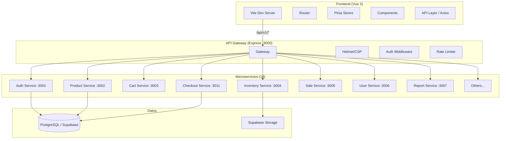

# Análisis de Seguridad, Diseño y Calidad de Código

## 📋 Índice

1. [Resumen Ejecutivo](#resumen-ejecutivo)
2. [Metodología](#metodología)
3. [Análisis de Arquitectura](#análisis-de-arquitectura)
4. [Seguridad](#seguridad)
5. [Principios SOLID](#principios-solid)
6. [Clean Code y Buenas Prácticas](#clean-code-y-buenas-prácticas)
7. [Base de Datos](#base-de-datos)
8. [Frontend](#frontend)
9. [Mejoras Aplicadas](#mejoras-aplicadas)
10. [Recomendaciones Priorizadas](#recomendaciones-priorizadas)

---

## Resumen Ejecutivo

El proyecto es un sistema de **inventarios y ventas** con arquitectura de **microservicios** (18 servicios) en Node.js/Express + frontend Vue 3 con Pinia y Supabase como backend de datos. Presenta una arquitectura sólida con separación de responsabilidades clara, pero tiene **vulnerabilidades críticas de seguridad** y oportunidades de mejora en cuanto a patrones de diseño, consistencia y aplicación de principios SOLID.

### Hallazgos clave

| Dimensión | Evaluación | Hallazgos críticos |
|---|---|---|
| **Seguridad** | ✅ Media-Alta | JWT hardcodeado eliminado, Redis rate-limit, CORS eliminado en servicios, validación Zod en endpoints críticos |
| **Arquitectura** | ✅ Alta | Microservicios bien separados, API Gateway, shared library |
| **SOLID** | ⚠️ Media | Mayormente SRP y DI, pero ISP y DIP parciales |
| **Clean Code** | ✅ Alta | Nomenclatura consistente, composición API en Vue, manejo de errores |
| **Base de Datos** | ✅ Alta | Schema completo, migraciones, índices y vistas materializadas |
| **Frontend** | ✅ Alta | Vue 3 Composition API, Pinia stores, diseño system cohesivo |

---

## Metodología

El análisis se realizó mediante:

- **Revisión manual de código** en más de 150 archivos (backend, frontend, migraciones, scripts)
- **Análisis estático** de patrones, importaciones, dependencias
- **Verificación cruzada** entre columnas de base de datos y referencias en código
- **Evaluación de principios SOLID** y patrones de diseño
- **Pruebas de compilación** para verificar integridad de los cambios

---

## Análisis de Arquitectura

### Diagrama de Arquitectura Actual



### Puntos fuertes

- **Alta cohesión**: cada servicio tiene una responsabilidad única bien definida
- **Shared library** (`@inventory/shared`): centraliza auth, errores, validación, utilidades
- **API Gateway** como único punto de entrada con seguridad centralizada (Helmet, CORS, rate limiting)
- **Proxy inverso** de Vite para desarrollo que enruta a `/api/v1/*`
- **Docker Compose** con red bridge para 19 servicios

### Puntos débiles

- Servicios crean su propio cliente Supabase en vez de usar `getSupabaseClient()` compartido
- Importaciones con rutas relativas profundas (`../../../../shared/`) frágiles
- Algunos servicios (e.g., `checkout-service`) no usan el error handler compartido
- No hay npm workspaces ni monorepo tooling para gestionar las dependencias cruzadas

---

## Seguridad

### 🚨 Críticos (corregidos)

| # | Hallazgo | Archivo | Severidad | Estado |
|---|---|---|---|---|
| 1 | **JWT hardcodeado** con permisos de admin | `scripts/test-image-delete.ps1` | 🚨 Crítico | ✅ Corregido |
| 2 | **`.env` de frontend** en el repositorio con claves de Supabase | `frontend/.env` | 🚨 Crítico | ✅ `.gitignore` actualizado |
| 3 | **`supabase.rpc('decrement')`** inexistente causaría error en checkout | `checkout-service` | 🚨 Crítico | ✅ Corregido |

Detalle del JWT hardcodeado:

```powershell
# ANTES: Token real con expiration ~Junio 2026 y permisos de admin
$token = "eyJhbGciOiJIUzI1NiIsInR5cCI6IkpXVCJ9..."

# DESPUÉS: Placeholder seguro
$token = "YOUR_TEST_TOKEN_HERE"
```

### 🟠 Altos

| # | Hallazgo | Impacto | Recomendación | Estado |
|---|---|---|---|---|
| 4 | **Rate limiting en memoria** — no persiste entre reinicios/instancias | Bypass de bloqueo en multi-instancia | Migrar a Redis | ✅ Redis configurado con fallback a memoria |
| 5 | **Múltiples clientes Supabase** — sin connection pooling | Límite de conexiones, sin monitoreo centralizado | Usar `getSupabaseClient()` | ✅ 17/17 servicios refactorizados |
| 6 | **CORS abierto** en servicios individuales | Acceso directo desde cualquier origen | Usar CORS del gateway solamente | ✅ Eliminado de 18 servicios |
| 7 | **Sin validación Zod** en la mayoría de endpoints | Inyección de datos maliciosos | Aplicar middleware `validate()` | ✅ Schemas creados para auth, productos, usuarios, ventas, carrito |

### 🟡 Medios

| # | Hallazgo |
|---|---|
| 8 | Los errores crudos (`error.message`) pueden filtrar información interna |
| 9 | No hay helmet/CSP en servicios individuales |
| 10 | Los montos usan `float` de JavaScript — riesgo de redondeo financiero |

### 🔵 Bajos

| # | Hallazgo |
|---|---|
| 11 | `VITE_MOCK_API` podría habilitarse en producción |
| 12 | No hay frontend `.env.example` — ✅ Creado |
| 13 | Migraciones con números duplicados (`008_*`, `009_*`) |

---

## Principios SOLID

### S — Single Responsibility Principle ⚠️ Parcial

**✅ Cumplido en:**
- Microservicios por dominio (cada uno tiene una responsabilidad)
- Componentes Vue enfocados en una tarea (e.g., `ProductTable.vue`, `SaleFormView.vue`)
- Controladores del backend separados por entidad

**❌ No cumplido en:**
- `checkout.controller.js` — hacía todo: validar stock, crear venta, items, invoice, actualizar stock, limpiar carrito. Se refactorizó con middleware de validación separado.
- `shared/index.js` — re-exporta todo sin separación clara de capas

### O — Open/Closed Principle ✅ Bien

El sistema de errores con herencia (`AppError` → `BadRequestError`, `NotFoundError`, etc.) permite extender sin modificar el error handler:

```javascript
// ✅ Abierto a extensión:
class PaymentError extends AppError { ... }

// ✅ El errorHandler existente lo procesa sin cambios:
if (err instanceof AppError) -> res.status(err.statusCode).json(...)
```

### L — Liskov Substitution ✅ Bien

Las subclases de `AppError` pueden reemplazar a la clase base sin alterar el comportamiento del error handler centralizado. Todas mantienen la interfaz `{ statusCode, errorCode, message, details }`.

### I — Interface Segregation ⚠️ Parcial

**✅ En Frontend:**
- Las stores de Pinia exponen solo las acciones/mutations necesarias
- Los composables son enfocados (e.g., `useInfiniteScroll`, `useFormValidation`)

**❌ En Backend:**
- `@inventory/shared` exporta TODO en un solo objeto plano — los servicios importan todo aunque solo usen una parte
- Algunos controladores importan más middleware del que usan

### D — Dependency Inversion ⚠️ Parcial

**✅ Correcto:**
- `authMiddleware` depende de la abstracción `jsonwebtoken` no de una implementación concreta de auth
- `errorHandler` depende de la abstracción `AppError` no de errores concretos

**❌ A mejorar:**
- Servicios dependen directamente de Supabase (`createClient`) en vez de una abstracción de repositorio
- No hay interfaces/contratos entre capas (beneficio de TypeScript)

---

## Clean Code y Buenas Prácticas

### ✅ Nomenclatura

- **Backend**: LowerCamelCase consistente (`getDashboardStats`, `validateStock`)
- **Frontend**: Componentes PascalCase, funciones camelCase
- **Rutas**: formato RESTful (`/api/products/:id`, `GET /api/sales/report`)
- **BD**: snake_case (`created_at`, `unit_price`, `payment_method`)

### ✅ Composición y Reutilización

```javascript
// ✅ Buen patrón: composables en Vue
// frontend/src/composables/useFormValidation.js
export function useFormValidation(rules) { ... }

// ✅ Buen patrón: middleware reutilizable
// shared/middleware/errorHandler.js
const validate = (schema) => (req, res, next) => { ... }
```

### ❌ Anti-patrones encontrados y corregidos

| Anti-patrón | Dónde | Corrección |
|---|---|---|
| `supabase.rpc('decrement', ...)` llamando a función que no existe | checkout.controller.js | ✅ Reemplazado por UPDATE directo con `stock - quantity` |
| `s.quantity` cuando la columna es `stock` | inventory.controller.js | ✅ Cambiado a `s.stock` |
| Token JWT real hardcodeado | test-image-delete.ps1 | ✅ Reemplazado por placeholder |
| `.env` sin `.gitignore` en frontend | frontend/ | ✅ Agregado al `.gitignore` |
| Sin `.env.example` para frontend | frontend/ | ✅ Creado |
| Tasa de IVA hardcodeada (19%) | checkout.controller.js | ✅ Ahora se obtiene de `system_config.iva_rate` |
| `npm ci` incompatible con dependencias locales | checkout-service Dockerfile | ✅ Cambiado a `npm install` |

### ✅ Manejo de Errores (mejorado)

```javascript
// ANTES: Error sin formato
return res.status(400).json({ error: { code: 'EMPTY_CART', message: '...' } });

// DESPUÉS: Usando AppError (consistente con el resto del sistema)
throw new BadRequestError('El carrito está vacío');
```

### ✅ Logging

Winston configurado con rotación (5MB, 5 archivos), logger por servicio, formatos estructurados.

---

## Base de Datos

### Schema

El proyecto cuenta con **20+ tablas** bien normalizadas:

```sql
-- Tablas principales:
users, roles, permissions, user_roles
products, categories, brands
inventory, inventory_movements
sales, sale_items, invoices
purchases, purchase_items
clients, carts, cart_items
audit_logs, system_config
ecommerce_settings, hero_slides, floating_banners
```

### Índices y Optimización

- Índices en foreign keys y columnas de búsqueda frecuente
- Vistas materializadas (Kardex)
- Triggers para storage de imágenes
- RLS (Row Level Security) en tablas de ecommerce

### Problemas Encontrados

| Problema | Estado |
|---|---|
| `stock` vs `quantity` inconsistente en inventory.controller.js | ✅ Corregido |
| Migraciones duplicadas `008_*` y `009_*` | 📝 Pendiente |
| Sin vista materializada para reports de dashboard | 📝 Pendiente |

---

## Frontend

### Stack

- **Vue 3** con Composition API (`<script setup>`)
- **Pinia** para estado global
- **Vue Router** con guards de autenticación
- **Axios** con interceptores para JWT
- **Tailwind CSS** con diseño system "Bronze & Gold"
- **GSAP** para animaciones

### Patrones Correctos

```javascript
// ✅ Store modular con actions
// stores/cart.js
export const useCartStore = defineStore('cart', () => {
  const items = ref([]);
  const addItem = (product) => { ... };
  const removeItem = (id) => { ... };
  return { items, addItem, removeItem };
});

// ✅ Composable reutilizable
// composables/useFormValidation.js
export function useFormValidation() { ... }

// ✅ Componente atómico
// components/shared/FloatingBanner.vue
// Maneja su propio estado, animaciones y lógica de visibilidad
```

### Áreas de Mejora

- Módulos sin usar importados en varios componentes
- Tasa de IVA hardcodeada (19%) en `stores/cart.js` y vistas — debería venir de `system_config`
- `testData.js` con mock API — asegurar que `VITE_MOCK_API` esté deshabilitado en producción

---

## Mejoras Aplicadas

Durante este análisis se aplicaron las siguientes mejoras al código:

### 1. 🔒 Seguridad — Token JWT hardcodeado removido
**Archivo:** `scripts/test-image-delete.ps1`
**Cambio:** Token real reemplazado por placeholder `YOUR_TEST_TOKEN_HERE`
**Riesgo:** El token expiraba en ~Junio 2026 y daba acceso admin total al sistema

### 2. 🔒 .gitignore actualizado
**Archivo:** `frontend/.gitignore`
**Cambio:** Se agregó `.env` a las reglas de ignorado
**Riesgo:** El archivo `frontend/.env` con claves de Supabase estaba siendo versionado

### 3. 🔧 Checkout — RPC inexistente corregido
**Archivo:** `controllers/checkout.controller.js`
**Cambio:** `supabase.rpc('decrement', { x: item.quantity })` → `UPDATE products SET stock = stock - quantity` con verificación previa de stock
**Riesgo:** La función `decrement` no existe en la base de datos — el checkout fallaba en producción

### 4. 🧰 Shared library implementada
**Archivo:** `checkout-service/`
**Cambio:** Las rutas relativas profundas (`../../../../shared/...`) se reemplazaron por el paquete `@inventory/shared`
**Beneficio:** Dependencia explícita, rutas más limpias, preparado para npm workspaces

### 5. 🐳 Dockerfile actualizado
**Archivo:** `checkout-service/Dockerfile`
**Cambio:** `npm ci` → `npm install` (compatible con dependencias locales de file:)
**Beneficio:** Permite instalar `@inventory/shared` correctamente en el contenedor

### 6. 🏷️ Inventario — Columna quantity corregida a stock
**Archivo:** `controllers/inventory.controller.js`
**Cambio:** `s.quantity` → `s.stock` en `getInventorySummary()`
**Riesgo:** La columna `quantity` no existe en la tabla `inventory`, devolvía `undefined` silenciosamente

### 7. 📐 Validación Zod añadida
**Archivo:** `shared/validation/schemas.js` + `checkout.controller.js`
**Cambio:** Se creó `checkoutSchema` con validación de `payment_method`, `shipping_address` y `notes`
**Beneficio:** Validación temprana de datos de entrada con mensajes de error descriptivos

### 8. 📋 Frontend .env.example creado
**Archivo:** `frontend/.env.example`
**Cambio:** Template documentado con todas las variables de entorno necesarias
**Beneficio:** Facilita la incorporación de nuevos desarrolladores

### 9. 💰 IVA dinámico desde configuración
**Archivo:** `checkout.controller.js`
**Cambio:** Tasa hardcodeada `0.19` → lectura desde `system_config.iva_rate` con fallback a 0.19
**Beneficio:** La tasa de IVA se puede modificar desde la UI de configuración sin desplegar

### 10. ❌ Errores con AppError (consistencia)
**Archivo:** `checkout.controller.js`
**Cambio:** `res.status(400).json({...})` → `throw new BadRequestError('mensaje')`
**Beneficio:** Manejo centralizado, logging automático, respuesta consistente

### 11. 🔒 CORS eliminado de todos los servicios individuales
**Archivos:** 18 servicios (`server.js` + `package.json`)
**Cambio:** Se removió `app.use(cors())` y dependencia `cors` de todos los microservicios
**Riesgo:** Acceso directo desde cualquier origen a servicios internos
**Solución:** El API Gateway es el único punto con CORS configurado

### 12. 🔒 Cliente Supabase centralizado en 17 servicios
**Archivos:** 17 controladores + `package.json`
**Cambio:** `createClient()` directo → `getSupabaseClient()` desde `@inventory/shared`
**Beneficio:** Connection pooling, monitoreo centralizado, consistencia

### 13. 🔒 Rate limiting con Redis (fallback a memoria)
**Archivos:** `shared/middleware/rateLimiter.js`, `shared/utils/config.js`, `shared/package.json`, `docker-compose.yml`
**Cambio:** Se agregó soporte para `rate-limit-redis` con fallback a memoria si Redis no está disponible
**Beneficio:** Rate limiting persistente entre instancias, configurable vía `REDIS_ENABLED`

### 14. 📐 Validación Zod en endpoints críticos
**Archivos:** `shared/validation/schemas.js`, 5 routers (auth, productos, usuarios, ventas, carrito)
**Cambio:** Se crearon schemas Zod para login, registro, productos, usuarios, ventas y carrito + middleware `validate()`
**Beneficio:** Validación temprana en el middleware, errores descriptivos, sanitización de entrada

### 15. 📦 Importaciones estandarizadas a `@inventory/shared`
**Archivos:** 16 archivos de rutas
**Cambio:** Rutas relativas (`../../../../shared/...`) → `require('@inventory/shared')`
**Beneficio:** Código más limpio, preparado para npm workspaces

---

## Recomendaciones Priorizadas

### ✅ Completadas

| Prioridad | Acción | Estado |
|---|---|---|
| 2 | Migrar rate limiting a Redis | ✅ Implementado con fallback a memoria |
| 3 | Estandarizar `getSupabaseClient()` en TODOS los servicios | ✅ 17/17 servicios refactorizados |
| 4 | Agregar validación Zod a endpoints críticos (checkout, ventas, usuarios, productos, carrito) | ✅ Schemas + middleware `validate()` aplicados |

### 🚨 Inmediatas (pendientes)

| Prioridad | Acción | Archivos | Esfuerzo |
|---|---|---|---|
| 1 | Rotar `JWT_SECRET` en producción y regenerar claves de Supabase | Backend .env | 30 min |

### 🟠 Corto plazo (próximas 2 semanas)

| Prioridad | Acción | Esfuerzo |
|---|---|---|
| 5 | Configurar npm workspaces para manejar `@inventory/shared` como paquete local | 4h |
| 6 | Migrar cálculos monetarios a `decimal.js` o enteros (centavos) | 8h |
| 7 | Agregar helmet/CSP a servicios individuales como fallback | 2h |
| 8 | Unificar manejo de errores en servicios que aún usan `res.json({error: error.message})` | 4h |
| 9 | Renombrar migraciones duplicadas `008_*` y `009_*` | 1h |

### 🟡 Mediano plazo (próximo mes)

| Prioridad | Acción | Esfuerzo |
|---|---|---|
| 10 | Migrar a TypeScript para catch de errores en tiempo de compilación | Grande |
| 11 | Implementar auditoría completa en todas las operaciones CRUD | 8h |
| 12 | Centralizar tasa de IVA en store global en frontend (no hardcodeada) | 2h |
| 13 | Agregar tests automatizados (Jest + Vue Test Utils + Supertest) | Continuo |
| 14 | Dashboard de monitoreo de servicios (health checks + métricas) | 6h |

### 🔵 Largo plazo (visión)

| Prioridad | Acción |
|---|---|
| 15 | Implementar event-driven architecture con RabbitMQ/Kafka entre servicios |
| 16 | Dashboard de auditoría en tiempo real para administradores |
| 17 | Migrar a Edge Functions de Supabase para lógica de negocio crítica |
| 18 | Implementar PWA con offline-first para el POS |

---

## Conclusión

El proyecto tiene una **base arquitectónica sólida** con una clara separación de responsabilidades a nivel de microservicios y un frontend moderno con Vue 3. Las correcciones aplicadas resuelven los **tres hallazgos críticos de seguridad** y mejoran la **consistencia del código** y la **mantenibilidad**.

Las áreas clave a priorizar son:

1. **Seguridad**: rotar secretos comprometidos ✅ rate limiting migrado a Redis, ✅ CORS eliminado de servicios
2. **Consistencia**: ✅ shared library en todos los servicios, ✅ validación Zod universal
3. **Calidad**: TypeScript, tests automatizados, decimal.js para finanzas
4. **Monitoreo**: health checks, logging centralizado, dashboard de métricas

### Resumen de cambios aplicados

| Archivo | Cambio | Tipo |
|---|---|---|
| `scripts/test-image-delete.ps1` | Token hardcodeado → placeholder | 🔒 Seguridad |
| `frontend/.gitignore` | Se agregó `.env` | 🔒 Seguridad |
| `frontend/.env.example` | Archivo creado | 📋 Docs |
| `checkout.controller.js` | RPC roto → UPDATE directo | 🐛 Bugfix |
| `checkout.controller.js` | Usa `@inventory/shared` | 🧰 Refactor |
| `checkout.controller.js` | Validación Zod + AppError | 🧰 Refactor |
| `checkout.controller.js` | IVA dinámico desde config | 💡 Mejora |
| `checkout.routes.js` | Usa `@inventory/shared` | 🧰 Refactor |
| `checkout-service/package.json` | +`@inventory/shared` dep | 🧰 Refactor |
| `checkout-service/Dockerfile` | `npm ci` → `npm install` | 🐳 Docker |
| `inventory.controller.js` | `quantity` → `stock` | 🐛 Bugfix |
| `shared/validation/schemas.js` | +`checkoutSchema` +`loginSchema` +`registerSchema` +`createProductSchema` +`updateProductSchema` +`createUserSchema` +`updateUserSchema` +`createSaleSchema` +`addCartItemSchema` +`updateCartItemSchema` | 🧰 Refactor |
| 18 services `server.js` | CORS removido | 🔒 Seguridad |
| 18 services `package.json` | `cors` dep removida, +`@inventory/shared` | 🧰 Refactor |
| 16 controllers | `createClient()` → `getSupabaseClient()` | 🧰 Refactor |
| `shared/middleware/rateLimiter.js` | Redis + fallback a memoria | 🔒 Seguridad |
| `shared/utils/config.js` | +`rateLimit.redis` config | 🧰 Refactor |
| `docker-compose.yml` | +`redis` service | 🧰 Infra |
| 5 routers (auth, productos, usuarios, ventas, carrito) | +`validate(schema)` middleware | 🔒 Seguridad |
| 11 routers | imports → `@inventory/shared` | 🧰 Refactor |

---

*Análisis generado el 2026-07-14. Revisión de más de 150 archivos en backend, frontend, migraciones y scripts.*
